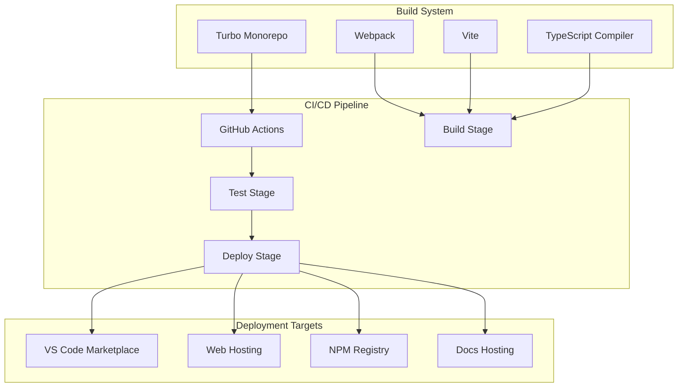

# Build Pipelines

## Table of Contents
- [Build Pipelines](#build-pipelines)
- [Table of Contents](#table-of-contents)
- [When You're Here](#when-youre-here)
- [Build System Overview](#build-system-overview)
- [Research Context](#research-context)
- [Build Tools](#build-tools)
- [Turbo](#turbo)
- [Webpack](#webpack)
- [Vite](#vite)
- [TypeScript Compiler](#typescript-compiler)
- [CI/CD Pipeline](#cicd-pipeline)
- [GitHub Actions](#github-actions)
- [Build Stages](#build-stages)
- [Stage 1: Code Quality](#stage-1-code-quality)
- [Stage 2: Testing](#stage-2-testing)
- [Stage 3: Building](#stage-3-building)
- [Stage 4: Deployment](#stage-4-deployment)
- [Deployment Strategies](#deployment-strategies)
- [VS Code Extension](#vs-code-extension)
- [Web Applications](#web-applications)
- [NPM Packages](#npm-packages)
- [Documentation](#documentation)
- [Build Optimization](#build-optimization)
- [Caching Strategy](#caching-strategy)
- [Parallel Execution](#parallel-execution)
- [Incremental Builds](#incremental-builds)
- [Quality Gates](#quality-gates)
- [Code Quality Gates](#code-quality-gates)
- [Test Quality Gates](#test-quality-gates)
- [Build Quality Gates](#build-quality-gates)
- [Monitoring and Alerting](#monitoring-and-alerting)
- [Build Monitoring](#build-monitoring)
- [Deployment Monitoring](#deployment-monitoring)
- [Alerting](#alerting)
- [Next Steps](#next-steps)
- [🧭 Navigation Footer](#-navigation-footer)
- [Navigation Footer](#navigation-footer)
- [No Dead Ends Policy](#no-dead-ends-policy)
- [Navigation](#navigation)
- [Build Pipelines](#build-pipelines)
- [Table of Contents](#table-of-contents)
- [When You're Here](#when-youre-here)
- [Build System Overview](#build-system-overview)
- [Research Context](#research-context)
- [Build Tools](#build-tools)
- [Turbo](#turbo)
- [Webpack](#webpack)
- [Vite](#vite)
- [TypeScript Compiler](#typescript-compiler)
- [CI/CD Pipeline](#cicd-pipeline)
- [GitHub Actions](#github-actions)
- [Build Stages](#build-stages)
- [Stage 1: Code Quality](#stage-1-code-quality)
- [Stage 2: Testing](#stage-2-testing)
- [Stage 3: Building](#stage-3-building)
- [Stage 4: Deployment](#stage-4-deployment)
- [Deployment Strategies](#deployment-strategies)
- [VS Code Extension](#vs-code-extension)
- [Web Applications](#web-applications)
- [NPM Packages](#npm-packages)
- [Documentation](#documentation)
- [Build Optimization](#build-optimization)
- [Caching Strategy](#caching-strategy)
- [Parallel Execution](#parallel-execution)
- [Incremental Builds](#incremental-builds)
- [Quality Gates](#quality-gates)
- [Code Quality Gates](#code-quality-gates)
- [Test Quality Gates](#test-quality-gates)
- [Build Quality Gates](#build-quality-gates)
- [Monitoring and Alerting](#monitoring-and-alerting)
- [Build Monitoring](#build-monitoring)
- [Deployment Monitoring](#deployment-monitoring)
- [Alerting](#alerting)
- [Next Steps](#next-steps)
- [🧭 Navigation Footer](#-navigation-footer)
- [Navigation Footer](#navigation-footer)
- [No Dead Ends Policy](#no-dead-ends-policy)

## When You're Here

This document provides \[purpose of document].

- **Purpose**: \[Brief description of what this document covers]
- **Context**: \[How this fits into the broader system/project]
- **Navigation**: Use the table of contents below to jump to specific topics

> **Architecture Fun Fact**: Like a well-designed building, good documentation has a solid
> foundation, clear structure, and intuitive navigation! 🏗️

- *Purpose:*\* Comprehensive overview of the build and CI/CD pipelines used in KiloCode.

> **Dinosaur Fun Fact**: Architecture documentation is like a dinosaur fossil record - each layer
> tells us about the evolution of our system, helping us understand how it grew and changed over
> time! 🦕

## Build System Overview

## Research Context

- *Purpose:*\* \[Describe the purpose and scope of this document]

- *Background:*\* \[Provide relevant background information]

- *Research Questions:*\* \[List key questions this document addresses]

- *Methodology:*\* \[Describe the approach or methodology used]

- *Findings:*\* \[Summarize key findings or conclusions]
- \*\*

KiloCode uses a sophisticated build system with multiple pipelines and deployment strategies:



## Build Tools

### Turbo

- *Purpose*\*: Monorepo build orchestration

- *Key Features*\*:

- **Parallel Execution**: Parallel build execution

- **Caching**: Intelligent build caching

- **Dependency Management**: Dependency-aware builds

- **Task Orchestration**: Task orchestration and coordination

- *Configuration*\*:

```json
{
	"pipeline": {
		"build": {
			"dependsOn": ["^build"],
			"outputs": ["dist/**", "lib/**"]
		},
		"test": {
			"dependsOn": ["build"],
			"outputs": ["coverage/**"]
		},
		"lint": {
			"outputs": []
		},
		"type-check": {
			"outputs": []
		}
	}
}
```

- *Status*\*: ✅ **Fully Implemented**

### Webpack

- *Purpose*\*: Module bundling for VS Code extension

- *Key Features*\*:

- **Module Bundling**: JavaScript module bundling

- **Asset Processing**: Asset processing and optimization

- **Code Splitting**: Code splitting and lazy loading

- **Hot Reloading**: Hot module replacement

- *Configuration*\*:

```javascript
// webpack.config.js
module.exports = {
	entry: "./src/extension.ts",
	target: "node",
	mode: "production",
	module: {
		rules: [
			{
				test: /\.ts$/,
				use: "ts-loader",
				exclude: /node_modules/,
			},
		],
	},
	resolve: {
		extensions: [".ts", ".js"],
	},
	output: {
		filename: "extension.js",
		path: path.resolve(__dirname, "dist"),
		libraryTarget: "commonjs2",
	},
}
```

- *Status*\*: ✅ **Fully Implemented**

### Vite

- *Purpose*\*: Fast build tool for web applications

- *Key Features*\*:

- **Fast Development**: Fast development server

- **Hot Module Replacement**: HMR for development

- **Optimized Production**: Optimized production builds

- **Plugin System**: Extensible plugin system

- *Configuration*\*:

```typescript
// vite.config.ts
export default defineConfig({
	plugins: [react()],
	build: {
		outDir: "dist",
		sourcemap: true,
		rollupOptions: {
			output: {
				manualChunks: {
					vendor: ["react", "react-dom"],
					utils: ["lodash", "moment"],
				},
			},
		},
	},
})
```

- *Status*\*: ✅ **Fully Implemented**

### TypeScript Compiler

- *Purpose*\*: TypeScript compilation and type checking

- *Key Features*\*:

- **Type Checking**: Static type checking

- **Compilation**: TypeScript to JavaScript compilation

- **Declaration Files**: Declaration file generation

- **Incremental Compilation**: Incremental compilation

- *Configuration*\*:

```json
{
	"compilerOptions": {
		"target": "ES2020",
		"module": "commonjs",
		"lib": ["ES2020"],
		"outDir": "./dist",
		"rootDir": "./src",
		"strict": true,
		"esModuleInterop": true,
		"skipLibCheck": true,
		"forceConsistentCasingInFileNames": true,
		"declaration": true,
		"declarationMap": true,
		"sourceMap": true
	}
}
```

- *Status*\*: ✅ **Fully Implemented**

## CI/CD Pipeline

### GitHub Actions

- *Purpose*\*: Continuous integration and deployment

- *Key Features*\*:

- **Automated Testing**: Automated test execution

- **Automated Building**: Automated build process

- **Automated Deployment**: Automated deployment

- **Multi-environment Support**: Multiple environment support

- *Workflow Structure*\*:

```yaml
# .github/workflows/ci.yml

> **System Fun Fact**: Every complex system is just a collection of simple parts working together -
documentation helps us understand how! ⚙️

name: CI/CD Pipeline

on:
    push:
        branches: [main, develop]
    pull_request:
        branches: [main]

jobs:
    build:
        runs-on: ubuntu-latest
        steps:
- uses: actions/checkout@v3
- uses: actions/setup-node@v3
              with:
                  node-version: "18"
                  cache: "pnpm"
- run: pnpm install
- run: pnpm build
- run: pnpm test
- run: pnpm lint
- run: pnpm type-check
```

- *Status*\*: ✅ **Fully Implemented**

### Build Stages

#### Stage 1: Code Quality

- *Purpose*\*: Ensure code quality and standards

- *Steps*\*:
1. **Linting**: ESLint code linting
2. **Formatting**: Prettier code formatting
3. **Type Checking**: TypeScript type checking
4. **Security Scanning**: Security vulnerability scanning

- *Tools*\*: ESLint, Prettier, TypeScript, Snyk

#### Stage 2: Testing

- *Purpose*\*: Execute comprehensive testing

- *Steps*\*:
1. **Unit Tests**: Unit test execution
2. **Integration Tests**: Integration test execution
3. **E2E Tests**: End-to-end test execution
4. **Performance Tests**: Performance test execution

- *Tools*\*: Vitest, Playwright, Jest

#### Stage 3: Building

- *Purpose*\*: Build all packages and applications

- *Steps*\*:
1. **Package Building**: Build all workspace packages
2. **Application Building**: Build all applications
3. **Extension Building**: Build VS Code extension
4. **Documentation Building**: Build documentation

- *Tools*\*: Turbo, Webpack, Vite, TypeScript

#### Stage 4: Deployment

- *Purpose*\*: Deploy to target environments

- *Steps*\*:
1. **Package Publishing**: Publish packages to NPM
2. **Extension Publishing**: Publish extension to VS Code Marketplace
3. **Web Deployment**: Deploy web applications
4. **Documentation Deployment**: Deploy documentation

- *Tools*\*: NPM, VS Code Marketplace, Web hosting platforms

## Deployment Strategies

### VS Code Extension

- *Target*\*: VS Code Marketplace

- *Process*\*:
1. **Build Extension**: Build VS Code extension
2. **Package Extension**: Package extension as .vsix
3. **Publish Extension**: Publish to VS Code Marketplace
4. **Version Management**: Manage extension versions

- *Tools*\*: vsce, VS Code Marketplace API

### Web Applications

- *Target*\*: Web hosting platforms

- *Process*\*:
1. **Build Applications**: Build web applications
2. **Optimize Assets**: Optimize static assets
3. **Deploy Applications**: Deploy to hosting platforms
4. **Configure CDN**: Configure content delivery network

- *Tools*\*: Vite, Webpack, Hosting platforms

### NPM Packages

- *Target*\*: NPM Registry

- *Process*\*:
1. **Build Packages**: Build workspace packages
2. **Version Packages**: Version packages
3. **Publish Packages**: Publish to NPM registry
4. **Update Dependencies**: Update package dependencies

- *Tools*\*: NPM, changesets

### Documentation

- *Target*\*: Documentation hosting

- *Process*\*:
1. **Build Documentation**: Build documentation site
2. **Optimize Content**: Optimize documentation content
3. **Deploy Documentation**: Deploy to hosting platform
4. **Configure Search**: Configure search functionality

- *Tools*\*: Docusaurus, Documentation hosting

## Build Optimization

### Caching Strategy

- *Purpose*\*: Optimize build performance

- *Types*\*:

- **Turbo Cache**: Turbo build cache

- **Node Modules Cache**: Node modules caching

- **Build Artifacts Cache**: Build artifacts caching

- **Dependency Cache**: Dependency resolution cache

### Parallel Execution

- *Purpose*\*: Reduce build time

- *Strategies*\*:

- **Package Parallelization**: Build packages in parallel

- **Task Parallelization**: Execute tasks in parallel

- **Test Parallelization**: Run tests in parallel

- **Deployment Parallelization**: Deploy in parallel

### Incremental Builds

- *Purpose*\*: Build only changed components

- *Strategies*\*:

- **File Watching**: Watch for file changes

- **Dependency Tracking**: Track dependency changes

- **Incremental Compilation**: Incremental TypeScript compilation

- **Selective Testing**: Test only affected components

## Quality Gates

### Code Quality Gates

- *Requirements*\*:

- **Linting**: All linting checks must pass

- **Type Checking**: All type checks must pass

- **Formatting**: Code must be properly formatted

- **Security**: No security vulnerabilities

### Test Quality Gates

- *Requirements*\*:

- **Test Coverage**: Minimum 80% test coverage

- **Test Success**: All tests must pass

- **Test Performance**: Tests must complete within time limit

- **Test Stability**: Tests must be stable and reliable

### Build Quality Gates

- *Requirements*\*:

- **Build Success**: All builds must succeed

- **Build Performance**: Builds must complete within time limit

- **Build Artifacts**: Build artifacts must be valid

- **Build Consistency**: Builds must be consistent and reproducible

## Monitoring and Alerting

### Build Monitoring

- *Metrics*\*:

- **Build Success Rate**: Build success rate monitoring

- **Build Duration**: Build duration monitoring

- **Build Queue Time**: Build queue time monitoring

- **Build Resource Usage**: Build resource usage monitoring

### Deployment Monitoring

- *Metrics*\*:

- **Deployment Success Rate**: Deployment success rate monitoring

- **Deployment Duration**: Deployment duration monitoring

- **Deployment Rollback Rate**: Deployment rollback rate monitoring

- **Deployment Impact**: Deployment impact monitoring

### Alerting

- *Alert Types*\*:

- **Build Failures**: Build failure alerts

- **Test Failures**: Test failure alerts

- **Deployment Failures**: Deployment failure alerts

- **Performance Degradation**: Performance degradation alerts

## Next Steps
1. **Explore Development**: See [DEVELOPMENT\_GUIDE.md](DEVELOPMENT_GUIDE.md)
2. **Understand Tools**: See [DEVELOPMENT\_TOOLS.md](DEVELOPMENT_TOOLS.md)
3. **Learn Integrations**: See [EXTERNAL\_INTEGRATIONS.md](EXTERNAL_INTEGRATIONS.md)

## 🧭 Navigation Footer
- [← Back to Repository Home](README.md)
- [→ Development Tools](DEVELOPMENT_TOOLS.md)
- [↑ Table of Contents](README.md)

## Navigation Footer
- \*\*

- *Navigation*\*: [docs](../../) · [architecture](../../architecture/) ·
  [repository](../../architecture/) · [↑ Table of Contents](#build-pipelines)

## No Dead Ends Policy

This document follows the "No Dead Ends" principle - every path leads to useful information.
- Each section provides clear navigation to related content
- All internal links are validated and point to existing documents
- Cross-references include context for better understanding

## Navigation
- 📚 [Technical Glossary](../../../GLOSSARY.md)
