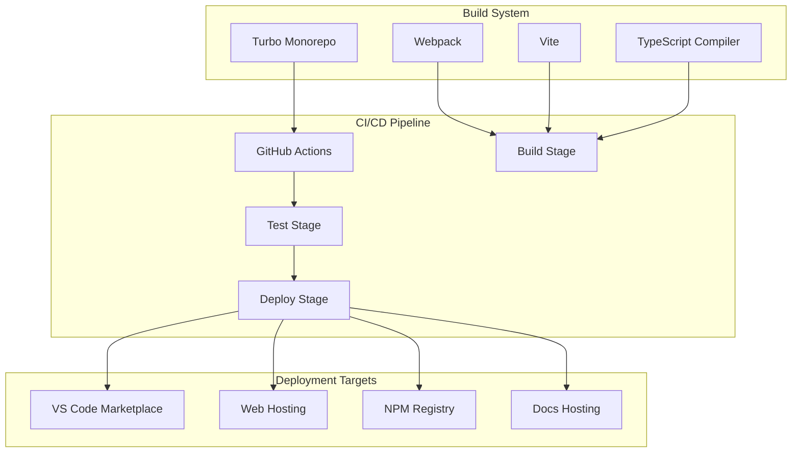

# Build Pipelines

> **Architecture Fun Fact**: Like a well-designed building, good documentation has a solid foundation, clear structure, and intuitive navigation! 🏗️

- _Purpose:_\* Comprehensive overview of the build and CI/CD pipelines used in KiloCode.

> **Dinosaur Fun Fact**: Architecture documentation is like a dinosaur fossil record - each layer
> tells us about the evolution of our system, helping us understand how it grew and changed over
> time! 🦕

## Build System Overview

## Research Context

- _Purpose:_\* \[Describe the purpose and scope of this document]
- _Background:_\* \[Provide relevant background information]
- _Research Questions:_\* \[List key questions this document addresses]
- _Methodology:_\* \[Describe the approach or methodology used]
- _Findings:_\* \[Summarize key findings or conclusions]
- \*\*

KiloCode uses a sophisticated build system with multiple pipelines and deployment strategies:



## Build Tools

### Turbo

- _Purpose_\*: Monorepo build orchestration
- _Key Features_\*:
- **Parallel Execution**: Parallel build execution
- **Caching**: Intelligent build caching
- **Dependency Management**: Dependency-aware builds
- **Task Orchestration**: Task orchestration and coordination
- _Configuration_\*:

```json
{
	"pipeline": {
		"build": {
			"dependsOn": ["^build"],
			"outputs": ["dist/**", "lib/**"]
		},
		"test": {
			"dependsOn": ["build"],
			"outputs": ["coverage/**"]
		},
		"lint": {
			"outputs": []
		},
		"type-check": {
			"outputs": []
		}
	}
}
```

- _Status_\*: ✅ **Fully Implemented**

### Webpack

- _Purpose_\*: Module bundling for VS Code extension
- _Key Features_\*:
- **Module Bundling**: JavaScript module bundling
- **Asset Processing**: Asset processing and optimization
- **Code Splitting**: Code splitting and lazy loading
- **Hot Reloading**: Hot module replacement
- _Configuration_\*:

```javascript
// webpack.config.js
module.exports = {
	entry: "./src/extension.ts",
	target: "node",
	mode: "production",
	module: {
		rules: [
			{
				test: /\.ts$/,
				use: "ts-loader",
				exclude: /node_modules/,
			},
		],
	},
	resolve: {
		extensions: [".ts", ".js"],
	},
	output: {
		filename: "extension.js",
		path: path.resolve(__dirname, "dist"),
		libraryTarget: "commonjs2",
	},
}
```

- _Status_\*: ✅ **Fully Implemented**

### Vite

- _Purpose_\*: Fast build tool for web applications
- _Key Features_\*:
- **Fast Development**: Fast development server
- **Hot Module Replacement**: HMR for development
- **Optimized Production**: Optimized production builds
- **Plugin System**: Extensible plugin system
- _Configuration_\*:

```typescript
// vite.config.ts
export default defineConfig({
	plugins: [react()],
	build: {
		outDir: "dist",
		sourcemap: true,
		rollupOptions: {
			output: {
				manualChunks: {
					vendor: ["react", "react-dom"],
					utils: ["lodash", "moment"],
				},
			},
		},
	},
})
```

- _Status_\*: ✅ **Fully Implemented**

### TypeScript Compiler

- _Purpose_\*: TypeScript compilation and type checking
- _Key Features_\*:
- **Type Checking**: Static type checking
- **Compilation**: TypeScript to JavaScript compilation
- **Declaration Files**: Declaration file generation
- **Incremental Compilation**: Incremental compilation
- _Configuration_\*:

```json
{
	"compilerOptions": {
		"target": "ES2020",
		"module": "commonjs",
		"lib": ["ES2020"],
		"outDir": "./dist",
		"rootDir": "./src",
		"strict": true,
		"esModuleInterop": true,
		"skipLibCheck": true,
		"forceConsistentCasingInFileNames": true,
		"declaration": true,
		"declarationMap": true,
		"sourceMap": true
	}
}
```

- _Status_\*: ✅ **Fully Implemented**

## CI/CD Pipeline

### GitHub Actions

- _Purpose_\*: Continuous integration and deployment
- _Key Features_\*:
- **Automated Testing**: Automated test execution
- **Automated Building**: Automated build process
- **Automated Deployment**: Automated deployment
- **Multi-environment Support**: Multiple environment support
- _Workflow Structure_\*:

```yaml
# .github/workflows/ci.yml

> **System Fun Fact**: Every complex system is just a collection of simple parts working together - documentation helps us understand how! ⚙️

name: CI/CD Pipeline

on:
    push:
        branches: [main, develop]
    pull_request:
        branches: [main]

jobs:
    build:
        runs-on: ubuntu-latest
        steps:
          - uses: actions/checkout@v3
          - uses: actions/setup-node@v3
              with:
                  node-version: "18"
                  cache: "pnpm"
          - run: pnpm install
          - run: pnpm build
          - run: pnpm test
          - run: pnpm lint
          - run: pnpm type-check
```

- _Status_\*: ✅ **Fully Implemented**

### Build Stages

#### Stage 1: Code Quality

- _Purpose_\*: Ensure code quality and standards
- _Steps_\*:

1. **Linting**: ESLint code linting
2. **Formatting**: Prettier code formatting
3. **Type Checking**: TypeScript type checking
4. **Security Scanning**: Security vulnerability scanning

- _Tools_\*: ESLint, Prettier, TypeScript, Snyk

#### Stage 2: Testing

- _Purpose_\*: Execute comprehensive testing
- _Steps_\*:

1. **Unit Tests**: Unit test execution
2. **Integration Tests**: Integration test execution
3. **E2E Tests**: End-to-end test execution
4. **Performance Tests**: Performance test execution

- _Tools_\*: Vitest, Playwright, Jest

#### Stage 3: Building

- _Purpose_\*: Build all packages and applications
- _Steps_\*:

1. **Package Building**: Build all workspace packages
2. **Application Building**: Build all applications
3. **Extension Building**: Build VS Code extension
4. **Documentation Building**: Build documentation

- _Tools_\*: Turbo, Webpack, Vite, TypeScript

#### Stage 4: Deployment

- _Purpose_\*: Deploy to target environments
- _Steps_\*:

1. **Package Publishing**: Publish packages to NPM
2. **Extension Publishing**: Publish extension to VS Code Marketplace
3. **Web Deployment**: Deploy web applications
4. **Documentation Deployment**: Deploy documentation

- _Tools_\*: NPM, VS Code Marketplace, Web hosting platforms

## Deployment Strategies

### VS Code Extension

- _Target_\*: VS Code Marketplace
- _Process_\*:

1. **Build Extension**: Build VS Code extension
2. **Package Extension**: Package extension as .vsix
3. **Publish Extension**: Publish to VS Code Marketplace
4. **Version Management**: Manage extension versions

- _Tools_\*: vsce, VS Code Marketplace API

### Web Applications

- _Target_\*: Web hosting platforms
- _Process_\*:

1. **Build Applications**: Build web applications
2. **Optimize Assets**: Optimize static assets
3. **Deploy Applications**: Deploy to hosting platforms
4. **Configure CDN**: Configure content delivery network

- _Tools_\*: Vite, Webpack, Hosting platforms

### NPM Packages

- _Target_\*: NPM Registry
- _Process_\*:

1. **Build Packages**: Build workspace packages
2. **Version Packages**: Version packages
3. **Publish Packages**: Publish to NPM registry
4. **Update Dependencies**: Update package dependencies

- _Tools_\*: NPM, changesets

### Documentation

- _Target_\*: Documentation hosting
- _Process_\*:

1. **Build Documentation**: Build documentation site
2. **Optimize Content**: Optimize documentation content
3. **Deploy Documentation**: Deploy to hosting platform
4. **Configure Search**: Configure search functionality

- _Tools_\*: Docusaurus, Documentation hosting

## Build Optimization

### Caching Strategy

- _Purpose_\*: Optimize build performance
- _Types_\*:
- **Turbo Cache**: Turbo build cache
- **Node Modules Cache**: Node modules caching
- **Build Artifacts Cache**: Build artifacts caching
- **Dependency Cache**: Dependency resolution cache

### Parallel Execution

- _Purpose_\*: Reduce build time
- _Strategies_\*:
- **Package Parallelization**: Build packages in parallel
- **Task Parallelization**: Execute tasks in parallel
- **Test Parallelization**: Run tests in parallel
- **Deployment Parallelization**: Deploy in parallel

### Incremental Builds

- _Purpose_\*: Build only changed components
- _Strategies_\*:
- **File Watching**: Watch for file changes
- **Dependency Tracking**: Track dependency changes
- **Incremental Compilation**: Incremental TypeScript compilation
- **Selective Testing**: Test only affected components

## Quality Gates

### Code Quality Gates

- _Requirements_\*:
- **Linting**: All linting checks must pass
- **Type Checking**: All type checks must pass
- **Formatting**: Code must be properly formatted
- **Security**: No security vulnerabilities

### Test Quality Gates

- _Requirements_\*:
- **Test Coverage**: Minimum 80% test coverage
- **Test Success**: All tests must pass
- **Test Performance**: Tests must complete within time limit
- **Test Stability**: Tests must be stable and reliable

### Build Quality Gates

- _Requirements_\*:
- **Build Success**: All builds must succeed
- **Build Performance**: Builds must complete within time limit
- **Build Artifacts**: Build artifacts must be valid
- **Build Consistency**: Builds must be consistent and reproducible

## Monitoring and Alerting

### Build Monitoring

- _Metrics_\*:
- **Build Success Rate**: Build success rate monitoring
- **Build Duration**: Build duration monitoring
- **Build Queue Time**: Build queue time monitoring
- **Build Resource Usage**: Build resource usage monitoring

### Deployment Monitoring

- _Metrics_\*:
- **Deployment Success Rate**: Deployment success rate monitoring
- **Deployment Duration**: Deployment duration monitoring
- **Deployment Rollback Rate**: Deployment rollback rate monitoring
- **Deployment Impact**: Deployment impact monitoring

### Alerting

- _Alert Types_\*:
- **Build Failures**: Build failure alerts
- **Test Failures**: Test failure alerts
- **Deployment Failures**: Deployment failure alerts
- **Performance Degradation**: Performance degradation alerts

## Next Steps

1. **Explore Development**: See [DEVELOPMENT_GUIDE.md](DEVELOPMENT_GUIDE.md)
2. **Understand Tools**: See [DEVELOPMENT_TOOLS.md](DEVELOPMENT_TOOLS.md)
3. **Learn Integrations**: See [EXTERNAL_INTEGRATIONS.md](EXTERNAL_INTEGRATIONS.md)

## 🧭 Navigation Footer

- [← Back to Repository Home](README.md)
- [→ Development Tools](DEVELOPMENT_TOOLS.md)
- [↑ Table of Contents](README.md)

## No Dead Ends Policy

This document is designed to provide value and connect to the broader KiloCode ecosystem:

- **Purpose**: \[Brief description of document purpose]
- **Connections**: Links to related documents and resources
- **Next Steps**: Clear guidance on how to use this information
- **Related Documentation**: References to complementary materials

For questions or suggestions about this documentation, please refer to the [Documentation Guide](../../DOCUMENTATION_GUIDE.md) or [Architecture Overview](../architecture/README.md).

## Navigation Footer

- \*\*
- _Navigation_\*: [docs](../../) · [architecture](../../architecture/) ·
  [repository](../docs/architecture/../architecture/repository/) · [↑ Table of Contents](#build-pipelines)
