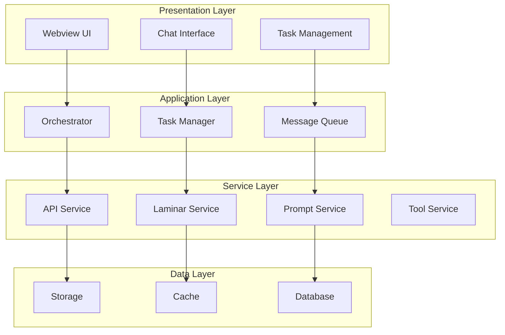
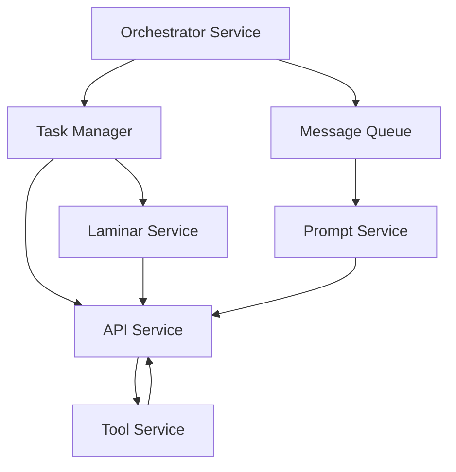

# Core Systems

**Purpose:** Detailed overview of the core systems and services that power KiloCode.

> **Dinosaur Fun Fact**: Architecture documentation is like a dinosaur fossil record - each layer tells us about the evolution of our system, helping us understand how it grew and changed over time! 🦕

## System Architecture Overview

KiloCode is built on a multi-layered architecture with clear separation of concerns:

## Core Services

### 1. Orchestrator Service

**Purpose**: Manages task execution and coordination

**Key Responsibilities**:

- Task lifecycle management
- Subtask creation and coordination
- Execution flow control
- State management

**Key Files**:

- `src/core/task/Task.ts` - Main task implementation
- `src/core/task/TaskManager.ts` - Task management
- `src/core/orchestrator/` - Orchestrator logic

**Status**: ✅ **Fully Implemented**

### 2. API Service

**Purpose**: Handles communication with external AI services

**Key Responsibilities**:

- API request management
- Response processing
- Error handling
- Rate limiting

**Key Files**:

- `src/api/` - API service implementations
- `src/core/api/` - Core API logic

**Status**: ✅ **Fully Implemented**

### 3. Message Queue Service

**Purpose**: Manages message queuing and processing

**Key Responsibilities**:

- Message queuing
- Message processing
- Queue management
- Message persistence

**Key Files**:

- `src/core/message-queue/` - Message queue implementation

**Status**: ✅ **Fully Implemented**

### 4. Laminar Service

**Purpose**: Provides observability and tracing capabilities

**Key Responsibilities**:

- Span management
- Trace collection
- Performance monitoring
- Error tracking

**Key Files**:

- `src/services/laminar/` - Laminar service implementation

**Status**: ✅ **Fully Implemented**

### 5. Prompt Service

**Purpose**: Manages prompt engineering and template management

**Key Responsibilities**:

- Prompt templates
- Context management
- Prompt optimization
- Template rendering

**Key Files**:

- `src/services/prompt/` - Prompt service implementation

**Status**: ✅ **Fully Implemented**

### 6. Tool Service

**Purpose**: Manages AI tool execution and coordination

**Key Responsibilities**:

- Tool registration
- Tool execution
- Tool coordination
- Tool results processing

**Key Files**:

- `src/services/tools/` - Tool service implementation

**Status**: ✅ **Fully Implemented**

## System Components

### Task Management System

**Components**:

- **Task**: Individual task execution unit
- **TaskManager**: Task lifecycle management
- **TaskQueue**: Task queuing and scheduling
- **TaskState**: Task state management

**Key Features**:

- Task creation and initialization
- Task execution and monitoring
- Task completion and cleanup
- Task state persistence

### Message Processing System

**Components**:

- **MessageQueue**: Message queuing system
- **MessageProcessor**: Message processing logic
- **MessageHandler**: Message handling and routing
- **MessageStorage**: Message persistence

**Key Features**:

- Asynchronous message processing
- Message prioritization
- Message retry logic
- Message persistence

### API Integration System

**Components**:

- **APIClient**: API client implementation
- **APIHandler**: API request handling
- **APIResponse**: Response processing
- **APIConfig**: API configuration

**Key Features**:

- Multiple API provider support
- Request/response handling
- Error handling and retry
- Rate limiting and throttling

### Observability System

**Components**:

- **SpanManager**: Span lifecycle management
- **TraceCollector**: Trace collection and storage
- **MetricsCollector**: Metrics collection
- **LogManager**: Log management

**Key Features**:

- Distributed tracing
- Performance monitoring
- Error tracking
- Log aggregation

## Service Dependencies

### Dependency Graph

### Service Communication

**Synchronous Communication**:

- Direct method calls
- Event-driven communication
- Shared state management

**Asynchronous Communication**:

- Message queuing
- Event publishing
- Callback mechanisms

## Data Flow

### Request Flow

1. **User Input** → Webview UI
2. **UI Event** → Message Queue
3. **Message Processing** → Orchestrator
4. **Task Creation** → Task Manager
5. **API Call** → API Service
6. **Response Processing** → Task Manager
7. **Result Display** → Webview UI

### Response Flow

1. **API Response** → API Service
2. **Response Processing** → Task Manager
3. **State Update** → Orchestrator
4. **Message Update** → Message Queue
5. **UI Update** → Webview UI
6. **User Notification** → Chat Interface

## Performance Characteristics

### Scalability

**Horizontal Scaling**: Service-based architecture supports horizontal scaling

**Vertical Scaling**: Individual services can be scaled independently

**Load Distribution**: Message queuing enables load distribution

### Reliability

**Fault Tolerance**: Service isolation prevents cascading failures

**Error Handling**: Comprehensive error handling at each layer

**Recovery**: Automatic recovery and retry mechanisms

### Monitoring

**Health Checks**: Service health monitoring

**Performance Metrics**: Response time and throughput monitoring

**Error Tracking**: Comprehensive error tracking and alerting

## Configuration Management

### Service Configuration

**Configuration Sources**:

- Environment variables
- Configuration files
- Runtime configuration
- User preferences

**Configuration Types**:

- Service-specific configuration
- Global configuration
- Environment-specific configuration
- User-specific configuration

### Configuration Validation

**Schema Validation**: Configuration schema validation

**Type Safety**: TypeScript-based configuration types

**Runtime Validation**: Runtime configuration validation

## Security Considerations

### Authentication

**Service Authentication**: Service-to-service authentication

**User Authentication**: User authentication and authorization

**API Authentication**: API key and token management

### Authorization

**Role-Based Access**: Role-based access control

**Permission Management**: Fine-grained permission management

**Resource Access**: Resource access control

## Next Steps

1. **Explore Workspace Packages**: See [WORKSPACE_PACKAGES.md](WORKSPACE_PACKAGES.md)
2. **Understand Applications**: See [APPLICATIONS.md](APPLICATIONS.md)
3. **Learn Development**: See [DEVELOPMENT_GUIDE.md](DEVELOPMENT_GUIDE.md)

## 🧭 Navigation Footer

- [← Back to Repository Home](README.md)
- [→ Workspace Packages](WORKSPACE_PACKAGES.md)
- [↑ Table of Contents](README.md)
