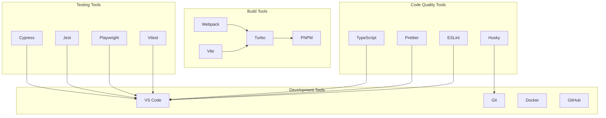

# Development Tools

> **Engineering Fun Fact**: Just as engineers use systematic approaches to solve complex problems, this documentation provides structured guidance for understanding and implementing solutions! 🔧

- _Purpose:_\* Overview of the development tools and utilities used in KiloCode development.

> **Dinosaur Fun Fact**: Architecture documentation is like a dinosaur fossil record - each layer
> tells us about the evolution of our system, helping us understand how it grew and changed over
> time! 🦕

## Development Tools Overview

## Research Context

- _Purpose:_\* \[Describe the purpose and scope of this document]
- _Background:_\* \[Provide relevant background information]
- _Research Questions:_\* \[List key questions this document addresses]
- _Methodology:_\* \[Describe the approach or methodology used]
- _Findings:_\* \[Summarize key findings or conclusions]
- \*\*

KiloCode uses a comprehensive set of development tools for efficient development and maintenance:



## Code Quality Tools

### ESLint

- _Purpose_\*: JavaScript and TypeScript linting
- _Configuration_\*: `@roo-code/config-eslint`
- _Key Features_\*:
- **Code Linting**: JavaScript and TypeScript code linting
- **Rule Enforcement**: Enforce coding standards
- **Error Detection**: Detect potential errors and bugs
- **Code Consistency**: Ensure code consistency
- _Configuration_\*:

```javascript
// eslint.config.js
module.exports = {
	extends: ["@roo-code/config-eslint"],
	rules: {
		"no-console": "warn",
		"no-unused-vars": "error",
		"@typescript-eslint/no-explicit-any": "error",
	},
}
```

- _Status_\*: ✅ **Fully Implemented**

### Prettier

- _Purpose_\*: Code formatting
- _Configuration_\*: Shared Prettier configuration
- _Key Features_\*:
- **Code Formatting**: Automatic code formatting
- **Consistent Style**: Consistent code style
- **Editor Integration**: Editor integration
- **CI Integration**: CI/CD integration
- _Configuration_\*:

```json
{
	"semi": true,
	"trailingComma": "es5",
	"singleQuote": true,
	"printWidth": 80,
	"tabWidth": 2,
	"useTabs": false
}
```

- _Status_\*: ✅ **Fully Implemented**

### TypeScript

- _Purpose_\*: Type checking and compilation
- _Configuration_\*: `@roo-code/config-typescript`
- _Key Features_\*:
- **Type Checking**: Static type checking
- **Compilation**: TypeScript to JavaScript compilation
- **Declaration Files**: Declaration file generation
- **IDE Support**: IDE support and IntelliSense
- _Configuration_\*:

```json
{
	"extends": "@roo-code/config-typescript",
	"compilerOptions": {
		"strict": true,
		"noImplicitAny": true,
		"strictNullChecks": true
	}
}
```

- _Status_\*: ✅ **Fully Implemented**

### Husky

- _Purpose_\*: Git hooks management
- _Configuration_\*: Git hooks configuration
- _Key Features_\*:
- **Pre-commit Hooks**: Pre-commit code quality checks
- **Pre-push Hooks**: Pre-push validation
- **Commit Message Hooks**: Commit message validation
- **Automated Checks**: Automated quality checks
- _Configuration_\*:

```json
{
	"husky": {
		"hooks": {
			"pre-commit": "lint-staged",
			"pre-push": "npm run test",
			"commit-msg": "commitlint -E HUSKY_GIT_PARAMS"
		}
	}
}
```

- _Status_\*: ✅ **Fully Implemented**

## Build Tools

### Turbo

- _Purpose_\*: Monorepo build orchestration
- _Configuration_\*: `turbo.json`
- _Key Features_\*:
- **Parallel Execution**: Parallel build execution
- **Caching**: Intelligent build caching
- **Dependency Management**: Dependency-aware builds
- **Task Orchestration**: Task orchestration and coordination
- _Configuration_\*:

```json
{
	"pipeline": {
		"build": {
			"dependsOn": ["^build"],
			"outputs": ["dist/**", "lib/**"]
		},
		"test": {
			"dependsOn": ["build"],
			"outputs": ["coverage/**"]
		},
		"lint": {
			"outputs": []
		}
	}
}
```

- _Status_\*: ✅ **Fully Implemented**

### Webpack

- _Purpose_\*: Module bundling
- _Configuration_\*: Webpack configuration files
- _Key Features_\*:
- **Module Bundling**: JavaScript module bundling
- **Asset Processing**: Asset processing and optimization
- **Code Splitting**: Code splitting and lazy loading
- **Hot Reloading**: Hot module replacement
- _Configuration_\*:

```javascript
// webpack.config.js
module.exports = {
	entry: "./src/index.ts",
	module: {
		rules: [
			{
				test: /\.ts$/,
				use: "ts-loader",
				exclude: /node_modules/,
			},
		],
	},
	resolve: {
		extensions: [".ts", ".js"],
	},
}
```

- _Status_\*: ✅ **Fully Implemented**

### Vite

- _Purpose_\*: Fast build tool
- _Configuration_\*: `vite.config.ts`
- _Key Features_\*:
- **Fast Development**: Fast development server
- **Hot Module Replacement**: HMR for development
- **Optimized Production**: Optimized production builds
- **Plugin System**: Extensible plugin system
- _Configuration_\*:

```typescript
// vite.config.ts
export default defineConfig({
	plugins: [react()],
	build: {
		outDir: "dist",
		sourcemap: true,
	},
})
```

- _Status_\*: ✅ **Fully Implemented**

### PNPM

- _Purpose_\*: Package management
- _Configuration_\*: `pnpm-workspace.yaml`
- _Key Features_\*:
- **Fast Installation**: Fast package installation
- **Disk Efficiency**: Efficient disk usage
- **Workspace Support**: Monorepo workspace support
- **Strict Dependencies**: Strict dependency management
- _Configuration_\*:

```yaml
# pnpm-workspace.yaml

> **Architecture Fun Fact**: Like a well-designed building, good documentation has a solid foundation, clear structure, and intuitive navigation! 🏗️

packages:
  - "packages/*"
  - "apps/*"
  - "src"
  - "webview-ui"
```

- _Status_\*: ✅ **Fully Implemented**

## Testing Tools

### Vitest

- _Purpose_\*: Unit and integration testing
- _Configuration_\*: `vitest.config.ts`
- _Key Features_\*:
- **Fast Execution**: Fast test execution
- **TypeScript Support**: Native TypeScript support
- **Mocking**: Built-in mocking capabilities
- **Coverage**: Code coverage reporting
- _Configuration_\*:

```typescript
// vitest.config.ts
export default defineConfig({
	test: {
		globals: true,
		environment: "node",
		coverage: {
			provider: "v8",
			reporter: ["text", "json", "html"],
		},
	},
})
```

- _Status_\*: ✅ **Fully Implemented**

### Playwright

- _Purpose_\*: End-to-end testing
- _Configuration_\*: `playwright.config.ts`
- _Key Features_\*:
- **Multi-browser Testing**: Chrome, Firefox, Safari support
- **Cross-platform Testing**: Windows, macOS, Linux support
- **Visual Testing**: Visual regression testing
- **Performance Testing**: Performance testing capabilities
- _Configuration_\*:

```typescript
// playwright.config.ts
export default defineConfig({
	testDir: "./tests",
	fullyParallel: true,
	retries: process.env.CI ? 2 : 0,
	workers: process.env.CI ? 1 : undefined,
	reporter: "html",
	use: {
		baseURL: "http://localhost:3000",
	},
})
```

- _Status_\*: ✅ **Fully Implemented**

### Jest

- _Purpose_\*: Performance and specialized testing
- _Configuration_\*: `jest.config.js`
- _Key Features_\*:
- **Performance Testing**: Performance testing capabilities
- **Memory Testing**: Memory leak detection
- **Stress Testing**: Stress testing capabilities
- **Benchmarking**: Performance benchmarking
- _Configuration_\*:

```javascript
// jest.config.js
module.exports = {
	preset: "ts-jest",
	testEnvironment: "node",
	testMatch: ["**/__tests__/**/*.test.ts"],
}
```

- _Status_\*: ✅ **Fully Implemented**

### Cypress

- _Purpose_\*: Web application testing
- _Configuration_\*: `cypress.config.ts`
- _Key Features_\*:
- **Web Testing**: Web application testing
- **Real Browser Testing**: Real browser testing
- **Visual Testing**: Visual regression testing
- **API Testing**: API testing capabilities
- _Configuration_\*:

```typescript
// cypress.config.ts
export default defineConfig({
	e2e: {
		baseUrl: "http://localhost:3000",
		supportFile: "cypress/support/e2e.ts",
		specPattern: "cypress/e2e/**/*.cy.{js,jsx,ts,tsx}",
	},
})
```

- _Status_\*: ✅ **Fully Implemented**

## Development Environment

### VS Code

- _Purpose_\*: Primary development environment
- _Extensions_\*:
- **TypeScript**: TypeScript support
- **ESLint**: ESLint integration
- **Prettier**: Prettier integration
- **GitLens**: Git integration
- **Thunder Client**: API testing
- **REST Client**: REST API testing
- _Configuration_\*:

```json
{
	"typescript.preferences.importModuleSpecifier": "relative",
	"editor.formatOnSave": true,
	"editor.codeActionsOnSave": {
		"source.fixAll.eslint": true
	}
}
```

- _Status_\*: ✅ **Fully Implemented**

### Git

- _Purpose_\*: Version control
- _Configuration_\*: Git configuration
- _Key Features_\*:
- **Version Control**: Source code version control
- **Branch Management**: Branch management and merging
- **Commit Management**: Commit management and history
- **Collaboration**: Team collaboration and code review
- _Configuration_\*:

```gitconfig
[user]
  name = "Developer Name"
  email = "developer@example.com"
[core]
  autocrlf = input
  safecrlf = true
[push]
  default = simple
```

- _Status_\*: ✅ **Fully Implemented**

### Docker

- _Purpose_\*: Containerization
- _Configuration_\*: `Dockerfile`
- _Key Features_\*:
- **Containerization**: Application containerization
- **Environment Consistency**: Consistent development environments
- **Deployment**: Container-based deployment
- **Isolation**: Process and resource isolation
- _Configuration_\*:

```dockerfile
# Dockerfile

> **Engineering Fun Fact**: Just as engineers use systematic approaches to solve complex problems, this documentation provides structured guidance for understanding and implementing solutions! 🔧

FROM node:18-alpine
WORKDIR /app
COPY package*.json ./
RUN npm install
COPY . .
RUN npm run build
EXPOSE 3000
CMD ["npm", "start"]
```

- _Status_\*: ✅ **Fully Implemented**

### GitHub

- _Purpose_\*: Code hosting and collaboration
- _Features_\*:
- **Code Hosting**: Git repository hosting
- **Issue Tracking**: Issue and bug tracking
- **Pull Requests**: Code review and collaboration
- **Actions**: CI/CD automation
- **Projects**: Project management
- _Status_\*: ✅ **Fully Implemented**

## Development Workflow

### Local Development

1. **Clone Repository**: `git clone <repository-url>`
2. **Install Dependencies**: `pnpm install`
3. **Start Development**: `turbo dev`
4. **Run Tests**: `turbo test`
5. **Lint Code**: `turbo lint`

### Code Quality

1. **Pre-commit Checks**: Automatic pre-commit checks
2. **Code Formatting**: Automatic code formatting
3. **Type Checking**: TypeScript type checking
4. **Linting**: ESLint code linting

### Testing

1. **Unit Tests**: `pnpm test`
2. **Integration Tests**: `pnpm test:integration`
3. **E2E Tests**: `pnpm test:e2e`
4. **Performance Tests**: `pnpm test:performance`

### Building

1. **Build Packages**: `turbo build`
2. **Build Applications**: `turbo build:apps`
3. **Build Extension**: `turbo build:extension`
4. **Build Documentation**: `turbo build:docs`

## Next Steps

1. **Explore Integrations**: See [EXTERNAL_INTEGRATIONS.md](EXTERNAL_INTEGRATIONS.md)
2. **Understand Repository**: See [REPOSITORY_STRUCTURE.md](REPOSITORY_STRUCTURE.md)
3. **Learn Development**: See [DEVELOPMENT_GUIDE.md](DEVELOPMENT_GUIDE.md)

## 🧭 Navigation Footer

- [← Back to Repository Home](README.md)
- [→ External Integrations](EXTERNAL_INTEGRATIONS.md)
- [↑ Table of Contents](README.md)

## No Dead Ends Policy

This document is designed to provide value and connect to the broader KiloCode ecosystem:

- **Purpose**: \[Brief description of document purpose]
- **Connections**: Links to related documents and resources
- **Next Steps**: Clear guidance on how to use this information
- **Related Documentation**: References to complementary materials

For questions or suggestions about this documentation, please refer to the [Documentation Guide](../../DOCUMENTATION_GUIDE.md) or [Architecture Overview](../architecture/README.md).

## Navigation Footer

- \*\*
- _Navigation_\*: [docs](../../) · [architecture](../../architecture/) ·
  [repository](../docs/architecture/../architecture/repository/) · [↑ Table of Contents](#development-tools)
