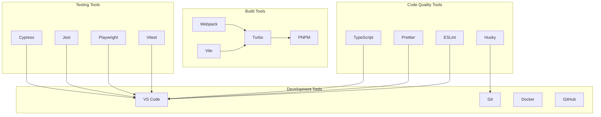

# Development Tools

## Table of Contents

* [Development Tools](#development-tools)
* [Table of Contents](#table-of-contents)
* [When You're Here](#when-youre-here)
* [Development Tools Overview](#development-tools-overview)
* [Research Context](#research-context)
* [Code Quality Tools](#code-quality-tools)
* [ESLint](#eslint)
* [Prettier](#prettier)
* [TypeScript](#typescript)
* [Husky](#husky)
* [Build Tools](#build-tools)
* [Turbo](#turbo)
* [Webpack](#webpack)
* [Vite](#vite)
* [PNPM](#pnpm)
* [Testing Tools](#testing-tools)
* [Vitest](#vitest)
* [Playwright](#playwright)
* [Jest](#jest)
* [Cypress](#cypress)
* [Development Environment](#development-environment)
* [VS Code](#vs-code)
* [Git](#git)
* [Docker](#docker)
* [GitHub](#github)
* [Development Workflow](#development-workflow)
* [Local Development](#local-development)
* [Code Quality](#code-quality)
* [Testing](#testing)
* [Building](#building)
* [Next Steps](#next-steps)
* [🧭 Navigation Footer](#-navigation-footer)
* [Navigation Footer](#navigation-footer)
* [No Dead Ends Policy](#no-dead-ends-policy)
* [Navigation](#navigation)
* [Development Tools](#development-tools)
* [Table of Contents](#table-of-contents)
* [When You're Here](#when-youre-here)
* [Development Tools Overview](#development-tools-overview)
* [Research Context](#research-context)
* [Code Quality Tools](#code-quality-tools)
* [ESLint](#eslint)
* [Prettier](#prettier)
* [TypeScript](#typescript)
* [Husky](#husky)
* [Build Tools](#build-tools)
* [Turbo](#turbo)
* [Webpack](#webpack)
* [Vite](#vite)
* [PNPM](#pnpm)
* [Testing Tools](#testing-tools)
* [Vitest](#vitest)
* [Playwright](#playwright)
* [Jest](#jest)
* [Cypress](#cypress)
* [Development Environment](#development-environment)
* [VS Code](#vs-code)
* [Git](#git)
* [Docker](#docker)
* [GitHub](#github)
* [Development Workflow](#development-workflow)
* [Local Development](#local-development)
* [Code Quality](#code-quality)
* [Testing](#testing)
* [Building](#building)
* [Next Steps](#next-steps)
* [🧭 Navigation Footer](#-navigation-footer)
* [Navigation Footer](#navigation-footer)
* [No Dead Ends Policy](#no-dead-ends-policy)

## When You're Here

This document provides \[purpose of document].

* **Purpose**: \[Brief description of what this document covers]
* **Context**: \[How this fits into the broader system/project]
* **Navigation**: Use the table of contents below to jump to specific topics

> **Engineering Fun Fact**: Just as engineers use systematic approaches to solve complex problems,
> this documentation provides structured guidance for understanding and implementing solutions! 🔧

* *Purpose:*\* Overview of the development tools and utilities used in KiloCode development.

> **Dinosaur Fun Fact**: Architecture documentation is like a dinosaur fossil record - each layer
> tells us about the evolution of our system, helping us understand how it grew and changed over
> time! 🦕

## Development Tools Overview

## Research Context

* *Purpose:*\* \[Describe the purpose and scope of this document]

* *Background:*\* \[Provide relevant background information]

* *Research Questions:*\* \[List key questions this document addresses]

* *Methodology:*\* \[Describe the approach or methodology used]

* *Findings:*\* \[Summarize key findings or conclusions]

* \*\*

KiloCode uses a comprehensive set of development tools for efficient development and maintenance:



## Code Quality Tools

### ESLint

* *Purpose*\*: JavaScript and TypeScript linting

* *Configuration*\*: `@roo-code/config-eslint`

* *Key Features*\*:

* **Code Linting**: JavaScript and TypeScript code linting

* **Rule Enforcement**: Enforce coding standards

* **Error Detection**: Detect potential errors and bugs

* **Code Consistency**: Ensure code consistency

* *Configuration*\*:

```javascript
// eslint.config.js
module.exports = {
	extends: ["@roo-code/config-eslint"],
	rules: {
		"no-console": "warn",
		"no-unused-vars": "error",
		"@typescript-eslint/no-explicit-any": "error",
	},
}
```

* *Status*\*: ✅ **Fully Implemented**

### Prettier

* *Purpose*\*: Code formatting

* *Configuration*\*: Shared Prettier configuration

* *Key Features*\*:

* **Code Formatting**: Automatic code formatting

* **Consistent Style**: Consistent code style

* **Editor Integration**: Editor integration

* **CI Integration**: CI/CD integration

* *Configuration*\*:

```json
{
	"semi": true,
	"trailingComma": "es5",
	"singleQuote": true,
	"printWidth": 80,
	"tabWidth": 2,
	"useTabs": false
}
```

* *Status*\*: ✅ **Fully Implemented**

### TypeScript

* *Purpose*\*: Type checking and compilation

* *Configuration*\*: `@roo-code/config-typescript`

* *Key Features*\*:

* **Type Checking**: Static type checking

* **Compilation**: TypeScript to JavaScript compilation

* **Declaration Files**: Declaration file generation

* **IDE Support**: IDE support and IntelliSense

* *Configuration*\*:

```json
{
	"extends": "@roo-code/config-typescript",
	"compilerOptions": {
		"strict": true,
		"noImplicitAny": true,
		"strictNullChecks": true
	}
}
```

* *Status*\*: ✅ **Fully Implemented**

### Husky

* *Purpose*\*: Git hooks management

* *Configuration*\*: Git hooks configuration

* *Key Features*\*:

* **Pre-commit Hooks**: Pre-commit code quality checks

* **Pre-push Hooks**: Pre-push validation

* **Commit Message Hooks**: Commit message validation

* **Automated Checks**: Automated quality checks

* *Configuration*\*:

```json
{
	"husky": {
		"hooks": {
			"pre-commit": "lint-staged",
			"pre-push": "npm run test",
			"commit-msg": "commitlint -E HUSKY_GIT_PARAMS"
		}
	}
}
```

* *Status*\*: ✅ **Fully Implemented**

## Build Tools

### Turbo

* *Purpose*\*: Monorepo build orchestration

* *Configuration*\*: `turbo.json`

* *Key Features*\*:

* **Parallel Execution**: Parallel build execution

* **Caching**: Intelligent build caching

* **Dependency Management**: Dependency-aware builds

* **Task Orchestration**: Task orchestration and coordination

* *Configuration*\*:

```json
{
	"pipeline": {
		"build": {
			"dependsOn": ["^build"],
			"outputs": ["dist/**", "lib/**"]
		},
		"test": {
			"dependsOn": ["build"],
			"outputs": ["coverage/**"]
		},
		"lint": {
			"outputs": []
		}
	}
}
```

* *Status*\*: ✅ **Fully Implemented**

### Webpack

* *Purpose*\*: Module bundling

* *Configuration*\*: Webpack configuration files

* *Key Features*\*:

* **Module Bundling**: JavaScript module bundling

* **Asset Processing**: Asset processing and optimization

* **Code Splitting**: Code splitting and lazy loading

* **Hot Reloading**: Hot module replacement

* *Configuration*\*:

```javascript
// webpack.config.js
module.exports = {
	entry: "./src/index.ts",
	module: {
		rules: [
			{
				test: /\.ts$/,
				use: "ts-loader",
				exclude: /node_modules/,
			},
		],
	},
	resolve: {
		extensions: [".ts", ".js"],
	},
}
```

* *Status*\*: ✅ **Fully Implemented**

### Vite

* *Purpose*\*: Fast build tool

* *Configuration*\*: `vite.config.ts`

* *Key Features*\*:

* **Fast Development**: Fast development server

* **Hot Module Replacement**: HMR for development

* **Optimized Production**: Optimized production builds

* **Plugin System**: Extensible plugin system

* *Configuration*\*:

```typescript
// vite.config.ts
export default defineConfig({
	plugins: [react()],
	build: {
		outDir: "dist",
		sourcemap: true,
	},
})
```

* *Status*\*: ✅ **Fully Implemented**

### PNPM

* *Purpose*\*: Package management

* *Configuration*\*: `pnpm-workspace.yaml`

* *Key Features*\*:

* **Fast Installation**: Fast package installation

* **Disk Efficiency**: Efficient disk usage

* **Workspace Support**: Monorepo workspace support

* **Strict Dependencies**: Strict dependency management

* *Configuration*\*:

```yaml
# pnpm-workspace.yaml

> **Architecture Fun Fact**: Like a well-designed building, good documentation has a solid
foundation, clear structure, and intuitive navigation! 🏗️

packages:
- "packages/*"
- "apps/*"
- "src"
- "webview-ui"
```

* *Status*\*: ✅ **Fully Implemented**

## Testing Tools

### Vitest

* *Purpose*\*: Unit and integration testing

* *Configuration*\*: `vitest.config.ts`

* *Key Features*\*:

* **Fast Execution**: Fast test execution

* **TypeScript Support**: Native TypeScript support

* **Mocking**: Built-in mocking capabilities

* **Coverage**: Code coverage reporting

* *Configuration*\*:

```typescript
// vitest.config.ts
export default defineConfig({
	test: {
		globals: true,
		environment: "node",
		coverage: {
			provider: "v8",
			reporter: ["text", "json", "html"],
		},
	},
})
```

* *Status*\*: ✅ **Fully Implemented**

### Playwright

* *Purpose*\*: End-to-end testing

* *Configuration*\*: `playwright.config.ts`

* *Key Features*\*:

* **Multi-browser Testing**: Chrome, Firefox, Safari support

* **Cross-platform Testing**: Windows, macOS, Linux support

* **Visual Testing**: Visual regression testing

* **Performance Testing**: Performance testing capabilities

* *Configuration*\*:

```typescript
// playwright.config.ts
export default defineConfig({
	testDir: "./tests",
	fullyParallel: true,
	retries: process.env.CI ? 2 : 0,
	workers: process.env.CI ? 1 : undefined,
	reporter: "html",
	use: {
		baseURL: "http://localhost:3000",
	},
})
```

* *Status*\*: ✅ **Fully Implemented**

### Jest

* *Purpose*\*: Performance and specialized testing

* *Configuration*\*: `jest.config.js`

* *Key Features*\*:

* **Performance Testing**: Performance testing capabilities

* **Memory Testing**: Memory leak detection

* **Stress Testing**: Stress testing capabilities

* **Benchmarking**: Performance benchmarking

* *Configuration*\*:

```javascript
// jest.config.js
module.exports = {
	preset: "ts-jest",
	testEnvironment: "node",
	testMatch: ["**/__tests__/**/*.test.ts"],
}
```

* *Status*\*: ✅ **Fully Implemented**

### Cypress

* *Purpose*\*: Web application testing

* *Configuration*\*: `cypress.config.ts`

* *Key Features*\*:

* **Web Testing**: Web application testing

* **Real Browser Testing**: Real browser testing

* **Visual Testing**: Visual regression testing

* **API Testing**: API testing capabilities

* *Configuration*\*:

```typescript
// cypress.config.ts
export default defineConfig({
	e2e: {
		baseUrl: "http://localhost:3000",
		supportFile: "cypress/support/e2e.ts",
		specPattern: "cypress/e2e/**/*.cy.{js,jsx,ts,tsx}",
	},
})
```

* *Status*\*: ✅ **Fully Implemented**

## Development Environment

### VS Code

* *Purpose*\*: Primary development environment

* *Extensions*\*:

* **TypeScript**: TypeScript support

* **ESLint**: ESLint integration

* **Prettier**: Prettier integration

* **GitLens**: Git integration

* **Thunder Client**: API testing

* **REST Client**: REST API testing

* *Configuration*\*:

```json
{
	"typescript.preferences.importModuleSpecifier": "relative",
	"editor.formatOnSave": true,
	"editor.codeActionsOnSave": {
		"source.fixAll.eslint": true
	}
}
```

* *Status*\*: ✅ **Fully Implemented**

### Git

* *Purpose*\*: Version control

* *Configuration*\*: Git configuration

* *Key Features*\*:

* **Version Control**: Source code version control

* **Branch Management**: Branch management and merging

* **Commit Management**: Commit management and history

* **Collaboration**: Team collaboration and code review

* *Configuration*\*:

```gitconfig
[user]
  name = "Developer Name"
  email = "developer@example.com"
[core]
  autocrlf = input
  safecrlf = true
[push]
  default = simple
```

* *Status*\*: ✅ **Fully Implemented**

### Docker

* *Purpose*\*: Containerization

* *Configuration*\*: `Dockerfile`

* *Key Features*\*:

* **Containerization**: Application containerization

* **Environment Consistency**: Consistent development environments

* **Deployment**: Container-based deployment

* **Isolation**: Process and resource isolation

* *Configuration*\*:

```dockerfile
# Dockerfile

> **Engineering Fun Fact**: Just as engineers use systematic approaches to solve complex problems,
this documentation provides structured guidance for understanding and implementing solutions! 🔧

FROM node:18-alpine
WORKDIR /app
COPY package*.json ./
RUN npm install
COPY . .
RUN npm run build
EXPOSE 3000
CMD ["npm", "start"]
```

* *Status*\*: ✅ **Fully Implemented**

### GitHub

* *Purpose*\*: Code hosting and collaboration

* *Features*\*:

* **Code Hosting**: Git repository hosting

* **Issue Tracking**: Issue and bug tracking

* **Pull Requests**: Code review and collaboration

* **Actions**: CI/CD automation

* **Projects**: Project management

* *Status*\*: ✅ **Fully Implemented**

## Development Workflow

### Local Development

1. **Clone Repository**: `git clone <repository-url>`
2. **Install Dependencies**: `pnpm install`
3. **Start Development**: `turbo dev`
4. **Run Tests**: `turbo test`
5. **Lint Code**: `turbo lint`

### Code Quality

1. **Pre-commit Checks**: Automatic pre-commit checks
2. **Code Formatting**: Automatic code formatting
3. **Type Checking**: TypeScript type checking
4. **Linting**: ESLint code linting

### Testing

1. **Unit Tests**: `pnpm test`
2. **Integration Tests**: `pnpm test:integration`
3. **E2E Tests**: `pnpm test:e2e`
4. **Performance Tests**: `pnpm test:performance`

### Building

1. **Build Packages**: `turbo build`
2. **Build Applications**: `turbo build:apps`
3. **Build Extension**: `turbo build:extension`
4. **Build Documentation**: `turbo build:docs`

## Next Steps

1. **Explore Integrations**: See [EXTERNAL\_INTEGRATIONS.md](EXTERNAL_INTEGRATIONS.md)
2. **Understand Repository**: See [REPOSITORY\_STRUCTURE.md](REPOSITORY_STRUCTURE.md)
3. **Learn Development**: See [DEVELOPMENT\_GUIDE.md](DEVELOPMENT_GUIDE.md)

## 🧭 Navigation Footer

* [← Back to Repository Home](README.md)
* [→ External Integrations](EXTERNAL_INTEGRATIONS.md)
* [↑ Table of Contents](README.md)

## Navigation Footer

* \*\*

* *Navigation*\*: [docs](../../) · [architecture](../../architecture/) ·
  [repository](../../architecture/) · [↑ Table of Contents](#development-tools)

## No Dead Ends Policy

This document follows the "No Dead Ends" principle - every path leads to useful information.

* Each section provides clear navigation to related content
* All internal links are validated and point to existing documents
* Cross-references include context for better understanding

## Navigation

* 📚 [Technical Glossary](../GLOSSARY.md)
