# External Integrations

> **Architecture Fun Fact**: Like a well-designed building, good documentation has a solid foundation, clear structure, and intuitive navigation! 🏗️

- *Purpose:*\* Overview of external service integrations and third-party dependencies used in
  KiloCode.

> **Dinosaur Fun Fact**: Architecture documentation is like a dinosaur fossil record - each layer
> tells us about the evolution of our system, helping us understand how it grew and changed over
> time! 🦕

## Integration Overview

## Research Context

- *Purpose:*\* \[Describe the purpose and scope of this document]

- *Background:*\* \[Provide relevant background information]

- *Research Questions:*\* \[List key questions this document addresses]

- *Methodology:*\* \[Describe the approach or methodology used]

- *Findings:*\* \[Summarize key findings or conclusions]
- \*\*

KiloCode integrates with various external services and platforms to provide comprehensive
functionality:

```mermaid
graph TB
    subgraph "AI Services"
        OPENAI[OpenAI API]
        ANTHROPIC[Anthropic API]
        AZURE_OPENAI[Azure OpenAI]
    end

    subgraph "Cloud Services"
        AWS[AWS Services]
        AZURE[Azure Services]
        GCP[Google Cloud]
    end

    subgraph "Development Platforms"
        VSCODE_MARKETPLACE[VS Code Marketplace]
        NPM[NPM Registry]
        GITHUB[GitHub]
        DOCKER_HUB[Docker Hub]
    end

    subgraph "Monitoring & Analytics"
        LAMINAR[Laminar]
        TELEMETRY[Telemetry Services]
        ANALYTICS[Analytics Platforms]
    end

    subgraph "KiloCode Core"
        CORE[Core Extension]
        WEBVIEW[Webview UI]
        PACKAGES[Workspace Packages]
    end

    CORE --> OPENAI
    CORE --> ANTHROPIC
    CORE --> AZURE_OPENAI
    CORE --> AWS
    CORE --> AZURE
    CORE --> GCP
    CORE --> LAMINAR
    CORE --> TELEMETRY
    WEBVIEW --> ANALYTICS
    PACKAGES --> NPM
    CORE --> VSCODE_MARKETPLACE
    CORE --> GITHUB
    CORE --> DOCKER_HUB
```



## AI Services

### OpenAI API

- *Purpose*\*: Primary AI service provider

- *Integration Points*\*:

- **Chat Completions**: Main chat functionality

- **Function Calling**: Tool execution

- **Embeddings**: Vector embeddings

- **Fine-tuning**: Model fine-tuning

- *Configuration*\*:

```typescript
// OpenAI configuration
const openai = new OpenAI({
	apiKey: process.env.OPENAI_API_KEY,
	organization: process.env.OPENAI_ORG_ID,
})
```

- *Status*\*: ✅ **Fully Implemented**

### Anthropic API

- *Purpose*\*: Alternative AI service provider

- *Integration Points*\*:

- **Claude API**: Claude model integration

- **Message API**: Message handling

- **Tool Use**: Tool usage capabilities

- **Streaming**: Streaming responses

- *Configuration*\*:

```typescript
// Anthropic configuration
const anthropic = new Anthropic({
	apiKey: process.env.ANTHROPIC_API_KEY,
})
```

- *Status*\*: ✅ **Fully Implemented**

### Azure OpenAI

- *Purpose*\*: Enterprise AI service provider

- *Integration Points*\*:

- **Azure OpenAI Service**: Azure-hosted OpenAI

- **Enterprise Features**: Enterprise-grade features

- **Security**: Enhanced security features

- **Compliance**: Compliance and governance

- *Configuration*\*:

```typescript
// Azure OpenAI configuration
const azureOpenAI = new AzureOpenAI({
	apiKey: process.env.AZURE_OPENAI_API_KEY,
	endpoint: process.env.AZURE_OPENAI_ENDPOINT,
	apiVersion: "2024-02-15-preview",
})
```

- *Status*\*: ✅ **Fully Implemented**

## Cloud Services

### AWS Services

- *Purpose*\*: Amazon Web Services integration

- *Services Used*\*:

- **S3**: Object storage

- **Lambda**: Serverless functions

- **DynamoDB**: NoSQL database

- **CloudWatch**: Monitoring and logging

- *Configuration*\*:

```typescript
// AWS configuration
const aws = new AWS.Config({
	accessKeyId: process.env.AWS_ACCESS_KEY_ID,
	secretAccessKey: process.env.AWS_SECRET_ACCESS_KEY,
	region: process.env.AWS_REGION,
})
```

- *Status*\*: ✅ **Fully Implemented**

### Azure Services

- *Purpose*\*: Microsoft Azure integration

- *Services Used*\*:

- **Blob Storage**: Object storage

- **Functions**: Serverless functions

- **Cosmos DB**: NoSQL database

- **Application Insights**: Monitoring and analytics

- *Configuration*\*:

```typescript
// Azure configuration
const azure = new Azure({
	connectionString: process.env.AZURE_CONNECTION_STRING,
	subscriptionId: process.env.AZURE_SUBSCRIPTION_ID,
})
```

- *Status*\*: ✅ **Fully Implemented**

### Google Cloud Platform

- *Purpose*\*: Google Cloud integration

- *Services Used*\*:

- **Cloud Storage**: Object storage

- **Cloud Functions**: Serverless functions

- **Firestore**: NoSQL database

- **Cloud Monitoring**: Monitoring and logging

- *Configuration*\*:

```typescript
// GCP configuration
const gcp = new GoogleCloud({
	projectId: process.env.GCP_PROJECT_ID,
	keyFilename: process.env.GCP_KEY_FILE,
})
```

- *Status*\*: ✅ **Fully Implemented**

## Development Platforms

### VS Code Marketplace

- *Purpose*\*: Extension distribution and management

- *Integration Points*\*:

- **Extension Publishing**: Extension distribution

- **Version Management**: Version control

- **User Feedback**: User reviews and feedback

- **Analytics**: Download and usage analytics

- *Configuration*\*:

```json
{
	"name": "kilo-code",
	"displayName": "KiloCode",
	"description": "AI-powered coding assistant",
	"version": "1.0.0",
	"publisher": "kilocode",
	"engines": {
		"vscode": "^1.74.0"
	}
}
```

- *Status*\*: ✅ **Fully Implemented**

### NPM Registry

- *Purpose*\*: Package distribution and management

- *Integration Points*\*:

- **Package Publishing**: Package distribution

- **Version Management**: Semantic versioning

- **Dependency Management**: Package dependencies

- **Security**: Security vulnerability scanning

- *Configuration*\*:

```json
{
	"name": "@roo-code/types",
	"version": "1.0.0",
	"description": "Shared TypeScript types",
	"main": "dist/index.js",
	"types": "dist/index.d.ts",
	"publishConfig": {
		"access": "public"
	}
}
```

- *Status*\*: ✅ **Fully Implemented**

### GitHub

- *Purpose*\*: Code hosting and collaboration

- *Integration Points*\*:

- **Repository Hosting**: Git repository hosting

- **Issue Tracking**: Issue and bug tracking

- **Pull Requests**: Code review and collaboration

- **Actions**: CI/CD automation

- **Packages**: Package registry

- *Configuration*\*:

```yaml
# .github/workflows/ci.yml

> **Engineering Fun Fact**: Just as engineers use systematic approaches to solve complex problems, this documentation provides structured guidance for understanding and implementing solutions! 🔧

name: CI/CD Pipeline
on:
    push:
        branches: [main]
    pull_request:
        branches: [main]
jobs:
    build:
        runs-on: ubuntu-latest
        steps:
- uses: actions/checkout@v3
- uses: actions/setup-node@v3
- run: pnpm install
- run: pnpm build
- run: pnpm test
```

- *Status*\*: ✅ **Fully Implemented**

### Docker Hub

- *Purpose*\*: Container registry and distribution

- *Integration Points*\*:

- **Container Registry**: Docker image storage

- **Image Distribution**: Container distribution

- **Version Management**: Image versioning

- **Security**: Image security scanning

- *Configuration*\*:

```dockerfile
# Dockerfile

> **Engineering Fun Fact**: Just as engineers use systematic approaches to solve complex problems, this documentation provides structured guidance for understanding and implementing solutions! 🔧

FROM node:18-alpine
WORKDIR /app
COPY package*.json ./
RUN npm install
COPY . .
RUN npm run build
EXPOSE 3000
CMD ["npm", "start"]
```

- *Status*\*: ✅ **Fully Implemented**

## Monitoring & Analytics

### Laminar

- *Purpose*\*: Observability and tracing platform

- *Integration Points*\*:

- **Distributed Tracing**: Request tracing

- **Span Management**: Span lifecycle management

- **Performance Monitoring**: Performance metrics

- **Error Tracking**: Error tracking and alerting

- *Configuration*\*:

```typescript
// Laminar configuration
const laminar = new LaminarClient({
	apiKey: process.env.LAMINAR_API_KEY,
	endpoint: process.env.LAMINAR_ENDPOINT,
	environment: process.env.NODE_ENV,
})
```

- *Status*\*: ✅ **Fully Implemented**

### Telemetry Services

- *Purpose*\*: Usage analytics and telemetry

- *Integration Points*\*:

- **Usage Analytics**: User behavior tracking

- **Performance Metrics**: Performance monitoring

- **Error Reporting**: Error reporting and tracking

- **Feature Usage**: Feature usage analytics

- *Configuration*\*:

```typescript
// Telemetry configuration
const telemetry = new TelemetryClient({
	apiKey: process.env.TELEMETRY_API_KEY,
	endpoint: process.env.TELEMETRY_ENDPOINT,
	debug: process.env.NODE_ENV === "development",
})
```

- *Status*\*: ✅ **Fully Implemented**

### Analytics Platforms

- *Purpose*\*: Web analytics and user tracking

- *Integration Points*\*:

- **User Analytics**: User behavior tracking

- **Page Views**: Page view tracking

- **Events**: Custom event tracking

- **Conversion**: Conversion tracking

- *Configuration*\*:

```typescript
// Analytics configuration
const analytics = new AnalyticsClient({
	trackingId: process.env.ANALYTICS_TRACKING_ID,
	apiKey: process.env.ANALYTICS_API_KEY,
})
```

- *Status*\*: ✅ **Fully Implemented**

## Integration Architecture

### Service Layer

- *Purpose*\*: Abstract external service interactions

- *Components*\*:

- **Service Clients**: External service clients

- **Authentication**: Authentication management

- **Rate Limiting**: Rate limiting and throttling

- **Error Handling**: Error handling and retry logic

### Configuration Management

- *Purpose*\*: Manage external service configurations

- *Components*\*:

- **Environment Variables**: Environment-based configuration

- **Configuration Files**: Configuration file management

- **Secrets Management**: Secure secrets management

- **Validation**: Configuration validation

### Monitoring and Observability

- *Purpose*\*: Monitor external service integrations

- *Components*\*:

- **Health Checks**: Service health monitoring

- **Performance Metrics**: Performance monitoring

- **Error Tracking**: Error tracking and alerting

- **Usage Analytics**: Usage analytics and reporting

## Security Considerations

### Authentication

- *Methods*\*:

- **API Keys**: API key authentication

- **OAuth 2.0**: OAuth 2.0 authentication

- **JWT Tokens**: JWT token authentication

- **Service Accounts**: Service account authentication

### Authorization

- *Methods*\*:

- **Role-Based Access**: Role-based access control

- **Permission Management**: Fine-grained permissions

- **Resource Access**: Resource access control

- **API Rate Limiting**: API rate limiting

### Data Protection

- *Methods*\*:

- **Encryption**: Data encryption in transit and at rest

- **Secrets Management**: Secure secrets management

- **Data Masking**: Sensitive data masking

- **Audit Logging**: Comprehensive audit logging

## Next Steps
1. **Explore Repository**: See [REPOSITORY\_STRUCTURE.md](REPOSITORY_STRUCTURE.md)
2. **Understand Core Systems**: See [CORE\_SYSTEMS.md](CORE_SYSTEMS.md)
3. **Learn Development**: See [DEVELOPMENT\_GUIDE.md](DEVELOPMENT_GUIDE.md)

## 🧭 Navigation Footer
- [← Back to Repository Home](README.md)
- [→ Repository Structure](REPOSITORY_STRUCTURE.md)
- [↑ Table of Contents](README.md)

## Navigation Footer
- \*\*

- *Navigation*\*: [docs](../../) · [architecture](../../architecture/) ·
  [repository](../../architecture/) · [↑ Table of Contents](#external-integrations)

## No Dead Ends Policy

This document follows the "No Dead Ends" principle - every path leads to useful information.
- Each section provides clear navigation to related content
- All internal links are validated and point to existing documents
- Cross-references include context for better understanding
