# External Integrations

> **Architecture Fun Fact**: Like a well-designed building, good documentation has a solid foundation, clear structure, and intuitive navigation! 🏗️

- _Purpose:_\* Overview of external service integrations and third-party dependencies used in
  KiloCode.

> **Dinosaur Fun Fact**: Architecture documentation is like a dinosaur fossil record - each layer
> tells us about the evolution of our system, helping us understand how it grew and changed over
> time! 🦕

## Integration Overview

## Research Context

- _Purpose:_\* \[Describe the purpose and scope of this document]
- _Background:_\* \[Provide relevant background information]
- _Research Questions:_\* \[List key questions this document addresses]
- _Methodology:_\* \[Describe the approach or methodology used]
- _Findings:_\* \[Summarize key findings or conclusions]
- \*\*

KiloCode integrates with various external services and platforms to provide comprehensive
functionality:

```mermaid
graph TB
    subgraph "AI Services"
        OPENAI[OpenAI API]
        ANTHROPIC[Anthropic API]
        AZURE_OPENAI[Azure OpenAI]
    end

    subgraph "Cloud Services"
        AWS[AWS Services]
        AZURE[Azure Services]
        GCP[Google Cloud]
    end

    subgraph "Development Platforms"
        VSCODE_MARKETPLACE[VS Code Marketplace]
        NPM[NPM Registry]
        GITHUB[GitHub]
        DOCKER_HUB[Docker Hub]
    end

    subgraph "Monitoring & Analytics"
        LAMINAR[Laminar]
        TELEMETRY[Telemetry Services]
        ANALYTICS[Analytics Platforms]
    end

    subgraph "KiloCode Core"
        CORE[Core Extension]
        WEBVIEW[Webview UI]
        PACKAGES[Workspace Packages]
    end

    CORE --> OPENAI
    CORE --> ANTHROPIC
    CORE --> AZURE_OPENAI
    CORE --> AWS
    CORE --> AZURE
    CORE --> GCP
    CORE --> LAMINAR
    CORE --> TELEMETRY
    WEBVIEW --> ANALYTICS
    PACKAGES --> NPM
    CORE --> VSCODE_MARKETPLACE
    CORE --> GITHUB
    CORE --> DOCKER_HUB
```



## AI Services

### OpenAI API

- _Purpose_\*: Primary AI service provider
- _Integration Points_\*:
- **Chat Completions**: Main chat functionality
- **Function Calling**: Tool execution
- **Embeddings**: Vector embeddings
- **Fine-tuning**: Model fine-tuning
- _Configuration_\*:

```typescript
// OpenAI configuration
const openai = new OpenAI({
	apiKey: process.env.OPENAI_API_KEY,
	organization: process.env.OPENAI_ORG_ID,
})
```

- _Status_\*: ✅ **Fully Implemented**

### Anthropic API

- _Purpose_\*: Alternative AI service provider
- _Integration Points_\*:
- **Claude API**: Claude model integration
- **Message API**: Message handling
- **Tool Use**: Tool usage capabilities
- **Streaming**: Streaming responses
- _Configuration_\*:

```typescript
// Anthropic configuration
const anthropic = new Anthropic({
	apiKey: process.env.ANTHROPIC_API_KEY,
})
```

- _Status_\*: ✅ **Fully Implemented**

### Azure OpenAI

- _Purpose_\*: Enterprise AI service provider
- _Integration Points_\*:
- **Azure OpenAI Service**: Azure-hosted OpenAI
- **Enterprise Features**: Enterprise-grade features
- **Security**: Enhanced security features
- **Compliance**: Compliance and governance
- _Configuration_\*:

```typescript
// Azure OpenAI configuration
const azureOpenAI = new AzureOpenAI({
	apiKey: process.env.AZURE_OPENAI_API_KEY,
	endpoint: process.env.AZURE_OPENAI_ENDPOINT,
	apiVersion: "2024-02-15-preview",
})
```

- _Status_\*: ✅ **Fully Implemented**

## Cloud Services

### AWS Services

- _Purpose_\*: Amazon Web Services integration
- _Services Used_\*:
- **S3**: Object storage
- **Lambda**: Serverless functions
- **DynamoDB**: NoSQL database
- **CloudWatch**: Monitoring and logging
- _Configuration_\*:

```typescript
// AWS configuration
const aws = new AWS.Config({
	accessKeyId: process.env.AWS_ACCESS_KEY_ID,
	secretAccessKey: process.env.AWS_SECRET_ACCESS_KEY,
	region: process.env.AWS_REGION,
})
```

- _Status_\*: ✅ **Fully Implemented**

### Azure Services

- _Purpose_\*: Microsoft Azure integration
- _Services Used_\*:
- **Blob Storage**: Object storage
- **Functions**: Serverless functions
- **Cosmos DB**: NoSQL database
- **Application Insights**: Monitoring and analytics
- _Configuration_\*:

```typescript
// Azure configuration
const azure = new Azure({
	connectionString: process.env.AZURE_CONNECTION_STRING,
	subscriptionId: process.env.AZURE_SUBSCRIPTION_ID,
})
```

- _Status_\*: ✅ **Fully Implemented**

### Google Cloud Platform

- _Purpose_\*: Google Cloud integration
- _Services Used_\*:
- **Cloud Storage**: Object storage
- **Cloud Functions**: Serverless functions
- **Firestore**: NoSQL database
- **Cloud Monitoring**: Monitoring and logging
- _Configuration_\*:

```typescript
// GCP configuration
const gcp = new GoogleCloud({
	projectId: process.env.GCP_PROJECT_ID,
	keyFilename: process.env.GCP_KEY_FILE,
})
```

- _Status_\*: ✅ **Fully Implemented**

## Development Platforms

### VS Code Marketplace

- _Purpose_\*: Extension distribution and management
- _Integration Points_\*:
- **Extension Publishing**: Extension distribution
- **Version Management**: Version control
- **User Feedback**: User reviews and feedback
- **Analytics**: Download and usage analytics
- _Configuration_\*:

```json
{
	"name": "kilo-code",
	"displayName": "KiloCode",
	"description": "AI-powered coding assistant",
	"version": "1.0.0",
	"publisher": "kilocode",
	"engines": {
		"vscode": "^1.74.0"
	}
}
```

- _Status_\*: ✅ **Fully Implemented**

### NPM Registry

- _Purpose_\*: Package distribution and management
- _Integration Points_\*:
- **Package Publishing**: Package distribution
- **Version Management**: Semantic versioning
- **Dependency Management**: Package dependencies
- **Security**: Security vulnerability scanning
- _Configuration_\*:

```json
{
	"name": "@roo-code/types",
	"version": "1.0.0",
	"description": "Shared TypeScript types",
	"main": "dist/index.js",
	"types": "dist/index.d.ts",
	"publishConfig": {
		"access": "public"
	}
}
```

- _Status_\*: ✅ **Fully Implemented**

### GitHub

- _Purpose_\*: Code hosting and collaboration
- _Integration Points_\*:
- **Repository Hosting**: Git repository hosting
- **Issue Tracking**: Issue and bug tracking
- **Pull Requests**: Code review and collaboration
- **Actions**: CI/CD automation
- **Packages**: Package registry
- _Configuration_\*:

```yaml
# .github/workflows/ci.yml

> **Engineering Fun Fact**: Just as engineers use systematic approaches to solve complex problems, this documentation provides structured guidance for understanding and implementing solutions! 🔧

name: CI/CD Pipeline
on:
    push:
        branches: [main]
    pull_request:
        branches: [main]
jobs:
    build:
        runs-on: ubuntu-latest
        steps:
          - uses: actions/checkout@v3
          - uses: actions/setup-node@v3
          - run: pnpm install
          - run: pnpm build
          - run: pnpm test
```

- _Status_\*: ✅ **Fully Implemented**

### Docker Hub

- _Purpose_\*: Container registry and distribution
- _Integration Points_\*:
- **Container Registry**: Docker image storage
- **Image Distribution**: Container distribution
- **Version Management**: Image versioning
- **Security**: Image security scanning
- _Configuration_\*:

```dockerfile
# Dockerfile

> **Engineering Fun Fact**: Just as engineers use systematic approaches to solve complex problems, this documentation provides structured guidance for understanding and implementing solutions! 🔧

FROM node:18-alpine
WORKDIR /app
COPY package*.json ./
RUN npm install
COPY . .
RUN npm run build
EXPOSE 3000
CMD ["npm", "start"]
```

- _Status_\*: ✅ **Fully Implemented**

## Monitoring & Analytics

### Laminar

- _Purpose_\*: Observability and tracing platform
- _Integration Points_\*:
- **Distributed Tracing**: Request tracing
- **Span Management**: Span lifecycle management
- **Performance Monitoring**: Performance metrics
- **Error Tracking**: Error tracking and alerting
- _Configuration_\*:

```typescript
// Laminar configuration
const laminar = new LaminarClient({
	apiKey: process.env.LAMINAR_API_KEY,
	endpoint: process.env.LAMINAR_ENDPOINT,
	environment: process.env.NODE_ENV,
})
```

- _Status_\*: ✅ **Fully Implemented**

### Telemetry Services

- _Purpose_\*: Usage analytics and telemetry
- _Integration Points_\*:
- **Usage Analytics**: User behavior tracking
- **Performance Metrics**: Performance monitoring
- **Error Reporting**: Error reporting and tracking
- **Feature Usage**: Feature usage analytics
- _Configuration_\*:

```typescript
// Telemetry configuration
const telemetry = new TelemetryClient({
	apiKey: process.env.TELEMETRY_API_KEY,
	endpoint: process.env.TELEMETRY_ENDPOINT,
	debug: process.env.NODE_ENV === "development",
})
```

- _Status_\*: ✅ **Fully Implemented**

### Analytics Platforms

- _Purpose_\*: Web analytics and user tracking
- _Integration Points_\*:
- **User Analytics**: User behavior tracking
- **Page Views**: Page view tracking
- **Events**: Custom event tracking
- **Conversion**: Conversion tracking
- _Configuration_\*:

```typescript
// Analytics configuration
const analytics = new AnalyticsClient({
	trackingId: process.env.ANALYTICS_TRACKING_ID,
	apiKey: process.env.ANALYTICS_API_KEY,
})
```

- _Status_\*: ✅ **Fully Implemented**

## Integration Architecture

### Service Layer

- _Purpose_\*: Abstract external service interactions
- _Components_\*:
- **Service Clients**: External service clients
- **Authentication**: Authentication management
- **Rate Limiting**: Rate limiting and throttling
- **Error Handling**: Error handling and retry logic

### Configuration Management

- _Purpose_\*: Manage external service configurations
- _Components_\*:
- **Environment Variables**: Environment-based configuration
- **Configuration Files**: Configuration file management
- **Secrets Management**: Secure secrets management
- **Validation**: Configuration validation

### Monitoring and Observability

- _Purpose_\*: Monitor external service integrations
- _Components_\*:
- **Health Checks**: Service health monitoring
- **Performance Metrics**: Performance monitoring
- **Error Tracking**: Error tracking and alerting
- **Usage Analytics**: Usage analytics and reporting

## Security Considerations

### Authentication

- _Methods_\*:
- **API Keys**: API key authentication
- **OAuth 2.0**: OAuth 2.0 authentication
- **JWT Tokens**: JWT token authentication
- **Service Accounts**: Service account authentication

### Authorization

- _Methods_\*:
- **Role-Based Access**: Role-based access control
- **Permission Management**: Fine-grained permissions
- **Resource Access**: Resource access control
- **API Rate Limiting**: API rate limiting

### Data Protection

- _Methods_\*:
- **Encryption**: Data encryption in transit and at rest
- **Secrets Management**: Secure secrets management
- **Data Masking**: Sensitive data masking
- **Audit Logging**: Comprehensive audit logging

## Next Steps

1. **Explore Repository**: See [REPOSITORY_STRUCTURE.md](REPOSITORY_STRUCTURE.md)
2. **Understand Core Systems**: See [CORE_SYSTEMS.md](CORE_SYSTEMS.md)
3. **Learn Development**: See [DEVELOPMENT_GUIDE.md](DEVELOPMENT_GUIDE.md)

## 🧭 Navigation Footer

- [← Back to Repository Home](README.md)
- [→ Repository Structure](REPOSITORY_STRUCTURE.md)
- [↑ Table of Contents](README.md)

## No Dead Ends Policy

This document is designed to provide value and connect to the broader KiloCode ecosystem:

- **Purpose**: \[Brief description of document purpose]
- **Connections**: Links to related documents and resources
- **Next Steps**: Clear guidance on how to use this information
- **Related Documentation**: References to complementary materials

For questions or suggestions about this documentation, please refer to the [Documentation Guide](../../DOCUMENTATION_GUIDE.md) or [Architecture Overview](../architecture/README.md).

## Navigation Footer

- \*\*
- _Navigation_\*: [docs](../../) · [architecture](../../architecture/) ·
  [repository](../docs/architecture/../architecture/repository/) · [↑ Table of Contents](#external-integrations)
