# Repository Structure

## Table of Contents
- [Repository Structure](#repository-structure)
- [Table of Contents](#table-of-contents)
- [When You're Here](#when-youre-here)
- [Executive Summary](#executive-summary)
- [Research Context](#research-context)
- [Repository Structure Diagram](#repository-structure-diagram)
- [Directory Structure](#directory-structure)
- [Core Extension (](#core-extension-)
- [Webview UI (](#webview-ui-)
- [Workspace Packages (](#workspace-packages-)
- [Applications (](#applications-)
- [File Type Distribution](#file-type-distribution)
- [TypeScript Files](#typescript-files)
- [Configuration Files](#configuration-files)
- [Documentation Files](#documentation-files)
- [Monorepo Architecture](#monorepo-architecture)
- [Workspace Configuration](#workspace-configuration)
- [Dependency Management](#dependency-management)
- [Development Workflow](#development-workflow)
- [Local Development](#local-development)
- [Package Development](#package-development)
- [Application Development](#application-development)
- [Build and Deployment](#build-and-deployment)
- [Build Pipeline](#build-pipeline)
- [Deployment Strategy](#deployment-strategy)
- [Quality Assurance](#quality-assurance)
- [Code Quality](#code-quality)
- [Testing Strategy](#testing-strategy)
- [Continuous Integration](#continuous-integration)
- [Next Steps](#next-steps)
- [🧭 Navigation Footer](#-navigation-footer)
- [Navigation Footer](#navigation-footer)
- [No Dead Ends Policy](#no-dead-ends-policy)
- [Navigation](#navigation)
- [Repository Structure](#repository-structure)
- [Table of Contents](#table-of-contents)
- [When You're Here](#when-youre-here)
- [Executive Summary](#executive-summary)
- [Research Context](#research-context)
- [Repository Structure Diagram](#repository-structure-diagram)
- [Directory Structure](#directory-structure)
- [Core Extension (](#core-extension-)
- [Webview UI (](#webview-ui-)
- [Workspace Packages (](#workspace-packages-)
- [Applications (](#applications-)
- [File Type Distribution](#file-type-distribution)
- [TypeScript Files](#typescript-files)
- [Configuration Files](#configuration-files)
- [Documentation Files](#documentation-files)
- [Monorepo Architecture](#monorepo-architecture)
- [Workspace Configuration](#workspace-configuration)
- [Dependency Management](#dependency-management)
- [Development Workflow](#development-workflow)
- [Local Development](#local-development)
- [Package Development](#package-development)
- [Application Development](#application-development)
- [Build and Deployment](#build-and-deployment)
- [Build Pipeline](#build-pipeline)
- [Deployment Strategy](#deployment-strategy)
- [Quality Assurance](#quality-assurance)
- [Code Quality](#code-quality)
- [Testing Strategy](#testing-strategy)
- [Continuous Integration](#continuous-integration)
- [Next Steps](#next-steps)
- [🧭 Navigation Footer](#-navigation-footer)
- [Navigation Footer](#navigation-footer)
- [No Dead Ends Policy](#no-dead-ends-policy)

## When You're Here

This document provides \[purpose of document].

- **Purpose**: \[Brief description of what this document covers]
- **Context**: \[How this fits into the broader system/project]
- **Navigation**: Use the table of contents below to jump to specific topics

> **System Fun Fact**: Every complex system is just a collection of simple parts working together -
> documentation helps us understand how! ⚙️

- *Purpose:*\* High-level overview of the KiloCode repository organization and directory structure.

> **Dinosaur Fun Fact**: Architecture documentation is like a dinosaur fossil record - each layer
> tells us about the evolution of our system, helping us understand how it grew and changed over
> time! 🦕

## Executive Summary

## Research Context

- *Purpose:*\* \[Describe the purpose and scope of this document]

- *Background:*\* \[Provide relevant background information]

- *Research Questions:*\* \[List key questions this document addresses]

- *Methodology:*\* \[Describe the approach or methodology used]

- *Findings:*\* \[Summarize key findings or conclusions]
- \*\*

The KiloCode repository is a comprehensive VS Code extension for AI-powered coding assistance,
featuring a multi-layered architecture with extensive tooling, testing, and deployment
infrastructure. The codebase spans over 1,120 TypeScript files across multiple workspace packages,
applications, and services.

- *Key Statistics:*\*

- **Total Files**: 1,120+ TypeScript files

- **Workspace Packages**: 7 core packages

- **Applications**: 8 applications (docs, testing, web interfaces)

- **Core Services**: 15+ specialized services

- **Tools**: 25+ AI-powered tools

- **Test Coverage**: Extensive unit, integration, and E2E testing

## Repository Structure Diagram

```mermaid
graph TB
    subgraph "Repository Root"
        ROOT[KiloCode Repository]
    end

    subgraph "Core Systems"
        CORE[src/ - Core Extension]
        WEBVIEW[webview-ui/ - React UI]
        PACKAGES[packages/ - Shared Libraries]
        APPS[apps/ - Applications]
    end

    subgraph "Supporting Infrastructure"
        JETBRAINS[jetbrains/ - JetBrains Plugin]
        LAMINAR[laminar/ - Patches]
        CONTEXT[context/ - Context Files]
        PLANS[plans/ - Investigation Plans]
    end

    subgraph "Development Tools"
        SCRIPTS[scripts/ - Build Scripts]
        DEPS[deps/ - Dependencies]
        BENCHMARK[benchmark/ - Performance Tests]
        LAUNCH[launch/ - Launch Configurations]
    end

    ROOT --> CORE
    ROOT --> WEBVIEW
    ROOT --> PACKAGES
    ROOT --> APPS
    ROOT --> JETBRAINS
    ROOT --> LAMINAR
    ROOT --> CONTEXT
    ROOT --> PLANS
    ROOT --> SCRIPTS
    ROOT --> DEPS
    ROOT --> BENCHMARK
    ROOT --> LAUNCH

    style ROOT fill:#e1f5fe
    style CORE fill:#f3e5f5
    style WEBVIEW fill:#e8f5e8
    style PACKAGES fill:#fff3e0
    style APPS fill:#fce4ec
```



## Directory Structure

### Core Extension (`src/`)

- *Purpose*\*: Main VS Code extension implementation

- *Key Components*\*:

- **Core Services**: Task management, API integration, message handling

- **Webview Communication**: Bridge between extension and UI

- **Integrations**: External service integrations

- **Utilities**: Shared utility functions

- **Activation**: Extension activation and lifecycle management

- *File Count*\*: 400+ TypeScript files

### Webview UI (`webview-ui/`)

- *Purpose*\*: React-based user interface for the extension

- *Key Components*\*:

- **Chat Interface**: Main chat UI components

- **Task Management**: Task creation and management UI

- **Settings**: Configuration and preferences UI

- **Components**: Reusable UI components

- **Services**: Frontend service layer

- *File Count*\*: 300+ TypeScript/React files

### Workspace Packages (`packages/`)

- *Purpose*\*: Shared libraries and utilities across the monorepo

- *Packages*\*:

- **@roo-code/types**: Shared TypeScript type definitions

- **@roo-code/build**: Build system and tooling

- **@roo-code/cloud**: Cloud service integrations

- **@roo-code/evals**: Evaluation and testing utilities

- **@roo-code/ipc**: Inter-process communication

- **@roo-code/telemetry**: Telemetry and analytics

- **@kilo-code/config-\***: Configuration packages

- *File Count*\*: 200+ TypeScript files

### Applications (`apps/`)

- *Purpose*\*: Standalone applications and interfaces

- *Applications*\*:

- **kilocode-docs**: Documentation website

- **storybook**: Component library and design system

- **playwright-e2e**: End-to-end testing suite

- **vscode-e2e**: VS Code extension testing

- **web-evals**: Web-based evaluation tools

- **web-roo-code**: Web interface for RooCode

- *File Count*\*: 150+ TypeScript files

## File Type Distribution

### TypeScript Files

- **Core Extension**: 400+ files
- **Webview UI**: 300+ files
- **Packages**: 200+ files
- **Applications**: 150+ files
- **JetBrains Plugin**: 100+ files
- **Total**: 1,150+ TypeScript files

### Configuration Files

- **Package.json**: 20+ files
- **TypeScript Config**: 15+ files
- **Build Configs**: 10+ files
- **Lint Configs**: 5+ files

### Documentation Files

- **Markdown**: 200+ files
- **README**: 50+ files
- **Changelog**: 10+ files

## Monorepo Architecture

### Workspace Configuration

- *Root Package.json*\*:

```json
{
	"name": "kilo-code",
	"private": true,
	"workspaces": ["packages/*", "apps/*", "src", "webview-ui"]
}
```

- *Package Management*\*: PNPM workspace with shared dependencies

- *Build System*\*: Turbo for monorepo build orchestration

### Dependency Management

- *Shared Dependencies*\*: Common dependencies managed at root level

- *Package-Specific Dependencies*\*: Individual packages can have specific dependencies

- *Version Management*\*: Centralized version management with Renovate

## Development Workflow

### Local Development
1. **Clone Repository**: `git clone <repository-url>`
2. **Install Dependencies**: `pnpm install`
3. **Build Packages**: `turbo build`
4. **Start Development**: `turbo dev`

### Package Development
1. **Navigate to Package**: `cd packages/<package-name>`
2. **Install Dependencies**: `pnpm install`
3. **Run Tests**: `pnpm test`
4. **Build Package**: `pnpm build`

### Application Development
1. **Navigate to Application**: `cd apps/<app-name>`
2. **Install Dependencies**: `pnpm install`
3. **Start Development Server**: `pnpm dev`
4. **Run Tests**: `pnpm test`

## Build and Deployment

### Build Pipeline

- *Stages*\*:
1. **Dependency Installation**: Install all workspace dependencies
2. **Type Checking**: Validate TypeScript across all packages
3. **Linting**: Run ESLint on all code
4. **Testing**: Execute unit, integration, and E2E tests
5. **Building**: Compile and bundle all packages
6. **Packaging**: Create distribution packages

- *Tools*\*:

- **Turbo**: Monorepo build orchestration

- **TypeScript**: Type checking and compilation

- **ESLint**: Code linting and formatting

- **Vitest**: Unit and integration testing

- **Playwright**: End-to-end testing

### Deployment Strategy

- *VS Code Extension*\*: Published to VS Code Marketplace

- *Web Applications*\*: Deployed to hosting platforms

- *Documentation*\*: Deployed to documentation hosting

- *Packages*\*: Published to NPM registry

## Quality Assurance

### Code Quality

- *Linting*\*: ESLint with custom rules for TypeScript and React

- *Formatting*\*: Prettier for consistent code formatting

- *Type Safety*\*: Strict TypeScript configuration

- *Code Review*\*: Mandatory code review for all changes

### Testing Strategy

- *Unit Tests*\*: Individual component and function testing

- *Integration Tests*\*: Component interaction testing

- *End-to-End Tests*\*: Full workflow testing

- *Performance Tests*\*: Load and performance testing

### Continuous Integration

- *Automated Testing*\*: All tests run on every commit

- *Quality Gates*\*: Build fails if quality checks fail

- *Deployment*\*: Automated deployment on successful builds

## Next Steps
1. **Explore Core Systems**: See [CORE\_SYSTEMS.md](CORE_SYSTEMS.md)
2. **Understand Packages**: See [WORKSPACE\_PACKAGES.md](WORKSPACE_PACKAGES.md)
3. **Learn Development**: See [DEVELOPMENT\_GUIDE.md](DEVELOPMENT_GUIDE.md)

## 🧭 Navigation Footer
- [← Back to Repository Home](README.md)
- [→ Core Systems](CORE_SYSTEMS.md)
- [↑ Table of Contents](README.md)

## Navigation Footer
- \*\*

- *Navigation*\*: [docs](../../) · [architecture](../../architecture/) ·
  [repository](../../architecture/) · [↑ Table of Contents](#repository-structure)

## No Dead Ends Policy

This document follows the "No Dead Ends" principle - every path leads to useful information.
- Each section provides clear navigation to related content
- All internal links are validated and point to existing documents
- Cross-references include context for better understanding

## Navigation
- 📚 [Technical Glossary](../../GLOSSARY.md)
