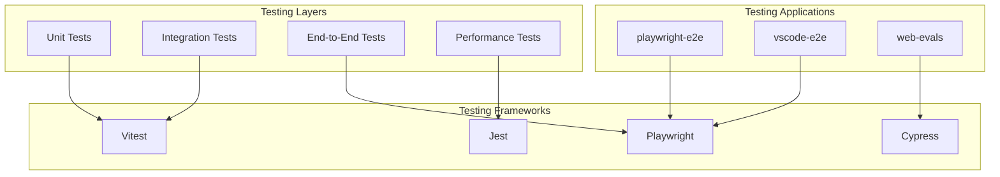

# Testing Infrastructure

## Table of Contents

* [Testing Infrastructure](#testing-infrastructure)
* [Table of Contents](#table-of-contents)
* [When You're Here](#when-youre-here)
* [Testing Overview](#testing-overview)
* [Research Context](#research-context)
* [Testing Frameworks](#testing-frameworks)
* [Vitest](#vitest)
* [Playwright](#playwright)
* [Jest](#jest)
* [Testing Applications](#testing-applications)
* [playwright-e2e](#playwrighte2e)
* [vscode-e2e](#vscodee2e)
* [web-evals](#webevals)
* [Testing Strategy](#testing-strategy)
* [Unit Testing](#unit-testing)
* [Integration Testing](#integration-testing)
* [End-to-End Testing](#endtoend-testing)
* [Performance Testing](#performance-testing)
* [Test Data Management](#test-data-management)
* [Test Fixtures](#test-fixtures)
* [Test Utilities](#test-utilities)
* [Continuous Integration](#continuous-integration)
* [CI/CD Pipeline](#cicd-pipeline)
* [Test Automation](#test-automation)
* [Quality Assurance](#quality-assurance)
* [Code Coverage](#code-coverage)
* [Test Quality](#test-quality)
* [Performance Monitoring](#performance-monitoring)
* [Next Steps](#next-steps)
* [🧭 Navigation Footer](#-navigation-footer)
* [Navigation Footer](#navigation-footer)
* [No Dead Ends Policy](#no-dead-ends-policy)
* [Navigation](#navigation)
* [Testing Infrastructure](#testing-infrastructure)
* [Table of Contents](#table-of-contents)
* [When You're Here](#when-youre-here)
* [Testing Overview](#testing-overview)
* [Research Context](#research-context)
* [Testing Frameworks](#testing-frameworks)
* [Vitest](#vitest)
* [Playwright](#playwright)
* [Jest](#jest)
* [Testing Applications](#testing-applications)
* [playwright-e2e](#playwrighte2e)
* [vscode-e2e](#vscodee2e)
* [web-evals](#webevals)
* [Testing Strategy](#testing-strategy)
* [Unit Testing](#unit-testing)
* [Integration Testing](#integration-testing)
* [End-to-End Testing](#endtoend-testing)
* [Performance Testing](#performance-testing)
* [Test Data Management](#test-data-management)
* [Test Fixtures](#test-fixtures)
* [Test Utilities](#test-utilities)
* [Continuous Integration](#continuous-integration)
* [CI/CD Pipeline](#cicd-pipeline)
* [Test Automation](#test-automation)
* [Quality Assurance](#quality-assurance)
* [Code Coverage](#code-coverage)
* [Test Quality](#test-quality)
* [Performance Monitoring](#performance-monitoring)
* [Next Steps](#next-steps)
* [🧭 Navigation Footer](#-navigation-footer)
* [Navigation Footer](#navigation-footer)
* [No Dead Ends Policy](#no-dead-ends-policy)

## When You're Here

This document provides \[purpose of document].

* **Purpose**: \[Brief description of what this document covers]
* **Context**: \[How this fits into the broader system/project]
* **Navigation**: Use the table of contents below to jump to specific topics

> **Architecture Fun Fact**: Like a well-designed building, good documentation has a solid
> foundation, clear structure, and intuitive navigation! 🏗️

* *Purpose:*\* Comprehensive overview of the testing infrastructure and frameworks used in KiloCode.

> **Dinosaur Fun Fact**: Architecture documentation is like a dinosaur fossil record - each layer
> tells us about the evolution of our system, helping us understand how it grew and changed over
> time! 🦕

## Testing Overview

## Research Context

* *Purpose:*\* \[Describe the purpose and scope of this document]

* *Background:*\* \[Provide relevant background information]

* *Research Questions:*\* \[List key questions this document addresses]

* *Methodology:*\* \[Describe the approach or methodology used]

* *Findings:*\* \[Summarize key findings or conclusions]

* \*\*

KiloCode employs a comprehensive testing strategy with multiple testing layers and frameworks:



## Testing Frameworks

### Vitest

* *Purpose*\*: Unit and integration testing framework

* *Key Features*\*:

* **Fast Execution**: Fast test execution with Vite

* **TypeScript Support**: Native TypeScript support

* **Mocking**: Built-in mocking capabilities

* **Coverage**: Code coverage reporting

* **Watch Mode**: Watch mode for development

* *Configuration*\*:

```typescript
// vitest.config.ts
export default defineConfig({
	test: {
		globals: true,
		environment: "node",
		coverage: {
			provider: "v8",
			reporter: ["text", "json", "html"],
			thresholds: {
				global: {
					branches: 80,
					functions: 80,
					lines: 80,
					statements: 80,
				},
			},
		},
	},
})
```

* *Status*\*: ✅ **Fully Implemented**

* *Used By*\*: All packages and core extension

### Playwright

* *Purpose*\*: End-to-end testing framework

* *Key Features*\*:

* **Multi-browser Testing**: Chrome, Firefox, Safari support

* **Cross-platform Testing**: Windows, macOS, Linux support

* **Visual Testing**: Visual regression testing

* **Performance Testing**: Performance testing capabilities

* **Mobile Testing**: Mobile device testing

* *Configuration*\*:

```typescript
// playwright.config.ts
export default defineConfig({
	testDir: "./tests",
	fullyParallel: true,
	forbidOnly: !!process.env.CI,
	retries: process.env.CI ? 2 : 0,
	workers: process.env.CI ? 1 : undefined,
	reporter: "html",
	use: {
		baseURL: "http://localhost:3000",
		trace: "on-first-retry",
	},
	projects: [
		{ name: "chromium", use: { ...devices["Desktop Chrome"] } },
		{ name: "firefox", use: { ...devices["Desktop Firefox"] } },
		{ name: "webkit", use: { ...devices["Desktop Safari"] } },
	],
})
```

* *Status*\*: ✅ **Fully Implemented**

* *Used By*\*: E2E testing applications

### Jest

* *Purpose*\*: Performance and specialized testing

* *Key Features*\*:

* **Performance Testing**: Performance testing capabilities

* **Memory Testing**: Memory leak detection

* **Stress Testing**: Stress testing capabilities

* **Benchmarking**: Performance benchmarking

* *Configuration*\*:

```typescript
// jest.config.js
module.exports = {
	preset: "ts-jest",
	testEnvironment: "node",
	testMatch: ["**/__tests__/**/*.test.ts"],
	collectCoverageFrom: ["src/**/*.ts", "!src/**/*.d.ts"],
	coverageThreshold: {
		global: {
			branches: 80,
			functions: 80,
			lines: 80,
			statements: 80,
		},
	},
}
```

* *Status*\*: ✅ **Fully Implemented**

* *Used By*\*: Performance testing and benchmarking

## Testing Applications

### playwright-e2e

* *Purpose*\*: End-to-end testing suite

* *Key Features*\*:

* **E2E Tests**: Comprehensive end-to-end testing

* **Cross-browser Testing**: Multi-browser testing

* **Visual Testing**: Visual regression testing

* **Performance Testing**: Performance testing and monitoring

* *Test Structure*\*:

```
apps/playwright-e2e/
├── tests/
│   ├── ui/              # UI tests
│   ├── api/             # API tests
│   ├── integration/     # Integration tests
│   └── performance/     # Performance tests
├── fixtures/            # Test fixtures
├── utils/               # Test utilities
└── config/              # Test configuration
```

* *Status*\*: ✅ **Fully Implemented**

### vscode-e2e

* *Purpose*\*: VS Code extension testing

* *Key Features*\*:

* **Extension Testing**: VS Code extension testing

* **UI Testing**: Extension UI testing

* **Integration Testing**: Extension integration testing

* **Performance Testing**: Extension performance testing

* *Test Structure*\*:

```
apps/vscode-e2e/
├── tests/
│   ├── extension/       # Extension tests
│   ├── ui/              # UI tests
│   ├── integration/     # Integration tests
│   └── performance/     # Performance tests
├── fixtures/            # Test fixtures
├── utils/               # Test utilities
└── config/              # Test configuration
```

* *Status*\*: ✅ **Fully Implemented**

### web-evals

* *Purpose*\*: Web-based evaluation tools

* *Key Features*\*:

* **Evaluation Interface**: Web-based evaluation interface

* **Test Management**: Test case management

* **Results Visualization**: Evaluation results visualization

* **Performance Metrics**: Performance metrics and analytics

* *Test Structure*\*:

```
apps/web-evals/
├── tests/
│   ├── unit/            # Unit tests
│   ├── integration/     # Integration tests
│   ├── e2e/             # E2E tests
│   └── performance/     # Performance tests
├── fixtures/            # Test fixtures
├── utils/               # Test utilities
└── config/              # Test configuration
```

* *Status*\*: ✅ **Fully Implemented**

## Testing Strategy

### Unit Testing

* *Purpose*\*: Test individual components and functions

* *Coverage*\*: Minimum 80% code coverage

* *Frameworks*\*: Vitest, Jest

* *Test Types*\*:

* **Function Tests**: Individual function testing

* **Component Tests**: React component testing

* **Service Tests**: Service layer testing

* **Utility Tests**: Utility function testing

### Integration Testing

* *Purpose*\*: Test component interactions

* *Coverage*\*: Critical integration paths

* *Frameworks*\*: Vitest, Jest

* *Test Types*\*:

* **API Integration**: API integration testing

* **Service Integration**: Service integration testing

* **Database Integration**: Database integration testing

* **External Service Integration**: External service testing

### End-to-End Testing

* *Purpose*\*: Test complete user workflows

* *Coverage*\*: Critical user journeys

* *Frameworks*\*: Playwright, Cypress

* *Test Types*\*:

* **User Workflows**: Complete user workflow testing

* **Cross-browser Testing**: Multi-browser testing

* **Visual Testing**: Visual regression testing

* **Performance Testing**: Performance testing

### Performance Testing

* *Purpose*\*: Test system performance and scalability

* *Coverage*\*: Performance-critical paths

* *Frameworks*\*: Jest, Playwright

* *Test Types*\*:

* **Load Testing**: Load testing and stress testing

* **Memory Testing**: Memory leak detection

* **Performance Testing**: Performance benchmarking

* **Scalability Testing**: Scalability testing

## Test Data Management

### Test Fixtures

* *Purpose*\*: Provide consistent test data

* *Types*\*:

* **Mock Data**: Mock data for testing

* **Test Data**: Test data generation

* **Fixtures**: Test fixtures and setup

* **Mocks**: Mock objects and services

### Test Utilities

* *Purpose*\*: Provide common testing utilities

* *Types*\*:

* **Test Helpers**: Common test helper functions

* **Mock Utilities**: Mock creation utilities

* **Assertion Utilities**: Custom assertion utilities

* **Setup Utilities**: Test setup utilities

## Continuous Integration

### CI/CD Pipeline

* *Purpose*\*: Automated testing and deployment

* *Stages*\*:

1. **Code Quality**: Linting and type checking
2. **Unit Tests**: Unit test execution
3. **Integration Tests**: Integration test execution
4. **E2E Tests**: End-to-end test execution
5. **Performance Tests**: Performance test execution
6. **Deployment**: Automated deployment

* *Tools*\*:

* **GitHub Actions**: CI/CD pipeline

* **Turbo**: Monorepo build orchestration

* **PNPM**: Package management

* **Docker**: Containerization

### Test Automation

* *Purpose*\*: Automated test execution

* *Features*\*:

* **Scheduled Testing**: Automated scheduled testing

* **Triggered Testing**: Event-triggered testing

* **Parallel Testing**: Parallel test execution

* **Test Reporting**: Automated test reporting

## Quality Assurance

### Code Coverage

* *Minimum Coverage*\*: 80% code coverage

* *Coverage Types*\*:

* **Line Coverage**: Line-by-line coverage

* **Branch Coverage**: Branch coverage

* **Function Coverage**: Function coverage

* **Statement Coverage**: Statement coverage

### Test Quality

* *Test Standards*\*:

* **Test Naming**: Descriptive test names

* **Test Structure**: Consistent test structure

* **Test Documentation**: Test documentation

* **Test Maintenance**: Test maintenance

### Performance Monitoring

* *Performance Metrics*\*:

* **Test Execution Time**: Test execution time monitoring

* **Test Success Rate**: Test success rate monitoring

* **Test Flakiness**: Test flakiness monitoring

* **Coverage Trends**: Coverage trend monitoring

## Next Steps

1. **Explore Build**: See [BUILD\_PIPELINES.md](BUILD_PIPELINES.md)
2. **Understand Development**: See [DEVELOPMENT\_GUIDE.md](DEVELOPMENT_GUIDE.md)
3. **Learn Tools**: See [DEVELOPMENT\_TOOLS.md](DEVELOPMENT_TOOLS.md)

## 🧭 Navigation Footer

* [← Back to Repository Home](README.md)
* [→ Build Pipelines](BUILD_PIPELINES.md)
* [↑ Table of Contents](README.md)

## Navigation Footer

* \*\*

* *Navigation*\*: [docs](../../) · [architecture](../../architecture/) ·
  [repository](../../architecture/) · [↑ Table of Contents](#testing-infrastructure)

## No Dead Ends Policy

This document follows the "No Dead Ends" principle - every path leads to useful information.

* Each section provides clear navigation to related content
* All internal links are validated and point to existing documents
* Cross-references include context for better understanding

## Navigation

* 📚 [Technical Glossary](../../GLOSSARY.md)
