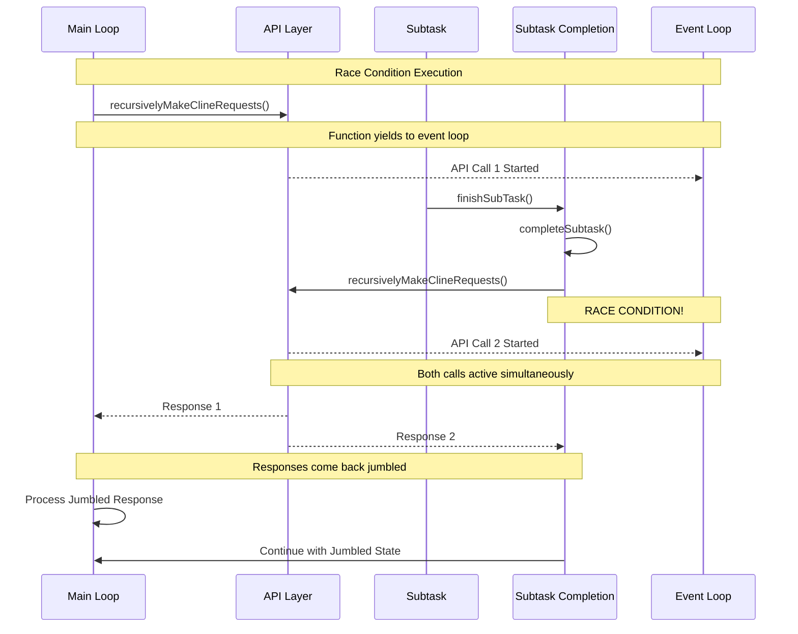
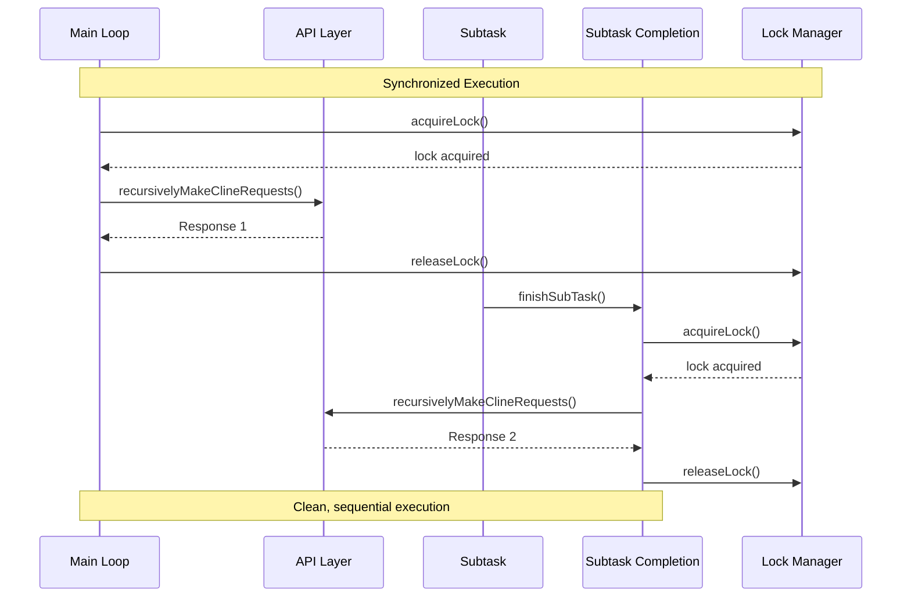

# Combined State Machine

## Overview

The Combined State Machine shows how Task, Session, and Recursive Call state machines interact to create the overall system behavior, including the race condition and its solution.

## Combined State Diagram

```mermaid
stateDiagram-v2
    [*] --> SystemStart

    state SystemStart {
        [*] --> NewSession
        NewSession --> ActiveSession : startTask()
    }

    state ActiveSession {
        [*] --> TaskRunning
        TaskRunning --> TaskPaused : user navigates away
        TaskRunning --> TaskCompleted : task finishes
        TaskPaused --> TaskRunning : user returns
        TaskPaused --> TaskCompleted : task finishes while paused
    }

    state TaskCompleted {
        [*] --> SessionInactive
        SessionInactive --> TaskReconstruction : user resumes
        TaskReconstruction --> TaskRunning : reconstruction complete
    }

    state RaceCondition {
        [*] --> ConcurrentCalls
        ConcurrentCalls --> APIDuplication : both calls reach API
        APIDuplication --> JumbledResponses : responses come back mixed
        JumbledResponses --> ChatConfusion : UI gets confused
    }

    state SynchronizedExecution {
        [*] --> LockAcquired
        LockAcquired --> SequentialCalls : calls processed one by one
        SequentialCalls --> CleanResponses : responses come back clean
        CleanResponses --> NormalUI : UI works correctly
    }

    SystemStart --> ActiveSession
    ActiveSession --> TaskCompleted
    TaskCompleted --> SystemStart : new session
    ActiveSession --> RaceCondition : navigation fix triggers
    RaceCondition --> SynchronizedExecution : proper synchronization
    SynchronizedExecution --> ActiveSession : execution continues

    note right of RaceCondition : "PROBLEM: Concurrent API calls"
    note right of SynchronizedExecution : "SOLUTION: Proper locking"
```

## State Interactions

### SystemStart → ActiveSession

- **Trigger**: User starts a new task
- **Task State**: CREATED → INITIALIZING → RUNNING
- **Session State**: NEW → ACTIVE
- **Recursive Call State**: IDLE → RUNNING

### ActiveSession → TaskCompleted

- **Trigger**: Task finishes naturally
- **Task State**: RUNNING → COMPLETED
- **Session State**: ACTIVE → COMPLETED
- **Recursive Call State**: RUNNING → IDLE

### ActiveSession → RaceCondition

- **Trigger**: Navigation fix causes concurrent calls
- **Task State**: RUNNING (concurrent)
- **Session State**: ACTIVE
- **Recursive Call State**: RUNNING → CONCURRENT

### RaceCondition → SynchronizedExecution

- **Trigger**: Proper synchronization implemented
- **Task State**: RUNNING (synchronized)
- **Session State**: ACTIVE
- **Recursive Call State**: CONCURRENT → QUEUED → LOCKED

## Race Condition Flow



## Synchronized Execution Flow



## State Machine Manager

```typescript
class CombinedStateMachineManager {
	private taskStates = new Map<string, TaskState>()
	private sessionStates = new Map<string, SessionState>()
	private recursiveCallStates = new Map<string, RecursiveCallState>()

	// Combined state transition
	transitionCombinedState(taskId: string, sessionId: string, event: string): boolean {
		const taskState = this.taskStates.get(taskId)
		const sessionState = this.sessionStates.get(sessionId)
		const recursiveCallState = this.recursiveCallStates.get(taskId)

		// Handle race condition detection
		if (
			event === "concurrent_call" &&
			taskState === TaskState.RUNNING &&
			recursiveCallState === RecursiveCallState.RUNNING
		) {
			this.recursiveCallStates.set(taskId, RecursiveCallState.CONCURRENT)
			this.handleRaceCondition(taskId, sessionId)
			return true
		}

		// Handle normal transitions
		return this.transitionTask(taskId, event) && this.transitionSession(sessionId, event)
	}

	// Race condition handling
	private handleRaceCondition(taskId: string, sessionId: string): void {
		console.warn(`[RACE_CONDITION_DETECTED] Task ${taskId} in session ${sessionId}`)

		// Implement race condition mitigation
		this.recursiveCallStates.set(taskId, RecursiveCallState.QUEUED)
		this.processQueuedCalls(taskId)
	}

	// Process queued calls in order
	private processQueuedCalls(taskId: string): void {
		// Implementation for processing queued calls
		// This ensures calls are processed sequentially
	}
}
```

## Key Transitions

### Normal Flow

1. **SystemStart** → **ActiveSession**: User starts task
2. **ActiveSession** → **TaskCompleted**: Task finishes
3. **TaskCompleted** → **SystemStart**: New session

### Race Condition Flow

1. **ActiveSession** → **RaceCondition**: Navigation fix triggers
2. **RaceCondition**: Concurrent API calls cause jumbled responses
3. **RaceCondition** → **SynchronizedExecution**: Fix implemented

### Synchronized Flow

1. **SynchronizedExecution**: Calls processed with locks
2. **SynchronizedExecution** → **ActiveSession**: Normal execution continues

## Problem and Solution

### Problem (RaceCondition State)

- **Concurrent API Calls**: Multiple `recursivelyMakeClineRequests()` calls
- **Jumbled Responses**: API responses come back mixed up
- **Chat Confusion**: UI gets confused by jumbled state

### Solution (SynchronizedExecution State)

- **Lock-Based Synchronization**: Only one call at a time
- **Sequential Processing**: Calls processed in order
- **Clean Responses**: API responses come back clean
- **Normal UI**: Chat interface works correctly

---

**Related Documentation:**

- [Task State Machine](TASK_STATE_MACHINE.md)
- [Session State Machine](SESSION_STATE_MACHINE.md)
- [Recursive Call State Machine](RECURSIVE_CALL_STATE_MACHINE.md)
- [API Duplication Race Condition Analysis](../API_DUPLICATION_RACE_CONDITION_ANALYSIS.md)
