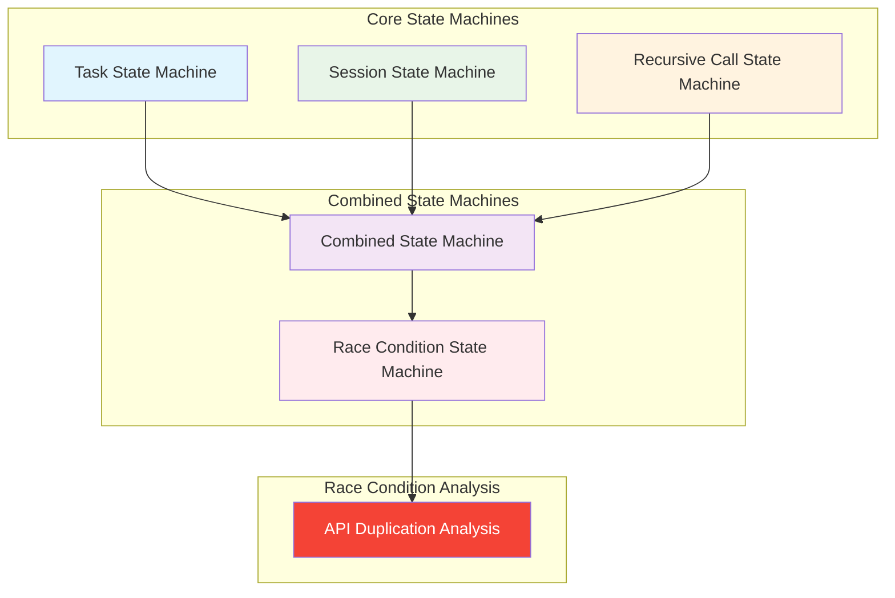

# State Machines Documentation 🦕

## Overview

Welcome to the **tectonic plates** of our system! These state machines are like the geological layers that govern how our application behaves. Just as the Earth's crust has different types of rock formations, our system has different types of state transitions - and sometimes, like a fault line, they don't align properly, causing seismic activity (race conditions).

> **Quantum Physics Fun Fact**: In quantum mechanics, particles can exist in multiple states simultaneously until observed - much like our recursive calls can exist in multiple states until we synchronize them! The key is knowing when to "collapse the wave function" (acquire the lock).

## 🗺️ Navigation Guide

### Start Here

- **[Combined State Machine](COMBINED_STATE_MACHINE.md)** - The "continental drift" view of how all states interact
- **[Race Condition State Machine](RACE_CONDITION_STATE_MACHINE.md)** - The "earthquake epicenter" where problems occur

### Core State Machines

- **[Task State Machine](TASK_STATE_MACHINE.md)** - Individual task lifecycle (like tracking a dinosaur's life stages)
- **[Session State Machine](SESSION_STATE_MACHINE.md)** - Chat session management (like mapping different geological eras)
- **[Recursive Call State Machine](RECURSIVE_CALL_STATE_MACHINE.md)** - API call synchronization (the "quantum entanglement" of our system)

## 🎯 Quick Reference

### For Debugging

1. **Something's broken?** → [Race Condition State Machine](RACE_CONDITION_STATE_MACHINE.md)
2. **Need to understand the flow?** → [Combined State Machine](COMBINED_STATE_MACHINE.md)
3. **Implementing a fix?** → [Recursive Call State Machine](RECURSIVE_CALL_STATE_MACHINE.md)

### For Understanding

1. **How do tasks work?** → [Task State Machine](TASK_STATE_MACHINE.md)
2. **How do sessions work?** → [Session State Machine](SESSION_STATE_MACHINE.md)
3. **How do API calls work?** → [Recursive Call State Machine](RECURSIVE_CALL_STATE_MACHINE.md)

## 🦕 Dinosaur Analogy

Think of our state machines like different dinosaur species:

- **Task State Machine** = **Tyrannosaurus Rex** - The apex predator, always running and hunting (executing tasks)
- **Session State Machine** = **Brontosaurus** - The gentle giant, managing the overall environment (chat sessions)
- **Recursive Call State Machine** = **Velociraptor** - Fast, coordinated, but can cause chaos when they swarm (API calls)

When they work together, it's like a well-coordinated dinosaur pack. When they don't... well, that's when we get our race condition "extinction event"!

## 🔬 Research Areas

### Current Focus

- **3-Request Race Condition**: The "meteor impact" that causes mass extinction (session corruption)
- **Green Text Trigger**: The "volcanic eruption" that starts the chain reaction
- **Synchronization**: The "evolutionary adaptation" needed to survive

### Next Steps

1. **Map the exact sequence** of state transitions during race conditions
2. **Design the synchronization mechanism** to prevent concurrent access
3. **Implement monitoring** to detect when we're approaching a "mass extinction event"

---

**Navigation**: [Back to Architecture](../) · [Next: Combined State Machine](COMBINED_STATE_MACHINE.md) · [Race Condition Analysis](../API_DUPLICATION_RACE_CONDITION_ANALYSIS.md)

_"In the grand scheme of geological time, our race conditions are just brief moments of tectonic activity. But like a well-placed fossil, they tell us everything about the system's history."_ 🦴

## State Machine Files

### Core State Machines

1. **[Task State Machine](TASK_STATE_MACHINE.md)**

    - Manages individual task lifecycle from creation to completion
    - States: CREATED, INITIALIZING, RUNNING, PAUSED, COMPLETED, FAILED, TIMEOUT, ABORTED, CANCELLED, DESTROYED
    - Key for understanding when tasks can have concurrent recursive calls

2. **[Session State Machine](SESSION_STATE_MACHINE.md)**

    - Manages chat session lifecycle and user navigation
    - States: NEW, ACTIVE, PAUSED, INACTIVE, COMPLETED, TIMEOUT, DESTROYED
    - Determines when sessions are active and can cause race conditions

3. **[Recursive Call State Machine](RECURSIVE_CALL_STATE_MACHINE.md)**
    - Manages recursive API call execution and synchronization
    - States: IDLE, RUNNING, CONCURRENT, QUEUED, LOCKED, TIMEOUT
    - **Critical for race condition detection and prevention**

### Combined and Specialized State Machines

4. **[Combined State Machine](COMBINED_STATE_MACHINE.md)**

    - Shows how all state machines interact together
    - Includes system-level state transitions
    - Demonstrates the overall flow from normal execution to race condition to solution

5. **[Race Condition State Machine](RACE_CONDITION_STATE_MACHINE.md)**
    - Specifically models the race condition problem and solution
    - States: NormalExecution, RaceCondition, SynchronizedExecution
    - Shows the problem states and how synchronization fixes them

## State Machine Relationships

## Key Concepts

### Race Condition Root Cause

The race condition occurs when:

1. **Task State**: RUNNING (main task loop active)
2. **Session State**: ACTIVE (user viewing session)
3. **Recursive Call State**: RUNNING → CONCURRENT (multiple calls)

### Synchronization Solution

The solution involves:

1. **Recursive Call State**: CONCURRENT → QUEUED → LOCKED
2. **Sequential Processing**: Only one call at a time
3. **Clean State Transitions**: Proper state management

### State Machine Interactions

- **Task State** determines if a task can have concurrent calls
- **Session State** determines if a session is active and can cause race conditions
- **Recursive Call State** manages the actual synchronization and race condition prevention

## Usage

### For Developers

- Start with [Combined State Machine](COMBINED_STATE_MACHINE.md) for overall understanding
- Review [Race Condition State Machine](RACE_CONDITION_STATE_MACHINE.md) for problem/solution details
- Use individual state machine docs for implementation details

### For Debugging

- Use [Recursive Call State Machine](RECURSIVE_CALL_STATE_MACHINE.md) for call synchronization issues
- Check [Task State Machine](TASK_STATE_MACHINE.md) for task lifecycle problems
- Review [Session State Machine](SESSION_STATE_MACHINE.md) for navigation-related issues

### For Implementation

- Follow state transition tables in each document
- Use provided TypeScript interfaces and implementations
- Implement proper state machine managers as shown in examples

## Related Documentation

- [API Duplication Race Condition Analysis](../API_DUPLICATION_RACE_CONDITION_ANALYSIS.md) - Main analysis document
- [API Duplication Investigation Plan](../../plans/API_DUPLICATION_INVESTIGATION_PLAN.md) - Investigation plan
- [Orchestrator Documentation](../orchestrator/) - Orchestrator-specific documentation

## State Machine Implementation Guidelines

1. **Always check state before transitions**
2. **Use proper locking mechanisms for concurrent access**
3. **Implement timeout handling for lock acquisition**
4. **Log state transitions for debugging**
5. **Handle race conditions gracefully**
6. **Follow the state transition tables exactly**

---

**Last Updated**: December 2024  
**Maintainer**: Development Team  
**Status**: Active Documentation
