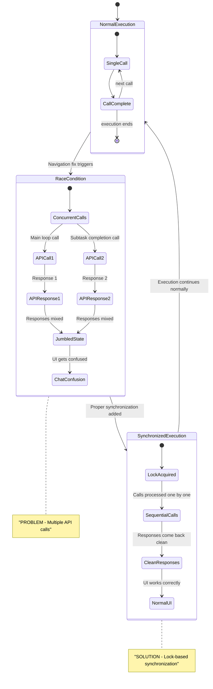

# Race Condition State Machine
## Table of Contents

- [Race Condition State Machine](#race-condition-state-machine)
  - [Table of Contents](#table-of-contents)
  - [Overview](#overview)
  - [Research Context](#research-context)
  - [Race Condition States](#race-condition-states)
  - [State Descriptions](#state-descriptions)
    - [NormalExecution State](#normalexecution-state)
    - [RaceCondition State](#racecondition-state)
    - [SynchronizedExecution State](#synchronizedexecution-state)
  - [Race Condition Detection](#race-condition-detection)
  - [Synchronization Implementation](#synchronization-implementation)
  - [State Transition Triggers](#state-transition-triggers)
    - [NormalExecution → RaceCondition](#normalexecution-racecondition)
    - [RaceCondition → SynchronizedExecution](#racecondition-synchronizedexecution)
    - [SynchronizedExecution → NormalExecution](#synchronizedexecution-normalexecution)
  - [Monitoring and Debugging](#monitoring-and-debugging)
  - [Key States](#key-states)
  - [Prevention Strategies](#prevention-strategies)
  - [🔍 Research Context & Next Steps](#-research-context-next-steps)
    - [When You're Here, You Can:](#when-youre-here-you-can)
    - [No Dead Ends Policy](#no-dead-ends-policy)
  - [Navigation Footer](#navigation-footer)

> **Development Fun Fact**: Documentation is like code comments for humans - it explains the "why"
> behind the "what"! 💻

## When You're Here

This document is part of the KiloCode project documentation. If you're not familiar with this
document's role or purpose, this section helps orient you.

- **Purpose**: [Brief description of what this document covers]
- **Audience**: [Who should read this document]
- **Prerequisites**: [What you should know before reading]
- **Related Documents**: [Links to related documentation]

## Overview

## Research Context

- *Purpose:*\* \[Describe the purpose and scope of this document]

- *Background:*\* \[Provide relevant background information]

- *Research Questions:*\* \[List key questions this document addresses]

- *Methodology:*\* \[Describe the approach or methodology used]

- *Findings:*\* \[Summarize key findings or conclusions]
- \*\*

The Race Condition State Machine specifically models the states involved in the API duplication race
condition, showing the problem states and the solution states.

## Race Condition States



## State Descriptions

### NormalExecution State

- **SingleCall**: One recursive call is active
- **CallComplete**: Call finishes successfully
- **Next Call**: Another call can be made
- **Execution Ends**: All calls completed

### RaceCondition State

- **ConcurrentCalls**: Multiple calls start simultaneously
- **APICall1**: Main task loop API call
- **APICall2**: Subtask completion API call
- **APIResponse1/2**: Responses come back
- **JumbledState**: Responses are mixed up
- **ChatConfusion**: UI gets confused

### SynchronizedExecution State

- **LockAcquired**: Lock is held for exclusive access
- **SequentialCalls**: Calls processed one at a time
- **CleanResponses**: Responses come back in order
- **NormalUI**: UI works correctly

## Race Condition Detection

```typescript
class RaceConditionDetector {
	private activeCalls = new Map<string, Set<string>>()
	private callTimestamps = new Map<string, number>()

	// Detect when multiple calls are active
	detectConcurrentCalls(taskId: string, callId: string): boolean {
		const activeCalls = this.activeCalls.get(taskId) || new Set()

		if (activeCalls.size > 0) {
console.warn(`[RACE_CONDITION_DETECTED] Task ${taskId} has ${activeCalls.size + 1} concurrent
calls`)
			return true
		}

		activeCalls.add(callId)
		this.activeCalls.set(taskId, activeCalls)
		return false
	}

	// Track call completion
	completeCall(taskId: string, callId: string): void {
		const activeCalls = this.activeCalls.get(taskId)
		if (activeCalls) {
			activeCalls.delete(callId)
			if (activeCalls.size === 0) {
				this.activeCalls.delete(taskId)
			}
		}
	}

	// Check if race condition is active
	isRaceConditionActive(taskId: string): boolean {
		const activeCalls = this.activeCalls.get(taskId)
		return activeCalls ? activeCalls.size > 1 : false
	}
}
```

## Synchronization Implementation

```typescript
class RaceConditionSynchronizer {
	private callLocks = new Map<string, boolean>()
	private callQueues = new Map<string, Array<() => Promise<void>>>()

	// Acquire lock for exclusive access
	async acquireLock(taskId: string, timeoutMs: number = 5000): Promise<boolean> {
		const startTime = Date.now()

		while (this.callLocks.get(taskId)) {
			if (Date.now() - startTime > timeoutMs) {
				console.warn(`[LOCK_TIMEOUT] Task ${taskId} lock acquisition timed out`)
				return false
			}
			await new Promise((resolve) => setTimeout(resolve, 10))
		}

		this.callLocks.set(taskId, true)
		console.log(`[LOCK_ACQUIRED] Task ${taskId} acquired lock`)
		return true
	}

	// Release lock and process queue
	releaseLock(taskId: string): void {
		this.callLocks.set(taskId, false)
		console.log(`[LOCK_RELEASED] Task ${taskId} released lock`)
		this.processQueue(taskId)
	}

	// Queue a call for later execution
	queueCall(taskId: string, call: () => Promise<void>): void {
		const queue = this.callQueues.get(taskId) || []
		queue.push(call)
		this.callQueues.set(taskId, queue)
		console.log(`[CALL_QUEUED] Task ${taskId} queued call, queue size: ${queue.length}`)
	}

	// Process queued calls
	private processQueue(taskId: string): void {
		const queue = this.callQueues.get(taskId)
		if (queue && queue.length > 0) {
			const nextCall = queue.shift()
			if (nextCall) {
				console.log(`[CALL_DEQUEUED] Task ${taskId} processing queued call`)
				nextCall()
			}
		}
	}
}
```

## State Transition Triggers

### NormalExecution → RaceCondition

- **Trigger**: Navigation fix causes concurrent calls
- **Condition**: `recursivelyMakeClineRequests()` called from both main loop and subtask completion
- **Result**: Multiple API calls active simultaneously

### RaceCondition → SynchronizedExecution

- **Trigger**: Synchronization mechanism implemented
- **Condition**: Lock-based system prevents concurrent calls
- **Result**: Calls processed sequentially

### SynchronizedExecution → NormalExecution

- **Trigger**: Synchronization removed or bypassed
- **Condition**: System returns to normal operation
- **Result**: Single calls processed normally

## Monitoring and Debugging

```typescript
class RaceConditionMonitor {
	private raceConditionEvents: Array<{
		taskId: string
		timestamp: number
		event: string
		details: any
	}> = []

	// Log race condition events
	logEvent(taskId: string, event: string, details: any): void {
		const logEntry = {
			taskId,
			timestamp: Date.now(),
			event,
			details,
		}
		this.raceConditionEvents.push(logEntry)
		console.log(`[RACE_CONDITION_MONITOR] ${event}`, logEntry)
	}

	// Get race condition statistics
	getStatistics(taskId: string): {
		totalEvents: number
		concurrentCallEvents: number
		lockAcquisitionEvents: number
		queueEvents: number
	} {
		const taskEvents = this.raceConditionEvents.filter((e) => e.taskId === taskId)

		return {
			totalEvents: taskEvents.length,
			concurrentCallEvents: taskEvents.filter((e) => e.event === "concurrent_call").length,
			lockAcquisitionEvents: taskEvents.filter((e) => e.event === "lock_acquired").length,
			queueEvents: taskEvents.filter((e) => e.event === "call_queued").length,
		}
	}

	// Clear old events
	clearOldEvents(olderThanMs: number = 300000): void {
		// 5 minutes
		const cutoff = Date.now() - olderThanMs
		this.raceConditionEvents = this.raceConditionEvents.filter((e) => e.timestamp > cutoff)
	}
}
```

## Key States

- **NormalExecution**: Safe, single-call execution
- **RaceCondition**: **PROBLEM** - Multiple concurrent calls
- **SynchronizedExecution**: **SOLUTION** - Lock-based synchronization

## Prevention Strategies
1. **Lock-Based Synchronization**: Ensure only one call at a time
2. **Call Queuing**: Queue additional calls when lock is held
3. **Race Condition Detection**: Monitor for concurrent calls
4. **Timeout Handling**: Handle lock acquisition timeouts gracefully
5. **Event Logging**: Track race condition events for debugging
- \*\*

- *Related Documentation:*\*
- [Task State Machine](TASK_STATE_MACHINE.md)
- [Session State Machine](SESSION_STATE_MACHINE.md)
- [Recursive Call State Machine](RECURSIVE_CALL_STATE_MACHINE.md)
- [Combined State Machine](COMBINED_STATE_MACHINE.md)
- [API Duplication Race Condition Analysis](../API_DUPLICATION_RACE_CONDITION_ANALYSIS.md)

## 🔍 Research Context & Next Steps

### When You're Here, You Can:

- *Understanding Architecture:*\*

- **Next**: Check related architecture documentation in the same directory

- **Related**: [Technical Glossary](../../GLOSSARY.md) for terminology,
  [Architecture Documentation](README.md) for context

- *Implementing Architecture Features:*\*

- **Next**: [Repository Development Guide](../../architecture/GETTING_STARTED.md) →
  [Testing Infrastructure](../testing/TESTING_STRATEGY.md)

- **Related**: [Orchestrator Documentation](../orchestrator/README.md) for integration patterns

- *Troubleshooting Architecture Issues:*\*

- **Next**: \[Race Condition Analysis]race-condition/README.md) →
  \[Root Cause Analysis]race-condition/ROOT\_CAUSE\_ANALYSIS.md)

- **Related**: [Orchestrator Error Handling](../orchestrator/ORCHESTRATOR_ERROR_HANDLING.md) for
  common issues

### No Dead Ends Policy

Every page provides clear next steps based on your research goals. If you're unsure where to go
next, return to [Architecture Documentation](README.md) for guidance.

## Navigation Footer
- \*\*

## No Dead Ends Policy

Every section in this document connects you to your next step:

- **If you're new here**: Start with the [When You're Here](#when-youre-here) section
- **If you need context**: Check the [Research Context](#research-context) section
- **If you're ready to implement**: Jump to the implementation sections
- **If you're stuck**: Visit our [Troubleshooting Guide](../tools/TROUBLESHOOTING_GUIDE.md)
- **If you need help**: Check the [Technical Glossary](../GLOSSARY.md)

- *Navigation*\*: [← Back to Architecture Documentation](README.md) ·
  [📚 Technical Glossary](../../GLOSSARY.md) · [↑ Table of Contents](#-research-context--next-steps)
