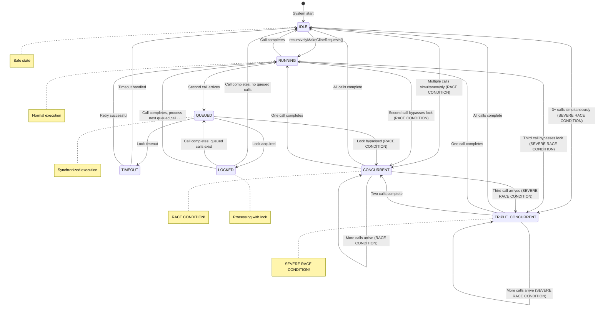

# Recursive Call State Machine

## Table of Contents
- [Recursive Call State Machine](#recursive-call-state-machine)
- [Table of Contents](#table-of-contents)
- [When You're Here](#when-youre-here)
- [Overview](#overview)
- [Research Context](#research-context)
- [🗺️ Navigation](#-navigation)
- [Quick Links](#quick-links)
- [Key Concepts](#key-concepts)
- [Recursive Call States](#recursive-call-states)
- [Recursive Call State Properties](#recursive-call-state-properties)
- [State Transition Diagram](#state-transition-diagram)
- [Race Condition Detection](#race-condition-detection)
- [3-Request Race Condition](#3request-race-condition)
- [Synchronization States](#synchronization-states)
- [State Machine Implementation](#state-machine-implementation)
- [Key States](#key-states)
- [Race Condition Prevention](#race-condition-prevention)
- [🔍 Research Context & Next Steps](#-research-context-next-steps)
- [When You're Here, You Can:](#when-youre-here-you-can)
- [No Dead Ends Policy](#no-dead-ends-policy)
- [Navigation Footer](#navigation-footer)
- [No Dead Ends Policy](#no-dead-ends-policy)
- [Recursive Call State Machine](#recursive-call-state-machine)
- [Table of Contents](#table-of-contents)
- [Overview](#overview)
- [Research Context](#research-context)
- [🗺️ Navigation](#-navigation)
- [Quick Links](#quick-links)
- [Key Concepts](#key-concepts)
- [Recursive Call States](#recursive-call-states)
- [Recursive Call State Properties](#recursive-call-state-properties)
- [State Transition Diagram](#state-transition-diagram)
- [Race Condition Detection](#race-condition-detection)
- [3-Request Race Condition](#3request-race-condition)
- [Synchronization States](#synchronization-states)
- [State Machine Implementation](#state-machine-implementation)
- [Key States](#key-states)
- [Race Condition Prevention](#race-condition-prevention)
- [🔍 Research Context & Next Steps](#-research-context-next-steps)
- [When You're Here, You Can:](#when-youre-here-you-can)
- [No Dead Ends Policy](#no-dead-ends-policy)
- [Navigation Footer](#navigation-footer)

> **Architecture Fun Fact**: Like a well-designed building, good documentation has a solid
> foundation, clear structure, and intuitive navigation! 🏗️

## When You're Here

This document is part of the KiloCode project documentation. If you're not familiar with this
document's role or purpose, this section helps orient you.

- **Purpose**: \[Brief description of what this document covers]
- **Audience**: \[Who should read this document]
- **Prerequisites**: \[What you should know before reading]
- **Related Documents**: \[Links to related documentation]

## Overview

## Research Context

- *Purpose:*\* \[Describe the purpose and scope of this document]

- *Background:*\* \[Provide relevant background information]

- *Research Questions:*\* \[List key questions this document addresses]

- *Methodology:*\* \[Describe the approach or methodology used]

- *Findings:*\* \[Summarize key findings or conclusions]
- \*\*

The Recursive Call State Machine manages the execution of recursive API calls, including the
detection and prevention of race conditions. This is the **"quantum field controller"** of our
system - it manages the delicate balance between order and chaos in our API calls!

> **Quantum Physics Fun Fact**: In quantum mechanics, particles can exist in a "superposition" of
> states until observed. Our API calls can exist in multiple states (IDLE, RUNNING, CONCURRENT)
> until we "observe" them with proper synchronization! The key is knowing when to "collapse the wave
> function" (acquire the lock). 🔬

## 🗺️ Navigation

### Quick Links

- **Something's broken?** → [Race Condition Analysis](../API_DUPLICATION_RACE_CONDITION_ANALYSIS.md)
- **Need to understand the flow?** → [Combined State Machine](COMBINED_STATE_MACHINE.md)
- **Ready to implement a fix?** → Synchronization Implementation

### Key Concepts

- **IDLE** is the safe state (the "vacuum state" - empty but ready)
- **RUNNING** is normal execution (the "stable particle" - predictable)
- **CONCURRENT** is the danger zone (the "quantum entanglement gone wrong")
- **TRIPLE\_CONCURRENT** is catastrophic (the "nuclear meltdown" - XML apocalypse!)

## Recursive Call States

```typescript
// 🔬 The "quantum states" of our API calls - like particles that can exist in multiple states
// until we "observe" them (acquire a lock). This is where the magic (and chaos) happens!
enum RecursiveCallState {
	IDLE = "idle", // No recursive calls active (the "vacuum state" - empty but ready)
	RUNNING = "running", // Single recursive call active (the "stable particle" - predictable)
CONCURRENT = "concurrent", // Multiple recursive calls active (RACE CONDITION - "quantum
entanglement gone wrong")
TRIPLE_CONCURRENT = "triple_concurrent", // 3+ simultaneous calls (SEVERE RACE CONDITION - "nuclear
meltdown")
	QUEUED = "queued", // Calls queued due to lock (the "waiting room" - orderly but patient)
	LOCKED = "locked", // Lock acquired, processing (the "laboratory" - controlled environment)
	TIMEOUT = "timeout", // Lock acquisition timed out (the "failed experiment" - gave up waiting)
}

// 🗺️ The "geological survey" of our call states - what properties does each layer have?
interface RecursiveCallStateProperties {
	hasActiveCalls: boolean // Are there any calls currently running?
	hasConcurrentCalls: boolean // Are multiple calls running simultaneously? (DANGER!)
	hasTripleConcurrent: boolean // Are 3+ calls running? (CATASTROPHIC!)
	isLocked: boolean // Is the system locked for exclusive access?
	hasQueuedCalls: boolean // Are there calls waiting in the queue?
	canMakeNewCall: boolean // Can we safely start a new call?
	raceConditionRisk: boolean // Is there a risk of race conditions?
	severeCorruptionRisk: boolean // Is there a risk of severe corruption? (XML apocalypse!)
}
```

## Recursive Call State Properties

```typescript
// 🔬 The "quantum field properties" - mapping each state's characteristics
// Think of this as our "particle physics handbook" for different call states
const RECURSIVE_CALL_STATE_PROPERTIES: Record<RecursiveCallState, RecursiveCallStateProperties> = {
	// 🌌 IDLE: The "vacuum state" - empty but ready for action
	[RecursiveCallState.IDLE]: {
		hasActiveCalls: false, // No particles in the field
		hasConcurrentCalls: false, // No quantum entanglement
		hasTripleConcurrent: false, // No nuclear reactions
		isLocked: false, // Field is open
		hasQueuedCalls: false, // No particles waiting
		canMakeNewCall: true, // Safe to inject new particles
		raceConditionRisk: false, // No risk of quantum decoherence
		severeCorruptionRisk: false, // No risk of field collapse
	},

	// ⚛️ RUNNING: The "stable particle" - predictable and controlled
	[RecursiveCallState.RUNNING]: {
		hasActiveCalls: true, // One particle in the field
		hasConcurrentCalls: false, // No quantum entanglement
		hasTripleConcurrent: false, // No nuclear reactions
		isLocked: true, // Field is locked for exclusive access
		hasQueuedCalls: false, // No particles waiting
		canMakeNewCall: false, // Can't inject new particles (locked)
		raceConditionRisk: false, // No risk of quantum decoherence
		severeCorruptionRisk: false, // No risk of field collapse
	},

	// ⚡ CONCURRENT: The "quantum entanglement gone wrong" - DANGER ZONE!
	[RecursiveCallState.CONCURRENT]: {
		hasActiveCalls: true, // Multiple particles in the field
		hasConcurrentCalls: true, // Quantum entanglement detected!
		hasTripleConcurrent: false, // Not quite nuclear yet
		isLocked: false, // Field is unlocked (that's the problem!)
		hasQueuedCalls: false, // No particles waiting (they're all running!)
		canMakeNewCall: false, // Can't inject new particles (too chaotic)
		raceConditionRisk: true, // HIGH RISK of quantum decoherence!
		severeCorruptionRisk: false, // Not quite field collapse level
	},

	// 💥 TRIPLE_CONCURRENT: The "nuclear meltdown" - CATASTROPHIC!
	[RecursiveCallState.TRIPLE_CONCURRENT]: {
		hasActiveCalls: true, // Multiple particles in the field
		hasConcurrentCalls: true, // Quantum entanglement detected!
		hasTripleConcurrent: true, // NUCLEAR REACTION! 💥
		isLocked: false, // Field is unlocked (that's the problem!)
		hasQueuedCalls: false, // No particles waiting (they're all running!)
		canMakeNewCall: false, // Can't inject new particles (too chaotic)
		raceConditionRisk: true, // HIGH RISK of quantum decoherence!
		severeCorruptionRisk: true, // FIELD COLLAPSE IMMINENT! (XML apocalypse!)
	},

	// 🚶 QUEUED: The "waiting room" - orderly but patient
	[RecursiveCallState.QUEUED]: {
		hasActiveCalls: true, // One particle in the field
		hasConcurrentCalls: false, // No quantum entanglement
		hasTripleConcurrent: false, // No nuclear reactions
		isLocked: true, // Field is locked for exclusive access
		hasQueuedCalls: true, // Particles waiting in line
		canMakeNewCall: false, // Can't inject new particles (locked)
		raceConditionRisk: false, // No risk of quantum decoherence
		severeCorruptionRisk: false, // No risk of field collapse
	},

	// 🔬 LOCKED: The "laboratory" - controlled environment
	[RecursiveCallState.LOCKED]: {
		hasActiveCalls: true, // One particle in the field
		hasConcurrentCalls: false, // No quantum entanglement
		hasTripleConcurrent: false, // No nuclear reactions
		isLocked: true, // Field is locked for exclusive access
		hasQueuedCalls: false, // No particles waiting
		canMakeNewCall: false, // Can't inject new particles (locked)
		raceConditionRisk: false, // No risk of quantum decoherence
		severeCorruptionRisk: false, // No risk of field collapse
	},

	// ⏰ TIMEOUT: The "failed experiment" - gave up waiting
	[RecursiveCallState.TIMEOUT]: {
		hasActiveCalls: false, // No particles in the field
		hasConcurrentCalls: false, // No quantum entanglement
		hasTripleConcurrent: false, // No nuclear reactions
		isLocked: false, // Field is open
		hasQueuedCalls: false, // No particles waiting
		canMakeNewCall: true, // Safe to inject new particles
		raceConditionRisk: false, // No risk of quantum decoherence
		severeCorruptionRisk: false, // No risk of field collapse
	},
}
```

## State Transition Diagram



## Race Condition Detection

The race condition occurs when the system transitions from `IDLE` to `CONCURRENT`, bypassing the
proper `RUNNING` state. This happens when:
1. **Main Task Loop**: Calls `recursivelyMakeClineRequests()`
2. **Subtask Completion**: Also calls `recursivelyMakeClineRequests()` via `continueParentTask()`
3. **Concurrent Execution**: Both calls reach the API simultaneously
4. **Race Condition**: Responses come back jumbled, confusing the chat interface

### 3-Request Race Condition

The most severe form involves **3 simultaneous API requests** triggered by:
1. **Subtask Premature Completion**: Subtask incorrectly thinks it's done and outputs green text
2. **Subtask Stops**: Subtask stops execution prematurely
3. **User Request**: User sends another request to the agent
4. **Triple Concurrent Calls**:
- Main orchestrator loop call
- Subtask completion call (from premature completion)
- New user request call
5. **Severe Corruption**: XML appears in chat, permanent session damage

This 3-request scenario is particularly destructive because it causes:

- **XML Corruption**: Chat history becomes severely broken
- **Permanent Damage**: Session requires restart to recover
- **Cascading Failure**: All subsequent requests become corrupted

## Synchronization States

- **QUEUED**: Calls are queued when a lock is already held
- **LOCKED**: A call is actively processing with the lock held
- **TIMEOUT**: Lock acquisition timed out, call is abandoned

## State Machine Implementation

```typescript
class RecursiveCallStateManager {
	private recursiveCallStates = new Map<string, RecursiveCallState>()
	private callLocks = new Map<string, boolean>()
	private callQueues = new Map<string, Array<() => Promise<void>>>()

	// Check if we can make a new call
	canMakeCall(taskId: string): boolean {
		const state = this.recursiveCallStates.get(taskId)
		return state === RecursiveCallState.IDLE || state === RecursiveCallState.TIMEOUT
	}

	// Acquire lock for recursive call
	async acquireLock(taskId: string, timeoutMs: number = 5000): Promise<boolean> {
		const startTime = Date.now()

		while (this.callLocks.get(taskId)) {
			if (Date.now() - startTime > timeoutMs) {
				this.recursiveCallStates.set(taskId, RecursiveCallState.TIMEOUT)
				return false
			}
			await new Promise((resolve) => setTimeout(resolve, 10))
		}

		this.callLocks.set(taskId, true)
		this.recursiveCallStates.set(taskId, RecursiveCallState.LOCKED)
		return true
	}

	// Release lock and process queue
	releaseLock(taskId: string): void {
		this.callLocks.set(taskId, false)
		this.recursiveCallStates.set(taskId, RecursiveCallState.IDLE)
		this.processQueue(taskId)
	}

	// Detect race condition
	detectRaceCondition(taskId: string): boolean {
		const state = this.recursiveCallStates.get(taskId)
		if (state === RecursiveCallState.RUNNING) {
			this.recursiveCallStates.set(taskId, RecursiveCallState.CONCURRENT)
			console.warn(`[RACE_CONDITION_DETECTED] Task ${taskId} has concurrent recursive calls`)
			return true
		}
		return false
	}
}
```

## Key States

- **IDLE**: Safe state, no active calls
- **RUNNING**: Normal execution, single call active
- **CONCURRENT**: **RACE CONDITION** - multiple calls active simultaneously
- **QUEUED**: Calls waiting for lock, synchronized execution
- **LOCKED**: Call processing with lock held

## Race Condition Prevention

To prevent race conditions:
1. **Check State**: Before making a call, check if another call is already running
2. **Acquire Lock**: Use a lock mechanism to ensure only one call at a time
3. **Queue Calls**: If lock is held, queue the call for later execution
4. **Detect Concurrent**: Monitor for concurrent calls and handle appropriately
- \*\*

- *Related Documentation:*\*
- [Task State Machine](TASK_STATE_MACHINE.md)
- [Session State Machine](SESSION_STATE_MACHINE.md)
- [Combined State Machine](COMBINED_STATE_MACHINE.md)
- [API Duplication Race Condition Analysis](../API_DUPLICATION_RACE_CONDITION_ANALYSIS.md)

## 🔍 Research Context & Next Steps

### When You're Here, You Can:

- *Understanding Architecture:*\*

- **Next**: Check related architecture documentation in the same directory

- **Related**: [Technical Glossary](../../../GLOSSARY.md) for terminology,
  [Architecture Documentation](README.md) for context

- *Implementing Architecture Features:*\*

- **Next**: [Repository Development Guide](../../architecture/GETTING_STARTED.md) →
  [Testing Infrastructure](../testing/TESTING_STRATEGY.md)

- **Related**: [Orchestrator Documentation](../../orchestrator/README.md) for integration patterns

- *Troubleshooting Architecture Issues:*\*

- **Next**: \[Race Condition Analysis]race-condition/README.md) →
  \[Root Cause Analysis]race-condition/ROOT\_CAUSE\_ANALYSIS.md)

- **Related**: [Orchestrator Error Handling](../../orchestrator/ORCHESTRATOR_ERROR_HANDLING.md) for
  common issues

### No Dead Ends Policy

Every page provides clear next steps based on your research goals. If you're unsure where to go
next, return to [Architecture Documentation](README.md) for guidance.

## Navigation Footer
- \*\*

## No Dead Ends Policy

Every section in this document connects you to your next step:

- **If you're new here**: Start with the [When You're Here](#when-youre-here) section

- **If you need context**: Check the [Research Context](#research-context) section

- **If you're ready to implement**: Jump to the implementation sections

- **If you're stuck**: Visit our [Troubleshooting Guide](../tools/TROUBLESHOOTING_GUIDE.md)

- **If you need help**: Check the [Technical Glossary](../../../GLOSSARY.md)

- *Navigation*\*: [← Back to Architecture Documentation](README.md) ·
  [📚 Technical Glossary](../../../GLOSSARY.md) · [↑ Table of Contents](#-research-context--next-steps)
