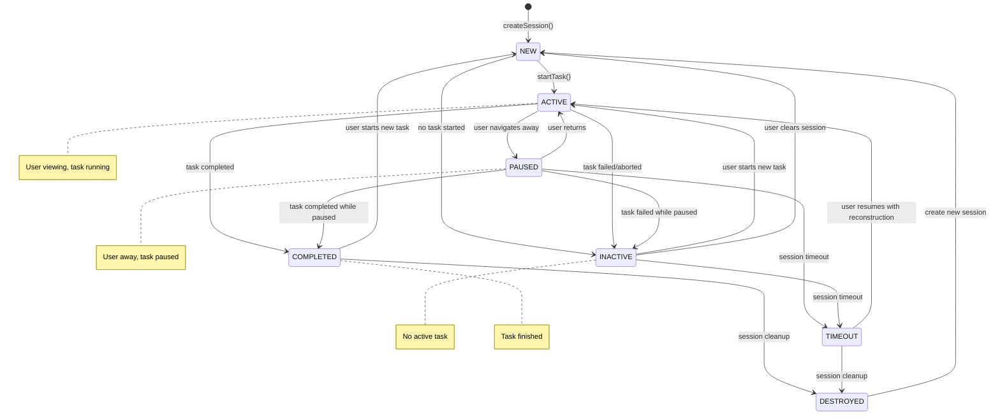

# Session State Machine

> **Engineering Fun Fact**: Just as engineers use systematic approaches to solve complex problems, this documentation provides structured guidance for understanding and implementing solutions! 🔧

## Overview

## Research Context
- *Purpose:*\* \[Describe the purpose and scope of this document]
- *Background:*\* \[Provide relevant background information]
- *Research Questions:*\* \[List key questions this document addresses]
- *Methodology:*\* \[Describe the approach or methodology used]
- *Findings:*\* \[Summarize key findings or conclusions]
- \*\*

The Session State Machine manages the lifecycle of chat sessions, including user navigation, task
associations, and session inactivity.

## Session States

```typescript
enum SessionState {
	NEW = "new", // New session created
	ACTIVE = "active", // User is currently viewing
	PAUSED = "paused", // User switched away but task still running
	INACTIVE = "inactive", // No active task, needs reconstruction
	COMPLETED = "completed", // Task finished, session closed
	TIMEOUT = "timeout", // Session timed out due to inactivity
	DESTROYED = "destroyed", // Session was destroyed
}

// Session state properties
interface SessionStateProperties {
	hasActiveTask: boolean
	isUserViewing: boolean
	needsTaskReconstruction: boolean
	canResumeTask: boolean
	taskState: TaskState | null
}
```

## Session State Properties

```typescript
const SESSION_STATE_PROPERTIES: Record<SessionState, SessionStateProperties> = {
	[SessionState.NEW]: {
		hasActiveTask: false,
		isUserViewing: true,
		needsTaskReconstruction: false,
		canResumeTask: false,
		taskState: null,
	},
	[SessionState.ACTIVE]: {
		hasActiveTask: true,
		isUserViewing: true,
		needsTaskReconstruction: false,
		canResumeTask: false,
		taskState: TaskState.RUNNING,
	},
	[SessionState.PAUSED]: {
		hasActiveTask: true,
		isUserViewing: false,
		needsTaskReconstruction: false,
		canResumeTask: true,
		taskState: TaskState.PAUSED,
	},
	[SessionState.INACTIVE]: {
		hasActiveTask: false,
		isUserViewing: false,
		needsTaskReconstruction: true,
		canResumeTask: false,
		taskState: null,
	},
	[SessionState.COMPLETED]: {
		hasActiveTask: false,
		isUserViewing: false,
		needsTaskReconstruction: false,
		canResumeTask: false,
		taskState: TaskState.COMPLETED,
	},
	[SessionState.TIMEOUT]: {
		hasActiveTask: false,
		isUserViewing: false,
		needsTaskReconstruction: true,
		canResumeTask: false,
		taskState: TaskState.DESTROYED,
	},
	[SessionState.DESTROYED]: {
		hasActiveTask: false,
		isUserViewing: false,
		needsTaskReconstruction: false,
		canResumeTask: false,
		taskState: TaskState.DESTROYED,
	},
}
```

## State Transition Diagram



## State Transition Table

```typescript
const SESSION_STATE_TRANSITIONS = {
	[SessionState.NEW]: {
		startTask: SessionState.ACTIVE,
		timeout: SessionState.INACTIVE,
	},
	[SessionState.ACTIVE]: {
		navigateAway: SessionState.PAUSED,
		taskComplete: SessionState.COMPLETED,
		taskFail: SessionState.INACTIVE,
	},
	[SessionState.PAUSED]: {
		navigateBack: SessionState.ACTIVE,
		taskComplete: SessionState.COMPLETED,
		taskFail: SessionState.INACTIVE,
		timeout: SessionState.TIMEOUT,
	},
	[SessionState.INACTIVE]: {
		startTask: SessionState.ACTIVE,
		clear: SessionState.NEW,
		timeout: SessionState.TIMEOUT,
	},
	[SessionState.COMPLETED]: {
		startNew: SessionState.NEW,
		destroy: SessionState.DESTROYED,
	},
	[SessionState.TIMEOUT]: {
		destroy: SessionState.DESTROYED,
		resume: SessionState.ACTIVE,
	},
	[SessionState.DESTROYED]: {
		create: SessionState.NEW,
	},
}
```

## Key States
- **ACTIVE**: User is currently viewing the session, task is running
- **PAUSED**: User navigated away but task is still running in memory
- **INACTIVE**: No active task, needs reconstruction from history
- **COMPLETED**: Task finished, session is closed

## Session Inactivity Criteria

A session is considered inactive when:
1. **No Active Task Associated**: `!session.taskId || !session.isActive`
2. **Task Has Been Completed**: Task status is completed, failed, timeout, aborted, or cancelled
3. **User Explicitly Ended the Session**: User clicked "End Chat" or similar
4. **Session Hasn't Been Accessed Recently**: Session timeout (e.g., 30 minutes of inactivity)
5. **Memory Pressure Forces Cleanup**: System needs to free memory

## Race Condition Impact

The session state machine is crucial for understanding the race condition because:
- **ACTIVE** sessions have tasks in memory that might be running
- **PAUSED** sessions can resume tasks that cause race conditions
- **INACTIVE** sessions need task reconstruction, which triggers the navigation fix
- **COMPLETED** sessions are inactive and don't cause race conditions
- \*\*
- *Related Documentation:*\*
- [Task State Machine](TASK_STATE_MACHINE.md)
- [Recursive Call State Machine](RECURSIVE_CALL_STATE_MACHINE.md)
- [Combined State Machine](COMBINED_STATE_MACHINE.md)
- [API Duplication Race Condition Analysis](../API_DUPLICATION_RACE_CONDITION_ANALYSIS.md)

## 🔍 Research Context & Next Steps

### When You're Here, You Can:
- *Understanding Architecture:*\*
- **Next**: Check related architecture documentation in the same directory
- **Related**: [Technical Glossary](../../../../../../../../../GLOSSARY.md) for terminology,
  [Architecture Documentation](README.md) for context
- *Implementing Architecture Features:*\*
- **Next**: [Repository Development Guide](../repository/DEVELOPMENT_GUIDE.md) →
  [Testing Infrastructure](../repository/TESTING_INFRASTRUCTURE.md)
- **Related**: [Orchestrator Documentation](../../orchestrator/README.md) for integration patterns
- *Troubleshooting Architecture Issues:*\*
- **Next**: \[Race Condition Analysis]race-condition/README.md) →
  \[Root Cause Analysis]race-condition/ROOT\_CAUSE\_ANALYSIS.md)
- **Related**: [Orchestrator Error Handling](../../orchestrator/ORCHESTRATOR_ERROR_HANDLING.md) for
  common issues

### No Dead Ends Policy

Every page provides clear next steps based on your research goals. If you're unsure where to go
next, return to [Architecture Documentation](README.md) for guidance.

## No Dead Ends Policy

This document is designed to provide value and connect to the broader KiloCode ecosystem:
- **Purpose**: \[Brief description of document purpose]
- **Connections**: Links to related documents and resources
- **Next Steps**: Clear guidance on how to use this information
- **Related Documentation**: References to complementary materials

For questions or suggestions about this documentation, please refer to the [Documentation Guide](../../DOCUMENTATION_GUIDE.md) or [Architecture Overview](../architecture/README.md).

## Navigation Footer
- \*\*
- *Navigation*\*: [← Back to Architecture Documentation](README.md) ·
  [📚 Technical Glossary](../../../../../../../../../GLOSSARY.md) · [↑ Table of Contents](#-research-context--next-steps)
