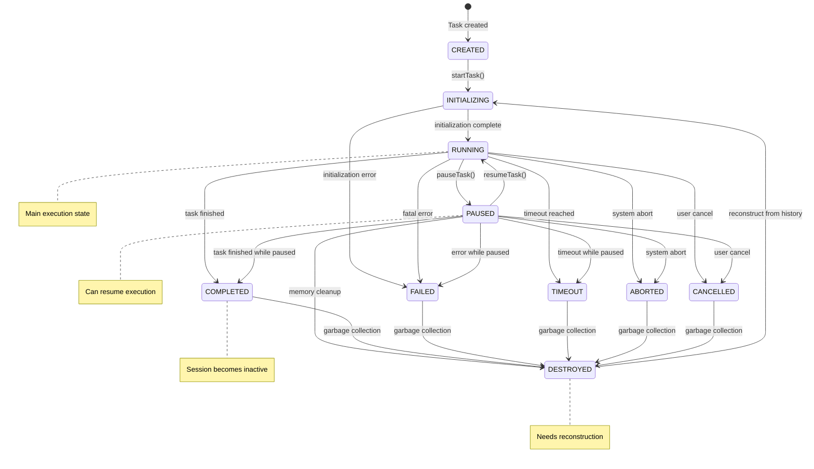

# Task State Machine

## Table of Contents

* [Task State Machine](#task-state-machine)
* [Table of Contents](#table-of-contents)
* [When You're Here](#when-youre-here)
* [Overview](#overview)
* [Research Context](#research-context)
* [🗺️ Navigation](#️-navigation)
* [Quick Links](#quick-links)
* [Key Concepts](#key-concepts)
* [Task States](#task-states)
* [Task State Properties](#task-state-properties)
* [State Transition Diagram](#state-transition-diagram)
* [State Transition Table](#state-transition-table)
* [Key States](#key-states)
* [Race Condition Impact](#race-condition-impact)
* [🔍 Research Context & Next Steps](#research-context--next-steps)
* [When You're Here, You Can:](#when-youre-here-you-can)
* [No Dead Ends Policy](#no-dead-ends-policy)
* [Navigation Footer](#navigation-footer)
* [No Dead Ends Policy](#no-dead-ends-policy)
* [Task State Machine](#task-state-machine)
* [Table of Contents](#table-of-contents)
* [Overview](#overview)
* [Research Context](#research-context)
* [🗺️ Navigation](#️-navigation)
* [Quick Links](#quick-links)
* [Key Concepts](#key-concepts)
* [Task States](#task-states)
* [Task State Properties](#task-state-properties)
* [State Transition Diagram](#state-transition-diagram)
* [State Transition Table](#state-transition-table)
* [Key States](#key-states)
* [Race Condition Impact](#race-condition-impact)
* [🔍 Research Context & Next Steps](#research-context--next-steps)
* [When You're Here, You Can:](#when-youre-here-you-can)
* [No Dead Ends Policy](#no-dead-ends-policy)
* [Navigation Footer](#navigation-footer)

> **Architecture Fun Fact**: Like a well-designed building, good documentation has a solid
> foundation, clear structure, and intuitive navigation! 🏗️

## When You're Here

This document is part of the KiloCode project documentation. If you're not familiar with this
document's role or purpose, this section helps orient you.

* **Purpose**: \[Brief description of what this document covers]
* **Audience**: \[Who should read this document]
* **Prerequisites**: \[What you should know before reading]
* **Related Documents**: \[Links to related documentation]

## Overview

## Research Context

* *Purpose:*\* \[Describe the purpose and scope of this document]

* *Background:*\* \[Provide relevant background information]

* *Research Questions:*\* \[List key questions this document addresses]

* *Methodology:*\* \[Describe the approach or methodology used]

* *Findings:*\* \[Summarize key findings or conclusions]

* \*\*

The Task State Machine manages the lifecycle of individual tasks in the system, from creation to
completion or destruction. Think of it as the **"dinosaur life cycle tracker"** - we need to know if
our digital creatures are eggs, hatchlings, adults, or fossils!

> **Geology Fun Fact**: The Grand Canyon reveals 2 billion years of geological history in its
> layers. Our task states reveal the entire lifecycle of a digital task in just 10 states - much
> more efficient! 🗺️

## 🗺️ Navigation

### Quick Links

* **Need to understand the problem?** →
  [Race Condition Analysis](../API_DUPLICATION_RACE_CONDITION_ANALYSIS.md)
* **Want to see how this fits together?** → [Combined State Machine](COMBINED_STATE_MACHINE.md)
* **Ready to implement a fix?** → [Recursive Call State Machine](RECURSIVE_CALL_STATE_MACHINE.md)

### Key Concepts

* **RUNNING** is where race conditions occur (the "hunting ground")
* **PAUSED** can resume and cause issues (the "hibernation that wakes up wrong")
* **COMPLETED** makes sessions inactive (the "extinction event")
* **DESTROYED** needs reconstruction (the "fossil that needs to be brought back to life")

## Task States

```typescript
// 🦕 The "dinosaur life stages" of our tasks - from egg to extinction
enum TaskState {
	CREATED = "created", // Task created but not initialized (like a dinosaur egg)
	INITIALIZING = "initializing", // Task is being initialized (hatching process)
	RUNNING = "running", // Task is actively executing (roaming the digital plains)
	PAUSED = "paused", // Task is paused but can resume (hibernation mode)
	COMPLETED = "completed", // Task finished successfully (natural death)
	FAILED = "failed", // Task failed with error (died from disease)
	TIMEOUT = "timeout", // Task timed out (died of old age)
	ABORTED = "aborted", // Task was aborted by system (hunted by predators)
	CANCELLED = "cancelled", // Task was cancelled by user (human intervention)
	DESTROYED = "destroyed", // Task was garbage collected (fossilized)
}

// 🗺️ The "geological properties" that define each state layer
interface TaskStateProperties {
	isPaused: boolean // Is this layer currently active?
	isInitialized: boolean // Has this layer been properly formed?
	canResume: boolean // Can this layer continue its formation?
	needsReconstruction: boolean // Does this layer need to be rebuilt?
	sessionImpact: "active" | "inactive" // How does this layer affect the overall landscape?
}
```

## Task State Properties

```typescript
// 🗺️ The "geological survey" - mapping each state's characteristics
// Think of this as our "rock identification guide" for different task formations
const TASK_STATE_PROPERTIES: Record<TaskState, TaskStateProperties> = {
	// 🥚 CREATED: The "dinosaur egg" state - not yet hatched
	[TaskState.CREATED]: {
		isPaused: false, // Not paused, just not started
		isInitialized: false, // Still in the shell
		canResume: false, // Can't resume what hasn't started
		needsReconstruction: false, // Fresh and new
		sessionImpact: "active", // Session is ready for action
	},

	// 🐣 INITIALIZING: The "hatching" process
	[TaskState.INITIALIZING]: {
		isPaused: false, // Actively hatching
		isInitialized: false, // Still in process
		canResume: false, // Can't resume mid-hatch
		needsReconstruction: false, // Building from scratch
		sessionImpact: "active", // Session is preparing
	},

	// 🦕 RUNNING: The "roaming the plains" state - this is where the magic happens!
	[TaskState.RUNNING]: {
		isPaused: false, // Actively hunting (executing)
		isInitialized: true, // Fully formed and ready
		canResume: false, // Already running, no need to resume
		needsReconstruction: false, // Built and operational
		sessionImpact: "active", // Session is fully engaged
	},

	// 😴 PAUSED: The "hibernation" state - can wake up anytime
	[TaskState.PAUSED]: {
		isPaused: true, // Sleeping but alive
		isInitialized: true, // Fully formed before sleep
		canResume: true, // Can wake up and continue
		needsReconstruction: false, // Still intact in memory
		sessionImpact: "active", // Session is still active
	},

	// 💀 COMPLETED: The "natural death" - successful life cycle
	[TaskState.COMPLETED]: {
		isPaused: true, // No longer active
		isInitialized: false, // Memory cleared
		canResume: false, // Can't bring back the dead
		needsReconstruction: true, // Need to rebuild from fossils (history)
		sessionImpact: "inactive", // Session becomes inactive
	},

	// 🦠 FAILED: The "disease" state - something went wrong
	[TaskState.FAILED]: {
		isPaused: true, // Stopped due to error
		isInitialized: false, // State corrupted
		canResume: false, // Can't resume from failure
		needsReconstruction: true, // Need to rebuild from scratch
		sessionImpact: "inactive", // Session becomes inactive
	},

	// ⏰ TIMEOUT: The "old age" state - ran out of time
	[TaskState.TIMEOUT]: {
		isPaused: true, // Stopped due to timeout
		isInitialized: false, // State expired
		canResume: false, // Can't resume expired task
		needsReconstruction: true, // Need to rebuild
		sessionImpact: "inactive", // Session becomes inactive
	},

	// 🦅 ABORTED: The "predator attack" - system killed it
	[TaskState.ABORTED]: {
		isPaused: true, // Forcibly stopped
		isInitialized: false, // State destroyed
		canResume: false, // Can't resume aborted task
		needsReconstruction: true, // Need to rebuild
		sessionImpact: "inactive", // Session becomes inactive
	},

	// 🚫 CANCELLED: The "human intervention" - user stopped it
	[TaskState.CANCELLED]: {
		isPaused: true, // User stopped it
		isInitialized: false, // State cleared
		canResume: false, // Can't resume cancelled task
		needsReconstruction: true, // Need to rebuild
		sessionImpact: "inactive", // Session becomes inactive
	},

	// 🦴 DESTROYED: The "fossilized" state - garbage collected
	[TaskState.DESTROYED]: {
		isPaused: true, // Completely inactive
		isInitialized: false, // Memory freed
		canResume: false, // Can't resume destroyed task
		needsReconstruction: true, // Need to rebuild from fossils
		sessionImpact: "inactive", // Session becomes inactive
	},
}
```

## State Transition Diagram



## State Transition Table

```typescript
const TASK_STATE_TRANSITIONS = {
	[TaskState.CREATED]: {
		startTask: TaskState.INITIALIZING,
		destroy: TaskState.DESTROYED,
	},
	[TaskState.INITIALIZING]: {
		complete: TaskState.RUNNING,
		fail: TaskState.FAILED,
	},
	[TaskState.RUNNING]: {
		pause: TaskState.PAUSED,
		complete: TaskState.COMPLETED,
		fail: TaskState.FAILED,
		timeout: TaskState.TIMEOUT,
		abort: TaskState.ABORTED,
		cancel: TaskState.CANCELLED,
	},
	[TaskState.PAUSED]: {
		resume: TaskState.RUNNING,
		complete: TaskState.COMPLETED,
		fail: TaskState.FAILED,
		timeout: TaskState.TIMEOUT,
		abort: TaskState.ABORTED,
		cancel: TaskState.CANCELLED,
		destroy: TaskState.DESTROYED,
	},
	[TaskState.COMPLETED]: {
		destroy: TaskState.DESTROYED,
	},
	[TaskState.FAILED]: {
		destroy: TaskState.DESTROYED,
	},
	[TaskState.TIMEOUT]: {
		destroy: TaskState.DESTROYED,
	},
	[TaskState.ABORTED]: {
		destroy: TaskState.DESTROYED,
	},
	[TaskState.CANCELLED]: {
		destroy: TaskState.DESTROYED,
	},
	[TaskState.DESTROYED]: {
		reconstruct: TaskState.INITIALIZING,
	},
}
```

## Key States

* **RUNNING**: Main execution state where task is actively processing
* **PAUSED**: Task is paused but can be resumed from memory
* **COMPLETED**: Task finished successfully, session becomes inactive
* **DESTROYED**: Task was garbage collected, needs reconstruction from history

## Race Condition Impact

The task state machine is crucial for understanding the race condition because:

* **RUNNING** tasks can have concurrent recursive calls

* **PAUSED** tasks can be resumed and cause race conditions

* **DESTROYED** tasks need reconstruction, which triggers the navigation fix

* **COMPLETED** tasks make sessions inactive, requiring different handling

* \*\*

* *Related Documentation:*\*

* [Session State Machine](SESSION_STATE_MACHINE.md)

* [Recursive Call State Machine](RECURSIVE_CALL_STATE_MACHINE.md)

* [Combined State Machine](COMBINED_STATE_MACHINE.md)

* [API Duplication Race Condition Analysis](../API_DUPLICATION_RACE_CONDITION_ANALYSIS.md)

## 🔍 Research Context & Next Steps

### When You're Here, You Can:

* *Understanding Architecture:*\*

* **Next**: Check related architecture documentation in the same directory

* **Related**: [Technical Glossary](../../GLOSSARY.md) for terminology,
  [Architecture Documentation](README.md) for context

* *Implementing Architecture Features:*\*

* **Next**: [Repository Development Guide](../../GETTING_STARTED.md) →
  [Testing Infrastructure](../../testing/TESTING_STRATEGY.md)

* **Related**: [Orchestrator Documentation](../../orchestrator/README.md) for integration patterns

* *Troubleshooting Architecture Issues:*\*

* **Next**: \[Race Condition Analysis]race-condition/README.md) →
  \[Root Cause Analysis]race-condition/ROOT\_CAUSE\_ANALYSIS.md)

* **Related**: [Orchestrator Error Handling](../../orchestrator/ORCHESTRATOR_ERROR_HANDLING.md) for
  common issues

### No Dead Ends Policy

Every page provides clear next steps based on your research goals. If you're unsure where to go
next, return to [Architecture Documentation](README.md) for guidance.

## Navigation Footer

* \*\*

## No Dead Ends Policy

Every section in this document connects you to your next step:

* **If you're new here**: Start with the [When You're Here](#when-youre-here) section

* **If you need context**: Check the [Research Context](#research-context) section

* **If you're ready to implement**: Jump to the implementation sections

* **If you're stuck**: Visit our [Troubleshooting Guide](../../tools/TROUBLESHOOTING_GUIDE.md)

* **If you need help**: Check the [Technical Glossary](../../GLOSSARY.md)

* *Navigation*\*: [← Back to Architecture Documentation](README.md) ·
  [📚 Technical Glossary](../../GLOSSARY.md) · [↑ Table of Contents](#research-context--next-steps)
