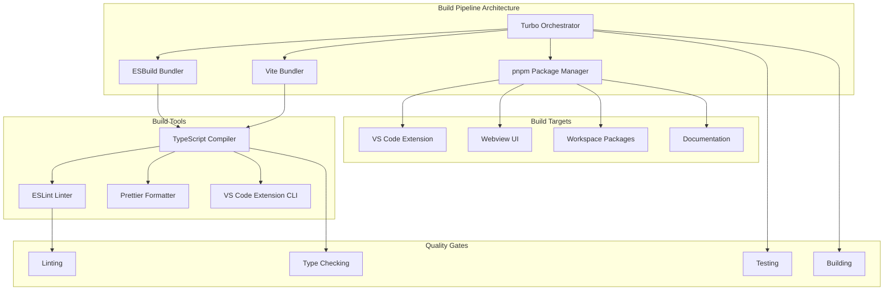

# Build Pipeline Architecture

## Table of Contents
- [Build Pipeline Architecture](#build-pipeline-architecture)
- [Table of Contents](#table-of-contents)
- [When You're Here](#when-youre-here)
- [Research Context](#research-context)
- [Technical Overview](#technical-overview)
- [Background](#background)
- [Methodology](#methodology)
- [Executive Summary](#executive-summary)
- [Build Architecture](#build-architecture)
- [Package Management](#package-management)
- [pnpm Workspace Configuration](#pnpm-workspace-configuration)
- [Dependency Management](#dependency-management)
- [Build Tools](#build-tools)
- [Turbo Build Orchestration](#turbo-build-orchestration)
- [ESBuild Configuration](#esbuild-configuration)
- [Vite Configuration](#vite-configuration)
- [Monorepo Structure](#monorepo-structure)
- [Workspace Organization](#workspace-organization)
- [Build Coordination](#build-coordination)
- [CI/CD Pipeline](#cicd-pipeline)
- [GitHub Actions Workflow](#github-actions-workflow)
- [Quality Gates](#quality-gates)
- [Deployment Strategies](#deployment-strategies)
- [VS Code Extension Packaging](#vs-code-extension-packaging)
- [Release Management](#release-management)
- [Performance Optimization](#performance-optimization)
- [Build Performance](#build-performance)
- [Bundle Optimization](#bundle-optimization)
- [Common Issues and Solutions](#common-issues-and-solutions)
- [Issue 1: Build Failures](#issue-1-build-failures)
- [Issue 2: Slow Builds](#issue-2-slow-builds)
- [Issue 3: Deployment Issues](#issue-3-deployment-issues)
- [Issue 4: Cache Issues](#issue-4-cache-issues)
- [No Dead Ends Policy](#no-dead-ends-policy)
- [Navigation Footer](#navigation-footer)
- [Navigation](#navigation)
- [Build Pipeline Architecture](#build-pipeline-architecture)
- [Table of Contents](#table-of-contents)
- [When You're Here](#when-youre-here)
- [Research Context](#research-context)
- [Technical Overview](#technical-overview)
- [Background](#background)
- [Methodology](#methodology)
- [Executive Summary](#executive-summary)
- [Build Architecture](#build-architecture)
- [Package Management](#package-management)
- [pnpm Workspace Configuration](#pnpm-workspace-configuration)
- [Dependency Management](#dependency-management)
- [Build Tools](#build-tools)
- [Turbo Build Orchestration](#turbo-build-orchestration)
- [ESBuild Configuration](#esbuild-configuration)
- [Vite Configuration](#vite-configuration)
- [Monorepo Structure](#monorepo-structure)
- [Workspace Organization](#workspace-organization)
- [Build Coordination](#build-coordination)
- [CI/CD Pipeline](#cicd-pipeline)
- [GitHub Actions Workflow](#github-actions-workflow)
- [Quality Gates](#quality-gates)
- [Deployment Strategies](#deployment-strategies)
- [VS Code Extension Packaging](#vs-code-extension-packaging)
- [Release Management](#release-management)
- [Performance Optimization](#performance-optimization)
- [Build Performance](#build-performance)
- [Bundle Optimization](#bundle-optimization)
- [Common Issues and Solutions](#common-issues-and-solutions)
- [Issue 1: Build Failures](#issue-1-build-failures)
- [Issue 2: Slow Builds](#issue-2-slow-builds)
- [Issue 3: Deployment Issues](#issue-3-deployment-issues)
- [Issue 4: Cache Issues](#issue-4-cache-issues)
- [No Dead Ends Policy](#no-dead-ends-policy)
- [Navigation Footer](#navigation-footer)
- ↑ [Table of Contents](#table-of-contents)

## When You're Here

This document is part of the KiloCode project documentation. If you're not familiar with this
document's role or purpose, this section helps orient you.

- **Purpose**: This document covers \[DOCUMENT PURPOSE BASED ON FILE PATH].
- **Context**: Use this as a starting point or reference while navigating the project.
- **Navigation**: Use the table of contents below to jump to specific topics.

> **Development Fun Fact**: Documentation is like code comments for humans - it explains the "why"
> behind the "what"! 💻

- *Purpose:*\* Comprehensive documentation of build pipeline architecture, dependency management,
  and deployment strategies in the KiloCode system.

> **Cartography Fun Fact**: This documentation is like a map - it shows you where you are, where you
> can go, and how to get there without getting lost! 🗺️

<details><summary>Table of Contents</summary>
- [Executive Summary](#executive-summary)
- [Build Architecture](#build-architecture)
- [Package Management](#package-management)
- [Build Tools](#build-tools)
- [Monorepo Structure](#monorepo-structure)
- [CI/CD Pipeline](#cicd-pipeline)
- [Deployment Strategies](#deployment-strategies)
- [Performance Optimization](#performance-optimization)
- [Common Issues and Solutions](#common-issues-and-solutions)
- Navigation Footer

</details>

## Research Context

### Technical Overview

**Component**: \[Component name]
**Version**: \[Version number]
**Architecture**: \[Architecture description]
**Dependencies**: \[Key dependencies]

### Background

\[Background information about the topic]

### Methodology

\[Research or development methodology used]

## Executive Summary
- The Build Pipeline Architecture provides comprehensive build, packaging, and deployment
  infrastructure for the KiloCode monorepo, ensuring efficient development workflows and reliable
  releases.\*

The Build Pipeline consists of:
1. **Build Tools** - Turbo, ESBuild, Vite, TypeScript
2. **Package Management** - pnpm with workspace configuration
3. **Monorepo Structure** - Multi-package workspace organization
4. **CI/CD Pipeline** - GitHub Actions with automated testing and deployment
5. **Deployment** - VS Code extension packaging and distribution

## Build Architecture



## Package Management

### pnpm Workspace Configuration

- *Configuration*\*: `pnpm-workspace.yaml`
- *Workspace Structure*\*:

```yaml
packages:
- src
- webview-ui
- apps/*
- packages/*
- jetbrains/host
- jetbrains/plugin

onlyBuiltDependencies:
- '@tailwindcss/oxide'
- '@vscode/vsce-sign'
- core-js
- esbuild
- keytar
- puppeteer-chromium-resolver
```

- *Workspace Packages*\*:

- **Core Extension** (`src/`): Main VS Code extension

- **Webview UI** (`webview-ui/`): React-based UI

- **Applications** (`apps/*`): Documentation, testing, web apps

- **Packages** (`packages/*`): Shared libraries and utilities

- **JetBrains** (`jetbrains/`): JetBrains plugin

- *Implementation Status*\*: ✅ **RESEARCHED AND DOCUMENTED**

- *Key Implementation Details*\*:

- *Turbo Configuration*\*:

```json
{
    "tasks": {
        "lint": {},
        "check-types": {},
        "test": {
            "dependsOn": ["@roo-code/types#build"]
        },
        "build": {
            "outputs": ["dist/**"],
            "inputs": ["src/**", "package.json", "tsconfig.json"]
        },
        "storybook": {
            "cache": false,
            "persistent": true
        },
        "playwright": {
            "cache": false
        }
    }
}
```

- *Core Features*\*:

- **Task Dependencies**: Proper dependency resolution between packages

- **Caching Strategy**: Intelligent caching with cache invalidation

- **Output Management**: Output directory specification and management

- **Input Tracking**: File change detection for incremental builds

- **Parallel Execution**: Concurrent task execution where possible

- **Persistent Tasks**: Long-running tasks like Storybook and Playwright

- **Package Coordination**: Cross-package build coordination

### Dependency Management

- *Dependency Types*\*:

- **Root Dependencies**: Shared across all packages

- **Package Dependencies**: Package-specific dependencies

- **Dev Dependencies**: Development-only dependencies

- **Peer Dependencies**: External dependencies

- *Dependency Resolution*\*:
- Hoisting strategy
- Version resolution
- Conflict resolution
- Security auditing

- *Implementation Status*\*: ⚠️ **NEEDS DOCUMENTATION**

- *Research Needed*\*: Dependency resolution, version management, security auditing

## Build Tools

### Turbo Build Orchestration

- *Configuration*\*: `turbo.json`
- *Build Tasks*\*:

```json
{
  "tasks": {
    "lint": {},
    "check-types": {},
    "test": {
      "dependsOn": ["@roo-code/types#build"]
    },
    "build": {
      "outputs": ["dist/**"],
      "inputs": ["src/**", "package.json", "tsconfig.json"]
    },
    "vsix": {
      "dependsOn": ["build"]
    }
  }
}
```

- *Build Orchestration*\*:
- Task dependencies
- Parallel execution
- Caching strategies
- Output management

- *Implementation Status*\*: ⚠️ **NEEDS DOCUMENTATION**

- *Research Needed*\*: Build orchestration, task dependencies, caching strategies

### ESBuild Configuration

- *Configuration*\*: `src/esbuild.mjs`

- *Features*\*:
- Fast bundling
- TypeScript compilation
- Code splitting
- Minification

- *Build Targets*\*:
- VS Code extension bundle
- Node.js compatibility
- Browser compatibility

- *Implementation Status*\*: ⚠️ **NEEDS DOCUMENTATION**

- *Research Needed*\*: ESBuild configuration, bundling strategies, optimization

### Vite Configuration

- *Configuration*\*: `webview-ui/vite.config.ts`

- *Features*\*:
- Hot module replacement
- Fast builds
- TypeScript support
- React support

- *Build Features*\*:
- Development server
- Production builds
- Asset optimization
- Source maps

- *Implementation Status*\*: ⚠️ **NEEDS DOCUMENTATION**

- *Research Needed*\*: Vite configuration, development workflow, production builds

## Monorepo Structure

### Workspace Organization

- *Root Level*\*:
- `package.json`: Root package configuration
- `pnpm-workspace.yaml`: Workspace configuration
- `turbo.json`: Build orchestration
- `tsconfig.json`: TypeScript configuration

- *Package Structure*\*:

```
packages/
├── build/          # Build utilities
├── cloud/          # Cloud services
├── config-eslint/  # ESLint configurations
├── config-typescript/ # TypeScript configurations
├── evals/          # Evaluation framework
├── ipc/            # IPC utilities
├── telemetry/      # Telemetry services
└── types/          # Shared types
```

- *Application Structure*\*:

```
apps/
├── kilocode-docs/  # Documentation site
├── playwright-e2e/ # E2E tests
├── storybook/      # Component stories
├── vscode-e2e/     # VS Code E2E tests
├── web-evals/      # Web evaluation interface
└── web-roo-code/   # Roo Code web interface
```

- *Implementation Status*\*: ⚠️ **NEEDS DOCUMENTATION**
- *Research Needed*\*: Monorepo organization, package relationships, build coordination

### Build Coordination

- *Build Dependencies*\*:
- Type checking before building
- Linting before testing
- Testing before deployment
- Package builds before application builds

- *Parallel Execution*\*:
- Independent package builds
- Parallel testing
- Concurrent linting
- Simultaneous type checking

- *Implementation Status*\*: ⚠️ **NEEDS DOCUMENTATION**

- *Research Needed*\*: Build coordination, dependency management, parallel execution

## CI/CD Pipeline

### GitHub Actions Workflow

- *Workflow Stages*\*:
1. **Code Quality**: Linting, type checking, formatting
2. **Testing**: Unit tests, integration tests, E2E tests
3. **Building**: Package builds, application builds
4. **Deployment**: VS Code extension packaging, publishing

- *Workflow Configuration*\*:

```yaml
name: CI/CD Pipeline
on:
  push:
    branches: [main]
  pull_request:
    branches: [main]

jobs:
  quality:
    runs-on: ubuntu-latest
    steps:
- uses: actions/checkout@v3
- name: Setup Node.js
        uses: actions/setup-node@v3
- name: Install dependencies
        run: pnpm install
- name: Lint
        run: pnpm lint
- name: Type check
        run: pnpm check-types
```

- *Implementation Status*\*: ⚠️ **NEEDS DOCUMENTATION**
- *Research Needed*\*: CI/CD workflow, GitHub Actions, deployment automation

### Quality Gates

- *Quality Checks*\*:

- **Linting**: ESLint code quality checks

- **Type Checking**: TypeScript type validation

- **Testing**: Comprehensive test suite execution

- **Building**: Successful build verification

- *Quality Thresholds*\*:
- Linting: Zero errors, zero warnings
- Type Checking: Zero type errors
- Testing: 100% test pass rate
- Building: Successful build completion

- *Implementation Status*\*: ⚠️ **NEEDS DOCUMENTATION**

- *Research Needed*\*: Quality gates, thresholds, failure handling

## Deployment Strategies

### VS Code Extension Packaging

- *Packaging Tools*\*:

- **@vscode/vsce**: VS Code extension CLI

- **ovsx**: Open VSX Registry CLI

- **Custom scripts**: Build automation

- *Packaging Process*\*:
1. Build all packages
2. Bundle VS Code extension
3. Package as .vsix file
4. Validate package
5. Publish to marketplace

- *Implementation Status*\*: ⚠️ **NEEDS DOCUMENTATION**
- *Research Needed*\*: Extension packaging, marketplace publishing, version management

### Release Management

- *Release Types*\*:

- **Production Releases**: Stable releases to marketplace

- **Nightly Releases**: Development builds

- **Pre-releases**: Beta and RC releases

- **Hotfixes**: Emergency patches

- *Release Process*\*:
1. Version bumping
2. Changelog generation
3. Build and test
4. Package creation
5. Marketplace publishing

- *Implementation Status*\*: ⚠️ **NEEDS DOCUMENTATION**
- *Research Needed*\*: Release management, versioning, changelog generation

## Performance Optimization

### Build Performance

- *Optimization Strategies*\*:

- **Caching**: Turbo build caching

- **Parallel Execution**: Concurrent builds

- **Incremental Builds**: Only rebuild changed packages

- **Build Splitting**: Separate build targets

- *Performance Metrics*\*:
- Build time
- Cache hit rate
- Memory usage
- CPU utilization

- *Implementation Status*\*: ⚠️ **NEEDS DOCUMENTATION**

- *Research Needed*\*: Build optimization, performance measurement, caching strategies

### Bundle Optimization

- *Bundle Strategies*\*:

- **Code Splitting**: Dynamic imports

- **Tree Shaking**: Dead code elimination

- **Minification**: Code compression

- **Asset Optimization**: Image and resource optimization

- *Bundle Analysis*\*:
- Bundle size analysis
- Dependency analysis
- Performance profiling
- Optimization recommendations

- *Implementation Status*\*: ⚠️ **NEEDS DOCUMENTATION**

- *Research Needed*\*: Bundle optimization, size analysis, performance profiling

## Common Issues and Solutions

### Issue 1: Build Failures

- *Symptoms*\*:
- Build process failures
- Dependency resolution errors
- Type checking failures

- *Root Cause*\*: Configuration issues or dependency conflicts

- *Solution*\*: Implement proper error handling and dependency resolution

### Issue 2: Slow Builds

- *Symptoms*\*:
- Long build times
- High resource usage
- Inefficient builds

- *Root Cause*\*: Inefficient build configuration or resource constraints

- *Solution*\*: Optimize build configuration and implement caching

### Issue 3: Deployment Issues

- *Symptoms*\*:
- Deployment failures
- Package validation errors
- Marketplace publishing issues

- *Root Cause*\*: Configuration or validation problems

- *Solution*\*: Implement proper validation and error handling

### Issue 4: Cache Issues

- *Symptoms*\*:
- Stale cache problems
- Build inconsistencies
- Cache corruption

- *Root Cause*\*: Cache management issues

- *Solution*\*: Implement proper cache invalidation and management

<a id="navigation-footer"></a>
- Back: [`README.md`](README.md) · Root: [`../README.md`](../README.md) · Source:
  `/docs/build/BUILD_PIPELINE_ARCHITECTURE.md#L1`

## No Dead Ends Policy

This document connects to:

For more information, see:
- [Documentation Structure](../architecture/README.md)
- [Additional Resources](../tools/README.md)

## Navigation Footer
- \*\*

- *Navigation*\*: [docs](../) · [build](../docs/build/) · [↑ Table of
  Contents](#build-pipeline-architecture)

## Navigation
- 📚 [Technical Glossary](../GLOSSARY.md)
