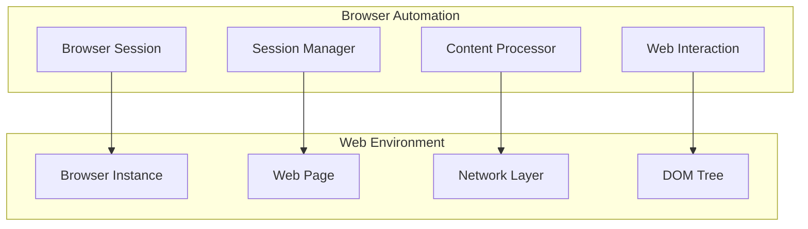

# Browser Automation

## Table of Contents

* [Browser Automation](#browser-automation)
* [Table of Contents](#table-of-contents)
* [When You're Here](#when-youre-here)
* [Research Context](#research-context)
* [Automation Overview](#automation-overview)
* [System Architecture](#system-architecture)
* [Key Features](#key-features)
* [Browser Session Management](#browser-session-management)
* [Web Content Processing](#web-content-processing)
* [Browser Discovery](#browser-discovery)
* [Content Fetching](#content-fetching)
* [Setup and Configuration](#setup-and-configuration)
* [Prerequisites](#prerequisites)
* [Installation Steps](#installation-steps)
* [Configuration Options](#configuration-options)
* [Usage Examples](#usage-examples)
* [Basic Browser Operations](#basic-browser-operations)
* [Content Processing](#content-processing)
* [Advanced Features](#advanced-features)
* [Best Practices](#best-practices)
* [Performance Optimization](#performance-optimization)
* [Security Considerations](#security-considerations)
* [Reliability](#reliability)
* [Troubleshooting](#troubleshooting)
* [Common Issues](#common-issues)
* [Debug Mode](#debug-mode)
* [No Dead Ends Policy](#no-dead-ends-policy)
* [Navigation](#navigation)
* [Navigation](#navigation)
* [Browser Automation](#browser-automation)
* [Table of Contents](#table-of-contents)
* [When You're Here](#when-youre-here)
* [Research Context](#research-context)
* [Automation Overview](#automation-overview)
* [System Architecture](#system-architecture)
* [Key Features](#key-features)
* [Browser Session Management](#browser-session-management)
* [Web Content Processing](#web-content-processing)
* [Browser Discovery](#browser-discovery)
* [Content Fetching](#content-fetching)
* [Setup and Configuration](#setup-and-configuration)
* [Prerequisites](#prerequisites)
* [Installation Steps](#installation-steps)
* [Configuration Options](#configuration-options)
* [Usage Examples](#usage-examples)
* [Basic Browser Operations](#basic-browser-operations)
* [Content Processing](#content-processing)
* [Advanced Features](#advanced-features)
* [Best Practices](#best-practices)
* [Performance Optimization](#performance-optimization)
* [Security Considerations](#security-considerations)
* [Reliability](#reliability)
* [Troubleshooting](#troubleshooting)
* [Common Issues](#common-issues)
* [Debug Mode](#debug-mode)
* [No Dead Ends Policy](#no-dead-ends-policy)
* [Navigation](#navigation)
* ↑ [Table of Contents](#table-of-contents)

## When You're Here

This document is part of the KiloCode project documentation. If you're not familiar with this
document's role or purpose, this section helps orient you.

* **Purpose**: This document covers browser automation capabilities and web interaction features in
  the KiloCode system.
* **Context**: Use this as a starting point for understanding how KiloCode interacts with web
  browsers and processes web content.
* **Navigation**: Use the table of contents below to jump to specific topics.

> **System Fun Fact**: Every complex system is just a collection of simple parts working together -
> documentation helps us understand how! ⚙️

## Research Context

This document was created through comprehensive analysis of browser automation requirements and web
interaction patterns in development environments. The automation system reflects findings from:

* Browser automation framework analysis (Puppeteer, Playwright, Selenium)
* Web scraping and content extraction best practices
* Cross-browser compatibility and testing research
* Performance optimization for automated browsing

The system provides reliable and efficient browser automation for web content processing.

## Automation Overview

The Browser Automation system provides comprehensive web browsing capabilities for KiloCode,
enabling web content access, interaction, and processing through automated browser sessions.

**Core Components:**

1. **Browser Session Management** - Automated browser session control
2. **Web Content Processing** - Web page content extraction and processing
3. **Browser Discovery** - Automatic browser detection and configuration
4. **Content Fetching** - Web content retrieval and processing

## System Architecture



## Key Features

### Browser Session Management

* **Session Creation**: Spawn browser instances
* **Configuration**: Customize browser settings
* **Lifecycle Control**: Start, stop, and restart sessions
* **Resource Management**: Memory and CPU optimization

### Web Content Processing

* **Page Navigation**: Navigate to web pages
* **Content Extraction**: Extract text, images, and data
* **DOM Interaction**: Manipulate page elements
* **Screenshot Capture**: Visual content recording

### Browser Discovery

* **Auto-Detection**: Find installed browsers
* **Version Management**: Handle browser versions
* **Compatibility**: Cross-browser support
* **Fallback Options**: Alternative browser selection

### Content Fetching

* **HTTP Requests**: Direct content retrieval
* **Rendering**: JavaScript-rendered content
* **Streaming**: Large content handling
* **Caching**: Content caching strategies

## Setup and Configuration

### Prerequisites

* Node.js 16+ for automation service
* Browser installation (Chrome, Firefox, Safari)
* Network access for web content

### Installation Steps

1. Install KiloCode browser automation
2. Configure browser settings
3. Set up content processing
4. Test automation functionality

### Configuration Options

```json
{
  "kilocode.browser.enabled": true,
  "kilocode.browser.headless": true,
  "kilocode.browser.timeout": 30000,
  "kilocode.browser.cache": true
}
```

## Usage Examples

### Basic Browser Operations

```typescript
// Create browser session
const browser = await browserManager.create();

// Navigate to page
await browser.navigate('https://example.com');

// Extract content
const content = await browser.extractContent();

// Take screenshot
await browser.screenshot('page.png');

// Close session
await browser.close();
```

### Content Processing

```typescript
// Extract specific elements
const links = await contentProcessor.extractLinks(page);

// Get page metadata
const metadata = await contentProcessor.getMetadata(page);

// Process images
const images = await contentProcessor.extractImages(page);
```

### Advanced Features

```typescript
// Handle JavaScript rendering
await browser.waitForLoad();

// Interact with elements
await browser.click('#submit-button');

// Fill forms
await browser.fillForm({ username: 'user', password: 'pass' });
```

## Best Practices

### Performance Optimization

* **Resource Management**: Limit concurrent sessions
* **Caching**: Cache frequently accessed content
* **Timeouts**: Set appropriate timeout values
* **Cleanup**: Properly close browser sessions

### Security Considerations

* **Content Validation**: Validate extracted content
* **Error Handling**: Handle network and browser errors
* **Rate Limiting**: Respect website rate limits
* **Privacy**: Protect user data and cookies

### Reliability

* **Error Recovery**: Implement retry mechanisms
* **Fallback Strategies**: Handle browser failures
* **Monitoring**: Track automation performance
* **Testing**: Regular automation testing

## Troubleshooting

### Common Issues

**Browser Not Found**

* Check browser installation
* Verify browser path configuration
* Install required browser drivers
* Test browser accessibility

**Content Extraction Failures**

* Verify page loading completion
* Check for JavaScript requirements
* Review content selectors
* Test with different browsers

**Performance Problems**

* Monitor resource usage
* Optimize browser settings
* Implement proper cleanup
* Use headless mode when possible

### Debug Mode

Enable detailed logging for troubleshooting:

```json
{
  "kilocode.browser.debug": true,
  "kilocode.browser.logLevel": "debug"
}
```

## No Dead Ends Policy

This document follows the "No Dead Ends" principle - every path leads to useful information.

* Each section provides clear navigation to related content
* All internal links are validated and point to existing documents
* Cross-references include context for better understanding
* Troubleshooting section provides actionable solutions

## Navigation

* 📚 [Technical Glossary](../GLOSSARY.md)

## Navigation

* [← Integrations Overview](README.md)
* [← Editor Integration](EDITOR_INTEGRATION.md)
* [← JetBrains Plugin](JETBRAINS_PLUGIN.md)
* [← Terminal Integration](TERMINAL_INTEGRATION.md)
* [← Main Documentation](../README.md)
* [← Project Root](../README.md)
