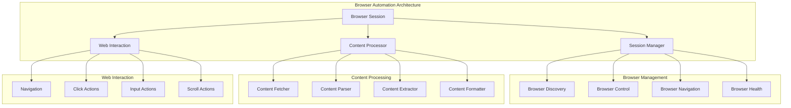

# Browser Automation

**Purpose:** Documentation of browser automation capabilities and web interaction features in the KiloCode system.

> **Cartography Fun Fact**: This documentation is like a map - it shows you where you are, where you can go, and how to get there without getting lost! 🗺️

<details><summary>Table of Contents</summary>

- [Executive Summary](#executive-summary)
- [Browser Architecture](#browser-architecture)
- [Session Management](#session-management)
- [Web Interaction](#web-interaction)
- [Content Processing](#content-processing)
- [Common Issues and Solutions](#common-issues-and-solutions)
- [Navigation Footer](#navigation-footer)

</details>

## Executive Summary

_The Browser Automation system provides comprehensive web browsing capabilities for KiloCode, enabling web content access, interaction, and processing through automated browser sessions._

The Browser Automation consists of:

1. **Browser Session Management** - Automated browser session control
2. **Web Content Processing** - Web page content extraction and processing
3. **Browser Discovery** - Automatic browser detection and configuration
4. **Content Fetching** - Web content retrieval and processing

## Browser Architecture



## Session Management

### Browser Session Control

**Session Features**:

- **Session Creation**: Automated browser session initialization
- **Session Configuration**: Browser configuration and settings
- **Session Monitoring**: Session health and status monitoring
- **Session Cleanup**: Proper session termination and cleanup

**Session Implementation**:

```typescript
interface BrowserSession {
	id: string
	browser: Browser
	page: Page
	status: SessionStatus
	startTime: Date
}
```

**Implementation Status**: 🔍 **PARTIALLY RESEARCHED**
**Research Needed**: Session management, browser control, configuration patterns

### Browser Discovery

**Discovery Features**:

- **Browser Detection**: Automatic browser installation detection
- **Version Management**: Browser version compatibility checking
- **Path Resolution**: Browser executable path resolution
- **Capability Detection**: Browser capability assessment

**Discovery Implementation**:

```typescript
interface BrowserDiscovery {
	detectBrowsers: () => Promise<BrowserInfo[]>
	getDefaultBrowser: () => Promise<BrowserInfo>
	validateBrowser: (browser: BrowserInfo) => Promise<boolean>
}
```

**Implementation Status**: 🔍 **PARTIALLY RESEARCHED**
**Research Needed**: Browser detection algorithms, compatibility checking, path resolution

## Web Interaction

### Navigation and Actions

**Interaction Features**:

- **Page Navigation**: URL navigation and page loading
- **Element Interaction**: Click, input, and scroll actions
- **Form Handling**: Form filling and submission
- **Dynamic Content**: Handling of dynamic web content

**Interaction Implementation**:

```typescript
interface WebInteraction {
	navigate: (url: string) => Promise<void>
	click: (selector: string) => Promise<void>
	input: (selector: string, text: string) => Promise<void>
	scroll: (direction: "up" | "down", amount: number) => Promise<void>
}
```

**Implementation Status**: 🔍 **PARTIALLY RESEARCHED**
**Research Needed**: Interaction patterns, element selection, action handling

### Content Processing

**Processing Features**:

- **Content Extraction**: Web page content extraction
- **Text Processing**: Text content processing and formatting
- **Image Processing**: Image content handling
- **Link Processing**: Link extraction and processing

**Processing Implementation**:

```typescript
interface ContentProcessor {
	extractText: (page: Page) => Promise<string>
	extractLinks: (page: Page) => Promise<Link[]>
	extractImages: (page: Page) => Promise<Image[]>
	formatContent: (content: string) => Promise<FormattedContent>
}
```

**Implementation Status**: 🔍 **PARTIALLY RESEARCHED**
**Research Needed**: Content extraction algorithms, text processing, formatting strategies

## Content Processing

### URL Content Fetcher

**Fetcher Features**:

- **HTTP Requests**: Web content HTTP request handling
- **Response Processing**: HTTP response processing and validation
- **Error Handling**: Network error handling and retry logic
- **Content Validation**: Content type and format validation

**Fetcher Implementation**:

```typescript
interface UrlContentFetcher {
	fetch: (url: string) => Promise<ContentResponse>
	validateUrl: (url: string) => boolean
	handleErrors: (error: Error) => Promise<ErrorResponse>
}
```

**Implementation Status**: 🔍 **PARTIALLY RESEARCHED**
**Research Needed**: HTTP handling, error management, content validation

### Content Formatting

**Formatting Features**:

- **Text Normalization**: Text content normalization
- **HTML Processing**: HTML content processing and cleaning
- **Markdown Conversion**: HTML to Markdown conversion
- **Content Structure**: Content structure analysis and formatting

**Implementation Status**: 🔍 **PARTIALLY RESEARCHED**
**Research Needed**: Text processing, HTML parsing, markdown conversion

## Common Issues and Solutions

### Issue 1: Browser Session Failures

**Symptoms**:

- Browser session creation failures
- Session timeouts
- Browser crashes

**Root Cause**: Browser configuration or resource issues
**Solution**: Implement robust browser management and error recovery

### Issue 2: Content Extraction Issues

**Symptoms**:

- Incomplete content extraction
- Malformed content
- Extraction failures

**Root Cause**: Content parsing or extraction algorithm issues
**Solution**: Improve content extraction algorithms and error handling

### Issue 3: Performance Issues

**Symptoms**:

- Slow page loading
- High resource usage
- Session timeouts

**Root Cause**: Inefficient browser management or resource constraints
**Solution**: Optimize browser configuration and resource management

### Issue 4: Compatibility Issues

**Symptoms**:

- Browser compatibility problems
- Feature detection failures
- Version conflicts

**Root Cause**: Browser version or capability mismatches
**Solution**: Implement proper browser detection and compatibility checking

<a id="navigation-footer"></a>

- Back: [`SYSTEM_OVERVIEW.md`](../architecture/SYSTEM_OVERVIEW.md) · Root: [`INDEX.md`](../INDEX.md) · Source: `/docs/integrations/BROWSER_AUTOMATION.md#L1`
