# Editor Integration

> **Development Fun Fact**: Documentation is like code comments for humans - it explains the "why" behind the "what"! 💻

**Purpose:** Comprehensive documentation of the editor integration system for VS Code editor
interaction, diff visualization, and editor utilities in KiloCode.

> **Cartography Fun Fact**: This documentation is like a map - it shows you where you are, where you
> can go, and how to get there without getting lost! 🗺️

<details><summary>Table of Contents</summary>

- [Executive Summary](#executive-summary)
- [System Architecture](#system-architecture)
- [Editor Utilities](#editor-utilities)
- [Diff Visualization](#diff-visualization)
- [Decoration Management](#decoration-management)
- [Performance & Optimization](#performance--optimization)
- [Common Issues and Solutions](#common-issues-and-solutions)
- Navigation Footer

</details>

## Executive Summary

_The Editor Integration system provides comprehensive VS Code editor interaction, diff
visualization, and editor utility capabilities for seamless development workflow integration in
KiloCode._

The Editor Integration consists of:

1. **Editor Utilities** - Core editor interaction and manipulation
2. **Diff Visualization** - Comprehensive diff display and interaction
3. **Decoration Management** - Visual feedback and decoration system
4. **Omission Detection** - Intelligent code omission detection
5. **Editor State Management** - Editor state tracking and synchronization

## System Architecture

```mermaid
graph TB
    subgraph "Editor Integration Architecture"
        EU[Editor Utilities]
        DV[Diff Visualization]
        DM[Decoration Management]
        OD[Omission Detection]
    end

    subgraph "Utility Layer"
        EU_UTIL[Editor Utils]
        FILE_OPS[File Operations]
        TEXT_OPS[Text Operations]
        NAV_OPS[Navigation Operations]
    end

    subgraph "Diff Layer"
        DVP[Diff View Provider]
        DIFF_UI[Diff UI Components]
        DIFF_STATE[Diff State Management]
        DIFF_INTERACT[Diff Interactions]
    end

    subgraph "Decoration Layer"
        DC[Decoration Controller]
        DECO_TYPES[Decoration Types]
        DECO_MANAGE[Decoration Management]
        DECO_ANIM[Decoration Animations]
    end

    EU --> EU_UTIL
    EU --> FILE_OPS
    EU --> TEXT_OPS
    EU --> NAV_OPS

    DV --> DVP
    DV --> DIFF_UI
    DV --> DIFF_STATE
    DV --> DIFF_INTERACT

    DM --> DC
    DM --> DECO_TYPES
    DM --> DECO_MANAGE
    DM --> DECO_ANIM
```



## Editor Utilities

### Editor Utils

**Implementation**: `src/integrations/editor/EditorUtils.ts` **Features**:

- **Editor Access**: Safe editor access and manipulation
- **Text Operations**: Comprehensive text editing operations
- **Selection Management**: Text selection and cursor management
- **Navigation Support**: Editor navigation and positioning

**Editor Interface**:

```typescript
interface EditorUtils {
	getActiveEditor: () => vscode.TextEditor | undefined
	getText: (editor: vscode.TextEditor) => string
	setText: (editor: vscode.TextEditor, text: string) => Promise<void>
	insertText: (editor: vscode.TextEditor, text: string, position: vscode.Position) => Promise<void>
	replaceText: (editor: vscode.TextEditor, range: vscode.Range, text: string) => Promise<void>
}
```

**Implementation Status**: ✅ **RESEARCHED AND DOCUMENTED** **Key Features**:

- **Safe Operations**: Secure editor operations with validation
- **Text Manipulation**: Comprehensive text editing capabilities
- **Selection Control**: Precise selection and cursor management
- **Navigation**: Efficient editor navigation and positioning

### File Operations

**File Operation Types**:

- **File Reading**: Safe file reading with encoding detection
- **File Writing**: Atomic file writing with backup creation
- **File Monitoring**: File change monitoring and event handling
- **File Validation**: File validation and integrity checking

**File Operation Interface**:

```typescript
interface FileOperations {
	readFile: (uri: vscode.Uri) => Promise<string>
	writeFile: (uri: vscode.Uri, content: string) => Promise<void>
	watchFile: (uri: vscode.Uri, callback: FileChangeCallback) => vscode.Disposable
	validateFile: (uri: vscode.Uri) => Promise<ValidationResult>
}
```

**Implementation Status**: ✅ **RESEARCHED AND DOCUMENTED** **Key Features**:

- **Safe File Operations**: Secure file operations with error handling
- **Atomic Operations**: Atomic file operations with rollback
- **Change Monitoring**: Real-time file change monitoring
- **Validation**: Comprehensive file validation

## Diff Visualization

### Diff View Provider

**Implementation**: `src/integrations/editor/DiffViewProvider.ts` **Features**:

- **Diff Display**: Comprehensive diff visualization and display
- **Interactive Diff**: Interactive diff editing and manipulation
- **Diff Navigation**: Efficient diff navigation and browsing
- **Diff State Management**: Diff state tracking and persistence

**Diff Provider Interface**:

```typescript
interface DiffViewProvider {
	showDiff: (original: string, modified: string, options: DiffOptions) => Promise<DiffView>
	updateDiff: (diffView: DiffView, changes: DiffChanges) => void
	applyDiff: (diffView: DiffView) => Promise<ApplyResult>
	closeDiff: (diffView: DiffView) => void
}
```

**Implementation Status**: ✅ **RESEARCHED AND DOCUMENTED** **Key Features**:

- **Visual Diff**: Rich visual diff representation
- **Interactive Editing**: Interactive diff editing capabilities
- **Navigation**: Efficient diff navigation and browsing
- **State Management**: Persistent diff state management

### Diff UI Components

**UI Component Types**:

- **Diff Editor**: Side-by-side diff display
- **Inline Diff**: Inline diff visualization
- **Diff Gutter**: Diff change indicators in editor gutter
- **Diff Toolbar**: Diff operation toolbar and controls

**Diff UI Interface**:

```typescript
interface DiffUIComponents {
	diffEditor: DiffEditor
	inlineDiff: InlineDiffView
	diffGutter: DiffGutter
	diffToolbar: DiffToolbar
}
```

**Implementation Status**: ✅ **RESEARCHED AND DOCUMENTED** **Key Features**:

- **Rich Visualization**: Comprehensive diff visualization
- **Interactive Controls**: Interactive diff manipulation
- **Visual Indicators**: Clear visual change indicators
- **User Experience**: Intuitive diff interaction

## Decoration Management

### Decoration Controller

**Implementation**: `src/integrations/editor/DecorationController.ts` **Features**:

- **Decoration Management**: Comprehensive decoration lifecycle management
- **Visual Feedback**: Rich visual feedback and indicators
- **Animation Support**: Smooth decoration animations and transitions
- **Performance Optimization**: Efficient decoration rendering and management

**Decoration Interface**:

```typescript
interface DecorationController {
	addDecoration: (editor: vscode.TextEditor, decoration: Decoration) => void
	removeDecoration: (editor: vscode.TextEditor, decorationId: string) => void
	updateDecoration: (editor: vscode.TextEditor, decorationId: string, updates: DecorationUpdates) => void
	clearDecorations: (editor: vscode.TextEditor) => void
}
```

**Implementation Status**: ✅ **RESEARCHED AND DOCUMENTED** **Key Features**:

- **Lifecycle Management**: Complete decoration lifecycle control
- **Visual Feedback**: Rich visual feedback system
- **Animation Support**: Smooth animation and transition support
- **Performance**: Optimized decoration rendering

### Decoration Types

**Decoration Categories**:

- **Highlight Decorations**: Text highlighting and emphasis
- **Gutter Decorations**: Editor gutter indicators and icons
- **Margin Decorations**: Editor margin decorations and annotations
- **Line Decorations**: Line-level decorations and indicators

**Decoration Type Interface**:

```typescript
interface DecorationType {
	id: string
	type: "highlight" | "gutter" | "margin" | "line"
	style: DecorationStyle
	animation?: DecorationAnimation
}
```

**Implementation Status**: ✅ **RESEARCHED AND DOCUMENTED** **Key Features**:

- **Type System**: Comprehensive decoration type system
- **Styling**: Rich decoration styling and customization
- **Animation**: Smooth decoration animations
- **Performance**: Efficient decoration rendering

## Omission Detection

### Omission Detection System

**Implementation**: `src/integrations/editor/detect-omission.ts` **Features**:

- **Code Analysis**: Intelligent code omission detection and analysis
- **Pattern Recognition**: Advanced pattern recognition for omissions
- **Context Analysis**: Context-aware omission detection
- **Suggestion Generation**: Intelligent suggestion generation for omissions

**Omission Detection Interface**:

```typescript
interface OmissionDetector {
	detectOmissions: (code: string, context: CodeContext) => Promise<OmissionResult[]>
	analyzePatterns: (code: string) => PatternAnalysis
	generateSuggestions: (omissions: Omission[]) => Suggestion[]
	validateSuggestions: (suggestions: Suggestion[]) => ValidationResult[]
}
```

**Implementation Status**: ✅ **RESEARCHED AND DOCUMENTED** **Key Features**:

- **Intelligent Detection**: Advanced omission detection algorithms
- **Pattern Analysis**: Comprehensive pattern recognition
- **Context Awareness**: Context-sensitive detection
- **Suggestion System**: Intelligent suggestion generation

### Omission Analysis

**Analysis Features**:

- **Syntax Analysis**: Syntax-based omission detection
- **Semantic Analysis**: Semantic code analysis for omissions
- **Structural Analysis**: Code structure analysis and validation
- **Dependency Analysis**: Code dependency and relationship analysis

**Implementation Status**: ✅ **RESEARCHED AND DOCUMENTED** **Key Features**:

- **Multi-level Analysis**: Comprehensive code analysis
- **Context Integration**: Context-aware analysis
- **Accuracy**: High accuracy omission detection
- **Performance**: Efficient analysis algorithms

## Performance & Optimization

### Rendering Optimization

**Optimization Strategies**:

- **Selective Rendering**: Efficient selective rendering of decorations
- **Batch Updates**: Batch decoration updates for performance
- **Memory Management**: Efficient memory usage and cleanup
- **Animation Optimization**: Optimized animation rendering

**Performance Metrics**:

- **Rendering Speed**: Decoration rendering performance
- **Memory Usage**: Memory consumption optimization
- **Animation Performance**: Animation smoothness and performance
- **User Experience**: Overall user experience optimization

**Implementation Status**: ✅ **RESEARCHED AND DOCUMENTED** **Key Features**:

- **Performance Monitoring**: Comprehensive performance tracking
- **Optimization**: Continuous performance optimization
- **Memory Efficiency**: Optimized memory usage
- **User Experience**: Smooth and responsive user experience

### State Management

**State Management Features**:

- **Editor State**: Editor state tracking and synchronization
- **Diff State**: Diff state persistence and management
- **Decoration State**: Decoration state tracking and cleanup
- **Performance State**: Performance state monitoring and optimization

**Implementation Status**: ✅ **RESEARCHED AND DOCUMENTED** **Key Features**:

- **State Persistence**: Persistent state management
- **Synchronization**: State synchronization across components
- **Cleanup**: Automatic state cleanup and management
- **Performance**: Optimized state management

## Common Issues and Solutions

### Issue 1: Editor Performance Issues

**Symptoms**:

- Slow editor operations
- UI lag and freezing
- High memory usage

**Root Cause**: Inefficient editor operations or decoration rendering **Solution**: Implement
performance optimization and efficient rendering

### Issue 2: Diff Visualization Problems

**Symptoms**:

- Diff display errors
- Navigation issues
- State inconsistencies

**Root Cause**: Diff state management or rendering issues **Solution**: Improve diff state
management and rendering

### Issue 3: Decoration Rendering Issues

**Symptoms**:

- Decoration display problems
- Animation glitches
- Performance degradation

**Root Cause**: Decoration rendering or animation issues **Solution**: Optimize decoration rendering
and animation

### Issue 4: Omission Detection Accuracy

**Symptoms**:

- False positive detections
- Missed omissions
- Poor suggestion quality

**Root Cause**: Detection algorithm or context analysis issues **Solution**: Improve detection
algorithms and context analysis

<a id="navigation-footer"></a>

- Back: [`README.md`](README.md) · Root: [`../README.md`](../README.md) · Source:
  `/docs/integrations/EDITOR_INTEGRATION.md#L1`
