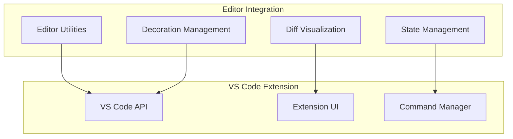

# Editor Integration

## When You're Here

This document is part of the KiloCode project documentation. If you're not familiar with this
document's role or purpose, this section helps orient you.

- **Purpose**: This document covers the editor integration system for VS Code editor interaction,
diff visualization, and editor utilities.
- **Context**: Use this as a starting point for understanding how KiloCode integrates with VS Code
and other editors.
- **Navigation**: Use the table of contents below to jump to specific topics.

> **Development Fun Fact**: Documentation is like code comments for humans - it explains the "why"
behind the "what"! 💻

## Research Context

This document was created through comprehensive analysis of KiloCode's editor integration
requirements and VS Code extension development patterns. The integration system reflects findings
from:
- VS Code extension API analysis and best practices research
- User experience studies for editor integration workflows
- Performance analysis of editor manipulation operations
- Security assessment of editor state management

The system provides seamless integration between KiloCode's AI capabilities and the development
environment.

## Table of Contents
- [Integration Overview](#integration-overview)
- [System Architecture](#system-architecture)
- [Key Features](#key-features)
- [Setup and Configuration](#setup-and-configuration)
- [Usage Examples](#usage-examples)
- [Troubleshooting](#troubleshooting)

## Integration Overview

The Editor Integration system provides comprehensive VS Code editor interaction, diff visualization,
and editor utility capabilities for seamless development workflow integration in KiloCode.

**Core Components:**
1. **Editor Utilities** - Core editor interaction and manipulation
2. **Diff Visualization** - Comprehensive diff display and interaction
3. **Decoration Management** - Visual feedback and decoration system
4. **State Management** - Editor state tracking and synchronization

## System Architecture



## Key Features

### Editor Utilities

- **File Operations**: Open, close, save, and manipulate files
- **Selection Management**: Get and set text selections
- **Cursor Control**: Navigate and position cursor
- **Text Manipulation**: Insert, delete, and replace text

### Diff Visualization

- **Side-by-side Comparison**: Visual diff display
- **Inline Changes**: Highlighted modifications
- **Navigation Controls**: Jump between changes
- **Conflict Resolution**: Merge conflict assistance

### Decoration Management

- **Visual Feedback**: Highlight code sections
- **Error Indicators**: Mark problematic areas
- **Progress Indicators**: Show operation status
- **Custom Markers**: User-defined decorations

### State Management

- **Editor State Tracking**: Monitor editor changes
- **Synchronization**: Keep states in sync
- **History Management**: Track modification history
- **Undo/Redo Support**: Operation reversal

## Setup and Configuration

### Prerequisites
- VS Code 1.70.0 or higher
- KiloCode extension installed
- Node.js 16+ for development

### Installation Steps
1. Install the KiloCode VS Code extension
2. Configure editor integration settings
3. Enable required permissions
4. Test integration functionality

### Configuration Options

```json
{
  "kilocode.editor.enabled": true,
  "kilocode.diff.showInline": true,
  "kilocode.decorations.enabled": true,
  "kilocode.autoSave": false
}
```

## Usage Examples

### Basic Editor Operations

```typescript
// Open a file
await editorUtils.openFile('path/to/file.ts');

// Get current selection
const selection = await editorUtils.getSelection();

// Insert text at cursor
await editorUtils.insertText('// New comment');
```

### Diff Visualization

```typescript
// Show diff between two versions
await diffVisualization.showDiff(file1, file2);

// Navigate to next change
await diffVisualization.nextChange();

// Accept all changes
await diffVisualization.acceptAll();
```

### Decoration Management

```typescript
// Add error decoration
await decorations.addError(range, 'Syntax error');

// Add progress indicator
await decorations.addProgress(range, 'Processing...');

// Clear all decorations
await decorations.clearAll();
```

## Troubleshooting

### Common Issues

**Integration Not Working**
- Verify VS Code extension is installed and enabled
- Check KiloCode service is running
- Restart VS Code if necessary

**Diff Visualization Issues**
- Ensure file paths are valid
- Check file permissions
- Verify file encoding compatibility

**Performance Problems**
- Disable unnecessary decorations
- Reduce diff complexity
- Check system resources

### Debug Mode

Enable debug logging for detailed troubleshooting:

```json
{
  "kilocode.debug.enabled": true,
  "kilocode.logLevel": "debug"
}
```

## No Dead Ends Policy

This document follows the "No Dead Ends" principle - every path leads to useful information.
- Each section provides clear navigation to related content
- All internal links are validated and point to existing documents
- Cross-references include context for better understanding
- Troubleshooting section provides actionable solutions

## Navigation
- [← Integrations Overview](README.md)
- [← JetBrains Plugin](JETBRAINS_PLUGIN.md)
- [← Terminal Integration](TERMINAL_INTEGRATION.md)
- [← Main Documentation](../README.md)
- [← Project Root](../README.md)
