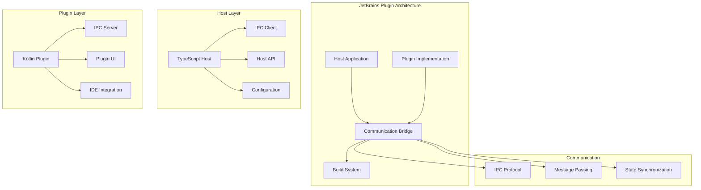

# JetBrains Plugin

**Purpose:** Documentation of the JetBrains IDE plugin architecture and host-plugin communication system in the KiloCode ecosystem.

<details><summary>Table of Contents</summary>

- [Executive Summary](#executive-summary)
- [Plugin Architecture](#plugin-architecture)
- [Host Application](#host-application)
- [Plugin Implementation](#plugin-implementation)
- [Communication Protocol](#communication-protocol)
- [Development Workflow](#development-workflow)
- [Common Issues and Solutions](#common-issues-and-solutions)
- [Navigation Footer](#navigation-footer)

</details>

## Executive Summary

_The JetBrains Plugin provides KiloCode functionality within JetBrains IDEs through a dual-component architecture consisting of a TypeScript host application and a Kotlin plugin implementation._

The JetBrains Plugin consists of:

1. **Host Application** - TypeScript-based host application
2. **Plugin Implementation** - Kotlin-based JetBrains plugin
3. **Communication Bridge** - IPC communication between host and plugin
4. **Build System** - Plugin packaging and distribution

## Plugin Architecture



## Host Application

### TypeScript Host

**Implementation**: `jetbrains/host/`
**Features**:

- **TypeScript Implementation**: Modern TypeScript codebase
- **IPC Client**: Communication with Kotlin plugin
- **API Layer**: Host-side API implementation
- **Configuration Management**: Plugin configuration handling

**Host Components**:

```typescript
interface HostApplication {
	ipcClient: IPCClient
	api: HostAPI
	config: ConfigurationManager
	lifecycle: LifecycleManager
}
```

**Implementation Status**: 🔍 **PARTIALLY RESEARCHED**
**Research Needed**: Host architecture, IPC implementation, API design

### Host API

**API Features**:

- **Core Functionality**: Core KiloCode functionality exposure
- **IDE Integration**: JetBrains IDE integration points
- **State Management**: Host application state management
- **Error Handling**: Comprehensive error handling

**Implementation Status**: 🔍 **PARTIALLY RESEARCHED**
**Research Needed**: API design patterns, state management, error handling

## Plugin Implementation

### Kotlin Plugin

**Implementation**: `jetbrains/plugin/`
**Features**:

- **Kotlin Implementation**: Native Kotlin plugin code
- **IDE Integration**: Deep JetBrains IDE integration
- **UI Components**: Plugin user interface
- **Service Layer**: Plugin service implementation

**Plugin Components**:

```kotlin
class KiloCodePlugin : Plugin {
    private val ipcServer: IPCServer
    private val uiManager: UIManager
    private val serviceManager: ServiceManager
}
```

**Implementation Status**: 🔍 **PARTIALLY RESEARCHED**
**Research Needed**: Plugin architecture, IDE integration, service implementation

### Plugin UI

**UI Components**:

- **Tool Windows**: Plugin tool windows and panels
- **Action Handlers**: IDE action integration
- **Settings UI**: Plugin configuration interface
- **Status Indicators**: Plugin status and progress indicators

**Implementation Status**: 🔍 **PARTIALLY RESEARCHED**
**Research Needed**: UI architecture, action handling, settings management

## Communication Protocol

### IPC Implementation

**Communication Features**:

- **Message Passing**: Bidirectional message passing
- **State Synchronization**: Host-plugin state synchronization
- **Error Propagation**: Error handling and propagation
- **Performance Optimization**: Efficient communication patterns

**Protocol Design**:

```typescript
interface IPCProtocol {
	send: (message: Message) => Promise<Response>
	receive: (handler: MessageHandler) => void
	disconnect: () => void
}
```

**Implementation Status**: 🔍 **PARTIALLY RESEARCHED**
**Research Needed**: Protocol design, message formats, synchronization patterns

### Message Types

**Message Categories**:

- **Command Messages**: Plugin command execution
- **State Messages**: State synchronization messages
- **Event Messages**: Event notification messages
- **Response Messages**: Command response messages

**Implementation Status**: 🔍 **PARTIALLY RESEARCHED**
**Research Needed**: Message type design, serialization, error handling

## Development Workflow

### Build System

**Build Components**:

- **TypeScript Compilation**: Host application compilation
- **Kotlin Compilation**: Plugin compilation
- **Plugin Packaging**: Plugin distribution packaging
- **Testing**: Automated testing and validation

**Build Configuration**:

```json
{
	"host": {
		"build": "TypeScript compilation",
		"test": "Host application testing"
	},
	"plugin": {
		"build": "Kotlin compilation",
		"package": "Plugin packaging"
	}
}
```

**Implementation Status**: 🔍 **PARTIALLY RESEARCHED**
**Research Needed**: Build configuration, packaging, testing strategies

### Development Tools

**Development Features**:

- **Hot Reload**: Development-time hot reloading
- **Debugging**: Debugging support for both components
- **Testing**: Unit and integration testing
- **Documentation**: Development documentation

**Implementation Status**: 🔍 **PARTIALLY RESEARCHED**
**Research Needed**: Development tools, debugging setup, testing framework

## Common Issues and Solutions

### Issue 1: Communication Failures

**Symptoms**:

- Host-plugin communication failures
- Message delivery failures
- State synchronization issues

**Root Cause**: IPC protocol or implementation issues
**Solution**: Implement robust error handling and retry mechanisms

### Issue 2: IDE Integration Issues

**Symptoms**:

- Plugin not loading in IDE
- UI components not displaying
- Action handlers not working

**Root Cause**: IDE integration or plugin configuration issues
**Solution**: Improve plugin configuration and IDE integration

### Issue 3: Performance Issues

**Symptoms**:

- Slow plugin performance
- High resource usage
- UI responsiveness issues

**Root Cause**: Inefficient implementation or resource management
**Solution**: Optimize performance and implement proper resource management

### Issue 4: Build and Deployment Issues

**Symptoms**:

- Build failures
- Plugin packaging errors
- Distribution issues

**Root Cause**: Build configuration or packaging issues
**Solution**: Fix build configuration and improve packaging process

<a id="navigation-footer"></a>

- Back: [`SYSTEM_OVERVIEW.md`](../architecture/SYSTEM_OVERVIEW.md) · Root: [`INDEX.md`](../INDEX.md) · Source: `/docs/integrations/JETBRAINS_PLUGIN.md#L1`
