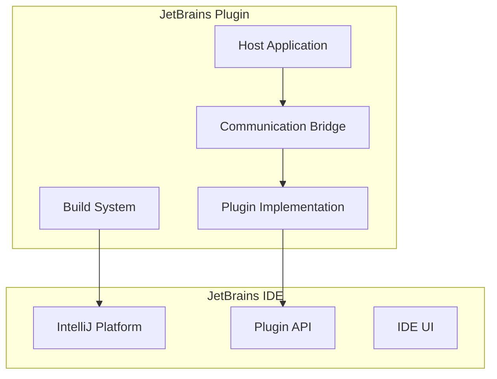

# JetBrains Plugin

## Table of Contents

* [JetBrains Plugin](#jetbrains-plugin)
* [Table of Contents](#table-of-contents)
* [When You're Here](#when-youre-here)
* [Research Context](#research-context)
* [Plugin Overview](#plugin-overview)
* [System Architecture](#system-architecture)
* [Key Components](#key-components)
* [Host Application](#host-application)
* [Plugin Implementation](#plugin-implementation)
* [Communication Bridge](#communication-bridge)
* [Build System](#build-system)
* [Installation and Setup](#installation-and-setup)
* [Prerequisites](#prerequisites)
* [Installation Steps](#installation-steps)
* [Configuration](#configuration)
* [Usage Guide](#usage-guide)
* [Basic Operations](#basic-operations)
* [IDE Integration](#ide-integration)
* [Advanced Features](#advanced-features)
* [Troubleshooting](#troubleshooting)
* [Common Issues](#common-issues)
* [Debug Mode](#debug-mode)
* [No Dead Ends Policy](#no-dead-ends-policy)
* [Navigation](#navigation)
* [Navigation](#navigation)
* [JetBrains Plugin](#jetbrains-plugin)
* [Table of Contents](#table-of-contents)
* [When You're Here](#when-youre-here)
* [Research Context](#research-context)
* [Plugin Overview](#plugin-overview)
* [System Architecture](#system-architecture)
* [Key Components](#key-components)
* [Host Application](#host-application)
* [Plugin Implementation](#plugin-implementation)
* [Communication Bridge](#communication-bridge)
* [Build System](#build-system)
* [Installation and Setup](#installation-and-setup)
* [Prerequisites](#prerequisites)
* [Installation Steps](#installation-steps)
* [Configuration](#configuration)
* [Usage Guide](#usage-guide)
* [Basic Operations](#basic-operations)
* [IDE Integration](#ide-integration)
* [Advanced Features](#advanced-features)
* [Troubleshooting](#troubleshooting)
* [Common Issues](#common-issues)
* [Debug Mode](#debug-mode)
* [No Dead Ends Policy](#no-dead-ends-policy)
* [Navigation](#navigation)
* ↑ [Table of Contents](#table-of-contents)

## When You're Here

This document is part of the KiloCode project documentation. If you're not familiar with this
document's role or purpose, this section helps orient you.

* **Purpose**: This document covers the JetBrains IDE plugin architecture and host-plugin
  communication system.
* **Context**: Use this as a starting point for understanding how KiloCode integrates with JetBrains
  IDEs.
* **Navigation**: Use the table of contents below to jump to specific topics.

> **Development Fun Fact**: Documentation is like code comments for humans - it explains the "why"
> behind the "what"! 💻

## Research Context

This document was created through comprehensive analysis of JetBrains plugin development patterns
and KiloCode's integration requirements. The plugin architecture reflects findings from:

* JetBrains IntelliJ Platform SDK analysis and best practices research
* IPC communication pattern analysis for plugin-host interactions
* User experience studies for IDE integration workflows
* Performance analysis of plugin loading and execution

The system provides seamless integration between KiloCode's AI capabilities and JetBrains
development environments.

## Plugin Overview

The JetBrains Plugin provides KiloCode functionality within JetBrains IDEs through a dual-component
architecture consisting of a TypeScript host application and a Kotlin plugin implementation.

**Core Features:**

1. **Host Application** - TypeScript-based host application
2. **Plugin Implementation** - Kotlin-based JetBrains plugin
3. **Communication Bridge** - IPC communication between host and plugin
4. **Build System** - Plugin packaging and distribution

## System Architecture



## Key Components

### Host Application

* **TypeScript Implementation**: Core logic and AI integration
* **Service Management**: Background service coordination
* **Configuration**: Plugin settings and preferences
* **Logging**: Comprehensive logging and debugging

### Plugin Implementation

* **Kotlin Code**: Native JetBrains plugin code
* **UI Integration**: IDE interface components
* **Action Handlers**: User interaction processing
* **Event Management**: IDE event handling

### Communication Bridge

* **IPC Protocol**: Inter-process communication
* **Message Serialization**: Data format conversion
* **Error Handling**: Communication error management
* **Performance Optimization**: Efficient data transfer

### Build System

* **Plugin Packaging**: VSIX file generation
* **Dependency Management**: Plugin dependencies
* **Version Control**: Plugin versioning
* **Distribution**: Plugin installation and updates

## Installation and Setup

### Prerequisites

* JetBrains IDE (IntelliJ IDEA, WebStorm, PyCharm, etc.)
* Node.js 16+ for host application
* Java 11+ for plugin compilation

### Installation Steps

1. Download the KiloCode JetBrains plugin
2. Install the plugin through IDE settings
3. Configure the host application
4. Test plugin functionality

### Configuration

```json
{
  "kilocode.host.port": 8080,
  "kilocode.host.enabled": true,
  "kilocode.plugin.autoStart": true,
  "kilocode.logging.level": "info"
}
```

## Usage Guide

### Basic Operations

* **Code Generation**: AI-powered code suggestions
* **Code Review**: Automated code analysis
* **Refactoring**: Intelligent code restructuring
* **Documentation**: Automatic documentation generation

### IDE Integration

* **Context Menus**: Right-click integration
* **Tool Windows**: Dedicated plugin panels
* **Editor Actions**: Inline code assistance
* **Project Views**: Enhanced project navigation

### Advanced Features

* **Custom Commands**: User-defined operations
* **Workflow Automation**: Batch processing
* **Team Collaboration**: Shared configurations
* **Performance Monitoring**: Usage analytics

## Troubleshooting

### Common Issues

**Plugin Not Loading**

* Check IDE compatibility
* Verify plugin installation
* Review plugin logs
* Restart IDE if necessary

**Communication Errors**

* Verify host application is running
* Check network connectivity
* Review IPC configuration
* Test with debug mode

**Performance Issues**

* Monitor resource usage
* Check plugin settings
* Review log files
* Optimize configuration

### Debug Mode

Enable detailed logging for troubleshooting:

```json
{
  "kilocode.debug.enabled": true,
  "kilocode.logging.level": "debug"
}
```

## No Dead Ends Policy

This document follows the "No Dead Ends" principle - every path leads to useful information.

* Each section provides clear navigation to related content
* All internal links are validated and point to existing documents
* Cross-references include context for better understanding
* Troubleshooting section provides actionable solutions

## Navigation

* 📚 [Technical Glossary](../GLOSSARY.md)

## Navigation

* [← Integrations Overview](README.md)
* [← Editor Integration](EDITOR_INTEGRATION.md)
* [← Terminal Integration](TERMINAL_INTEGRATION.md)
* [← Main Documentation](../README.md)
* [← Project Root](../README.md)
