# Terminal Integration

**Purpose:** Comprehensive documentation of the terminal integration system for command execution, shell integration, and terminal management in KiloCode.

<details><summary>Table of Contents</summary>

- [Executive Summary](#executive-summary)
- [System Architecture](#system-architecture)
- [Terminal Management](#terminal-management)
- [Shell Integration](#shell-integration)
- [Command Execution](#command-execution)
- [Performance & Optimization](#performance--optimization)
- [Common Issues and Solutions](#common-issues-and-solutions)
- [Navigation Footer](#navigation-footer)

</details>

## Executive Summary

_The Terminal Integration system provides comprehensive terminal management, command execution, and shell integration capabilities for seamless development workflow integration in KiloCode._

The Terminal Integration consists of:

1. **Terminal Management** - Terminal lifecycle and process management
2. **Shell Integration** - Shell-specific integration and optimization
3. **Command Execution** - Safe and efficient command execution
4. **Process Management** - Process monitoring and control
5. **Stream Processing** - Terminal output and input stream handling

## System Architecture

```mermaid
graph TB
    subgraph "Terminal Integration Architecture"
        TM[Terminal Management]
        SI[Shell Integration]
        CE[Command Execution]
        PM[Process Management]
    end

    subgraph "Terminal Layer"
        BT[Base Terminal]
        ET[Execa Terminal]
        TR[Terminal Registry]
        TS[Terminal States]
    end

    subgraph "Shell Layer"
        BASH[Bash Integration]
        CMD[CMD Integration]
        PWSH[PowerShell Integration]
        SH[Shell Utils]
    end

    subgraph "Process Layer"
        BP[Base Process]
        EP[Execa Process]
        SM[Stream Management]
        PM[Process Monitoring]
    end

    TM --> BT
    TM --> ET
    TM --> TR
    TM --> TS

    SI --> BASH
    SI --> CMD
    SI --> PWSH
    SI --> SH

    CE --> BP
    CE --> EP
    CE --> SM
    CE --> PM
```



## Terminal Management

### Terminal Registry

**Implementation**: `src/integrations/terminal/TerminalRegistry.ts`
**Features**:

- **Terminal Lifecycle**: Complete terminal lifecycle management
- **Process Tracking**: Active process monitoring and tracking
- **Resource Management**: Terminal resource allocation and cleanup
- **State Management**: Terminal state tracking and synchronization

**Registry Interface**:

```typescript
interface TerminalRegistry {
	createTerminal: (options: TerminalOptions) => Terminal
	getTerminal: (id: string) => Terminal | undefined
	destroyTerminal: (id: string) => void
	listTerminals: () => Terminal[]
}
```

**Implementation Status**: ✅ **RESEARCHED AND DOCUMENTED**
**Key Features**:

- **Lifecycle Management**: Complete terminal lifecycle control
- **Process Tracking**: Comprehensive process monitoring
- **Resource Management**: Efficient resource allocation
- **State Synchronization**: Terminal state management

### Base Terminal

**Implementation**: `src/integrations/terminal/BaseTerminal.ts`
**Features**:

- **Terminal Interface**: Standardized terminal interface
- **Event Handling**: Terminal event processing and handling
- **State Management**: Terminal state tracking and management
- **Error Handling**: Comprehensive error handling and recovery

**Terminal Interface**:

```typescript
interface BaseTerminal {
	id: string
	process: TerminalProcess
	state: TerminalState
	execute: (command: string) => Promise<CommandResult>
	destroy: () => Promise<void>
}
```

**Implementation Status**: ✅ **RESEARCHED AND DOCUMENTED**
**Key Features**:

- **Standardized Interface**: Consistent terminal interface
- **Event Processing**: Comprehensive event handling
- **State Management**: Terminal state tracking
- **Error Recovery**: Robust error handling

## Shell Integration

### Shell Integration Manager

**Implementation**: `src/integrations/terminal/ShellIntegrationManager.ts`
**Features**:

- **Shell Detection**: Automatic shell detection and configuration
- **Integration Setup**: Shell integration configuration and setup
- **Environment Management**: Shell environment configuration
- **Fallback Handling**: Graceful fallback for unsupported shells

**Shell Support**:

```typescript
interface ShellIntegration {
	shell: "bash" | "cmd" | "powershell" | "pwsh"
	setup: () => Promise<SetupResult>
	execute: (command: string) => Promise<CommandResult>
	cleanup: () => Promise<void>
}
```

**Implementation Status**: ✅ **RESEARCHED AND DOCUMENTED**
**Key Features**:

- **Multi-shell Support**: Support for multiple shell types
- **Automatic Detection**: Intelligent shell detection
- **Integration Setup**: Seamless shell integration
- **Fallback Support**: Graceful fallback handling

### Shell-specific Implementations

**Shell Types**:

- **Bash**: Unix/Linux bash shell integration
- **CMD**: Windows Command Prompt integration
- **PowerShell**: Windows PowerShell integration
- **PowerShell Core**: Cross-platform PowerShell integration

**Shell Features**:

```typescript
interface ShellFeatures {
	supportsColors: boolean
	supportsUnicode: boolean
	supportsHistory: boolean
	supportsAliases: boolean
	maxCommandLength: number
}
```

**Implementation Status**: ✅ **RESEARCHED AND DOCUMENTED**
**Key Features**:

- **Platform Support**: Cross-platform shell support
- **Feature Detection**: Shell capability detection
- **Optimization**: Shell-specific optimizations
- **Compatibility**: Backward compatibility support

## Command Execution

### Command Execution Engine

**Implementation**: `src/integrations/terminal/ExecaTerminal.ts`
**Features**:

- **Safe Execution**: Secure command execution with validation
- **Timeout Management**: Command timeout and cancellation
- **Output Processing**: Command output capture and processing
- **Error Handling**: Comprehensive error handling and reporting

**Execution Interface**:

```typescript
interface CommandExecutor {
	execute: (command: string, options: ExecutionOptions) => Promise<ExecutionResult>
	validate: (command: string) => ValidationResult
	cancel: (processId: string) => Promise<void>
}
```

**Implementation Status**: ✅ **RESEARCHED AND DOCUMENTED**
**Key Features**:

- **Secure Execution**: Safe command execution with validation
- **Timeout Control**: Command timeout and cancellation
- **Output Capture**: Complete output capture and processing
- **Error Management**: Comprehensive error handling

### Process Management

**Process Features**:

- **Process Lifecycle**: Complete process lifecycle management
- **Stream Handling**: Input/output stream management
- **Signal Handling**: Process signal handling and control
- **Resource Monitoring**: Process resource usage monitoring

**Process Interface**:

```typescript
interface TerminalProcess {
	id: string
	command: string
	status: ProcessStatus
	streams: ProcessStreams
	kill: () => Promise<void>
	wait: () => Promise<ProcessResult>
}
```

**Implementation Status**: ✅ **RESEARCHED AND DOCUMENTED**
**Key Features**:

- **Lifecycle Management**: Complete process lifecycle control
- **Stream Processing**: Efficient stream handling
- **Signal Control**: Process signal management
- **Resource Tracking**: Process resource monitoring

## Performance & Optimization

### Stream Processing

**Stream Features**:

- **Real-time Processing**: Real-time stream processing and handling
- **Buffer Management**: Efficient buffer management and optimization
- **Memory Optimization**: Memory-efficient stream processing
- **Performance Monitoring**: Stream performance monitoring and optimization

**Stream Processing**:

```typescript
interface StreamProcessor {
	process: (stream: ReadableStream) => Promise<ProcessedStream>
	buffer: (data: Buffer) => void
	flush: () => Promise<FlushResult>
	optimize: () => void
}
```

**Implementation Status**: ✅ **RESEARCHED AND DOCUMENTED**
**Key Features**:

- **Real-time Processing**: Live stream processing
- **Buffer Optimization**: Efficient buffer management
- **Memory Efficiency**: Optimized memory usage
- **Performance Tracking**: Stream performance monitoring

### Resource Management

**Resource Optimization**:

- **Memory Management**: Efficient memory usage and cleanup
- **Process Pooling**: Process pool management and reuse
- **Connection Pooling**: Terminal connection pooling
- **Garbage Collection**: Optimized garbage collection patterns

**Implementation Status**: ✅ **RESEARCHED AND DOCUMENTED**
**Key Features**:

- **Resource Efficiency**: Optimized resource utilization
- **Pool Management**: Efficient resource pooling
- **Cleanup**: Automatic resource cleanup
- **Performance**: Optimized resource performance

## Common Issues and Solutions

### Issue 1: Terminal Process Failures

**Symptoms**:

- Process execution failures
- Terminal crashes
- Command timeouts

**Root Cause**: Process management or shell integration issues
**Solution**: Implement robust process management and error recovery

### Issue 2: Shell Integration Problems

**Symptoms**:

- Shell detection failures
- Integration setup errors
- Command execution issues

**Root Cause**: Shell-specific integration or configuration issues
**Solution**: Improve shell detection and integration setup

### Issue 3: Stream Processing Issues

**Symptoms**:

- Output truncation
- Stream processing errors
- Memory leaks

**Root Cause**: Stream handling or buffer management issues
**Solution**: Implement robust stream processing and memory management

### Issue 4: Performance Problems

**Symptoms**:

- Slow command execution
- High memory usage
- Terminal lag

**Root Cause**: Inefficient processing or resource management
**Solution**: Optimize processing algorithms and resource utilization

<a id="navigation-footer"></a>

- Back: [`SYSTEM_OVERVIEW.md`](../architecture/SYSTEM_OVERVIEW.md) · Root: [`INDEX.md`](../INDEX.md) · Source: `/docs/integrations/TERMINAL_INTEGRATION.md#L1`
