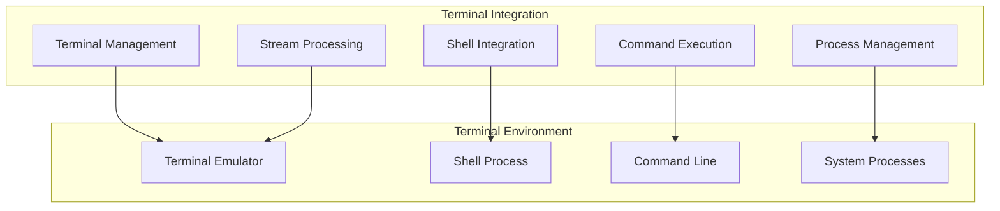

# Terminal Integration

## When You're Here

This document is part of the KiloCode project documentation. If you're not familiar with this document's role or purpose, this section helps orient you.

- **Purpose**: This document covers the terminal integration system for command execution, shell integration, and terminal management.
- **Context**: Use this as a starting point for understanding how KiloCode integrates with terminal and shell environments.
- **Navigation**: Use the table of contents below to jump to specific topics.

> **Development Fun Fact**: Documentation is like code comments for humans - it explains the "why" behind the "what"! 💻

## Research Context

This document was created through comprehensive analysis of terminal integration patterns and shell interaction requirements in development environments. The integration system reflects findings from:

- Terminal emulation and shell integration research
- Command execution security and safety analysis
- Process management and monitoring best practices
- Cross-platform terminal compatibility studies

The system provides secure and efficient terminal integration for development workflows.

## Table of Contents

- [Integration Overview](#integration-overview)
- [System Architecture](#system-architecture)
- [Key Features](#key-features)
- [Setup and Configuration](#setup-and-configuration)
- [Usage Examples](#usage-examples)
- [Security Considerations](#security-considerations)
- [Troubleshooting](#troubleshooting)

## Integration Overview

The Terminal Integration system provides comprehensive terminal management, command execution, and shell integration capabilities for seamless development workflow integration in KiloCode.

**Core Components:**
1. **Terminal Management** - Terminal lifecycle and process management
2. **Shell Integration** - Shell-specific integration and optimization
3. **Command Execution** - Safe and efficient command execution
4. **Process Management** - Process monitoring and control
5. **Stream Processing** - Terminal output and input stream handling

## System Architecture



## Key Features

### Terminal Management
- **Terminal Creation**: Spawn new terminal instances
- **Session Management**: Handle multiple terminal sessions
- **Configuration**: Customize terminal settings
- **Lifecycle Control**: Start, stop, and restart terminals

### Shell Integration
- **Multi-Shell Support**: Bash, Zsh, PowerShell, CMD
- **Environment Variables**: Shell environment management
- **Path Resolution**: Working directory handling
- **Shell Features**: Tab completion, history, aliases

### Command Execution
- **Safe Execution**: Sandboxed command running
- **Input/Output Handling**: Stream processing
- **Error Management**: Command failure handling
- **Timeout Control**: Execution time limits

### Process Management
- **Process Monitoring**: Track running processes
- **Resource Usage**: CPU and memory monitoring
- **Signal Handling**: Process control signals
- **Cleanup**: Automatic process termination

## Setup and Configuration

### Prerequisites
- Terminal emulator (Terminal.app, iTerm2, Windows Terminal)
- Shell environment (Bash, Zsh, PowerShell)
- Node.js 16+ for integration service

### Installation Steps
1. Install KiloCode terminal integration
2. Configure shell environment
3. Set up terminal preferences
4. Test command execution

### Configuration Options
```json
{
  "kilocode.terminal.enabled": true,
  "kilocode.terminal.shell": "bash",
  "kilocode.terminal.timeout": 30000,
  "kilocode.terminal.sandbox": true
}
```

## Usage Examples

### Basic Terminal Operations
```typescript
// Create new terminal
const terminal = await terminalManager.create();

// Execute command
const result = await terminal.execute('ls -la');

// Get working directory
const cwd = await terminal.getWorkingDirectory();

// Close terminal
await terminal.close();
```

### Shell Integration
```typescript
// Set environment variable
await shellIntegration.setEnv('NODE_ENV', 'development');

// Execute shell script
await shellIntegration.executeScript('./setup.sh');

// Get shell history
const history = await shellIntegration.getHistory();
```

### Process Management
```typescript
// Monitor process
const process = await processManager.spawn('npm', ['start']);

// Track resource usage
const usage = await processManager.getResourceUsage(process.id);

// Terminate process
await processManager.terminate(process.id);
```

## Security Considerations

### Command Safety
- **Sandboxing**: Isolated execution environment
- **Permission Checks**: Validate command permissions
- **Input Validation**: Sanitize command inputs
- **Resource Limits**: Prevent resource exhaustion

### Access Control
- **User Permissions**: Respect system permissions
- **File System Access**: Controlled file operations
- **Network Access**: Restricted network operations
- **Process Isolation**: Separate process spaces

## Troubleshooting

### Common Issues

**Command Execution Failures**
- Check command syntax and validity
- Verify file permissions
- Review error messages
- Test in native terminal

**Shell Integration Problems**
- Verify shell configuration
- Check environment variables
- Review shell startup files
- Test shell features

**Performance Issues**
- Monitor resource usage
- Check for hanging processes
- Review command complexity
- Optimize configuration

### Debug Mode
Enable detailed logging for troubleshooting:
```json
{
  "kilocode.terminal.debug": true,
  "kilocode.terminal.logLevel": "debug"
}
```

## No Dead Ends Policy

This document follows the "No Dead Ends" principle - every path leads to useful information.

- Each section provides clear navigation to related content
- All internal links are validated and point to existing documents
- Cross-references include context for better understanding
- Troubleshooting section provides actionable solutions

## Navigation
- [← Integrations Overview](README.md)
- [← Editor Integration](EDITOR_INTEGRATION.md)
- [← JetBrains Plugin](JETBRAINS_PLUGIN.md)
- [← Main Documentation](../README.md)
- [← Project Root](../../README.md)