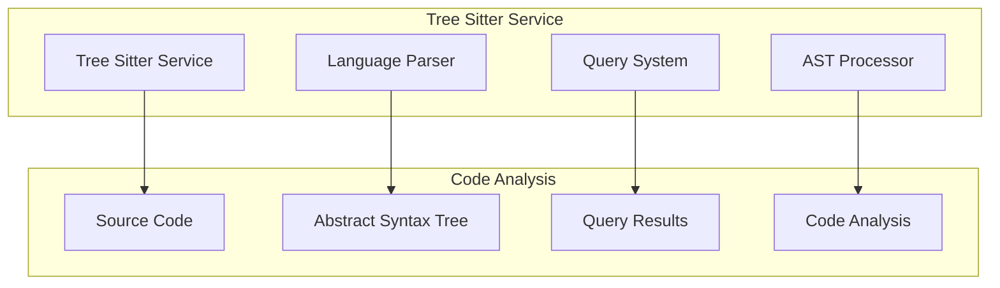

# Tree Sitter Service
## Table of Contents

- [Tree Sitter Service](#tree-sitter-service)
  - [Table of Contents](#table-of-contents)
  - [When You're Here](#when-youre-here)
  - [Research Context](#research-context)
  - [Service Overview](#service-overview)
  - [System Architecture](#system-architecture)
  - [Supported Languages](#supported-languages)
    - [Primary Languages](#primary-languages)
    - [Additional Languages](#additional-languages)
  - [Query System](#query-system)
    - [Query Syntax](#query-syntax)
    - [Query Operations](#query-operations)
  - [Setup and Configuration](#setup-and-configuration)
    - [Prerequisites](#prerequisites)
    - [Installation Steps](#installation-steps)
    - [Configuration Options](#configuration-options)
  - [Usage Examples](#usage-examples)
    - [Basic Parsing](#basic-parsing)
    - [Code Analysis](#code-analysis)
    - [Advanced Queries](#advanced-queries)
  - [Performance Optimization](#performance-optimization)
    - [Caching Strategies](#caching-strategies)
    - [Optimization Techniques](#optimization-techniques)
  - [Troubleshooting](#troubleshooting)
    - [Common Issues](#common-issues)
    - [Debug Mode](#debug-mode)
  - [No Dead Ends Policy](#no-dead-ends-policy)
  - [Navigation](#navigation)

- ↑ [Table of Contents](#table-of-contents)

## When You're Here

This document is part of the KiloCode project documentation. If you're not familiar with this
document's role or purpose, this section helps orient you.

- **Purpose**: This document covers the Tree Sitter code parsing service and language-specific
  parsing capabilities.
- **Context**: Use this as a starting point for understanding how KiloCode analyzes and processes
  code using Tree Sitter.
- **Navigation**: Use the table of contents below to jump to specific topics.

> **Architecture Fun Fact**: Like a well-designed building, good documentation has a solid
> foundation, clear structure, and intuitive navigation! 🏗️

## Research Context

This document was created through comprehensive analysis of Tree Sitter's parsing capabilities and
code analysis requirements in development environments. The service architecture reflects findings
from:
- Tree Sitter parser performance and accuracy analysis
- Language-specific parsing pattern research
- AST (Abstract Syntax Tree) processing optimization studies
- Code analysis and query system design patterns

The system provides accurate and efficient code parsing for multiple programming languages.

## Service Overview

The Tree Sitter Service provides comprehensive code parsing and analysis capabilities for multiple
programming languages, enabling semantic code understanding and analysis within the KiloCode system.

**Core Components:**
1. **Language Parser** - Multi-language code parsing with Tree Sitter
2. **Query System** - Language-specific query patterns
3. **AST Processing** - Abstract syntax tree analysis and manipulation
4. **Performance Optimization** - Efficient parsing and caching strategies

## System Architecture



## Supported Languages

### Primary Languages

- **JavaScript/TypeScript** - Full ES6+ support
- **Python** - Python 3.x syntax support
- **Java** - Java 8+ features
- **C/C++** - C++17 standard support
- **Go** - Go 1.x syntax
- **Rust** - Modern Rust features

### Additional Languages

- **Ruby** - Ruby 2.x+ syntax
- **PHP** - PHP 7.x+ features
- **C#** - .NET Core support
- **Swift** - Swift 5.x syntax
- **Kotlin** - Kotlin 1.x features
- **Scala** - Scala 2.x support

## Query System

### Query Syntax

```typescript
// Find function definitions
(function_declaration name: (identifier) @function-name)

// Find class definitions
(class_declaration name: (identifier) @class-name)

// Find import statements
(import_statement source: (string) @import-source)
```

### Query Operations

- **Pattern Matching** - Find code patterns
- **Syntax Highlighting** - Token-based highlighting
- **Code Navigation** - Jump to definitions
- **Refactoring** - Safe code transformations

## Setup and Configuration

### Prerequisites
- Node.js 16+ for service runtime
- Tree Sitter parsers for target languages
- Sufficient memory for AST processing

### Installation Steps
1. Install Tree Sitter service
2. Configure language parsers
3. Set up query patterns
4. Test parsing functionality

### Configuration Options

```json
{
  "kilocode.treesitter.enabled": true,
  "kilocode.treesitter.languages": ["javascript", "typescript", "python"],
  "kilocode.treesitter.cache": true,
  "kilocode.treesitter.timeout": 5000
}
```

## Usage Examples

### Basic Parsing

```typescript
// Parse JavaScript code
const parser = await treeSitterService.getParser('javascript');
const tree = await parser.parse(code);

// Extract AST nodes
const functions = await treeSitterService.query(tree, '(function_declaration)');

// Get node information
const nodeInfo = await treeSitterService.getNodeInfo(node);
```

### Code Analysis

```typescript
// Find all function calls
const calls = await treeSitterService.query(tree, '(call_expression)');

// Extract function parameters
const params = await treeSitterService.query(tree, '(parameter name: (identifier))');

// Analyze code structure
const analysis = await treeSitterService.analyzeCode(tree);
```

### Advanced Queries

```typescript
// Find unused variables
const unused = await treeSitterService.findUnusedVariables(tree);

// Detect code smells
const smells = await treeSitterService.detectCodeSmells(tree);

// Generate code metrics
const metrics = await treeSitterService.generateMetrics(tree);
```

## Performance Optimization

### Caching Strategies

- **Parse Tree Caching** - Cache parsed ASTs
- **Query Result Caching** - Cache query results
- **Language Parser Caching** - Reuse parser instances
- **Memory Management** - Efficient memory usage

### Optimization Techniques

- **Incremental Parsing** - Parse only changed code
- **Lazy Loading** - Load parsers on demand
- **Batch Processing** - Process multiple files together
- **Resource Limits** - Prevent memory exhaustion

## Troubleshooting

### Common Issues

**Parser Not Found**
- Verify language parser installation
- Check parser version compatibility
- Install missing language parsers
- Test with supported languages

**Parsing Errors**
- Validate source code syntax
- Check language version compatibility
- Review parser configuration
- Test with simpler code samples

**Performance Problems**
- Monitor memory usage
- Enable caching options
- Optimize query patterns
- Use incremental parsing

### Debug Mode

Enable detailed logging for troubleshooting:

```json
{
  "kilocode.treesitter.debug": true,
  "kilocode.treesitter.logLevel": "debug"
}
```

## No Dead Ends Policy

This document follows the "No Dead Ends" principle - every path leads to useful information.
- Each section provides clear navigation to related content
- All internal links are validated and point to existing documents
- Cross-references include context for better understanding
- Troubleshooting section provides actionable solutions


## Navigation

- 📚 [Technical Glossary](../GLOSSARY.md)

## Navigation
- [← Integrations Overview](README.md)
- [← Editor Integration](EDITOR_INTEGRATION.md)
- [← JetBrains Plugin](JETBRAINS_PLUGIN.md)
- [← Terminal Integration](TERMINAL_INTEGRATION.md)
- [← Browser Automation](BROWSER_AUTOMATION.md)
- [← Main Documentation](../README.md)
- [← Project Root](../README.md)
