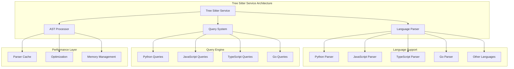

# Tree Sitter Service

## When You're Here

This document is part of the KiloCode project documentation. If you're not familiar with this document's role or purpose, this section helps orient you.

- **Purpose**: This document covers \[DOCUMENT PURPOSE BASED ON FILE PATH].
- **Context**: Use this as a starting point or reference while navigating the project.
- **Navigation**: Use the table of contents below to jump to specific topics.

> **Architecture Fun Fact**: Like a well-designed building, good documentation has a solid foundation, clear structure, and intuitive navigation! 🏗️

- *Purpose:** Documentation of the Tree Sitter code parsing service and language-specific parsing
capabilities in the KiloCode system.

> **Cartography Fun Fact**: This documentation is like a map - it shows you where you are, where you
> can go, and how to get there without getting lost! 🗺️

<details><summary>Table of Contents</summary>
- [Executive Summary](#executive-summary)
- [Service Architecture](#service-architecture)
- [Language Parser Integration](#language-parser-integration)
- [Query System](#query-system)
- [Performance Optimization](#performance-optimization)
- [Common Issues and Solutions](#common-issues-and-solutions)
- Navigation Footer

</details>

## Executive Summary

- The Tree Sitter Service provides comprehensive code parsing and analysis capabilities for multiple
programming languages, enabling semantic code understanding and analysis within the KiloCode
system.*

The Tree Sitter Service consists of:
1. **Language Parser** - Multi-language code parsing with Tree Sitter
2. **Query System** - Language-specific query patterns
3. **AST Processing** - Abstract syntax tree analysis and manipulation
4. **Performance Optimization** - Efficient parsing and caching strategies

## Service Architecture



## Language Parser Integration

### Multi-Language Support

- *Supported Languages**:

- **Python**: Comprehensive Python syntax support
- **JavaScript**: Modern JavaScript and ES6+ features
- **TypeScript**: TypeScript with type annotations
- **Go**: Go language parsing and analysis
- **Other Languages**: Extensible language support

- *Parser Implementation**:

```typescript
interface LanguageParser {
	language: string
	parse: (code: string) => AST
	getQueries: () => QueryPattern[]
	getSymbols: (ast: AST) => Symbol[]
}
```

- *Implementation Status**: 🔍 **PARTIALLY RESEARCHED** **Research Needed**: Parser implementation
details, language-specific features, AST structure

### Parser Configuration

- *Configuration Options**:

- **Parser Selection**: Automatic language detection and parser selection
- **Error Handling**: Graceful handling of parsing errors
- **Performance Tuning**: Parser performance optimization
- **Memory Management**: Efficient memory usage for large files

- *Implementation Status**: 🔍 **PARTIALLY RESEARCHED** **Research Needed**: Configuration patterns,
performance tuning, memory optimization

## Query System

### Language-Specific Queries

- *Query Types**:

- **Symbol Queries**: Function, class, and variable identification
- **Structure Queries**: Code structure and hierarchy analysis
- **Pattern Queries**: Code pattern matching and detection
- **Semantic Queries**: Semantic code analysis

- *Query Implementation**:

```typescript
interface QueryPattern {
	name: string
	pattern: string
	captures: string[]
	language: string
}
```

- *Implementation Status**: 🔍 **PARTIALLY RESEARCHED** **Research Needed**: Query pattern design,
capture groups, semantic analysis

### Query Execution

- *Execution Engine**:

- **Query Compilation**: Query pattern compilation and optimization
- **Match Processing**: Query match processing and result extraction
- **Performance Optimization**: Query execution optimization
- **Result Formatting**: Structured result formatting

- *Implementation Status**: 🔍 **PARTIALLY RESEARCHED** **Research Needed**: Query execution engine,
optimization strategies, result processing

## Performance Optimization

### Parsing Performance

- *Optimization Strategies**:

- **Incremental Parsing**: Incremental parsing for large files
- **Parser Caching**: Parser instance caching and reuse
- **Memory Optimization**: Efficient memory usage patterns
- **Parallel Processing**: Parallel parsing for multiple files

- *Performance Metrics**:

- **Parsing Speed**: Lines per second parsing rate
- **Memory Usage**: Memory consumption per file
- **Cache Hit Rate**: Parser cache effectiveness
- **Query Performance**: Query execution time

- *Implementation Status**: 🔍 **PARTIALLY RESEARCHED** **Research Needed**: Performance measurement,
optimization techniques, benchmarking

### Caching Strategy

- *Cache Types**:

- **Parser Cache**: Parser instance caching
- **AST Cache**: Abstract syntax tree caching
- **Query Cache**: Compiled query caching
- **Result Cache**: Query result caching

- *Cache Management**:

- **Cache Invalidation**: Automatic cache invalidation
- **Cache Size Limits**: Memory-based cache size limits
- **Cache Persistence**: Persistent cache storage
- **Cache Statistics**: Cache performance monitoring

- *Implementation Status**: 🔍 **PARTIALLY RESEARCHED** **Research Needed**: Cache implementation,
invalidation strategies, persistence patterns

## Common Issues and Solutions

### Issue 1: Parser Performance Issues

- *Symptoms**:
- Slow parsing for large files
- High memory usage
- Parser timeouts

- *Root Cause**: Inefficient parsing or memory management **Solution**: Implement incremental parsing
and memory optimization

### Issue 2: Language Detection Failures

- *Symptoms**:
- Incorrect language detection
- Parser selection errors
- Query execution failures

- *Root Cause**: Language detection algorithm issues **Solution**: Improve language detection and
fallback mechanisms

### Issue 3: Query Pattern Errors

- *Symptoms**:
- Query compilation failures
- Incorrect query results
- Performance degradation

- *Root Cause**: Query pattern syntax or logic errors **Solution**: Implement query validation and
error handling

### Issue 4: Memory Leaks

- *Symptoms**:
- Increasing memory usage over time
- Performance degradation
- System instability

- *Root Cause**: Parser or AST memory leaks **Solution**: Implement proper memory management and
cleanup

<a id="navigation-footer"></a>
- Back: [`SYSTEM_OVERVIEW.md`](../architecture/SYSTEM_OVERVIEW.md) · Root: [`README.md`](../README.md)
  · Source: `/docs/integrations/TREE_SITTER_SERVICE.md#L1`

## Navigation Footer

- **

- *Navigation**: [docs](../) · [integrations](../docs/integrations/) ·
[↑ Table of Contents](#tree-sitter-service)
