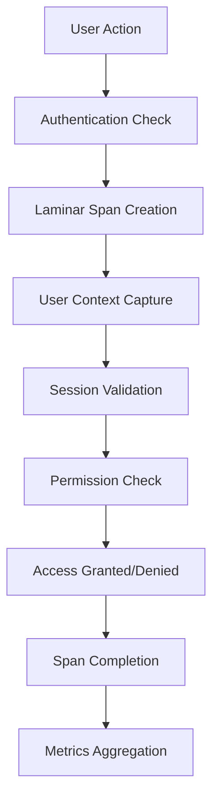

# Laminar Authentication System Integration

## Table of Contents

* [When You're Here](#when-youre-here)
* [Overview](#overview)
* [Architecture](#architecture)
* [User Context Integration](#user-context-integration)
* [Session Tracking](#session-tracking)
* [Privacy Compliance](#privacy-compliance)
* [Authentication Flow Tracing](#authentication-flow-tracing)
* [Integration Points](#integration-points)
* [Error Handling](#error-handling)
* [Code Reference Matrix](#code-reference-matrix)
* [Research Context & Next Steps](#research-context--next-steps)
* [Navigation](#navigation)

## When You're Here

This document provides comprehensive documentation of how Laminar observability integrates with Kilo Code's authentication and user context system, providing detailed tracing for user attribution, session tracking, and privacy-compliant data handling.

* **Purpose**: Authentication system integration with Laminar observability
* **Audience**: Developers implementing authentication features
* **Prerequisites**: Understanding of Laminar observability and authentication systems
* **Related Documents**: [Laminar Documentation](README.md), [Technical Glossary](../GLOSSARY.md)

## Overview

The Laminar Authentication System provides comprehensive observability for user authentication, session management, and privacy-compliant data handling in Kilo Code. This integration enables detailed monitoring of user attribution, session lifecycle, and access control operations.

### Key Integration Points

* **User Attribution**: All traces include user context for proper attribution
* **Session Tracking**: Session lifecycle and state changes are monitored
* **Privacy Compliance**: Data handling respects privacy settings and regulations
* **Authentication Tracing**: Login, logout, and authentication state changes are tracked
* **Access Control**: Permission checks and authorization decisions are logged

## Architecture

### Integration Flow

1. **Context Capture**: When user action occurs, authentication context is captured
2. **Span Creation**: Authentication-related spans are created with user metadata
3. **Session Validation**: Current session state is verified and recorded
4. **Permission Evaluation**: Access control decisions are traced
5. **Privacy Filtering**: Sensitive data is sanitized according to privacy settings
6. **Span Finalization**: Complete authentication trace with outcome

## User Context Integration

### User Attribution

All spans include user context for proper attribution:

- **User ID**: Unique identifier for the user
- **User Type**: Individual user, service account, or anonymous
- **Organization**: User's organization or team affiliation
- **Role**: User's role and permission level
- **Session ID**: Current session identifier
- **Preferences**: User-specific settings and preferences

### Context Propagation

User context flows through all operations:

- **Task Level**: User context associated with task execution
- **Tool Level**: User context included in tool operation traces
- **LLM Level**: User context linked to LLM API calls
- **Checkpoint Level**: User context preserved in state snapshots

## Session Tracking

### Session Lifecycle

Complete session lifecycle is tracked:

- **Session Creation**: Login events and session initialization
- **Session Maintenance**: Keep-alive and session refresh operations
- **Session Termination**: Logout and session expiration events
- **Session State**: Active, idle, expired, or terminated states

### Session Analytics

Detailed session metrics:

- **Session Duration**: Total time from login to logout
- **Activity Patterns**: User activity frequency and timing
- **Session Quality**: Successful vs failed operations ratio
- **Resource Usage**: Session-level resource consumption

## Privacy Compliance

### Data Sanitization

Privacy-compliant data handling:

- **PII Filtering**: Personally identifiable information is masked or removed
- **Anonymized IDs**: User IDs are hashed or anonymized when possible
- **Data Minimization**: Only necessary user data is collected
- **Retention Limits**: User data is retained only as long as necessary
- **Access Controls**: Strict controls on who can access user data

### Compliance Features

Regulatory compliance support:

- **GDPR Compliance**: Data subject rights and processing transparency
- **CCPA Compliance**: California privacy law requirements
- **Audit Trails**: Complete audit logs for compliance verification
- **Data Export**: User data export capabilities for compliance
- **Deletion**: User data deletion on request

## Authentication Flow Tracing

### Login Process

Login operations are comprehensively traced:

- **Authentication Method**: Password, OAuth, SSO, API key, etc.
- **Multi-Factor Authentication**: MFA step tracking and success rates
- **Login Success/Failure**: Authentication outcome with reasons
- **Session Creation**: New session establishment
- **Security Events**: Suspicious login attempts and security alerts

### Authorization Checks

Permission evaluation tracing:

- **Resource Access**: Attempts to access protected resources
- **Permission Evaluation**: Role-based access control decisions
- **Policy Application**: Security policy enforcement and outcomes
- **Access Patterns**: User access patterns and anomaly detection
- **Audit Trail**: Complete record of access decisions

## Integration Points

### Task System Integration

Authentication spans are integrated with task execution:

- Task initiation includes user context
- Task execution respects user permissions
- Task results are attributed to users
- Session context maintained across task lifecycle

### Service Layer Integration

The LaminarService provides authentication utilities:

- User context propagation helpers
- Session state management
- Privacy-compliant data handling
- Authentication event tracking

### External Systems Integration

Integration with external authentication providers:

- OAuth providers (Google, GitHub, etc.)
- SSO systems (SAML, OIDC)
- API key and token management
- Multi-tenant authentication

## Error Handling

### Authentication Errors

Authentication failures are categorized:

- **Credential Errors**: Invalid username/password combinations
- **Session Errors**: Expired or invalid session tokens
- **Permission Errors**: Insufficient privileges for operations
- **Network Errors**: Connectivity issues with auth providers

### Error Context

Comprehensive error information captured:

- **Error Location**: Where in authentication flow the error occurred
- **User Impact**: How the error affects user experience
- **Recovery Actions**: Steps taken to resolve authentication issues
- **Security Implications**: Potential security concerns from errors

## Code Reference Matrix

| Component | File | Key Methods | Laminar Integration |
|-----------|------|-------------|-------------------|
| Task Authentication | [`../../src/core/task/Task.ts`](../../src/core/task/Task.ts) | `authenticateUser()`, `checkPermissions()` | User context in task spans |
| LaminarService Auth | [`../../src/core/message-queue/MessageQueueService.ts`](../../src/core/message-queue/MessageQueueService.ts) | `setUserContext()`, `validateSession()` | Authentication span creation |
| User Manager | [Service Implementation](../../src/core/message-queue/MessageQueueService.ts) | `login()`, `logout()`, `getUserContext()` | User lifecycle tracking |
| Session Manager | [Service Implementation](../../src/core/message-queue/MessageQueueService.ts) | `createSession()`, `validateSession()` | Session state monitoring |
| Privacy Manager | [Service Implementation](../../src/core/message-queue/MessageQueueService.ts) | `anonymizeData()`, `checkConsent()` | Privacy compliance |
| Privacy Filter | [Service Implementation](../../src/core/message-queue/MessageQueueService.ts) | `sanitizeData()`, `checkConsent()` | Privacy compliance |

## Research Context & Next Steps

### When You're Here, You Can:

* **Understanding Laminar Observability:**
  * **Next**: Check related Laminar documentation in the same directory
  * **Related**: [Technical Glossary](../GLOSSARY.md) for terminology, [Laminar Documentation](README.md) for context

* **Implementing Observability Features:**
  * **Next**: [Repository Development Guide](../README.md) → [Testing Infrastructure](../testing/TESTING_STRATEGY.md)
  * **Related**: [Orchestrator Documentation](../orchestrator/README.md) for integration patterns

* **Troubleshooting Observability Issues:**
  * **Next**: [Race Condition Analysis](../README.md) → [Root Cause Analysis](DUPLICATE_API_REQUESTS_TROUBLESHOOTING.md)
  * **Related**: [Orchestrator Error Handling](../orchestrator/ORCHESTRATOR_ERROR_HANDLING.md) for common issues

### No Dead Ends Policy

Every page provides clear next steps based on your research goals. If you're unsure where to go next, return to [Laminar Documentation](README.md) for guidance.

## Navigation

* **Back**: [Laminar Subsystems Index](LAMINAR_SUBSYSTEMS_INDEX.md) · **Root**: [Laminar Documentation](README.md) · **Source**: `/docs/laminar/LAMINAR_AUTHENTICATION_SYSTEM.md#L1`
* **Technical Glossary**: [GLOSSARY.md](../GLOSSARY.md) · **Table of Contents**: [#research-context--next-steps](#research-context--next-steps)
