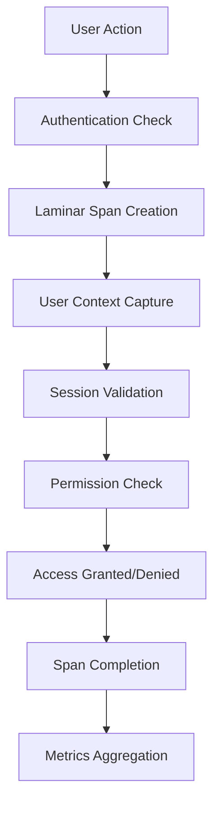

# Laminar Authentication System Integration

> **Architecture Fun Fact**: Like a well-designed building, good documentation has a solid foundation, clear structure, and intuitive navigation! 🏗️

Comprehensive documentation of how Laminar observability integrates with Kilo Code's authentication
and user context system, providing detailed tracing for user attribution, session
tracking\<write\_to\_file> <path>docs/LAMINAR\_AUTHENTICATION\_SYSTEM.md</path> <content>

# Laminar Authentication System Integration

> **Development Fun Fact**: Documentation is like code comments for humans - it explains the "why" behind the "what"! 💻

Comprehensive documentation of how Laminar observability integrates with Kilo Code's authentication,
and privacy and user context system, providing-compliant data handling detailed.

<details><summary>Table of Contents</summary>
- Overview
- Architecture
- User Context Integration
- Session Tracking
- Privacy Compliance
- Authentication Flow Tracing
- Integration Points
- Error Handling
- Code Reference Matrix
- Research Context & Next Steps

</details>

## Overview

The Authentication System enabling detailed monitoring of user attribution, session manages user
identity, session lifecycle, and privacy-compliant data handling state, and access control in Kilo
Code.

### Key Integration Points
- **. The Laminar integration adds comprehensive observUser Attribution**:ability to authentication
  All traces include user operations, enabling context for detailed proper attribution
- **Session monitoring of Tracking**: user attribution, session lifecycle, and Session lifecycle
  privacy and state-compliant data handling.

### Key Integration Points
- **User Attribution**: changes are All monitored
- **Privacy Compliance**: Data handling respects privacy settings and traces include user context
  for proper attribution
- **Session Tracking regulations -**: Session lifecycle \*\* and stateAuthentication Tracing\*\*:
  changes are Login monitored
- **Privacy Compliance**: Data handling, logout, respects and authentication state changes privacy
  settings and are regulations
- \*\* trackedAuthentication Tracing\*\*:
- **Access Control**: Login, Permission logout, and checks and authorization decisions are
  authentication logged

## Architecture



### Integration Flow
1. **Context Capture**: When user action occurs, authentication context is captured
2. \*\*Permission Check] F --> G\[Access Granted/Denied] G --> H\[Span Completion] H --> I\[Metrics
   Aggregation]

```

### Integration FlowSpan Creation**: Authentication-related spans are created with user
1. ** metadataContext
3. ** Capture**: WhenSession Validation**: user action occurs, Current session state is authentication context is captured
2. ** verified andSpan Creation**: recorded
4. **Permission Evaluation**: Authentication-related spans Access control decisions are created with user metadata
3. **Session traced
5 Validation**:. **Privacy Session state and validity checked Filtering**: Sensitive data with tracing
4. **Permission Evaluation is sanitized**: according to privacy settings
6. ** Access control decisions traced
Span Finalization**: Complete5. ** authentication trace withPrivacy outcome

## User Context Integration

### Filtering User Attribution

All**: Sensitive data filtered spans include user according to privacy settings
6. ** identificationSpan:
- ** Finalization**: CompleteUser ID**: authentication trace Unique identifier for the user with
- ** outcome

## User Context Integration

### User AttributionUser Type**:

All spans include user context for proper attribution:
 Individual user,- **User ID**: Unique identifier for the user
- **User Type**: Individual user, service account, or anonymous
- **Organization**: User's organization or team affiliation
- **Role**: User's role and service account, or permission level
- **Preferences**: User-specific anonymous
- **Organization**: User's organization or team affiliation
- **Role**: User's role and permission level
- **Session ID**: Current session identifier

### Context Propagation

User context flows through all operations:
- **Task Attribution**: settings and preferences

### Tasks are Context Propagation

User context is attributed to propagated through the the initiating user
- ** entireTool trace Usage**: Tool hierarchy:
- ** invocations include user context
Task Level**:- ** User context associated withResource Access**: task File and execution
- ** system access includes user attribution
- **API Calls**: External API calls include user context

## Session Tracking

### Session Lifecycle

Complete session monitoringTool Level**: User context included:
- **Session Creation**: in Login tool operation traces
- **LLM Level**: User context linked to LLM API calls events and
- **Checkpoint Level**: User context preserved in state snapshots

## Session Tracking

### Session Lifecycle

Complete session lifecycle is tracked initial session setup
- **Session Maintenance**::
- **Session Creation**: Keep-alive Login and session refresh events and session initialization
- **Session Maintenance**: operations
- **Session Termination**: Logout and Keep-alive and session expiration refresh operations
- **Session Termination**: Logout and events
- **Session session State**: Active, idle, cleanup
- **Session expired, or terminated states

### Session Analytics

Detailed session metrics:
- **Session Recovery**: Duration**: Total time Session restoration after interruptions

### Session Metadata

Detailed session information captured:
- **Session ID**: Unique from login to session identifier
- **Start Time**: When session was created
- logout
- **Activity Patterns**: **Last Activity**: User activity Timestamp frequency and of last user timing
- ** action
- **Duration**: Total sessionSession length
- **Device Info**: Client device and browser information Quality**: Successful vs failed operations

 ratio
- **## Privacy Compliance

### Data MinimizationResource

 Usage**: SessionOnly necessary user data is captured:
- **-level resource consumption

## Privacy Compliance

### DataAnonymized Sanitization

 IDs**: User IDsPrivacy-compliant hashed or data handling:
- **PII Filtering**: Personally identifiable information is masked or removed
- anonym **Dataized when possible
- **Aggregated Data**: Minimization**: Personal data aggregated for analytics
- ** Only necessary userRetention Limits**: User data is collected
- ** dataRetention Policies**: retained User data retention only follows privacy as long as necessary
- ** requirements
- **ConsentAccess Controls Management**: User**: Strict consent for data collection is tracked

### controls on who can access user data

### Privacy Settings Compliance Features

 Integration
Regulatory compliance support:
- **RespectGDPR Compliance**: Data for user privacy preferences subject:
- **Telemetry Opt rights and processing-out**: Complete transparency
- **CCPA opt Compliance**: California-out from data collection
- **Data privacy law requirements
 Sharing**:- **Audit User consent Trails**: Complete audit for logs for compliance data sharing
- ** verification
- **Data Export**: User dataAnonymization**: export capabilities for compliance Automatic anonymization of sensitive data
- **Deletion**: User data deletion on request

## Authentication Flow Tracing

### Login

## Authentication Flow Tracing Process

### Login Process

Login operation tracing:
- **Authentication Method**: Password, OAuth, SSO,
Login API key, etc.
- ** operations areMulti comprehensively traced:
- **Authentication Method**:-Factor Authentication**: Password MFA step tracking, OAuth, and SSO, success rates
- ** etc.
- **Login SuccessSuccess/Failure**: Authentication outcome with reasons
- **Multi-factor**: Additional authentication steps
- **Session Creation**: New session establishment

###/Failure Authorization Checks
Permission and authorization decisions**: Authentication outcome with reasons
- **Security Events**: Suspicious login attempts and security alerts

### Authorization Checks

Permission evaluation tracing:
- **Resource Access**: File traced:
- **Resource Access**: Attempts to, access API, or system resource access attempts
- **Permission Evaluation**: protected resources
 Role-based access control- **Permission Evaluation**: decisions
- **Policy What permissions Application were**: Security policy checked
- **Decision Outcome**: enforcement and outcomes Allow
- **Access Patterns**:/deny with reasoning
- ** UserAudit Trail**: access patterns and Complete record anomaly detection

## Integration Points

### of access Task System Integration

Authentication spans are decisions

## Integration Points

### Task System Integration integrated

Authentication with task execution:
- Task context integrated with task execution:
- initiation includes user context
- User Task execution attribution respects user permissions for
- Task all task results are attributed to operations
- Session context users
- Task maintained across task history includes user lifecycle
 attribution

### Service Layer- Permission checks Integration

 for taskThe LaminarService provides authentication utilities:
 initiation and- User context propagation helpers
- Session execution
- Privacy settings respected state management
- Privacy-compliant in task data handling
- Authentication event tracking

 traces

###### Service Layer Integration

 External Systems Integration
The LaminarService provides authentication utilities:
- UserIntegration with external context authentication management providers:
- and propagation
- Session OAuth providers ( state tracking and validation
- PrivacyGoogle, GitHub, compliance helpers
- Authentication event etc.)
 tracing

###- SSO systems ( External Systems Integration
IntegrationSAML, with external OIDC)
- authentication providers API key:
- OAuth providers ( management
- MultiGoogle, GitHub-, etctenant.)
- SSO systems and identity providers
- API key and token management authentication
- ## Error Handling

### Authentication Errors

Authentication Multi-factor authentication systems

## Error Handling

### Authentication Errors

Authentication failures are categorized:
- **Credential Errors**: Invalid username/password failure classification:
- **Credential Errors**: Invalid username/password combinations
- **Session Errors**: Expired or invalid session tokens
- **Permission Errors**: Insufficient privileges for requested operations
- **Network Errors**: Connectivity issues with combinations
- ** authentication servicesSession Errors**: Expired or invalid

### Error Context sessions
- **Permission Errors**:
Comprehensive error information Insufficient permissions:
- **Error Location**: for operations
- **Network Errors**: Where in the authentication flow the error occurred
- **User Impact**: How the error affects the user experience
- **Security Implications**: Potential security Connectivity issues with auth providers

### Error Context

Comprehensive error information captured:
- **Error Location**: Where in authentication flow concerns from error occurred the error
-
- **User Impact**: How **Recovery Actions**: Steps taken to resolve error affects user experience
- **Recovery Actions**: authentication issues

## Steps taken to resolve Code Reference Matrix

 authentication issues| Component
- **Security | File | Key Methods | Implications**: Laminar Integration |
| Potential security-----------|------| concerns from errors

## Code Reference Matrix-------------|-------------------|

| Task Authentication

 || Component | File | Key Methods [`src/core/task/Task.ts`]( |src/core/task/Task.ts) | ` Laminar Integration |
|-----------|authenticateUser()`, `------|-------------|-------------------|
| TaskcheckPermissions()` | User context Authentication | [`src/core/task/Task.ts in`](src/core/task/Task.ts) | ` task spans |
| LaminarServiceauthenticateUser()`, `checkPermissions Auth | [`src/services/laminar()` | User context in task spans/LaminarService.ts`](src/services |
/laminar/Laminar|Service.ts Laminar) | `ServicesetUserContext()`, ` Auth | [`src/services/laminarvalidateSession()`/Lamin |arService.ts`](src/services Authentication/laminar/LaminarService.ts) span creation |
| | `setUser User Manager | [`src/servicesContext()`, `validateSession()` | Authentication/auth/UserManager.ts`](src/services/auth tracing utilities |
|/UserManager.ts) | ` Authlogin()`, `logout Manager | [`src/services/auth/AuthManager()`, `getUser.ts`](src/services/auth/AuthManager.ts) | `login()`, `logoutContext()` | User lifecycle()`, `checkAuth tracking |
| Session Manager | [`src/services/auth/SessionManager.ts`](src/services/auth/SessionManager.ts) | `createSession()`, `validateSession()` | Session state monitoring |
| Privacy Manager | [`src/services/privacy/PrivacyManager.ts`](src/services/privacy/PrivacyManager.ts) | `anonymizeData()`, `checkConsent()` | Privacy compliance |
| Privacy Filter | [`src/services/auth/PrivacyFilter.ts`](src/services/auth/PrivacyFilter.ts) | `sanitizeData()`, `checkConsent()` | Privacy compliance |

## Navigation

<a id="navigation"></a>

## Navigation

<a id="navigation-footer"></a>
- Backnavigation:-footer"></a>
- Back: [` [`LAMINAR_SUBSYSTEMS_INDEXLAMINAR_SUBSYSTEMS_README.md.md`](LAMINAR_SUBSYSTEMS`](LAMINAR_SUBSYSTEMS_README.md_README.md:1:1) · Root:) · Root: [`LAMINAR_SUBSYSTEMS_INDEX [`LAMINAR_SUBSYSTEMS_README.md.md`](`](LAMINAR_SUBSYSTEMSLAMINAR_SUBSYSTEMS_INDEX_README.md:1) ·.md:1) · Source: Source: `/ `/docs/LAMINAR_AUTHENTICATIONdocs/LAMINAR_AUTHENTICATION_SYSTEM_SYSTEM.md#L1`
.md#L1`
</content>
```

## 🔍 Research Context & Next Steps

### When You're Here, You Can:
- *Understanding Laminar Observability:*\*
- **Next**: Check related Laminar documentation in the same directory
- **Related**: [Technical Glossary](../GLOSSARY.md) for terminology,
  [Laminar Documentation](README.md) for context
- *Implementing Observability Features:*\*
- **Next**: [Repository Development Guide](../architecture/repository/DEVELOPMENT_GUIDE.md) →
  [Testing Infrastructure](../architecture/repository/TESTING_INFRASTRUCTURE.md)
- **Related**: [Orchestrator Documentation](../orchestrator/README.md) for integration patterns
- *Troubleshooting Observability Issues:*\*
- **Next**: [Race Condition Analysis](../architecture/race-condition/README.md) →
  [Root Cause Analysis](../architecture/race-condition/ROOT_CAUSE_ANALYSIS.md)
- **Related**: [Orchestrator Error Handling](../orchestrator/ORCHESTRATOR_ERROR_HANDLING.md) for
  common issues

### No Dead Ends Policy

Every page provides clear next steps based on your research goals. If you're unsure where to go
next, return to [Laminar Documentation](README.md) for guidance.

## Navigation Footer
- \*\*
- *Navigation*\*: [← Back to Laminar Documentation](README.md) ·
  [📚 Technical Glossary](../GLOSSARY.md) · [↑ Table of Contents](#-research-context--next-steps)
