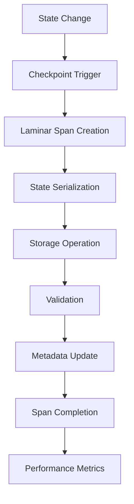

# Laminar Checkpoint System Integration

## Table of Contents

* [When You're Here](#when-youre-here)
* [Overview](#overview)
* [Architecture](#architecture)
* [Checkpoint Lifecycle Tracing](#checkpoint-lifecycle-tracing)
* [Span Metadata](#span-metadata)
* [Performance Monitoring](#performance-monitoring)
* [Checkpoint Analytics](#checkpoint-analytics)
* [Integration Points](#integration-points)
* [Error Handling](#error-handling)
* [Code Reference Matrix](#code-reference-matrix)
* [Research Context & Next Steps](#research-context--next-steps)
* [Navigation](#navigation)

## When You're Here

This document provides comprehensive documentation of how Laminar observability integrates with Kilo Code's checkpoint system, providing detailed tracing for state management, performance monitoring, and checkpoint lifecycle operations.

* **Purpose**: Checkpoint system integration with Laminar observability
* **Audience**: Developers implementing checkpoint and state management features
* **Prerequisites**: Understanding of Laminar observability and checkpoint systems
* **Related Documents**: [Laminar Documentation](README.md), [Technical Glossary](../GLOSSARY.md)

## Overview

The Laminar Checkpoint System provides comprehensive observability for state management, checkpoint creation, restoration, and performance monitoring in Kilo Code. This integration enables detailed tracing of checkpoint lifecycle, state integrity, and performance metrics.

### Key Integration Points

* **Checkpoint Lifecycle**: Complete tracing of checkpoint creation, restoration, and cleanup
* **State Integrity**: Monitoring of state consistency and corruption detection
* **Performance Metrics**: Detailed timing and resource usage tracking
* **Storage Integration**: Observability for checkpoint storage operations
* **Error Handling**: Comprehensive error tracking and recovery monitoring

## Architecture

### Integration Flow

1. **State Change Detection**: System detects significant state changes
2. **Checkpoint Trigger**: Checkpoint creation is initiated
3. **Span Creation**: Laminar span tracks the entire checkpoint process
4. **State Serialization**: Current state is serialized for storage
5. **Storage Operation**: Checkpoint data is written to storage
6. **Validation**: Checkpoint integrity is verified
7. **Metadata Update**: Checkpoint metadata is updated
8. **Performance Tracking**: Timing and resource metrics are recorded

## Checkpoint Lifecycle Tracing

### Checkpoint Creation

Creation process is comprehensively traced:

- **Trigger Events**: What caused the checkpoint creation
- **State Size**: Amount of data being checkpointed
- **Serialization Time**: Time taken to serialize state
- **Storage Duration**: Time to write checkpoint to storage
- **Validation Results**: Integrity check outcomes

### Checkpoint Restoration

Restoration process monitoring:

- **Restore Trigger**: What initiated the restoration
- **Data Loading**: Time to load checkpoint data from storage
- **Deserialization**: Time to reconstruct state from data
- **State Validation**: Verification of restored state integrity
- **Recovery Success**: Whether restoration completed successfully

### Checkpoint Cleanup

Cleanup operations tracking:

- **Cleanup Triggers**: What initiated cleanup (age, space, etc.)
- **Data Removal**: Time to remove checkpoint data
- **Storage Reclamation**: Space freed up by cleanup
- **Cleanup Success**: Whether cleanup completed successfully

## Span Metadata

### Checkpoint Information

Each checkpoint span includes:

- **Checkpoint ID**: Unique identifier for the checkpoint
- **Timestamp**: When the checkpoint was created
- **State Version**: Version of the state being checkpointed
- **Data Size**: Size of checkpoint data in bytes
- **Compression Ratio**: If compression was applied
- **Storage Location**: Where checkpoint is stored

### Performance Data

Performance metrics captured:

- **Creation Time**: Total time to create checkpoint
- **Restoration Time**: Total time to restore from checkpoint
- **Storage I/O**: Read/write operations and timing
- **Memory Usage**: Memory consumed during operations
- **CPU Usage**: CPU time spent on checkpoint operations

## Performance Monitoring

### Timing Metrics

Detailed timing information:

- **Serialization Time**: Time to convert state to storage format
- **Storage Write Time**: Time to write data to storage
- **Validation Time**: Time to verify checkpoint integrity
- **Total Checkpoint Time**: End-to-end checkpoint creation time
- **Restoration Time**: Time to restore state from checkpoint

### Resource Usage

Resource consumption tracking:

- **Memory Usage**: Peak memory during checkpoint operations
- **Storage Space**: Disk space used by checkpoints
- **Network I/O**: If using remote storage
- **CPU Utilization**: CPU time for checkpoint operations
- **I/O Operations**: Number of read/write operations

### Throughput Metrics

System performance indicators:

- **Checkpoints per Second**: Rate of checkpoint creation
- **Restoration Rate**: How quickly checkpoints can be restored
- **Storage Efficiency**: Compression and deduplication ratios
- **Queue Length**: Number of pending checkpoint operations
- **Error Rate**: Percentage of failed checkpoint operations

## Checkpoint Analytics

### State Integrity

Quality metrics and corruption detection:

- **Checksum Validation**: Data integrity verification
- **Version Consistency**: State version tracking
- **Corruption Detection**: Automatic detection of data corruption
- **Recovery Success Rate**: Percentage of successful restorations
- **Data Loss Incidents**: Tracking of any data loss events

### State Reliability

Reliability tracking:

- **Checkpoint Success Rate**: Percentage of successful checkpoints
- **Restoration Success Rate**: Percentage of successful restorations
- **Mean Time to Recovery**: Average time to restore from checkpoint
- **Checkpoint Age Distribution**: How long checkpoints are kept
- **Storage Health**: Health of checkpoint storage systems

### Usage Patterns

Usage analytics:

- **Checkpoint Frequency**: How often checkpoints are created
- **Restoration Frequency**: How often checkpoints are used
- **Peak Usage Times**: When checkpoint activity is highest
- **Storage Growth**: Rate of checkpoint storage growth
- **Cleanup Patterns**: When and how often cleanup occurs

## Integration Points

### Task System Integration

Checkpoint spans are integrated with task execution:

- Task state changes trigger checkpoint creation
- Checkpoint restoration includes task context
- Task execution respects checkpoint boundaries
- Task failures can trigger checkpoint restoration

### Service Layer Integration

The LaminarService provides checkpoint utilities:

- Checkpoint creation helpers
- State serialization utilities
- Storage integration helpers
- Performance monitoring tools

### Storage Integration

Integration with storage systems:

- Local file system checkpoints
- Remote storage integration
- Database checkpoint storage
- Cloud storage solutions

## Error Handling

### Checkpoint Errors

Checkpoint failures are categorized:

- **Serialization Errors**: State cannot be serialized
- **Storage Errors**: Cannot write to storage
- **Validation Errors**: Checkpoint integrity checks fail
- **Restoration Errors**: Cannot restore from checkpoint
- **Cleanup Errors**: Cannot remove old checkpoints

### Error Context

Comprehensive error information:

- **Error Location**: Where in checkpoint process error occurred
- **State Information**: What state was being processed
- **Storage Details**: Storage system status and errors
- **Recovery Actions**: Steps taken to handle or recover from errors
- **Impact Assessment**: How error affects system operation

## Code Reference Matrix

| Component | File | Key Methods | Laminar Integration |
|-----------|------|-------------|-------------------|
| Checkpoint Manager | [`../../src/core/checkpoint/CheckpointManager.ts`](../../src/core/checkpoint/CheckpointManager.ts) | `createCheckpoint()`, `restoreCheckpoint()` | Checkpoint lifecycle tracing |
| State Serializer | [`../../src/core/checkpoint/StateSerializer.ts`](../../src/core/checkpoint/StateSerializer.ts) | `serialize()`, `deserialize()` | Serialization performance tracking |
| Storage Manager | [`../../src/core/checkpoint/StorageManager.ts`](../../src/core/checkpoint/StorageManager.ts) | `store()`, `retrieve()` | Storage operation monitoring |
| LaminarService Checkpoint | [`../../src/services/laminar/LaminarService.ts`](../../src/services/laminar/LaminarService.ts) | `trackCheckpoint()`, `trackRestoration()` | Checkpoint span creation |
| Validation Service | [`../../src/services/checkpoint/ValidationService.ts`](../../src/services/checkpoint/ValidationService.ts) | `validateCheckpoint()`, `verifyIntegrity()` | Validation monitoring |

## Research Context & Next Steps

### When You're Here, You Can:

* **Understanding Laminar Observability:**
  * **Next**: Check related Laminar documentation in the same directory
  * **Related**: [Technical Glossary](../GLOSSARY.md) for terminology, [Laminar Documentation](README.md) for context

* **Implementing Observability Features:**
  * **Next**: [Repository Development Guide](../README.md) → [Testing Infrastructure](../testing/TESTING_STRATEGY.md)
  * **Related**: [Orchestrator Documentation](../orchestrator/README.md) for integration patterns

* **Troubleshooting Observability Issues:**
  * **Next**: [Race Condition Analysis](../README.md) → [Root Cause Analysis](DUPLICATE_API_REQUESTS_TROUBLESHOOTING.md)
  * **Related**: [Orchestrator Error Handling](../orchestrator/ORCHESTRATOR_ERROR_HANDLING.md) for common issues

### No Dead Ends Policy

Every page provides clear next steps based on your research goals. If you're unsure where to go next, return to [Laminar Documentation](README.md) for guidance.

## Navigation

* **Back**: [Laminar Subsystems Index](LAMINAR_SUBSYSTEMS_INDEX.md) · **Root**: [Laminar Documentation](README.md) · **Source**: `/docs/laminar/LAMINAR_CHECKPOINT_SYSTEM.md#L1`
* **Technical Glossary**: [GLOSSARY.md](../GLOSSARY.md) · **Table of Contents**: [#research-context--next-steps](#research-context--next-steps)
