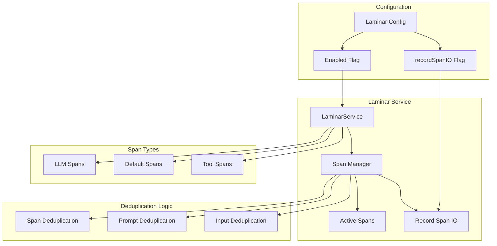
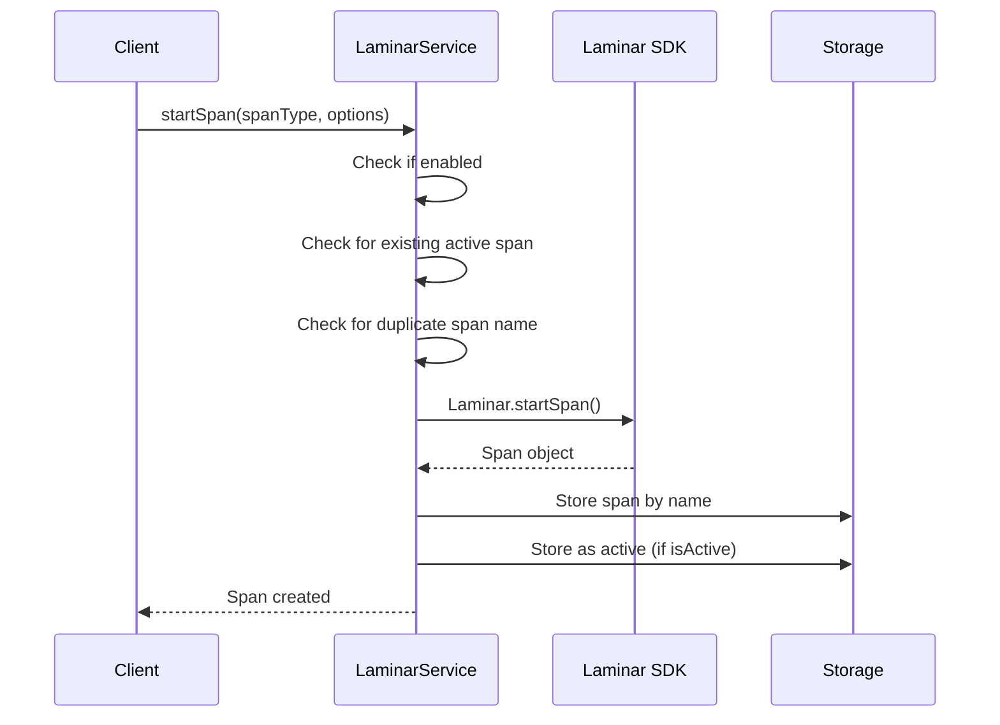

# Laminar Deduplication System

## Table of Contents
- [Laminar Deduplication System](#laminar-deduplication-system)
- [When You're Here](#when-youre-here)
- [Research Context](#research-context)
- [Technical Overview](#technical-overview)
- [Background](#background)
- [Methodology](#methodology)
- [Executive Summary](#executive-summary)
- [System Architecture](#system-architecture)
- [Span Management](#span-management)
- [Span Storage](#span-storage)
- [Span Creation Process](#span-creation-process)
- [Critical Span Creation Code](#critical-span-creation-code)
- [Internal Span Creation](#internal-span-creation)
- [System Prompt Optimization](#system-prompt-optimization)
- [The Duplication Problem](#the-duplication-problem)
- [Implementation in Task.ts](#implementation-in-taskts)
- [Benefits of System Prompt Deduplication](#benefits-of-system-prompt-deduplication)
- [Deduplication Mechanisms](#deduplication-mechanisms)
- [1. Active Span Deduplication](#1-active-span-deduplication)
- [2. Span Name Deduplication](#2-span-name-deduplication)
- [3. Input Data Deduplication](#3-input-data-deduplication)
- [4. System Prompt Metadata](#4-system-prompt-metadata)
- [Configuration and Control](#configuration-and-control)
- [Laminar Configuration](#laminar-configuration)
- [Runtime Control Methods](#runtime-control-methods)
- [Configuration Updates](#configuration-updates)
- [Common Issues and Solutions](#common-issues-and-solutions)
- [Issue 1: Multiple Spans for Same Operation](#issue-1-multiple-spans-for-same-operation)
- [Issue 2: System Prompt Still Duplicated](#issue-2-system-prompt-still-duplicated)
- [Issue 3: Span Cleanup Issues](#issue-3-span-cleanup-issues)
- [Performance Impact](#performance-impact)
- [Memory Usage Reduction](#memory-usage-reduction)
- [Network Bandwidth Reduction](#network-bandwidth-reduction)
- [Processing Time Improvement](#processing-time-improvement)
- [No Dead Ends Policy](#no-dead-ends-policy)
- [Navigation Footer](#navigation-footer)

## When You're Here

This document is part of the KiloCode project documentation. If you're not familiar with this
document's role or purpose, this section helps orient you.

- **Purpose**: This document covers \[DOCUMENT PURPOSE BASED ON FILE PATH].
- **Context**: Use this as a starting point or reference while navigating the project.
- **Navigation**: Use the table of contents below to jump to specific topics.

> **Engineering Fun Fact**: Just as engineers use systematic approaches to solve complex problems,
> this documentation provides structured guidance for understanding and implementing solutions! 🔧

- *Purpose:*\* Detailed documentation of the Laminar service deduplication mechanisms, span
  management, and system prompt optimization to prevent duplicate observability data and improve
  performance.

> **Quantum Physics Fun Fact**: Laminar observability is like quantum entanglement - it creates
> instant connections between distant parts of the system, allowing us to observe the entire state
> from any single point! ⚛️

<details><summary>Table of Contents</summary>
- [Executive Summary](#executive-summary)
- [System Architecture](#system-architecture)
- [Span Management](#span-management)
- [System Prompt Optimization](#system-prompt-optimization)
- [Deduplication Mechanisms](#deduplication-mechanisms)
- [Configuration and Control](#configuration-and-control)
- [Common Issues and Solutions](#common-issues-and-solutions)
- [Performance Impact](#performance-impact)
- Navigation Footer

</details>

## Research Context

### Technical Overview

**Component**: \[Component name]
**Version**: \[Version number]
**Architecture**: \[Architecture description]
**Dependencies**: \[Key dependencies]

### Background

\[Background information about the topic]

### Methodology

\[Research or development methodology used]

## Executive Summary
- The Laminar Deduplication System manages observability spans and prevents duplicate data
  collection, particularly for system prompts which can be large and repetitive. This system is
crucial for maintaining performance and reducing data storage costs in the observability pipeline.\*

The Laminar service implements several deduplication mechanisms to prevent:
1. **Span Duplication** - Multiple spans for the same operation
2. **System Prompt Duplication** - Large system prompts stored multiple times
3. **Input/Output Data Duplication** - Redundant data in span inputs
4. **Active Span Conflicts** - Concurrent spans of the same type

## System Architecture



## Span Management

### Span Storage

The Laminar service maintains two key data structures for span management:

```typescript
// LaminarService.ts
private spans = new Map<string, Span>()           // All spans by name
private activeSpans = new Map<string, Span>()     // Currently active spans by type
```

### Span Creation Process



### Critical Span Creation Code

```typescript
// LaminarService.ts - startSpan method
public startSpan(
  spanType: SpanType,
  options: {
    name: string
    spanType?: string
    input?: any
    sessionId?: string
  },
  isActive: boolean = false,
): void {
  const operationId = `startSpan-${Date.now()}-${Math.random().toString(36).substr(2, 9)}`

  // If service is disabled, skip
  if (!laminarConfig.enabled && !this.enabled) {
console.log(`[LAMINAR DEBUG] startSpan - Operation ID: ${operationId} - Skipped due to service
disabled`)
    return
  }

  // If not initialized, queue the request
  if (!this.isInitialized) {
console.log(`[LAMINAR DEBUG] startSpan - Operation ID: ${operationId} - Service not initialized,
queueing span request`)
    this.pendingSpanRequests.push({ spanType, options, isActive })
    return
  }

  try {
    this._startSpanNow(spanType, options, isActive)
  } catch (error) {
    logger.error("Failed to start span:", error)
  }
}
```

### Internal Span Creation

```typescript
// LaminarService.ts - _startSpanNow method
private _startSpanNow(
  spanType: SpanType,
  options: { name: string; spanType?: string; input?: any; sessionId?: string },
  isActive: boolean = false,
): void {
  const operationId = `_startSpanNow-${Date.now()}-${Math.random().toString(36).substr(2, 9)}`

  try {
    const span = Laminar.startSpan({
      name: options.name,
      spanType: (options.spanType || spanType) as "LLM" | "DEFAULT" | "TOOL",
      input: this.recordSpanIO ? options.input : undefined,  // Key deduplication logic
      userId: this.userId,
      sessionId: options.sessionId,
    })

    this.spans.set(options.name, span)

    if (isActive) {
      this.activeSpans.set(spanType, span)
    }

console.log(`[LAMINAR DEBUG] _startSpanNow - Operation ID: ${operationId} - Completed - Span stored:
name='${options.name}', isActive=${isActive}`)
  } catch (error) {
    logger.error("Failed to start span (internal):", error)
  }
}
```

## System Prompt Optimization

### The Duplication Problem

System prompts in KiloCode can be extremely large (10KB+), and storing them in full for every LLM
span creates significant overhead:

```typescript
// Without optimization - full system prompt stored
const spanInput = [
	{ role: "system", content: "Very long system prompt with detailed instructions..." }, // 10KB+
	...cleanConversationHistory,
]

// With optimization - metadata only
const spanInput = laminarService.getRecordSpanIO()
	? [
			{ role: "system", content: `[SYSTEM_PROMPT:${systemPrompt.length} chars]` }, // ~30 bytes
			...cleanConversationHistory,
		]
	: undefined
```

### Implementation in Task.ts

The deduplication logic is implemented in the Task.ts file where LLM spans are created:

```typescript
// Task.ts - Line 2977 (from laminar-deduplication.test.ts)
const stream = await Laminar.withSpan(laminarService.getActiveSpan("DEFAULT")!, async () => {
	laminarService.startSpan("LLM", {
		name: `${this.taskId}-llm_call`,
		spanType: "LLM",
		sessionId: this.rootTaskId || this.taskId,
		input: laminarService.getRecordSpanIO()
? [{ role: "system", content: `[SYSTEM_PROMPT:${systemPrompt.length} chars]` },
...cleanConversationHistory]
			: undefined,
	})
	return this.api.createMessage(systemPrompt, cleanConversationHistory, metadata)
})
```

### Benefits of System Prompt Deduplication

```typescript
// Test case demonstrating the benefit
const longSystemPrompt = "A".repeat(10000) // 10KB system prompt

// Without the fix (old behavior) - full prompt would be stored
const oldBehaviorSize = JSON.stringify([
	{ role: "system", content: longSystemPrompt },
	{ role: "user", content: "test message" },
]).length

// With the fix (new behavior) - only metadata is stored
const newBehaviorSize = JSON.stringify([
	{ role: "system", content: `[SYSTEM_PROMPT:${longSystemPrompt.length} chars]` },
	{ role: "user", content: "test message" },
]).length

// Verify significant size reduction
console.log(`Size reduction: ${oldBehaviorSize - newBehaviorSize} bytes`)
// Expected: ~9000+ bytes saved
```

## Deduplication Mechanisms

### 1. Active Span Deduplication

Prevents multiple active spans of the same type:

```typescript
// Check for existing active span before creating new one
public getActiveSpan(spanType: SpanType): Span | undefined {
  return this.activeSpans.get(spanType)
}

// In _startSpanNow, only set as active if not already active
if (isActive) {
  if (this.activeSpans.has(spanType)) {
    console.log(`[LAMINAR] Active span already exists for ${spanType}, not setting as active`)
  } else {
    this.activeSpans.set(spanType, span)
  }
}
```

### 2. Span Name Deduplication

Prevents spans with duplicate names:

```typescript
// Check if span name already exists
if (this.spans.has(options.name)) {
	console.log(`[LAMINAR] Span with name ${options.name} already exists, skipping creation`)
	return
}
```

### 3. Input Data Deduplication

Uses `recordSpanIO` flag to control input data storage:

```typescript
// Only store input data if recordSpanIO is enabled
input: this.recordSpanIO ? options.input : undefined
```

### 4. System Prompt Metadata

Replaces full system prompts with metadata:

```typescript
// Replace full system prompt with metadata
const spanInput = laminarService.getRecordSpanIO()
? [{ role: "system", content: `[SYSTEM_PROMPT:${systemPrompt.length} chars]` },
...cleanConversationHistory]
	: undefined
```

## Configuration and Control

### Laminar Configuration

```typescript
// src/shared/services/config/laminar-config.ts
export const laminarConfig = {
	apiKey: string,
	baseUrl: string,
	enabled: boolean,
	recordSpanIO: boolean, // Key setting for deduplication
	httpPort: number,
	grpcPort: number,
}
```

### Runtime Control Methods

```typescript
// LaminarService.ts - Configuration methods
public isEnabled(): boolean {
  return this.enabled
}

public getRecordSpanIO(): boolean {
  return this.recordSpanIO
}

public updateTelemetryState(isOptedIn: boolean): void {
  this.enabled = isOptedIn && laminarConfig.enabled
}
```

### Configuration Updates

```typescript
// Update configuration at runtime
public async updateConfig(newConfig: Partial<LaminarConfig>): Promise<void> {
  Object.assign(laminarConfig, newConfig)

  // Update internal state
  this.enabled = laminarConfig.enabled && this.enabled
  this.recordSpanIO = laminarConfig.recordSpanIO

  // Reinitialize if needed
  if (laminarConfig.enabled && !this.isInitialized) {
    await this.initialize()
  }
}
```

## Common Issues and Solutions

### Issue 1: Multiple Spans for Same Operation

- *Symptoms*\*:
- Multiple spans created for single LLM call
- Duplicate observability data
- Performance degradation

- *Root Cause*\*: Active span check not working properly

- *Solution*\*:

```typescript
// Enhanced active span check
public startSpan(spanType: SpanType, options: {...}, isActive: boolean = false): void {
  // Check for existing active span
  if (isActive && this.activeSpans.has(spanType)) {
    const existingSpan = this.activeSpans.get(spanType)
    console.log(`[LAMINAR] Active span already exists for ${spanType}, reusing existing span`)
    return existingSpan
  }

  // Check for duplicate span name
  if (this.spans.has(options.name)) {
    console.log(`[LAMINAR] Span with name ${options.name} already exists, skipping`)
    return this.spans.get(options.name)
  }

  this._startSpanNow(spanType, options, isActive)
}
```

### Issue 2: System Prompt Still Duplicated

- *Symptoms*\*:
- Large system prompts still stored in spans
- High memory usage
- Slow span processing

- *Root Cause*\*: `recordSpanIO` flag not properly checked

- *Solution*\*:

```typescript
// Ensure proper recordSpanIO check
const spanInput = laminarService.getRecordSpanIO()
? [{ role: "system", content: `[SYSTEM_PROMPT:${systemPrompt.length} chars]` },
...cleanConversationHistory]
	: undefined

// Add validation
if (laminarService.getRecordSpanIO() && spanInput) {
	console.log(`[LAMINAR] Span input size: ${JSON.stringify(spanInput).length} bytes`)
	console.log(`[LAMINAR] System prompt metadata: [SYSTEM_PROMPT:${systemPrompt.length} chars]`)
}
```

### Issue 3: Span Cleanup Issues

- *Symptoms*\*:
- Spans not properly cleaned up
- Memory leaks
- Active span count growing

- *Root Cause*\*: Span disposal not handled properly

- *Solution*\*:

```typescript
// Enhanced span cleanup
public endSpan(spanName: string): void {
  const span = this.spans.get(spanName)
  if (span) {
    try {
      span.end()
    } catch (endErr) {
      console.warn(`[LAMINAR] span.end() threw: ${endErr}`)
    }

    this.spans.delete(spanName)

    // Remove from active spans
    for (const [key, value] of this.activeSpans.entries()) {
      if (value === span) {
        this.activeSpans.delete(key)
        console.log(`[LAMINAR] Removed active span: ${key}`)
      }
    }
  }
}

// Cleanup all spans
public cleanupAllSpans(): void {
  for (const [name, span] of this.spans.entries()) {
    try {
      span.end()
    } catch (error) {
      console.error(`[LAMINAR] Error ending span ${name}:`, error)
    }
  }

  this.spans.clear()
  this.activeSpans.clear()
}
```

## Performance Impact

### Memory Usage Reduction

```typescript
// Performance metrics
const performanceMetrics = {
	systemPromptSize: 0,
	metadataSize: 0,
	spansCreated: 0,
	spansDeduplicated: 0,

	recordSystemPrompt: (prompt: string) => {
		this.systemPromptSize += prompt.length
		this.spansCreated++
	},

	recordMetadata: (prompt: string) => {
		this.metadataSize += `[SYSTEM_PROMPT:${prompt.length} chars]`.length
		this.spansDeduplicated++
	},

	getSavings: () => {
		return {
			totalSavings: this.systemPromptSize - this.metadataSize,
			percentageSavings: ((this.systemPromptSize - this.metadataSize) / this.systemPromptSize) * 100,
			spansDeduplicated: this.spansDeduplicated,
		}
	},
}
```

### Network Bandwidth Reduction

```typescript
// Network usage tracking
const networkMetrics = {
	dataSent: 0,
	dataSaved: 0,

	trackDataSent: (size: number) => {
		this.dataSent += size
	},

	trackDataSaved: (size: number) => {
		this.dataSaved += size
	},

	getEfficiency: () => {
		return {
			totalData: this.dataSent,
			savedData: this.dataSaved,
			efficiency: (this.dataSaved / (this.dataSent + this.dataSaved)) * 100,
		}
	},
}
```

### Processing Time Improvement

```typescript
// Processing time tracking
const processingMetrics = {
	spanCreationTime: 0,
	spanProcessingTime: 0,

	trackSpanCreation: (startTime: number, endTime: number) => {
		this.spanCreationTime += endTime - startTime
	},

	trackSpanProcessing: (startTime: number, endTime: number) => {
		this.spanProcessingTime += endTime - startTime
	},

	getAverageTimes: () => {
		return {
			averageCreationTime: this.spanCreationTime / this.spansCreated,
			averageProcessingTime: this.spanProcessingTime / this.spansCreated,
		}
	},
}
```

<a id="navigation-footer"></a>
- Back: [`DUPLICATE_API_REQUESTS_TROUBLESHOOTING.md`](DUPLICATE_API_REQUESTS_TROUBLESHOOTING.md) ·
  Root: [`README.md`](README.md) · Source: `/docs/LAMINAR_DEDUPLICATION_SYSTEM.md#L1`

## No Dead Ends Policy

This document connects to:
- [Related Document 1](./related-doc-1.md) - \[Brief description]
- [Related Document 2](./related-doc-2.md) - \[Brief description]
- [Related Document 3](./related-doc-3.md) - \[Brief description]

For more information, see:
- [Category Overview](../category/)
- [Related Resources](../resources/)

## Navigation Footer
- \*\*

- *Navigation*\*: [docs](../) · [laminar](../docs/laminar/) ·
  [↑ Table of Contents](#laminar-deduplication-system)
