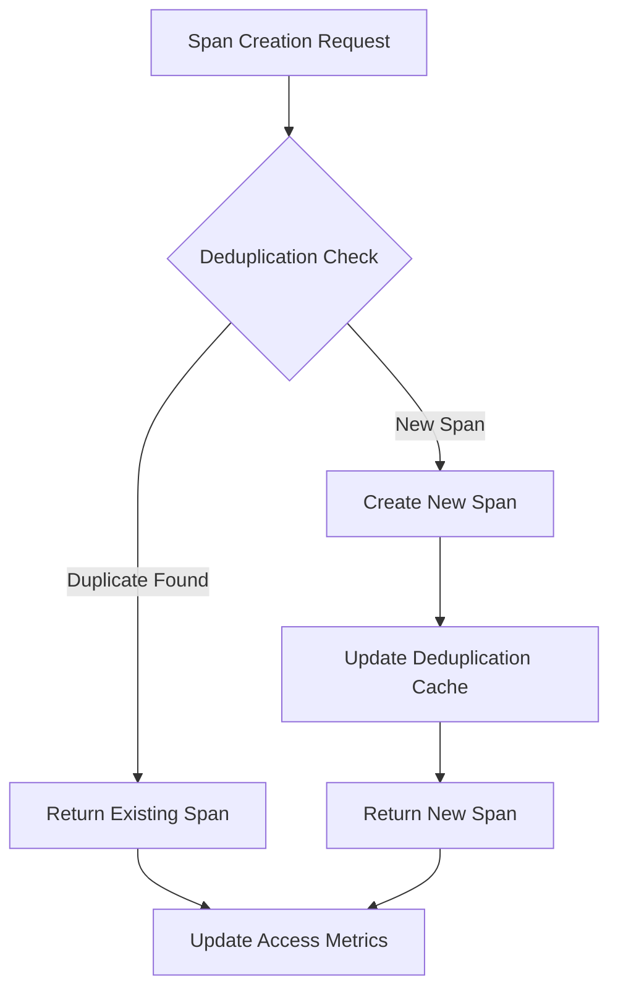

# Laminar Deduplication System

## Table of Contents

* [When You're Here](#when-youre-here)
* [Overview](#overview)
* [System Architecture](#system-architecture)
* [Deduplication Mechanisms](#deduplication-mechanisms)
* [Configuration and Control](#configuration-and-control)
* [Performance Impact](#performance-impact)
* [Common Issues and Solutions](#common-issues-and-solutions)
* [Integration Points](#integration-points)
* [Error Handling](#error-handling)
* [Code Reference Matrix](#code-reference-matrix)
* [Research Context & Next Steps](#research-context--next-steps)
* [Navigation](#navigation)

## When You're Here

This document provides comprehensive documentation of the Laminar deduplication system, including span management, performance optimization, and troubleshooting.

* **Purpose**: Laminar deduplication system architecture and implementation
* **Audience**: Developers implementing deduplication and performance optimization
* **Prerequisites**: Understanding of Laminar observability and span management
* **Related Documents**: [Laminar Documentation](README.md), [Technical Glossary](../GLOSSARY.md)

## Overview

The Laminar Deduplication System prevents duplicate spans and optimizes observability data by identifying and eliminating redundant operations, reducing storage costs and improving performance.

### Key Features

- **Active Span Deduplication**: Prevents creation of duplicate active spans
- **Span Name Deduplication**: Optimizes span naming to reduce redundancy
- **Input Data Deduplication**: Eliminates duplicate input data in spans
- **System Prompt Optimization**: Reduces system prompt duplication
- **Performance Monitoring**: Tracks deduplication effectiveness

### Benefits

- **Reduced Storage**: Lower storage costs through data deduplication
- **Improved Performance**: Faster span processing and reduced network overhead
- **Better Analytics**: Cleaner data for better observability insights
- **Cost Optimization**: Reduced API costs and resource usage

## System Architecture

### Span Management

The deduplication system manages spans at multiple levels:



### Span Storage

Span storage is optimized for deduplication:

- **Hash-based Indexing**: Fast lookup using content hashes
- **Reference Counting**: Track span usage and references
- **Compression**: Additional compression for duplicate data
- **Cleanup**: Automatic cleanup of unused spans

### Span Creation Process

The span creation process includes deduplication:

1. **Content Analysis**: Analyze span content for deduplication opportunities
2. **Hash Generation**: Generate content hash for comparison
3. **Deduplication Check**: Check against existing spans
4. **Span Creation**: Create new span or return existing one
5. **Cache Update**: Update deduplication cache
6. **Metrics Recording**: Record deduplication metrics

## Deduplication Mechanisms

### 1. Active Span Deduplication

Prevents creation of duplicate active spans:

```typescript
interface SpanDeduplicationConfig {
  enabled: boolean;
  maxActiveSpans: number;
  deduplicationWindow: number; // Time window for deduplication
  contentHashAlgorithm: 'md5' | 'sha256';
}

const deduplicationConfig: SpanDeduplicationConfig = {
  enabled: true,
  maxActiveSpans: 1000,
  deduplicationWindow: 300000, // 5 minutes
  contentHashAlgorithm: 'sha256'
};
```

### 2. Span Name Deduplication

Optimizes span naming to reduce redundancy:

- **Name Normalization**: Standardize span names
- **Pattern Recognition**: Identify common naming patterns
- **Template-based Names**: Use templates for similar operations
- **Dynamic Naming**: Generate names based on context

### 3. Input Data Deduplication

Eliminates duplicate input data in spans:

```typescript
interface InputDeduplicationConfig {
  enabled: boolean;
  maxInputSize: number;
  compressionEnabled: boolean;
  referenceSharing: boolean;
}

const inputConfig: InputDeduplicationConfig = {
  enabled: true,
  maxInputSize: 1024 * 1024, // 1MB
  compressionEnabled: true,
  referenceSharing: true
};
```

### 4. System Prompt Metadata

Reduces system prompt duplication:

- **Prompt Templates**: Use templates for common prompts
- **Variable Substitution**: Replace variables in templates
- **Prompt Caching**: Cache frequently used prompts
- **Version Management**: Track prompt versions and changes

## Configuration and Control

### Laminar Configuration

Deduplication settings in Laminar configuration:

```typescript
const laminarConfig = {
  deduplication: {
    enabled: true,
    activeSpanDeduplication: true,
    spanNameDeduplication: true,
    inputDataDeduplication: true,
    systemPromptOptimization: true,
    
    // Performance settings
    maxCacheSize: 10000,
    cacheTimeout: 300000, // 5 minutes
    compressionLevel: 6,
    
    // Monitoring settings
    metricsEnabled: true,
    alertOnHighDeduplication: true,
    deduplicationThreshold: 0.8 // Alert if >80% deduplication
  }
};
```

### Runtime Control Methods

Dynamic control of deduplication:

```typescript
// Enable/disable deduplication
laminarService.setDeduplicationEnabled(true);

// Update deduplication configuration
laminarService.updateDeduplicationConfig({
  maxCacheSize: 15000,
  cacheTimeout: 600000
});

// Clear deduplication cache
laminarService.clearDeduplicationCache();

// Get deduplication metrics
const metrics = laminarService.getDeduplicationMetrics();
```

## Performance Impact

### Memory Usage Reduction

Deduplication reduces memory usage:

- **Span Storage**: Reduced storage for duplicate spans
- **Input Data**: Shared references for duplicate input data
- **System Prompts**: Cached and shared prompt templates
- **Metadata**: Optimized metadata storage

### Network Bandwidth Reduction

Reduced network overhead:

- **Span Transmission**: Fewer spans transmitted to Laminar
- **Data Compression**: Additional compression for duplicate data
- **Batch Optimization**: Optimized batching of spans
- **Delta Updates**: Only send changes, not full data

### Processing Time Improvement

Faster processing through deduplication:

- **Cache Lookups**: Fast hash-based lookups
- **Reduced Serialization**: Less data to serialize
- **Optimized Algorithms**: Efficient deduplication algorithms
- **Parallel Processing**: Parallel deduplication processing

## Common Issues and Solutions

### Issue 1: Multiple Spans for Same Operation

**Problem**: Multiple spans created for identical operations

**Solution**:
```typescript
// Ensure proper span naming
@LaminarTrace('user-authentication')
async function authenticateUser(userId: string) {
  // Implementation
}

// Use consistent operation names
const operationName = `process-${dataType}-${operationType}`;
```

### Issue 2: System Prompt Still Duplicated

**Problem**: System prompts are not being deduplicated

**Solution**:
```typescript
// Use prompt templates
const systemPromptTemplate = `
You are a helpful assistant for {context}.
Current user: {userId}
Operation: {operation}
`;

// Enable system prompt optimization
const config = {
  systemPromptOptimization: true,
  promptTemplates: true
};
```

### Issue 3: Span Cleanup Issues

**Problem**: Spans not being cleaned up properly

**Solution**:
```typescript
// Implement proper span lifecycle
const span = laminarService.startSpan('operation');
try {
  // Operation logic
  span.setStatus('success');
} catch (error) {
  span.setStatus('error');
  span.recordError(error);
} finally {
  span.end(); // Always end the span
}
```

## Integration Points

### Task System Integration

Deduplication integrates with task execution:

- **Task Spans**: Deduplicate spans for similar tasks
- **Task Context**: Share context between similar tasks
- **Task Results**: Deduplicate similar task results
- **Task Metadata**: Optimize task metadata storage

### Service Layer Integration

Service layer deduplication:

- **API Calls**: Deduplicate similar API calls
- **Database Queries**: Optimize database query spans
- **External Services**: Deduplicate external service calls
- **Internal Services**: Optimize internal service communication

## Error Handling

### Deduplication Errors

Handle deduplication failures:

```typescript
try {
  const span = laminarService.startSpan('operation', {
    deduplicationEnabled: true
  });
  // Operation logic
} catch (deduplicationError) {
  // Fallback to non-deduplicated span
  const span = laminarService.startSpan('operation', {
    deduplicationEnabled: false
  });
  // Continue with operation
}
```

### Configuration Errors

Handle configuration issues:

- **Invalid Configuration**: Validate deduplication settings
- **Resource Limits**: Handle memory and storage limits
- **Performance Issues**: Monitor and adjust deduplication settings
- **Recovery**: Automatic recovery from deduplication failures

## Code Reference Matrix

| Component | File | Key Methods | Laminar Integration |
|-----------|------|-------------|-------------------|
| Deduplication Manager | [`../../src/deduplication/DeduplicationManager.ts`](../../src/deduplication/DeduplicationManager.ts) | `checkDuplicate()`, `createSpan()` | Span deduplication |
| Content Hasher | [`../../src/deduplication/ContentHasher.ts`](../../src/deduplication/ContentHasher.ts) | `generateHash()`, `compareHashes()` | Content analysis |
| Cache Manager | [`../../src/deduplication/CacheManager.ts`](../../src/deduplication/CacheManager.ts) | `get()`, `set()`, `clear()` | Deduplication cache |
| Metrics Collector | [`../../src/deduplication/MetricsCollector.ts`](../../src/deduplication/MetricsCollector.ts) | `recordMetrics()`, `getMetrics()` | Performance monitoring |
| Configuration Manager | [`../../src/deduplication/ConfigManager.ts`](../../src/deduplication/ConfigManager.ts) | `loadConfig()`, `updateConfig()` | Configuration management |

## Research Context & Next Steps

### When You're Here, You Can:

* **Understanding Laminar Observability:**
  * **Next**: Check related Laminar documentation in the same directory
  * **Related**: [Technical Glossary](../GLOSSARY.md) for terminology, [Laminar Documentation](README.md) for context

* **Implementing Observability Features:**
  * **Next**: [Repository Development Guide](../README.md) → [Testing Infrastructure](../testing/TESTING_STRATEGY.md)
  * **Related**: [Orchestrator Documentation](../orchestrator/README.md) for integration patterns

* **Troubleshooting Observability Issues:**
  * **Next**: [Race Condition Analysis](../README.md) → [Root Cause Analysis](DUPLICATE_API_REQUESTS_TROUBLESHOOTING.md)
  * **Related**: [Orchestrator Error Handling](../orchestrator/ORCHESTRATOR_ERROR_HANDLING.md) for common issues

### No Dead Ends Policy

Every page provides clear next steps based on your research goals. If you're unsure where to go next, return to [Laminar Documentation](README.md) for guidance.

## Navigation

* **Back**: [Laminar Subsystems Index](LAMINAR_SUBSYSTEMS_INDEX.md) · **Root**: [Laminar Documentation](README.md) · **Source**: `/docs/laminar/LAMINAR_DEDUPLICATION_SYSTEM.md#L1`
* **Technical Glossary**: [GLOSSARY.md](../GLOSSARY.md) · **Table of Contents**: [#research-context--next-steps](#research-context--next-steps)
