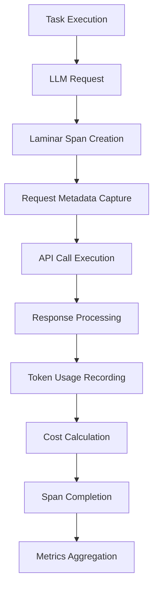

# Laminar LLM Integration

> **System Fun Fact**: Every complex system is just a collection of simple parts working together -
documentation helps us understand how! ⚙️

Comprehensive documentation of how Laminar observability integrates with Kilo Code's
LLM\<write\_to\_file> <path>docs/LAMINAR\_LLM\_INTEGRATION.md</path> <content>

# Laminar LLM Integration

> **Architecture Fun Fact**: Like a well-designed building, good documentation has a solid
foundation, clear structure, and intuitive navigation! 🏗️

Comprehensive documentation of how Laminar observability integrates with Kilo Code's LLM (Large
Language Model) interactions, providing detailed tracing for API calls, token usage, (Large Language
Model) interactions, costs, providing detailed and model performance tracing for metrics.

<details><summary>Table of Contents</summary>
- Overview
- Architecture
- LLM Call Tracing
- Token Usage Tracking
- Cost Monitoring
- Model Information Capture
- Cache Usage Tracking
- Performance Metrics
- Error Handling
- Integration Points
- Code Reference Matrix
- Research Context & Next Steps

## Overview

The LLM IntegrationIntegration Points]\(#key-integration-points)
- Code Reference Matrix
- Navigation

</details all interactions>

## between Kilo Code and Overview

The LLM Integration external subsystem language model APIs handles. The Laminar integration all
interactions provides comprehensive observ between Kilo Code and external language modelability for
these interactions, capturing detailed metrics about APIs. The Laminar token integration provides
usage comprehensive observability for these interactions,, enabling detailed monitoring of costs,
model performance, and cache effectiveness API.

### Key Integration Points calls

- **API Call Tracing**:, resource Every usage, and performance characteristics LLM API call creates
  a.

### Key Integration dedicated Points

span with full context

- **- **API Call Tracing**:Token Accounting**: Precise tracking of input, output, and cached Every
  LLM tokens
- **Cost Calculation**: Real request-time cost/response is captured with full context
- **Token Accounting**: Input computation based on token usage and model rates,
- \*\*Model output, and cache token usage is tracked
- **Cost Calculation**: Real-time cost Metadata computation based\*\*: Capture of model on usage
  patterns version , provider, and- \*\*Model configuration details Metadata\*\*:
- **Cache Analytics**: Model Tracking of cache version, provider, and hits configuration, misses,
  and effectiveness details
- \*\*

Cache## Architecture



### Integration Flow

1 Completion] . \*\* I --> J\[Span Creation\*\*: WhenMetrics Aggregation]

```

### Integration Flow

 an LLM1. **Request Initiation**: Span creation when LLM call is initiated
2. ** call is initiated, a new span is created withMetadata Capture**: request metadata
2. **Request Capture**: All request parameters, Model, provider, and request parameters model
recorded
3. **API Execution**: Actual LLM API call with timing measurement
4. **Response Processing**: settings, Token and context are recorded
3. **API Execution**: The actual API call is wrapped with timing and error tracking
4. **Response counting Processing**: and cost calculation
5. ** Response data, tokensCache Analysis**: used, and Cache performance usage patterns and metrics
are captured
5. **Cost efficiency Calculation**: metrics
6. ** RealSpan Final-time cost computationization**: Complete based on trace usage and data with
performance rates
6. **Span Finalization metrics

## LLM Call Tracing

###**: Span Hierarchy
LLM spans are Complete span nested under with success/failure status and task spans, maintaining
comprehensive metrics

## LLM Call Tracing

### Span Hierarchy

LLM spans are nested under task spans, maintaining execution context:

```

Task Span ├── execution context LLM Span:

```
Task 1
│   ├── Span
├── LLM Span 1
│   ├── Request Metadata
│   ├── API Call Timing
│   ├── Request Preparation Token
│   ├── Usage
│   └── Response Processing API Call
├── LLM Execution
│   ├── Response Span 2
 Processing
│   └── Token└── LLM Span Accounting
 ├── LLM Span 23
```

### Span Metadata

└── LLM SpanEach LLM span includes comprehensive metadata3

````

### Span Metadata

:
- **EachModel LLM span includes comprehensive metadata:
- **Model Information**: Model name, version Information**:, Provider, model name, and provider
- **Request Context**: version, and configuration
- **Request Details**: Prompt length, temperature, max tokens, and other Task parameters ID, user
- **Timing Information**: Request start time, API latency, and total processing time
- ** context,Cost and prompt details
- **API Details**: Endpoint, request ID, and timing information
- **Usage Metrics**: Data**: Real-time cost calculation Token counts, and cost calculations, and
performance data

## Token Usage Tracking

### Token rate information Categories

- **The system tracks multipleCache token types Status**: Whether:
- **Input Tokens**: Tokens sent to the the LLM response came from cache or live API

## Token Usage Tracking

- **Output Tokens**: Tokens received### Token from the LLM
- **Cache Categories
 Read Tokens**: TokensThe served system tracks from cache
- **Cache multiple Write Tokens**: Tokens token types for comprehensive written to cache

### accounting:

- **Input Tokens**: Tokens sent Tracking in the request Implementation
Token usage is prompt
- captured at **Output Tokens**: Tokens multiple levels received in:
 the response
- **Cached- **Per-Request Tokens**:**: Tokens Individual served from cache instead of live API call
API
- **Total Tokens**: token Sum consumption
 of all token- **Per- types forTask**: billing purposes

### Aggregate token usage across all LLM calls Tracking Implementation in a task

- **Per
- SessionToken usage**: Cumulative is captured at usage across user sessions
- ** multiplePer- levels:

```typescript
Model**:// Usage patterns by model Example token tracking in Task.ts
const type tokenMetrics = {
  and inputTokens: provider

## Cost Monitoring

### request Cost Calculation

.tokenReal-time cost computation based onCount,
  outputTokens: response.usage:
- **Token.com Rates**:pletion_tokens,
  cachedTokens: response.usage.cached_tokens Provider-specific pricing per token || 0,
  totalTokens:
- **Model Multipliers**: response Cost adjustments for different model.usage.total_tokens
};

span tiers
- **Cache.setAttributes({
  ' Creditsllm**: Cost.tokens reductions for cache.input': tokenMetrics.inputTokens,
  'llm.tokens.output': token hits
- **MetricsVolume.outputTokens,
  'llm Discounts**:.tokens Tiered pricing for.cached': tokenMetrics.cachedTokens,
  'llm.tokens.total': token high-volume usage

### CostMetrics.totalTokens

});
````

## Cost Attribution

Costs are attributed Monitoring

### Cost Calculation

Real-time cost computation based on at multiple levels:

- **: Per-- **TokenTask**: Rates**: Provider-specific rates for input Total cost of all LLM/output
  tokens calls in
- \*\*Model a task
- **Per Multipliers**: Different rates for-User\*\*: different model Cumulative costs per user
  capabilities session
- \*\*Cache
- **Per-Model**: Discounts\*\*: Cost breakdown Reduced by model costs for and provider cached
  responses
- \*\*
- **Per-Feature**: Cost allocation to specific functionality

## Model Information Capture

### Model Metadata

Comprehensive model information is capturedVolume Discounts\*\*: Tiered pricing for high-volume
usage

### Cost Attribution

Costs are attributed:
- at multiple **Model Name**: levels:
- **Per Specific model identifier (e.g., Request**: gpt-4 Individual API, cl call costs
- \*\*Per Taskaude-3) \*\*:- **Provider**: Aggregated costs for API provider (OpenAI, Anthropic
  entire, etc task execution
- \*\*Per.)
- **Version**: Model User version\*\*: Total and costs for release user sessions information
- \*\*Capabilities
- **Per Model**: Costs\*\*: broken down by model Supported type

## Model Information Capture

features and### limitations Model Metadata Comprehensive model information is

- **Configuration**: captured:
- **Provider**: Temperature, max tokens, and other OpenAI parameters

\###, Anthropic, Google Model, etc.

- **Model Name Performance**: Tracking gpt-4, Performance metrics claude- by3 model:
- **Response Time**:, gem Averageini-pro and, etc.
- \*\*Model percentile response times
- \*\* Version\*\*: Specific versionSuccess Rate or checkpoint
- **Configuration**: Temperature,\*\*: top API call success and error rates\_p,
- **Token Efficiency**: max Tokens per\_tokens request, etc.
- **Capabilities**: and Function calling, cost efficiency
- **Quality Metrics**: vision, Response quality etc.

and relevance### Model scores

## Cache Usage Tracking

### Performance Tracking Cache

Performance metrics Operations The system by tracks model:

- **Response Time cache**: Average read and and write operations:
- \*\* percentileCache Hits\*\*: latencies
- **Success Rate**: Requests served from cache
- API call success **Cache Misses**: Requests requiring percentages
- \*\*Token API calls
- **Cache Efficiency**: Writes\*\*: New Output responses stored in cache
- **Cache quality Invalidation**: Cache per token entries removed used
- \*\*Cost or updated

Efficiency### Cache\*\*: Value Performance Metrics delivered per dollar spentDetailed cache

## Cache Usage Tracking

efficiency### Cache measurements:

- **Hit Rate**: Metrics Percentage of requests served from cacheDetailed cache performance
- \*\* tracking: Cache- **Cache Hit Rate**: Percentage of Latency\*\*: Time to requests retrieve
  served from cache
- **Cache Miss Rate cached**: Percentage responses
- **Storage Efficiency**: requiring live API Cache size calls
- vs. **Cache Effectiveness**: hit rate Token savings optimization
- \*\* from cache usageCost
- **Cache Savings**: Cost Freshness reduction from\*\*: cache usage

## Performance Metrics Age of

### cached responses

### Cache Response Time Tracking

Integration Cache usage is trackedMultiple timing across metrics the system are captured:
- \*\*:
- **ReadAPI Latency**: Time for Operations\*\*: Cache lookups and LLM API hits
- **Write Operations**: to respond
- \*\* New responsesNetwork Latency\*\*: added to Network round cache
- \*\*-trip time
- **ProcessingInvalid Time**:ation Time Events\*\*: to Cache entries process removed
  request/response
- \*\*Total or updated Round
- **-trip**: End-toPerformance-end request Impact\*\*: Latency time

### improvements from cache usage

## Performance Metrics

Throughput### Response Metrics TimeSystem throughput Analysis
- \*\*API Latency measurements:
- **Requests**: Time per Second\*\*: spent waiting API call for API frequency
- \*\* response
- **Processing Time**: Total timeToken Throughput\*\*: for request Tokens processed per second
- \*\*Concurrent processing
- \*\* Requests\*\*:Time to Parallel First Token\*\*: Streaming response request handling
- \*\* startQueue time
- **Token Depth Generation Rate**:\*\*: Request Tokens queuing and per second generation back speed

logs

### Quality Metrics
- \*\*## Error Handling

\###Response Error Classification Completeness\*\*: LLM errors are categorized for analysis:

- **API Errors**: Provider API failures and Whether rate limits responses meet expectations
- **Error Rates**: API error frequencies
- \*\* and types
- **RetryNetwork Errors**: Patterns\*\*: Failed Connectivity and request retry timeout issues
- **Token Errors**: behavior Token- **Fallback limit Usage**: Alternative and model encoding
  problems
- usage patterns

## Error Handling

### Error Classification

LLM errors \*\* areAuthentication categorized for Errors\*\*: better analysis:
- \*\* API key andAPI Errors\*\*: Provider permission-side errors (rate issues

### Error Context

Comprehensive error information limits, captured:
- \*\*Error server errors Codes)
- \***\*: Specific errorNetwork identifiers Errors**: from Connectivity providers and
- **Error Messages**: Detailed timeout issues
- \*\* error descriptions
- **RetryAuthentication Errors**: Information\*\*: Retry attempts and API key and backoff strategies
- \*\* permission issues -Recovery Actions\*\*: Steps taken **Validation Errors**: Request to handle
  errors

## Integration Points

parameter validation failures

### Error Context

### TaskComprehensive error information System Integration

LLM spans are includes:
- \*\*Error children of task spans:
- Task Codes\*\*: Specific error context propagation for correlation
- User identifiers session from providers
- \*\* tracking across LLM calls -Error Messages\*\*: Detailed error descriptions
- \*\* Hierarchical span relationships
- Task-levelRequest usage aggregation Context\*\*:

### Service Layer Integration

What wasThe Lamin beingarService provides attempted when LLM tracing infrastructure:
- error occurred
- **Retry Information**: Standardized span creation Automatic retry attempts and outcomes

## Integration for LLM calls
- Points Token

### counting Task System and Integration

LLM spans are cost calculation utilities
- children of task spans Cache:
- Task usage tracking ID propagation and for metrics
- Error correlation
- User context inheritance
- Session handling and-based retry logic

### grouping
- Hierarchical span relationships

### Service Configuration Integration

Tracing Layer Integration The LaminarService behavior provides LLM-specific utilities:
- Standardized span creation for LLM calls
- Token counting and cost calculation is helpers configurable:
- Tracing level- (detailed, summary, Cache integration disabled)
- Cost calculation and parameters
- tracking
- Cache Model tracking metadata management preferences
- Privacy

### Configuration Integration

LLM tracing and respects data configuration settings:
- Tracing retention settings level configuration

## Code Reference Matrix

(detailed|, Component | File | Key Methods | summary, Laminar Integration | |-----------|------
disabled)
- Cost|-------------|-------------------| | tracking enable Task LLM Integration |
  \[`src/core/taskment /Task.ts`]\(src-/core/task/Task.ts Cache usage) |
  `makeLLMRequest reporting ()`, `process- Privacy andLLMResponse()` | Span creation, data token
  tracking | | LLM Service retention settings

## Code Reference Matrix

| Component | File | Key Methods | |
\[`src/services/llm/ LaminLLMar Integration |
|-----------|------Service.ts`]\(src/services/|-------------llm/LL|-------------------|
|MService.ts) Task | ` LLM Integration | [`src/core/task/Task.ts`](callLLMsrc/core/task/Task.ts)()`,
`|`makeLLMRequest()`, `calculateCost()` |process APILLMResponse()` | Span tracing creation, cost
calculation | |, token Cache tracking | | Manager LLM Service |
[`src/services |
[`src/services/cache/llm/LLMService.ts/CacheManager.ts`](src/services/cache`](src/CacheManager.ts)
| `/services/llm/LLgetMService.ts) | `callAPI()`, `Cached()`, `calculatesetCost()` | APICached()` |
Cache call wrapping, usage tracking | | Token Counter |
[` costsrc calculation | | Token/services/llm/TokenCounter Counter |
[`src/services/llm.ts`](src/services/llm/Token/TokenCounter.ts`](src/services/llCounter.ts)
| `countTokensm()`,
`/TokenCounter.ts) | `countTokens()`, `trackUsage()` | Token accounting | |trackUsage()` | Token
Cost Calculator | \[`src/services/ll accounting | |m/CostCalculator.ts`]\(src/services Cache Manager
| \[`src/services/ll/llm/CostCalculator.ts)m/C | `calculateacheManager.ts`](src/servicesCost/()`,
`llm/CacheManager.ts)update | `getRates()\` | Cost computation |

## NavigationCached()`, `store

<a id="navigation-footer">\</aResponse()\` | Cache>
- Back:
\[`LAMINAR tracking | _SUB| Cost Calculator |
[`SYSTEMS\_README.md`](LAMINsrc/services/llm/CostCalculatorAR_SUBSYSTEMS_README.md:1.ts)
·`]\(src/services/llm/C
  Root: \[`LAMINARostCalculator.ts) | `calculateCost\_SUBSYSTEMS\_README.md`](LAMIN()`,AR\_SUBSYSTEM
  `updateRates()` |S\_README.md:1 Cost computation |

## Navigation

\<a id) · Source: \`/docs/LAMIN="navigation-footer"></a>
- Back: \[`LAMINAR_SUBSYSTEMSAR_LLM_INTEGRATION.md#L1` \_INDEX

## 🔍 Research Context & Next Steps

### When You're Here, You Can:

- *Understanding Laminar Observability:*\*

- **Next**: Check related Laminar documentation in the same directory

- **Related**: [Technical Glossary](../GLOSSARY.md) for terminology,
  [Laminar Documentation](README.md) for context

- *Implementing Observability Features:*\*

- **Next**: [Repository Development Guide](../architecture/GETTING_STARTED.md) →
  [Testing Infrastructure](../testing/TESTING_STRATEGY.md)

- **Related**: [Orchestrator Documentation](../orchestrator/README.md) for integration patterns

- *Troubleshooting Observability Issues:*\*

- **Next**: [Race Condition Analysis](../architecture/README.md) →
  [Root Cause Analysis](../architecture/DUPLICATE_API_REQUESTS_ROOT_CAUSE_ANALYSIS.md)

- **Related**: [Orchestrator Error Handling](../orchestrator/ORCHESTRATOR_ERROR_HANDLING.md) for
  common issues

### No Dead Ends Policy

Every page provides clear next steps based on your research goals. If you're unsure where to go
next, return to [Laminar Documentation](README.md) for guidance.

## Navigation Footer
- \*\*

- *Navigation*\*: [← Back to Laminar Documentation](README.md) ·
  [📚 Technical Glossary](../GLOSSARY.md) · [↑ Table of Contents](#-research-context--next-steps)
