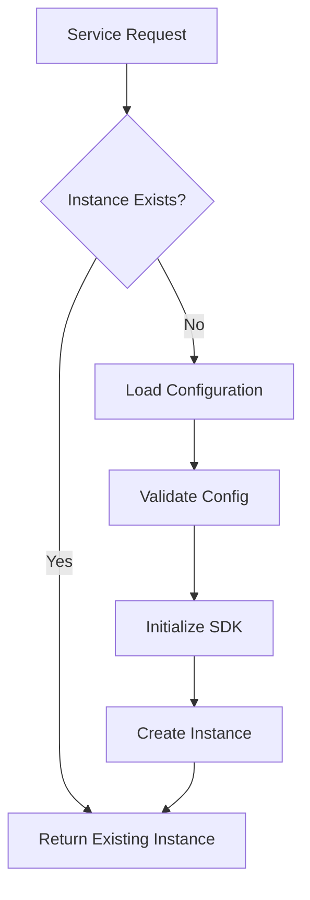

# Laminar Service Layer

## Table of Contents

* [Laminar Service Layer](#laminar-service-layer)
* [Table of Contents](#table-of-contents)
* [When You're Here](#when-youre-here)
* [Overview](#overview)
* [Role in Laminar Integration](#role-in-laminar-integration)
* [Integration Scope](#integration-scope)
* [Service Architecture](#service-architecture)
* [Core Components](#core-components)
* [Service Initialization](#service-initialization)
* [Singleton Pattern Implementation](#singleton-pattern-implementation)
* [Singleton Mechanics](#singleton-mechanics)
* [Instance Management](#instance-management)
* [Span Lifecycle Management](#span-lifecycle-management)
* [Span Creation](#span-creation)
* [Span Updates](#span-updates)
* [Span Completion](#span-completion)
* [Exception Recording](#exception-recording)
* [Exception Capture](#exception-capture)
* [Error Context](#error-context)
* [Telemetry Integration](#telemetry-integration)
* [Opt-out Compliance](#optout-compliance)
* [Data Collection Policies](#data-collection-policies)
* [Performance Considerations](#performance-considerations)
* [Overhead Minimization](#overhead-minimization)
* [Resource Management](#resource-management)
* [Error Handling](#error-handling)
* [Service Errors](#service-errors)
* [Recovery Mechanisms](#recovery-mechanisms)
* [Integration Points](#integration-points)
* [Task System Integration](#task-system-integration)
* [Other Subsystems](#other-subsystems)
* [Code Reference Matrix](#code-reference-matrix)
* [Implementation Timeline](#implementation-timeline)
* [🔍 Research Context & Next Steps](#-research-context--next-steps)
* [When You're Here, You Can:](#when-youre-here-you-can)
* [No Dead Ends Policy](#no-dead-ends-policy)
* [Navigation Footer](#navigation-footer)
* [No Dead Ends Policy](#no-dead-ends-policy)
* [Laminar Service Layer](#laminar-service-layer)
* [Table of Contents](#table-of-contents)
* [Overview](#overview)
* [Role in Laminar Integration](#role-in-laminar-integration)
* [Integration Scope](#integration-scope)
* [Service Architecture](#service-architecture)
* [Core Components](#core-components)
* [Service Initialization](#service-initialization)
* [Singleton Pattern Implementation](#singleton-pattern-implementation)
* [Singleton Mechanics](#singleton-mechanics)
* [Instance Management](#instance-management)
* [Span Lifecycle Management](#span-lifecycle-management)
* [Span Creation](#span-creation)
* [Span Updates](#span-updates)
* [Span Completion](#span-completion)
* [Exception Recording](#exception-recording)
* [Exception Capture](#exception-capture)
* [Error Context](#error-context)
* [Telemetry Integration](#telemetry-integration)
* [Opt-out Compliance](#optout-compliance)
* [Data Collection Policies](#data-collection-policies)
* [Performance Considerations](#performance-considerations)
* [Overhead Minimization](#overhead-minimization)
* [Resource Management](#resource-management)
* [Error Handling](#error-handling)
* [Service Errors](#service-errors)
* [Recovery Mechanisms](#recovery-mechanisms)
* [Integration Points](#integration-points)
* [Task System Integration](#task-system-integration)
* [Other Subsystems](#other-subsystems)
* [Code Reference Matrix](#code-reference-matrix)
* [Implementation Timeline](#implementation-timeline)
* [🔍 Research Context & Next Steps](#-research-context--next-steps)
* [When You're Here, You Can:](#when-youre-here-you-can)
* [No Dead Ends Policy](#no-dead-ends-policy)
* [Navigation Footer](#navigation-footer)

> **System Fun Fact**: Every complex system is just a collection of simple parts working together -
> documentation helps us understand how! ⚙️

* *Purpose:*\* This document describes the LaminarService singleton implementation, detailing span
  lifecycle management, exception recording, telemetry integration, and the core infrastructure that
  enables observability across Kilo Code subsystems.

> **Quantum Physics Fun Fact**: Laminar observability is like quantum entanglement - it creates
> instant connections between distant parts of the system, allowing us to observe the entire state
> from any single point! ⚛️

<details><summary>Table of Contents</summary>
- [Overview](#overview)
- [Service Architecture](#service-architecture)
- [Singleton Pattern Implementation](#singleton-pattern-implementation)
- [Span Lifecycle Management](#span-lifecycle-management)
- [Exception Recording](#exception-recording)
- [Telemetry Integration](#telemetry-integration)
- [Performance Considerations](#performance-considerations)
- Error Handling
- Integration Points
- Code Reference Matrix
- Implementation Timeline

</details>

## When You're Here

This document is part of the KiloCode project documentation. If you're not familiar with this
document's role or purpose, this section helps orient you.

* **Purpose**: \[Brief description of what this document covers]
* **Audience**: \[Who should read this document]
* **Prerequisites**: \[What you should know before reading]
* **Related Documents**: \[Links to related documentation]

## Overview

The Service Layer provides the core LaminarService singleton that manages observability
functionality across Kilo Code, implementing span lifecycle management, exception recording, and
integration with existing telemetry systems.

### Role in Laminar Integration

The service layer is responsible for:

* **Span Management:** Creating, updating, and completing observation spans
* **Exception Handling:** Recording and tracking errors across subsystems
* **Singleton Coordination:** Ensuring consistent observability state
* **Telemetry Integration:** Respecting existing telemetry opt-out preferences
* **Performance Monitoring:** Minimizing overhead while providing comprehensive insights

### Integration Scope

This subsystem serves as the central hub for all observability operations, providing APIs that other
subsystems use to instrument their functionality with tracing and monitoring capabilities.

## Service Architecture

### Core Components

* *LaminarService Class:*\*

```typescript
class LaminarService {
	private static instance: LaminarService
	private config: LaminarConfig
	private activeSpans: Map<string, Span>

	private constructor(config: LaminarConfig) {
		this.config = config
		this.activeSpans = new Map()
	}

	static getInstance(): LaminarService {
		// Singleton implementation
	}
}
```

* *Key Responsibilities:*\*
* Singleton instance management
* Configuration handling
* Span lifecycle coordination
* Exception recording
* Telemetry opt-out compliance

### Service Initialization

* *Initialization Process:*\*

1. Configuration validation and loading
2. Singleton instance creation
3. Laminar SDK initialization
4. Telemetry preference checking
5. Service readiness verification

* *Initialization Flow:*\*



## Singleton Pattern Implementation

### Singleton Mechanics

* *Thread-Safe Implementation:*\*

```typescript
private static instance: LaminarService | null = null;
private static instancePromise: Promise<LaminarService> | null = null;

static async getInstance(): Promise<LaminarService> {
  if (this.instance) return this.instance;

  if (this.instancePromise) return this.instancePromise;

  this.instancePromise = this.createInstance();
  this.instance = await this.instancePromise;
  this.instancePromise = null;

  return this.instance;
}
```

* *Benefits:*\*
* Ensures single instance across the application
* Prevents duplicate initialization
* Thread-safe in Node.js environment
* Lazy initialization for performance

### Instance Management

* *Lifecycle Management:*\*
* Creation on first access
* Persistent throughout application lifetime
* Proper cleanup on application shutdown
* Memory leak prevention

## Span Lifecycle Management

### Span Creation

* *Span Types:*\*

* **Root Spans:** Top-level operation spans (e.g., task execution)

* **Child Spans:** Nested operation spans (e.g., tool invocations)

* **Detached Spans:** Independent operation tracking

* *Creation API:*\*

```typescript
createSpan(name: string, parentSpan?: Span): Span {
  const span = tracer.startSpan(name, {
    parent: parentSpan
  });
  this.activeSpans.set(span.id, span);
  return span;
}
```

### Span Updates

* *Span Attributes:*\*

* Operation name and description

* Start and end timestamps

* Custom attributes and tags

* Error status and messages

* *Update Methods:*\*

```typescript
updateSpan(span: Span, attributes: Record<string, any>): void {
  Object.entries(attributes).forEach(([key, value]) => {
    span.setAttribute(key, value);
  });
}
```

### Span Completion

* *Completion Process:*\*

1. Set final attributes
2. Record completion status
3. Calculate duration
4. End span and clean up references

* *Completion API:*\*

```typescript
completeSpan(span: Span, error?: Error): void {
  if (error) {
    span.recordException(error);
    span.setStatus({ code: SpanStatusCode.ERROR });
  } else {
    span.setStatus({ code: SpanStatusCode.OK });
  }
  span.end();
  this.activeSpans.delete(span.id);
}
```

## Exception Recording

### Exception Capture

* *Exception Types:*\*

* **Operational Errors:** API failures, network issues

* **Application Errors:** Logic errors, invalid states

* **System Errors:** Resource exhaustion, crashes

* *Recording Implementation:*\*

```typescript
recordException(span: Span, error: Error, attributes?: Record<string, any>): void {
  span.recordException(error, attributes);
  span.setAttribute('error.type', error.name);
  span.setAttribute('error.message', error.message);
}
```

### Error Context

* *Context Information:*\*

* Stack traces and error locations

* Operation context at time of error

* User and session information

* System state snapshots

* *Context Enrichment:*\*

```typescript
private enrichErrorContext(error: Error): Record<string, any> {
  return {
    'error.stack': error.stack,
    'error.timestamp': Date.now(),
    'service.version': this.getServiceVersion(),
    'environment': this.config.environment
  };
}
```

## Telemetry Integration

### Opt-out Compliance

* *Telemetry Preferences:*\*

* Respect existing VS Code telemetry settings

* Check for user opt-out preferences

* Disable observability when requested

* Clear communication about data collection

* *Integration Logic:*\*

```typescript
private shouldCollectTelemetry(): boolean {
  const telemetryEnabled = vscode.workspace.getConfiguration('telemetry').get('enableTelemetry');
  const laminarEnabled = this.config.enabled;
  return telemetryEnabled && laminarEnabled;
}
```

### Data Collection Policies

* *Minimal Data Collection:*\*
* Only collect necessary observability data
* Anonymize user-identifiable information
* Respect privacy regulations
* Provide clear opt-out mechanisms

## Performance Considerations

### Overhead Minimization

* *Lazy Initialization:*\*

* Initialize components only when needed

* Conditional span creation based on configuration

* Minimal impact on critical paths

* *Efficient Operations:*\*

* Batch span operations when possible

* Use lightweight data structures

* Avoid blocking operations in span management

### Resource Management

* *Memory Usage:*\*

* Clean up completed spans promptly

* Prevent span reference leaks

* Monitor memory usage patterns

* *CPU Overhead:*\*

* Minimize synchronous operations

* Use background processing for non-critical tasks

* Profile and optimize hot paths

## Error Handling

### Service Errors

* *Initialization Failures:*\*

* Configuration validation errors

* SDK initialization failures

* Permission or connectivity issues

* *Runtime Errors:*\*

* Span operation failures

* Exception recording errors

* Telemetry transmission failures

### Recovery Mechanisms

* *Graceful Degradation:*\*

* Continue operation with reduced observability

* Log errors without crashing the application

* Retry failed operations with backoff

* *Error Propagation:*\*

* Surface critical errors to calling code

* Provide meaningful error messages

* Include debugging information

## Integration Points

### Task System Integration

* *Task Lifecycle Tracing:*\*

* Span creation for task execution

* LLM call monitoring

* Tool invocation tracking

* *Integration API:*\*

```typescript
// Task system usage
const span = await laminarService.createSpan("task.execution")
try {
	await executeTask()
	laminarService.completeSpan(span)
} catch (error) {
	laminarService.recordException(span, error)
	throw error
}
```

### Other Subsystems

* *Tool System:*\* Tool execution span management **Authentication:** User context attribution
* *Checkpoints:*\* State persistence tracing **Decorators:** Automatic instrumentation

## Code Reference Matrix

| Component          | Primary Functions                    | Key Files
| Integration Points     |
| ------------------ | ------------------------------------ |
\---------------------------------------- | ---------------------- |
| Singleton          | `getInstance()`, instance management |
`src/services/laminar/LaminarService.ts` | All subsystems         |
| Span Management    | `createSpan()`, `completeSpan()`     |
`src/services/laminar/LaminarService.ts` | Task execution         |
| Exception Handling | `recordException()`                  |
`src/services/laminar/LaminarService.ts` | Error tracking         |
| Configuration      | Config validation and loading        |
`src/services/laminar/LaminarService.ts` | Service initialization |

## Implementation Timeline

* *Estimated Time:*\* 45 minutes

| Step | Description                   | Time   | Status  |
| ---- | ----------------------------- | ------ | ------- |
| 1    | Implement singleton pattern   | 10 min | Pending |
| 2    | Add span lifecycle management | 15 min | Pending |
| 3    | Implement exception recording | 10 min | Pending |
| 4    | Add telemetry integration     | 5 min  | Pending |
| 5    | Performance optimization      | 5 min  | Pending |

<a id="navigation-footer"></a>

* Back: [`LAMINAR_SUBSYSTEMS_README.md`](LAMINAR_SUBSYSTEMS_README.md:1) · Root:
  [`README.md`](README.md:1) · Source: `/docs/LAMINAR_SERVICE_LAYER.md#L1`

## 🔍 Research Context & Next Steps

### When You're Here, You Can:

* *Understanding Laminar Observability:*\*

* **Next**: Check related Laminar documentation in the same directory

* **Related**: [Technical Glossary](../../GLOSSARY.md) for terminology,
  [Laminar Documentation](README.md) for context

* *Implementing Observability Features:*\*

* **Next**: [Repository Development Guide](GETTING_STARTED.md) →
  [Testing Infrastructure](../../testing/TESTING_STRATEGY.md)

* **Related**: [Orchestrator Documentation](../orchestrator/README.md) for integration patterns

* *Troubleshooting Observability Issues:*\*

* **Next**: [Race Condition Analysis](../README.md) →
  [Root Cause Analysis](DUPLICATE_API_REQUESTS_ROOT_CAUSE_ANALYSIS.md)

* **Related**: [Orchestrator Error Handling](../orchestrator/ORCHESTRATOR_ERROR_HANDLING.md) for
  common issues

### No Dead Ends Policy

Every page provides clear next steps based on your research goals. If you're unsure where to go
next, return to [Laminar Documentation](README.md) for guidance.

## Navigation Footer

* \*\*

## No Dead Ends Policy

Every section in this document connects you to your next step:

* **If you're new here**: Start with the [When You're Here](#when-youre-here) section

* **If you need context**: Check the [Research Context](#research-context) section

* **If you're ready to implement**: Jump to the implementation sections

* **If you're stuck**: Visit our [Troubleshooting Guide](../../tools/TROUBLESHOOTING_GUIDE.md)

* **If you need help**: Check the [Technical Glossary](../../GLOSSARY.md)

* *Navigation*\*: [← Back to Laminar Documentation](README.md) ·
  [📚 Technical Glossary](../../GLOSSARY.md) · [↑ Table of Contents](#-research-context--next-steps)
