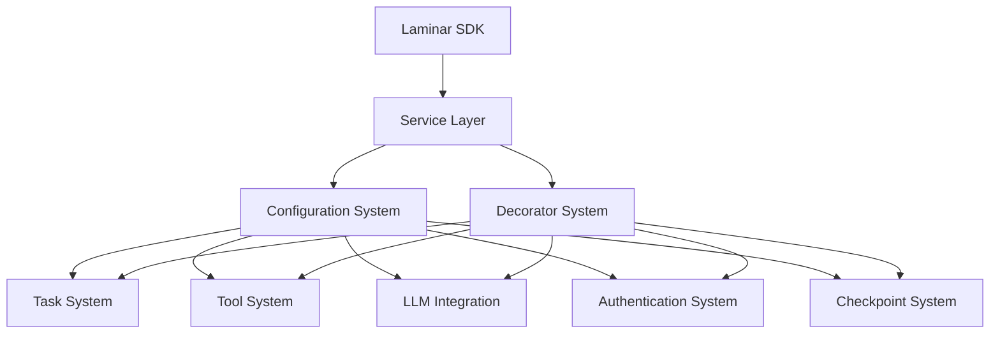
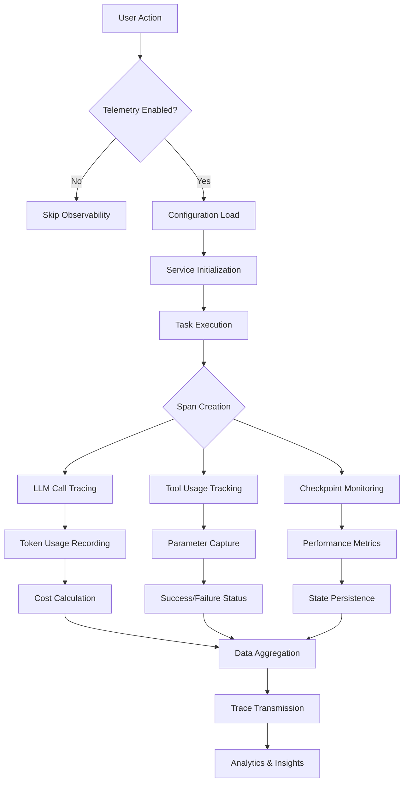

# Laminar Subsystems Index

## Table of Contents

* [Laminar Subsystems Index](#laminar-subsystems-index)
* [Table of Contents](#table-of-contents)
* [When You're Here](#when-youre-here)
* [Overview](#overview)
* [High-Level Responsibilities](#high-level-responsibilities)
* [Core Concepts At a Glance](#core-concepts-at-a-glance)
* [Integration Architecture](#integration-architecture)
* [Architecture Layers](#architecture-layers)
* [Documentation Map](#documentation-map)
* [Quick Reference Matrix](#quick-reference-matrix)
* [Subsystem Flow Diagram](#subsystem-flow-diagram)
* [Observability Principles](#observability-principles)
* [Change Management & Versioning](#change-management--versioning)
* [Glossary](#glossary)
* [🔍 Research Context & Next Steps](#-research-context--next-steps)
* [When You're Here, You Can:](#when-youre-here-you-can)
* [No Dead Ends Policy](#no-dead-ends-policy)
* [Navigation Footer](#navigation-footer)
* [No Dead Ends Policy](#no-dead-ends-policy)
* [Laminar Subsystems Index](#laminar-subsystems-index)
* [Table of Contents](#table-of-contents)
* [Overview](#overview)
* [High-Level Responsibilities](#high-level-responsibilities)
* [Core Concepts At a Glance](#core-concepts-at-a-glance)
* [Integration Architecture](#integration-architecture)
* [Architecture Layers](#architecture-layers)
* [Documentation Map](#documentation-map)
* [Quick Reference Matrix](#quick-reference-matrix)
* [Subsystem Flow Diagram](#subsystem-flow-diagram)
* [Observability Principles](#observability-principles)
* [Change Management & Versioning](#change-management--versioning)
* [Glossary](#glossary)
* [🔍 Research Context & Next Steps](#-research-context--next-steps)
* [When You're Here, You Can:](#when-youre-here-you-can)
* [No Dead Ends Policy](#no-dead-ends-policy)
* [Navigation Footer](#navigation-footer)

> **System Fun Fact**: Every complex system is just a collection of simple parts working together -
> documentation helps us understand how! ⚙️

* *Mission:*\* To provide a centralized, comprehensive, and easily navigable guide to the Laminar
  observability subsystems integrated into Kilo Code, enabling developers to understand, monitor, and
  extend tracing capabilities across task execution, tool usage, and LLM interactions with confidence.

## When You're Here

This document is part of the KiloCode project documentation. If you're not familiar with this
document's role or purpose, this section helps orient you.

* **Purpose**: \[Brief description of what this document covers]
* **Audience**: \[Who should read this document]
* **Prerequisites**: \[What you should know before reading]
* **Related Documents**: \[Links to related documentation]

## Overview

This document serves as the master index for the Laminar observability subsystems integrated into
Kilo Code. Its purpose is to provide a high-level overview and a centralized entry point into the
more detailed documentation covering specific subsystems of the Laminar integration. It establishes
the conceptual framework and key terminology used throughout the suite.

* *Scope:*\*

* **IN SCOPE:** High-level architecture of Laminar subsystems, their responsibilities, key
  components, integration points, and a map to all sibling Laminar documents.

* **OUT OF SCOPE:** Detailed implementation logic, specific tracing mechanics, low-level state
  management, or UI-specific interactions. These topics are delegated to the specialized documents
  linked in the [Documentation Map](#documentation-map).

* \*\*

## High-Level Responsibilities

The Laminar integration is responsible for providing comprehensive observability across Kilo Code's
execution flow. This includes tracing task lifecycles, monitoring tool usage, tracking LLM
interactions, and ensuring privacy-compliant data collection.

* **Task Lifecycle Tracing:** Complete span coverage from task initialization through completion,
  capturing all execution phases and state transitions.

* **Tool Usage Monitoring:** Detailed tracking of tool invocations, parameter capture, performance
  metrics, and success/failure status.

* **LLM Interaction Recording:** Comprehensive monitoring of API calls, token usage, costs, model
  information, and cache utilization.

* **User Context Attribution:** Linking traces to authenticated users while respecting privacy
  settings and telemetry opt-out preferences.

* **Automatic Instrumentation:** Providing decorators and utilities for seamless observability
  integration without code modification.

* **Performance Oversight:** Ensuring tracing overhead remains minimal while providing actionable
  insights.

* \*\*

## Core Concepts At a Glance

* **Span:** A unit of work with a start time, end time, and associated metadata representing an
  operation's execution.

* **Trace:** A collection of spans that together represent the end-to-end execution of a request or
  task.

* **Observability:** The ability to understand system behavior through logs, metrics, and traces.

* **Decorator:** A TypeScript decorator that automatically instruments methods with tracing
  capabilities.

* **Singleton Service:** The central LaminarService that manages span lifecycle and provides tracing
  APIs.

* **Configuration System:** Environment-aware configuration management for API keys, endpoints, and
  feature flags.

* **Telemetry Opt-out:** User-controlled mechanism to disable observability data collection.

* **Context Propagation:** Passing trace context between different parts of the system to maintain
  correlation.

* \*\*

## Integration Architecture

The Laminar integration follows a layered architecture that ensures clean separation of concerns and
minimal coupling with existing code:

### Architecture Layers

* **Foundation Layer:** SDK integration and basic configuration

* **Service Layer:** Core tracing infrastructure and APIs

* **Integration Layer:** Subsystem-specific tracing implementations

* **Instrumentation Layer:** Automatic decoration and monitoring

* **Validation Layer:** Testing and quality assurance

* \*\*

## Documentation Map

This table maps out the complete Laminar subsystems suite and their relationships.

| Document                           | Purpose                                                    |
Primary Audience  | Key Cross-Links            |
| :--------------------------------- | :--------------------------------------------------------- |
:---------------- | :------------------------- |
| **LAMINAR\_SUBSYSTEMS\_README.md**   | **This document.** High-level entry point and map.
| All Devs          | All sibling docs           |
| `LAMINAR_DEPENDENCY_MANAGEMENT.md` | Package installation, version management, compatibility.   |
DevOps, Core Devs | `LAMINAR_PORT.md`          |
| `LAMINAR_CONFIGURATION_SYSTEM.md`  | Environment config, API keys, validation, security.        |
Core Devs         | `LAMINAR_SERVICE_LAYER.md` |
| `LAMINAR_SERVICE_LAYER.md`         | Singleton service, span lifecycle, exception recording.    |
Core Devs         | All integration docs       |
| `LAMINAR_DECORATOR_SYSTEM.md`      | Automatic instrumentation, method decoration, I/O capture. |
Core Devs         | `LAMINAR_SERVICE_LAYER.md` |
| `LAMINAR_TASK_SYSTEM.md`           | Task lifecycle tracing, LLM integration, performance.      |
Core Devs         | `LAMINAR_PORT.md`          |
| `LAMINAR_TOOL_SYSTEM.md`           | Tool execution monitoring, parameter tracking.             |
Core Devs         | `LAMINAR_PORT.md`          |
| `LAMINAR_LLM_INTEGRATION.md`       | API call tracing, token usage, cost tracking.              |
Core Devs         | `LAMINAR_PORT.md`          |
| `LAMINAR_AUTHENTICATION_SYSTEM.md` | User context, session tracking, privacy compliance.        |
Core Devs         | `LAMINAR_PORT.md`          |
| `LAMINAR_CHECKPOINT_SYSTEM.md`     | State persistence tracing, performance metrics.            |
Core Devs         | `LAMINAR_PORT.md`          |
| `LAMINAR_TESTING_SYSTEM.md`        | Integration tests, performance validation, accuracy.       |
QA, Core Devs     | All subsystem docs         |

* \*\*

## Quick Reference Matrix

| Concept              | Primary Components                              | Linked Detailed Doc
|
| :------------------- | :---------------------------------------------- |
:--------------------------------- |
| Span Management      | `LaminarService.createSpan()`, `completeSpan()` |
`LAMINAR_SERVICE_LAYER.md`         |
| Task Tracing         | Task constructor, lifecycle methods             | `LAMINAR_TASK_SYSTEM.md`
|
| Tool Monitoring      | Tool invocation wrappers, parameter capture     | `LAMINAR_TOOL_SYSTEM.md`
|
| LLM Tracking         | API request/response interceptors               |
`LAMINAR_LLM_INTEGRATION.md`       |
| User Attribution     | Context propagation, session tracking           |
`LAMINAR_AUTHENTICATION_SYSTEM.md` |
| Automatic Decoration | `@observeDecorator`, method wrapping            |
`LAMINAR_DECORATOR_SYSTEM.md`      |
| Configuration        | Environment detection, API key management       |
`LAMINAR_CONFIGURATION_SYSTEM.md`  |
| Testing              | Integration suites, performance benchmarks      |
`LAMINAR_TESTING_SYSTEM.md`        |

* \*\*

## Subsystem Flow Diagram

This diagram illustrates the high-level flow of observability data through the Laminar subsystems.

* \*\*

## Observability Principles

The Laminar integration adheres to several key observability principles to ensure effective
monitoring while maintaining system performance and user privacy:

* **Minimal Overhead:** Tracing operations add less than 5% performance overhead

* **Privacy First:** Strict opt-out compliance and data minimization

* **Correlation:** All spans include correlation IDs for trace linking

* **Context Propagation:** Trace context flows through async operations

* **Error Transparency:** Exceptions are recorded without exposing sensitive data

* **Configurable Granularity:** Different detail levels for development vs production

* **Backwards Compatibility:** Integration doesn't break existing functionality

* \*\*

## Change Management & Versioning

To keep documentation synchronized with the codebase, follow these principles:

1. **Atomic Documentation:** All code changes that affect Laminar functionality MUST be accompanied
   by corresponding documentation updates in the same commit.
2. **Link Integrity:** When refactoring, ensure all clickable code references remain valid with
   correct line numbers.
3. **Diagram Updates:** Architectural or flow changes must be reflected in the relevant Mermaid
   diagrams.
4. **Version Compatibility:** Document version requirements and compatibility constraints for
   Laminar SDK updates.

* \*\*

## Glossary

* **Span:** A single unit of work with timing and metadata.

* **Trace:** A tree of spans representing a complete request flow.

* **Decorator:** A TypeScript feature for modifying class/method behavior.

* **Singleton:** A design pattern ensuring only one instance of a class exists.

* **Observability:** The ability to understand system internal state from external outputs.

* **Telemetry:** Automated collection and transmission of system data.

* **Context Propagation:** Passing trace information across service boundaries.

* **Opt-out:** User-controlled mechanism to disable data collection.

* \*\*

End of document.

## 🔍 Research Context & Next Steps

### When You're Here, You Can:

* *Understanding Laminar Observability:*\*

* **Next**: Check related Laminar documentation in the same directory

* **Related**: [Technical Glossary](../GLOSSARY.md) for terminology,
  [Laminar Documentation](README.md) for context

* *Implementing Observability Features:*\*

* **Next**: [Repository Development Guide](../architectu../../GETTING_STARTED.md) →
  [Testing Infrastructure](../../testing/TESTING_STRATEGY.md)

* **Related**: [Orchestrator Documentation](../orchestrator/README.md) for integration patterns

* *Troubleshooting Observability Issues:*\*

* **Next**: [Race Condition Analysis](../README.md) →
  [Root Cause Analysis](../architecture/DUPLICATE_API_REQUESTS_ROOT_CAUSE_ANALYSIS.md)

* **Related**: [Orchestrator Error Handling](../orchestrator/ORCHESTRATOR_ERROR_HANDLING.md) for
  common issues

### No Dead Ends Policy

Every page provides clear next steps based on your research goals. If you're unsure where to go
next, return to [Laminar Documentation](README.md) for guidance.

## Navigation Footer

* \*\*

## No Dead Ends Policy

Every section in this document connects you to your next step:

* **If you're new here**: Start with the [When You're Here](#when-youre-here) section

* **If you need context**: Check the [Research Context](#-research-context--next-steps) section

* **If you're ready to implement**: Jump to the implementation sections

* **If you're stuck**: Visit our [Troubleshooting Guide](../../tools/TROUBLESHOOTING_GUIDE.md)

* **If you need help**: Check the [Technical Glossary](../GLOSSARY.md)

* *Navigation*\*: [← Back to Laminar Documentation](README.md) ·
  [📚 Technical Glossary](../GLOSSARY.md) · [↑ Table of Contents](#-research-context--next-steps)

