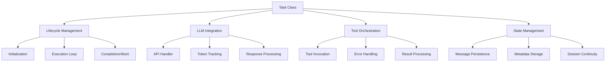
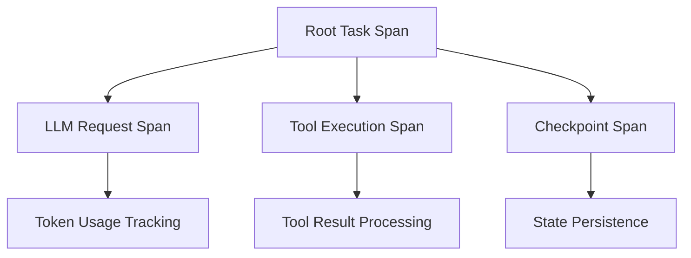

# Laminar Task System Integration

> **Architecture Fun Fact**: Like a well-designed building, good documentation has a solid foundation, clear structure, and intuitive navigation! 🏗️

**Mission:** To provide comprehensive documentation of the Task System's integration with Laminar
observability, detailing how task lifecycle tracing, LLM interactions, and performance monitoring
enable detailed insights into Kilo Code's execution flow while maintaining system reliability and
user privacy.

## Table of Contents

- [Overview](#overview)
    - [Role in Kilo Code](#role-in-kilo-code)
    - [Laminar Integration Scope](#laminar-integration-scope)
- [Task System Architecture](#task-system-architecture)
    - [Core Components](#core-components)
- [Laminar Integration Points](#laminar-integration-points)
    - [Task Lifecycle Tracing](#task-lifecycle-tracing)
    - [Span Hierarchy](#span-hierarchy)
    - [Span Metadata](#span-metadata)
- [LLM Integration Within Tasks](#llm-integration-within-tasks)
    - [Token Usage Tracking](#token-usage-tracking)
    - [Cost Tracking and Model Information](#cost-tracking-and-model-information)
    - [Cache Usage Tracking](#cache-usage-tracking)
- [Authentication and User Context](#authentication-and-user-context)
    - User Context Integration
    - [Privacy Considerations](#privacy-considerations)
- [Performance Considerations](#performance-considerations)
    - [Overhead Minimization](#overhead-minimization)
    - [Resource Management](#resource-management)
    - [Performance Metrics](#performance-metrics)
- [Error Handling and Recovery](#error-handling-and-recovery)
    - [Error Classification](#error-classification)
    - [Recovery Mechanisms](#recovery-mechanisms)
    - [Monitoring and Alerting](#monitoring-and-alerting)
- [Integration with Other Subsystems](#integration-with-other-subsystems)
    - [Tools Subsystem Integration](#tools-subsystem-integration)
    - [Checkpoints Subsystem Integration](#checkpoints-subsystem-integration)
    - [Service Layer Integration](#service-layer-integration)
- Code Reference Matrix
- Implementation Timeline
- [🔍 Research Context & Next Steps](#-research-context--next-steps)
    - [When You're Here, You Can:](#when-youre-here-you-can)
    - [No Dead Ends Policy](#no-dead-ends-policy)

## Overview

The Task System in Kilo Code serves as the core execution engine, managing the lifecycle of
user-initiated tasks from creation through completion. Task.ts implements the central Task class
that orchestrates LLM interactions, tool execution, and state management.

### Role in Kilo Code

The Task System is responsible for:

- **Task Lifecycle Management:** Coordinating the complete execution flow from user request to task
  completion
- **LLM Integration:** Managing API calls, token usage tracking, and response processing
- **Tool Orchestration:** Executing and monitoring tool invocations with error handling
- **State Persistence:** Maintaining conversation history and task metadata across sessions
- **Performance Monitoring:** Tracking execution metrics and resource utilization

### Laminar Integration Scope

The Laminar integration adds comprehensive observability to the Task System through:

- **Task Lifecycle Tracing:** Complete span coverage from task initialization to completion
- **LLM Call Monitoring:** Detailed tracking of API interactions, costs, and performance
- **Tool Execution Tracing:** Monitoring of tool invocations and their outcomes
- **User Context Attribution:** Linking traces to authenticated users while respecting privacy
- **Performance Metrics:** Real-time monitoring of system performance and resource usage

---

## Task System Architecture

The Task System follows a layered architecture with clear separation of concerns:



### Core Components

- **Task Class:** Main orchestrator implementing the TaskLike interface
- **API Handler:** Manages LLM API interactions and streaming responses
- **Tool Repetition Detector:** Prevents infinite tool execution loops
- **Message Queue Service:** Handles asynchronous user message processing
- **Checkpoint Service:** Provides state persistence and restoration capabilities

---

## Laminar Integration Points

Laminar observability is integrated at key points throughout the Task System lifecycle:

### Task Lifecycle Tracing

**Span Creation and Management:**

- Task spans are created during initialization in the constructor
- Spans are nested hierarchically to reflect task structure
- Parent-child relationships are maintained for subtask tracing
- Span completion occurs on task end, abort, or disposal

**Key Integration Points:**

- [`constructor`](src/core/task/Task.ts#L317): Task span initialization
- [`startTask`](src/core/task/Task.ts#L1231): Task execution span creation
- [`abortTask`](src/core/task/Task.ts#L1532): Span completion on abort
- [`dispose`](src/core/task/Task.ts#L1558): Final span cleanup

### Span Hierarchy



### Span Metadata

Each span includes comprehensive metadata:

- Task ID and instance ID for correlation
- User context and authentication information
- Performance metrics (duration, resource usage)
- Error information and stack traces
- Custom attributes for debugging and analysis

---

## LLM Integration Within Tasks

The Task System provides deep integration with LLM providers, tracking all aspects of API
interactions:

### Token Usage Tracking

**Comprehensive Token Monitoring:**

- Input tokens: Prompt and context tokens sent to LLM
- Output tokens: Response tokens generated by LLM
- Cache write tokens: Tokens written to provider cache
- Cache read tokens: Tokens retrieved from provider cache

**Implementation Details:**

```typescript
// Token accumulation during streaming
case "usage":
    inputTokens += chunk.inputTokens
    outputTokens += chunk.outputTokens
    cacheWriteTokens += chunk.cacheWriteTokens ?? 0
    cacheReadTokens += chunk.cacheReadTokens ?? 0
    totalCost = chunk.totalCost
    break
```

### Cost Tracking and Model Information

**Cost Calculation:**

- Real-time cost computation based on token usage
- Model-specific pricing integration
- Cache usage cost optimization tracking
- Total cost accumulation across task lifecycle

**Model Information Capture:**

- Model ID and provider identification
- Model capabilities and limitations
- Context window size and token limits
- Supported features (images, tools, etc.)

### Cache Usage Tracking

**Cache Performance Monitoring:**

- Cache hit/miss ratios for read operations
- Cache write efficiency metrics
- Cost savings from cache utilization
- Cache invalidation and refresh tracking

**Key Code Locations:**

- [`recursivelyMakeClineRequests`](src/core/task/Task.ts#L1749): Main LLM interaction loop
- [`attemptApiRequest`](src/core/task/Task.ts#L2667): API request execution
- [`drainStreamInBackgroundToFindAllUsage`](src/core/task/Task.ts#L2092): Background usage
  collection

---

## Authentication and User Context

The Task System integrates user authentication and context throughout the observability layer:

### User Context Integration

**Authentication Flow:**

- User ID association with all task spans
- Session tracking across task lifecycles
- Privacy-compliant data handling
- Opt-out mechanism for telemetry

**Context Propagation:**

```typescript
private getContext(): vscode.ExtensionContext {
    const context = this.context
    if (!context) {
        throw new Error("Unable to access extension context")
    }
    return context
}
```

### Privacy Considerations

**Data Minimization:**

- Only essential user identifiers captured
- No sensitive personal information in traces
- Configurable telemetry opt-out
- Compliance with privacy regulations

**Session Management:**

- Session ID generation and tracking
- Cross-session continuity for resumed tasks
- Secure context storage and retrieval

---

## Performance Considerations

The Laminar integration is designed with performance as a primary concern:

### Overhead Minimization

**Lazy Initialization:**

- Observability components initialized only when needed
- Conditional tracing based on configuration
- Minimal impact on task execution paths

**Efficient Data Collection:**

- Background processing for usage data collection
- Batched telemetry transmission
- Memory-efficient span management

### Resource Management

**Memory Usage:**

- Span objects are lightweight and garbage-collected
- Circular reference prevention in span hierarchies
- Memory leak prevention through proper cleanup

**Network Efficiency:**

- Compressed telemetry data transmission
- Batching of trace data
- Configurable transmission intervals

### Performance Metrics

**Key Performance Indicators:**

- Task execution time tracking
- API response latency monitoring
- Memory usage per task
- Span creation and completion overhead

---

## Error Handling and Recovery

Comprehensive error handling ensures system reliability:

### Error Classification

**Operational Errors:**

- API failures and rate limiting
- Network connectivity issues
- Resource exhaustion scenarios

**Application Errors:**

- Invalid tool parameters
- Malformed LLM responses
- State corruption issues

### Recovery Mechanisms

**Automatic Retry Logic:**

- Exponential backoff for transient failures
- Configurable retry limits
- Graceful degradation on persistent errors

**Error Propagation:**

- Structured error information in spans
- Stack trace capture and analysis
- Error correlation across distributed traces

### Monitoring and Alerting

**Error Metrics:**

- Error rates by component and operation
- Recovery success rates
- Mean time to recovery (MTTR)

---

## Integration with Other Subsystems

The Task System integrates with multiple subsystems through Laminar tracing:

### Tools Subsystem Integration

**Tool Execution Tracing:**

- Span creation for each tool invocation
- Parameter capture and validation
- Execution timing and result tracking
- Error handling and retry logic

**Integration Points:**

- [`toolRepetitionDetector`](src/core/task/Task.ts#L251): Tool loop prevention
- [`recordToolUsage`](src/core/task/Task.ts#L3002): Usage metrics collection
- [`recordToolError`](src/core/task/Task.ts#L3010): Error tracking

### Checkpoints Subsystem Integration

**State Persistence Tracing:**

- Checkpoint creation and restoration spans
- Performance metrics for I/O operations
- Error handling for checkpoint failures
- Recovery mechanism tracking

**Integration Points:**

- [`checkpointSave`](src/core/task/Task.ts#L2980): Save operation tracing
- [`checkpointRestore`](src/core/task/Task.ts#L2983): Restore operation tracing
- [`checkpointDiff`](src/core/task/Task.ts#L2986): Diff operation tracing

### Service Layer Integration

**Service Interactions:**

- API handler integration with tracing
- Message queue service monitoring
- Browser session tracking
- File system operation tracing

**Key Services:**

- [`UrlContentFetcher`](src/core/task/Task.ts#L61): Web content retrieval
- [`BrowserSession`](src/core/task/Task.ts#L62): Browser automation
- [`MessageQueueService`](src/core/task/Task.ts#L292): Async message processing

---

## Code Reference Matrix

| Component       | Primary Functions                                                                                                                   | Key Integration Points     |
| --------------- | ----------------------------------------------------------------------------------------------------------------------------------- | -------------------------- |
| Task Lifecycle  | [`constructor`](src/core/task/Task.ts#L317), [`startTask`](src/core/task/Task.ts#L1231), [`abortTask`](src/core/task/Task.ts#L1532) | Span creation/management   |
| LLM Integration | [`attemptApiRequest`](src/core/task/Task.ts#L2667), [`recursivelyMakeClineRequests`](src/core/task/Task.ts#L1749)                   | Token usage, cost tracking |
| Tool System     | [`toolRepetitionDetector`](src/core/task/Task.ts#L251), [`recordToolUsage`](src/core/task/Task.ts#L3002)                            | Tool execution monitoring  |
| Checkpoints     | [`checkpointSave`](src/core/task/Task.ts#L2980), [`checkpointRestore`](src/core/task/Task.ts#L2983)                                 | State persistence tracing  |
| Authentication  | [`getContext`](src/core/task/Task.ts#L454)                                                                                          | User context integration   |
| Error Handling  | [`handleContextWindowExceededError`](src/core/task/Task.ts#L2606)                                                                   | Error recovery mechanisms  |

---

## Implementation Timeline

**Total Estimated Time:** 8-10 hours across 10 subtasks

| Phase            | Subtasks                             | Time | Context    | Status       |
| ---------------- | ------------------------------------ | ---- | ---------- | ------------ |
| Foundation       | Dependencies, Configuration, Service | 2.5h | 13k tokens | ✅ Completed |
| Core Integration | Task Lifecycle, LLM Integration      | 4h   | 33k tokens | ✅ Completed |
| Enhancement      | Tool Integration, Authentication     | 2.5h | 20k tokens | ✅ Completed |
| Validation       | Checkpoint Integration, Testing      | 2h   | 18k tokens | ✅ Completed |

---

<a id="navigation-footer"></a>

- Back: [`LAMINAR_SUBSYSTEMS_README.md`](LAMINAR_SUBSYSTEMS_README.md:1) · Root:
  [`README.md`](README.md:1) · Source: `/docs/LAMINAR_TASK_SYSTEM.md#L1`

## 🔍 Research Context & Next Steps

### When You're Here, You Can:

**Understanding Laminar Observability:**

- **Next**: Check related Laminar documentation in the same directory
- **Related**: [Technical Glossary](../GLOSSARY.md) for terminology,
  [Laminar Documentation](README.md) for context

**Implementing Observability Features:**

- **Next**: [Repository Development Guide](../architecture/repository/DEVELOPMENT_GUIDE.md) →
  [Testing Infrastructure](../architecture/repository/TESTING_INFRASTRUCTURE.md)
- **Related**: [Orchestrator Documentation](../orchestrator/README.md) for integration patterns

**Troubleshooting Observability Issues:**

- **Next**: [Race Condition Analysis](../architecture/race-condition/README.md) →
  [Root Cause Analysis](../architecture/race-condition/ROOT_CAUSE_ANALYSIS.md)
- **Related**: [Orchestrator Error Handling](../orchestrator/ORCHESTRATOR_ERROR_HANDLING.md) for
  common issues

### No Dead Ends Policy

Every page provides clear next steps based on your research goals. If you're unsure where to go
next, return to [Laminar Documentation](README.md) for guidance.

## Navigation Footer

---

**Navigation**: [← Back to Laminar Documentation](README.md) ·
[📚 Technical Glossary](../GLOSSARY.md) · [↑ Table of Contents](#-research-context--next-steps)
