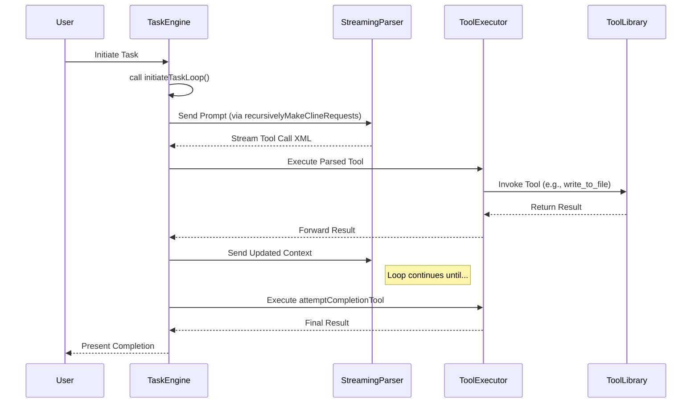

# Orchestrator Architecture

## Table of Contents

* [Orchestrator Architecture](#orchestrator-architecture)
* [Table of Contents](#table-of-contents)
* [Related Documents](#related-documents)
* [Architectural Philosophy](#architectural-philosophy)
* [Core Components](#core-components)
* [Data Flow Diagram](#data-flow-diagram)
* [Component Deep Dive](#component-deep-dive)
* [Task Engine](#task-engine)
* [Streaming Parser](#streaming-parser)
* [Tool Executor & Library](#tool-executor-library)
* [Key Interactions](#key-interactions)
* [Navigation Footer](#navigation-footer)
* [When You're Here](#when-youre-here)
* [🔍 Research Context & Next Steps](#-research-context--next-steps)
* [When You're Here, You Can:](#when-youre-here-you-can)
* [No Dead Ends Policy](#no-dead-ends-policy)
* [No Dead Ends Policy](#no-dead-ends-policy)
* [Orchestrator Architecture](#orchestrator-architecture)
* [Table of Contents](#table-of-contents)
* [Related Documents](#related-documents)
* [Architectural Philosophy](#architectural-philosophy)
* [Core Components](#core-components)
* [Data Flow Diagram](#data-flow-diagram)
* [Component Deep Dive](#component-deep-dive)
* [Task Engine](#task-engine)
* [Streaming Parser](#streaming-parser)
* [Tool Executor & Library](#tool-executor-library)
* [Key Interactions](#key-interactions)
* [Navigation Footer](#navigation-footer)
* [🔍 Research Context & Next Steps](#-research-context--next-steps)
* [When You're Here, You Can:](#when-youre-here-you-can)
* [No Dead Ends Policy](#no-dead-ends-policy)

> **Development Fun Fact**: Documentation is like code comments for humans - it explains the "why"
> behind the "what"! 💻

* *Purpose:*\* This document provides a detailed overview of the Kilo Code Orchestrator's
  architecture, including its core components, their interactions, and the flow of data through the
  system.

> **Quantum Physics Fun Fact**: The orchestrator architecture is like quantum superposition - it
> exists in multiple states simultaneously (CREATED, RUNNING, PAUSED) until observed (measured), at
> which point it collapses into a single definite state! ⚛️

Table of Contents

- [1. Related Documents](#related-documents)
- [2. Architectural Philosophy](#architectural-philosophy)
- [3. Core Components](#core-components)
- [4. Data Flow Diagram](#data-flow-diagram)
- [5. Component Deep Dive](#component-deep-dive)
- [6. Key Interactions](#key-interactions)
- \[7. Navigation Footer

- \*\*

### Related Documents

\]\(7-navigation-footer-details-----related-documents-a-idrelated-documentsa-)

* **[Orchestrator Master Index](../orchestrator/ORCHESTRATOR_INDEX.md)**: The master index for all
  orchestrator
  documentation.
* **[ORCHESTRATOR\_LIFECYCLE.md](ORCHESTRATOR_LIFECYCLE.md)**: Provides a step-by-step breakdown of
  the task execution lifecycle.
* **[Security & Governance](ORCHESTRATOR_SECURITY_GOVERNANCE.md)**: Details the
  security model, including modes and permissions.

[Back to Top](#orchestrator-architecture)

* \*\*

### Architectural Philosophy

The orchestrator is built on a modular, extensible, and state-driven architecture. The primary
design goals are:

* **Decoupling**: Components are designed to be independent, allowing for isolated testing and
  maintenance. The `Task` engine, for instance, is not directly aware of specific tool
  implementations.
* **Extensibility**: The system is designed to be easily extended with new tools and modes. See
  [Extensibility Guide](ORCHESTRATOR_EXTENSIBILITY.md).
* **Robustness**: A clear separation of concerns and defined error-handling pathways ensure
  predictable behavior.
* **Clarity**: Data flow and control flow are designed to be explicit and traceable, primarily
  through the central `Task` loop.

[Back to Top](#orchestrator-architecture)

* \*\*

### Core Components

The architecture comprises several key components that work in concert to execute tasks.

* **Task Engine (`Task.ts`)**: The heart of the orchestrator. It manages the entire lifecycle of a
  task, from initiation to completion. Its main entry point is
  [`initiateTaskLoop`](../../src/core/task/Task.ts#L1699).
* **Streaming Parser**: This component is responsible for processing the output from the language
  model in real-time, identifying and extracting tool-call requests.
* **Tool Executor**: Once a tool call is parsed, this component validates permissions and executes
  the corresponding tool, such as
  [`attemptCompletionTool`](../../src/core/tools/attemptCompletionTool.ts#L35).
* **Mode & Permission Service**: Manages the active operational `Mode` and enforces access control
  rules, determining which tools are available via
  [`isToolAllowedForMode`](../../src/shared/modes.ts#L167).
* **Subtask Manager**: Handles the delegation of work into smaller, isolated subtasks using
  [`startSubtask`](../../src/core/task/Task.ts#L1628) and
  [`completeSubtask`](../../src/core/task/Task.ts#L1669).
* **Prompt Generation**: Constructs the system prompts sent to the model, incorporating rules and
  context. A key function is [`getSystemPrompt`](../../src/core/task/Task.ts#L2499).

[Back to Top](#orchestrator-architecture)

* \*\*

### Data Flow Diagram

The following diagram illustrates how data and control flow between the core components.

[Back to Top](#orchestrator-architecture)

* \*\*

### Component Deep Dive

#### Task Engine

The `Task` engine is the central coordinator. It maintains the state of the current operation,
manages the conversation history with the model, and orchestrates calls to other components. The
[`recursivelyMakeClineRequests`](../../src/core/task/Task.ts#L1735) function is the primary driver
of
the iterative execution loop.

#### Streaming Parser

The parser's role is critical for performance and responsiveness. It scans the model's output stream
for XML-like tool-call syntax. This allows the system to act on a tool request before the full model
response has been received, enabling parallel execution of long-running tasks.

#### Tool Executor & Library

The executor acts as a gateway to the `ToolLibrary`. Before invoking a tool, it consults the **Mode
& Permission Service**. If a tool is not permitted in the current mode, it throws a
[`FileRestrictionError`](../../src/shared/modes.ts#L157) or a similar permissions-related error,
which is then handled by the Task Engine.

[Back to Top](#orchestrator-architecture)

* \*\*

### Key Interactions

* **Task Initiation to Tool Call**: A user request starts
  [`initiateTaskLoop`](../../src/core/task/Task.ts#L1699). The engine generates a prompt with
  [`getSystemPrompt`](../../src/core/task/Task.ts#L2499), which is sent to the model. The parser
  identifies a tool call, and the executor invokes it.
* **Mode Switching**: A tool call to `switchModeTool` (file moved/renamed) instructs the **Mode &
  Permission Service** to change the active mode, altering the set of available tools for subsequent
  operations.
* **Subtask Delegation**: When a task is too complex, the model can invoke `startSubtask` (file
  moved/renamed). This creates a new, nested `Task` instance with its own lifecycle, allowing for
  recursive problem decomposition. The parent task is paused until `completeSubtask` (file
  moved/renamed) is called.

[Back to Top](#orchestrator-architecture)

* \*\*

### Navigation Footer

## When You're Here

This document is part of the KiloCode project documentation. If you're not familiar with this
document's role or purpose, this section helps orient you.

* **Purpose**: \[Brief description of what this document covers]
* **Audience**: \[Who should read this document]
* **Prerequisites**: \[What you should know before reading]
* **Related Documents**: \[Links to related documentation]

## 🔍 Research Context & Next Steps

### When You're Here, You Can:

* *Understanding Orchestrator Architecture:*\*

* **Next**: [Orchestrator Lifecycle](ORCHESTRATOR_LIFECYCLE.md) →
  [Orchestrator Tools Reference](ORCHESTRATOR_TOOLS_REFERENCE.md) →
  [Orchestrator Best Practices](ORCHESTRATOR_BEST_PRACTICES.md)

* **Related**: [Technical Glossary](../GLOSSARY.md) for terminology,
  [State Machines](../README.md) for behavior modeling

* *Investigating Race Conditions:*\*

* **Next**: [Race Condition Analysis](../README.md) →
  [Root Cause Analysis](DUPLICATE_API_REQUESTS_ROOT_CAUSE_ANALYSIS.md) →
  [Code Flow Analysis](CODE_FLOW_ANALYSIS.md)

* **Related**: [Orchestrator Error Handling](ORCHESTRATOR_ERROR_HANDLING.md) for common issues

* *Implementing Orchestrator Features:*\*

* **Next**: [Orchestrator Best Practices](ORCHESTRATOR_BEST_PRACTICES.md) →
  [Orchestrator Task Delegation](ORCHESTRATOR_TASK_DELEGATION.md) →
  [Solution Recommendations](SOLUTION_RECOMMENDATIONS.md)

* **Related**: [Repository Development Guide](GETTING_STARTED.md) for
  codebase patterns

* *Understanding Current Problems:*\*

* **Next**: [Race Condition Analysis](../README.md) →
  [Code Flow Analysis](CODE_FLOW_ANALYSIS.md) →
  [Solution Recommendations](SOLUTION_RECOMMENDATIONS.md)

* **Related**: [State Machines](../README.md) for behavior analysis

### No Dead Ends Policy

Every page provides clear next steps based on your research goals. If you're unsure where to go
next, return to [Orchestrator Documentation](README.md) for guidance.

* \*\*

## No Dead Ends Policy

Every section in this document connects you to your next step:

* **If you're new here**: Start with the [When You're Here](#when-youre-here) section

* **If you need context**: Check the [Research Context](#research-context) section

* **If you're ready to implement**: Jump to the implementation sections

* **If you're stuck**: Visit our [Troubleshooting Guide](../tools/TROUBLESHOOTING_GUIDE.md)

* **If you need help**: Check the [Technical Glossary](../GLOSSARY.md)

* *Navigation*\*: [← Back to Orchestrator Documentation](README.md) ·
  [→ Orchestrator Lifecycle](ORCHESTRATOR_LIFECYCLE.md) · [📚 Technical Glossary](../GLOSSARY.md) ·
  [↑ Table of Contents](#-research-context--next-steps)
