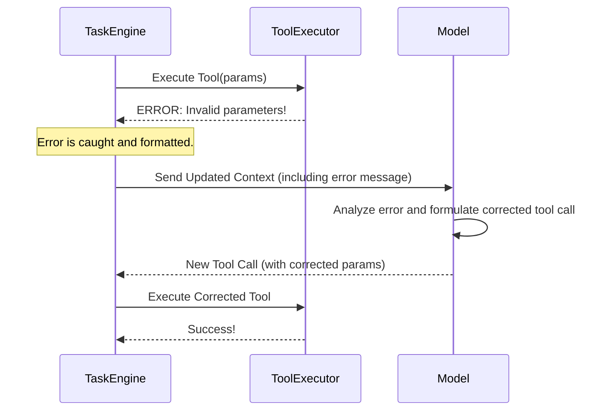

# Orchestrator Error Handling
## Table of Contents

- [Orchestrator Error Handling](#orchestrator-error-handling)
  - [Table of Contents](#table-of-contents)
    - [Related Documents](#related-documents)
    - [Error Handling Philosophy](#error-handling-philosophy)
    - [Types of Errors](#types-of-errors)
    - [The Recovery Loop](#the-recovery-loop)
    - [The "Mistake Limit"](#the-mistake-limit)
    - [Specific Error Scenarios](#specific-error-scenarios)
      - [Scenario: ](#scenario-)
      - [Scenario: Invalid Regex in ](#scenario-invalid-regex-in-)
  - [🔍 Research Context & Next Steps](#-research-context-next-steps)
    - [When You're Here, You Can:](#when-youre-here-you-can)
    - [No Dead Ends Policy](#no-dead-ends-policy)
    - [Navigation Footer](#navigation-footer)

> **Architecture Fun Fact**: Like a well-designed building, good documentation has a solid
> foundation, clear structure, and intuitive navigation! 🏗️

- *Purpose:*\* This document outlines the Kilo Code Orchestrator's strategies for handling errors,
ensuring resilience, and maintaining a stable operational state. It covers error detection, recovery
  mechanisms, and the "Mistake Limit" concept.

> **Dinosaur Fun Fact**: Error handling is like a dinosaur's immune system - it detects threats
> (errors), isolates them (recovery mechanisms), and learns from them (mistake limits) to become
> stronger over time! 🦕

Table of Contents

- [1. Related Documents](#related-documents)
- [2. Error Handling Philosophy](#error-handling-philosophy)
- [3. Types of Errors](#types-of-errors)
- [4. The Recovery Loop](#the-recovery-loop)
- [5. The "Mistake Limit"](#the-mistake-limit)
- [6. Specific Error Scenarios](#specific-error-scenarios)
- \[7. Navigation Footer

- \*\*

### Related Documents

]\(7-navigation-footer-details-----related-documents-a-idrelated-documentsa-)

- **[Orchestrator Master Index](../orchestrator/ORCHESTRATOR_INDEX.md)**: The master index for all
  orchestrator
  documentation.
- **[ORCHESTRATOR\_LIFECYCLE.md](ORCHESTRATOR_LIFECYCLE.md)**: Describes the lifecycle stages where
  errors can occur.
- **[Security & Governance](ORCHESTRATOR_SECURITY_GOVERNANCE.md)**: Details
  permission-related errors like `FileRestrictionError`.

[Back to Top](#orchestrator-error-handling)
- \*\*

### Error Handling Philosophy

The orchestrator is designed to be self-correcting where possible. The core philosophy is that
errors are a natural part of a complex, model-driven workflow. Instead of failing immediately, the
system attempts to recover by providing the error context back to the language model.

Key principles:

- **Informative Feedback**: Errors are not just caught; they are formatted into a clear, descriptive
  message that is fed back into the task's execution loop.
- **Model-Led Recovery**: The language model is responsible for attempting to correct its own
  mistakes. If it tries to use a tool with incorrect parameters, the resulting error message should
  guide it to fix the call in its next attempt.
- **Finite Retries**: To prevent infinite loops of failure, the system employs a "Mistake Limit" to
  halt tasks that are repeatedly failing.

[Back to Top](#orchestrator-error-handling)
- \*\*

### Types of Errors

- **Tool Execution Errors**: The most common type. These occur when a tool fails to execute.
  Examples include:
- Invalid parameters (e.g., wrong file path).
- Runtime exceptions within the tool's logic.
- I/O failures.
- **Parsing Errors**: The model produces malformed XML for a tool call that the `StreamingParser`
  cannot understand.
- **Permission Errors**: The model attempts to use a tool that is not allowed in the current mode.
  The primary example is [`FileRestrictionError`](`[FILE_MOVED_OR_RENAMED]`#L157).
- **Catastrophic Errors**: Unrecoverable system-level errors that immediately halt the task.

[Back to Top](#orchestrator-error-handling)
- \*\*

### The Recovery Loop

When a recoverable error occurs, the orchestrator does not terminate the task. Instead, it treats
the error as the "result" of the attempted tool call.

This loop allows the model to learn from its mistakes within the context of a single task.

[Back to Top](#orchestrator-error-handling)
- \*\*

### The "Mistake Limit"

To prevent a task from getting stuck in a perpetual failure loop, the `Task` engine maintains a
mistake counter.

- **Increment**: The counter is incremented every time a tool execution error occurs.
- **Threshold**: There is a pre-defined limit for the number of mistakes allowed within a single
  task.
- **Termination**: If the mistake counter exceeds the threshold, the task is immediately terminated,
  and a failure state is reported to the user. This prevents wasted resources and provides a clear
  signal that the current approach is not working.
- **Reset**: The counter is reset upon successful tool execution, giving the model a "clean slate"
  after a successful recovery.

This concept is a crucial guardrail that ensures system stability.

[Back to Top](#orchestrator-error-handling)
- \*\*

### Specific Error Scenarios

#### Scenario: `FileRestrictionError`
1. **Action**: Model in `architect` mode attempts to call `write_to_file`.
2. **Check**: The `ToolExecutor` consults the `Mode & Permission Service` via
   [`isToolAllowedForMode`](`[FILE_MOVED_OR_RENAMED]`#L167). The check fails.
3. **Error**: A [`FileRestrictionError`](`[FILE_MOVED_OR_RENAMED]`#L157) is thrown.
4. **Recovery**: The error message, explaining that `write_to_file` is not allowed in `architect`
   mode, is passed back to the model.
5. **Correction**: The model should then use a tool like
   [`switchModeTool`](`[FILE_MOVED_OR_RENAMED]`#L8) to change to `code` mode before re-attempting
   the file write.

#### Scenario: Invalid Regex in `search_files`
1. **Action**: Model calls `search_files` with a malformed regex pattern.
2. **Error**: The tool's implementation catches the regex compilation error and returns an error
   result.
3. **Recovery**: The error message, "Invalid regex pattern: \[details]", is sent to the model.
4. **Correction**: The model should fix the regex pattern in its next attempt.

[Back to Top](#orchestrator-error-handling)
- \*\*

## 🔍 Research Context & Next Steps

### When You're Here, You Can:

- *Understanding This System:*\*

- **Next**: Check related documentation in the same directory

- **Related**: [Technical Glossary](../GLOSSARY.md) for terminology,
  [Architecture Documentation](../architecture/README.md) for context

- *Implementing Features:*\*

- **Next**: [Repository Development Guide](../architecture/GETTING_STARTED.md) →
  [Testing Infrastructure](../testing/TESTING_STRATEGY.md)

- **Related**: [Orchestrator Documentation](../orchestrator/README.md) for integration patterns

- *Troubleshooting Issues:*\*

- **Next**: [Race Condition Analysis](../architecture/README.md) →
  [Root Cause Analysis](../architecture/DUPLICATE_API_REQUESTS_ROOT_CAUSE_ANALYSIS.md)

- **Related**: [Orchestrator Error Handling](../orchestrator/ORCHESTRATOR_ERROR_HANDLING.md) for
  common issues

### No Dead Ends Policy

Every page provides clear next steps based on your research goals. If you're unsure where to go
next, return to the appropriate README for guidance.

### Navigation Footer

You have reached the end of the error handling document. Return to the
[Master Index](../orchestrator/ORCHESTRATOR_INDEX.md) or proceed to the
[Security & Governance Document](ORCHESTRATOR_SECURITY_GOVERNANCE.md).

[Back to Top](#orchestrator-error-handling)
- \*\*

End of document.
- \*\*

- *Navigation*\*: [docs](../) · [orchestrator](../orchestrator/) ·
  [↑ Table of Contents](#orchestrator-error-handling)
