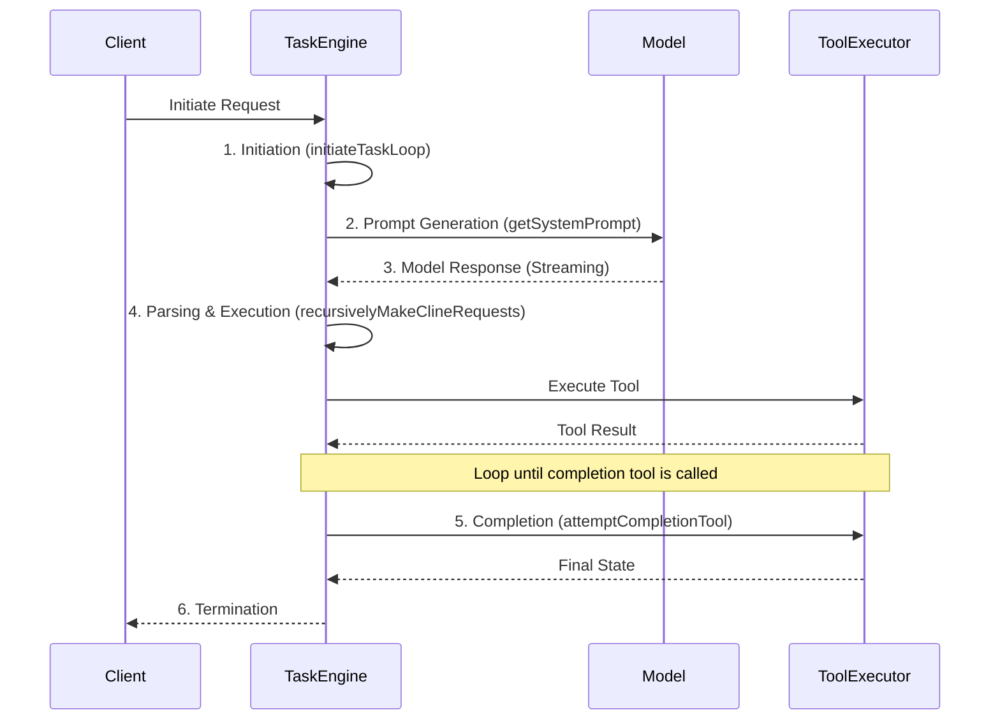

# Orchestrator Task Lifecycle

**Purpose:** This document provides a detailed, step-by-step description of the orchestrator's task lifecycle, from the moment a request is received to its final completion. It covers state transitions, the execution loop, and subtask management.

> **Geology Fun Fact**: The orchestrator lifecycle is like the rock cycle - tasks start as molten magma (CREATED), cool into solid rock (RUNNING), get weathered by external forces (PAUSED), and eventually erode back into sediment (COMPLETED)! 🪨

Table of Contents

- [1. Related Documents](#related-documents)
- [2. Lifecycle Overview](#lifecycle-overview)
- [3. Lifecycle Stages in Detail](#lifecycle-stages-in-detail)
- [4. State Transitions](#state-transitions)
- [5. The Execution Loop: `recursivelyMakeClineRequests`](#the-execution-loop-recursivelymakeclinerequests)
- [6. Subtask Lifecycle](#subtask-lifecycle)
- [7. Navigation Footer](#navigation-footer)

---

### Related Documents

- **[ORCHESTRATOR_INDEX.md](ORCHESTRATOR_INDEX.md)**: The master index for all orchestrator documentation.
- **[ORCHESTRATOR_ARCHITECTURE.md](ORCHESTRATOR_ARCHITECTURE.md)**: Describes the components involved in the lifecycle.
- **[ORCHESTRATOR_TASK_DELEGATION.md](ORCHESTRATOR_TASK_DELEGATION.md)**: Focuses specifically on the subtask creation and management process.
- **[ORCHESTRATOR_ERROR_HANDLING.md](ORCHESTRATOR_ERROR_HANDLING.md)**: Explains how errors are handled at various stages of the lifecycle.

[Back to Top](#orchestrator-task-lifecycle)

---

### Lifecycle Overview

The task lifecycle is a stateful, iterative process managed by the `Task` engine. It is designed to handle complex, multi-step workflows that may involve multiple interactions with the language model and various tools. The entire process is kicked off by a single call and runs until a completion state is reached.

[Back to Top](#orchestrator-task-lifecycle)

---

### Lifecycle Stages in Detail

#### Stage 1: Initiation

A task begins when an external caller (e.g., the VS Code extension UI) invokes the [`initiateTaskLoop`](/src/core/task/Task.ts#L1699) function. At this stage, the `Task` object is created, initial state is set up, and the context for the task is established.

#### Stage 2: Prompt Generation

The `Task` engine constructs the initial prompt to be sent to the language model. This is handled by the [`getSystemPrompt`](/src/core/task/Task.ts#L2499) function, which assembles the user's request, conversation history, available tools, and formatting rules like [`markdownFormattingSection`](/src/core/prompts/sections/markdown-formatting.ts#L1).

#### Stage 3: Model Response & Parsing

The prompt is sent to the model. The orchestrator's `StreamingParser` begins processing the response as it arrives. It actively scans for tool-call syntax, allowing the system to react instantly without waiting for the full response.

#### Stage 4: Parsing & Execution Loop

This is the core interactive phase of the lifecycle, driven by [`recursivelyMakeClineRequests`](/src/core/task/Task.ts#L1735). When the parser identifies a valid tool call, the `ToolExecutor` validates and runs it. The result of the tool execution is then appended to the conversation history, and the loop continues by sending the updated context back to the model.

#### Stage 5: Completion

The loop terminates when the model invokes the special [`attemptCompletionTool`](/src/core/tools/attemptCompletionTool.ts#L35). This signals that the task's objective has been met. The tool is responsible for packaging the final result and setting the task's status to "completed."

#### Stage 6: Termination

The `Task` engine performs final cleanup, persists the final state, and returns the result to the initial caller. The lifecycle for this task instance is now complete.

[Back to Top](#orchestrator-task-lifecycle)

---

### State Transitions

A task can exist in several states throughout its lifecycle:

- `pending`: The task has been created but the execution loop has not yet begun.
- `in_progress`: The task is actively engaged in the model-response/tool-execution loop.
- `awaiting_subtask`: The task has delegated work to a subtask and is paused, waiting for it to complete.
- `completed`: The task has successfully finished via `attemptCompletionTool`.
- `failed`: The task terminated due to an unrecoverable error or reaching its mistake limit.

[Back to Top](#orchestrator-task-lifecycle)

---

### The Execution Loop: `recursivelyMakeClineRequests`

The function [`recursivelyMakeClineRequests`](/src/core/task/Task.ts#L1735) is the engine of the lifecycle. It is not a simple loop but a recursive function that represents one full turn of the conversation with the model.

1.  **Call Model**: Sends the current context (history, tool results) to the model.
2.  **Parse Response**: The `StreamingParser` processes the output.
3.  **Execute Tools**: If tool calls are found, they are executed.
4.  **Recurse**: The function calls itself with the updated context, continuing the "conversation" until a terminal state (completion or failure) is reached.

[Back to Top](#orchestrator-task-lifecycle)

---

### Subtask Lifecycle

When the model determines a part of the task requires isolated execution, it can use the [`startSubtask`](/src/core/task/Task.ts#L1628) tool.

1.  **Pause Parent**: The parent task's state is set to `awaiting_subtask`.
2.  **Create Child**: A new `Task` instance is created with a specific, narrowed-down objective. This child task has its own independent lifecycle.
3.  **Execute Child**: The child task runs through its own initiation, execution, and completion stages.
4.  **Resume Parent**: Once the child task calls [`completeSubtask`](/src/core/task/Task.ts#L1669), its result is passed back to the parent. The parent task's state is switched back to `in_progress`, and its execution loop continues, now with the information from the completed subtask.

[Back to Top](#orchestrator-task-lifecycle)

---

### Navigation Footer

You have reached the end of the lifecycle document. Return to the [Master Index](ORCHESTRATOR_INDEX.md) or proceed to the [Task Delegation Document](ORCHESTRATOR_TASK_DELEGATION.md).

[Back to Top](#orchestrator-task-lifecycle)

---

End of document.

## Provider network send points, duplicate-causes, and recommended docs-only changes

### Quick pointer to code

- Task control loop: [`src/core/task/Task.ts`](/src/core/task/Task.ts#L2648)
- Message queue: [`src/core/message-queue/MessageQueueService.ts`](/src/core/message-queue/MessageQueueService.ts#L36)
- Provider entrypoints: `createMessage()` implementations under [`src/api/providers/`](/src/api/providers/index.ts#L1)

### Concrete send patterns (summary)

- OpenAI-compatible SDK calls: client.chat.completions.create(...) (many handlers: [`/\src/api/providers/openai.ts#L83`](/src/api/providers/openai.ts#L83), [`/\src/api/providers/ollama.ts#L61`](/src/api/providers/ollama.ts#L61), etc.)
- Responses API + SSE fallback: OpenAI Native handler uses SDK streaming and a fetch-based SSE fallback (see [`/\src/api/providers/openai-native.ts#L296`](/src/api/providers/openai-native.ts#L296)).
- Vendor SDK streaming iterators: Anthropic, Gemini, Bedrock (e.g., [`/\src/api/providers/anthropic.ts#L80`](/src/api/providers/anthropic.ts#L80), [`/\src/api/providers/bedrock.ts#L420`](/src/api/providers/bedrock.ts#L420)).
- Manual fetch() usages (SSE or JSON): OpenRouter image endpoint, OpenAI Native SSE fallback, Glama polling, etc.

### Likely causes of duplicate requests (doc summary)

1. Orchestrator-level retries + provider internal retries/fallbacks (e.g., OpenAI-native previous_response retry + Task retry).
2. Token refresh flows that retry the same request (Gemini/Qwen patterns).
3. Race on conversation continuity (previous_response_id) causing a provider retry and orchestrator retry.
4. Wrapper/provider switching (VirtualQuotaFallback) without cancelling in-flight streams.
5. Duplicate or repeated fetchModel calls in provider code paths (observed pattern).
6. SSE vs SDK fallback paths that can trigger additional network sends on error-handling branches.

### Docs-only recommendations (no code changes)

- Add a "Provider expectations" doc section describing:
    - Which errors providers should throw vs yield (e.g., THROTTLING -> throw so Task-level retry/backoff runs).
    - Expected behavior for token refresh flows (single in-flight refresh promise; block concurrent sends while refresh occurs).
    - Best-effort contract for previous_response_id usage and race mitigation strategy.
    - How providers should expose cancellation (note the orchestration will supply an AbortSignal when supported).
    - Where to include request-level metadata (recommended header names and fallbacks).
- Add a "Tracing & idempotency" doc covering:
    - Recommended header names (X-KILOCODE-TASK-ID, X-KILOCODE-TIMESTAMP-ISO) and preferred placement in requests.
    - Per-provider caveats where headers cannot be used (e.g., Bedrock SDK) and fallback options (embed minimal metadata into conversation or system block).
- Add a "Retry responsibility" doc that states:
    - Providers may perform idempotent internal retries (token refresh, small SDK-specific fixes).
    - Providers must rethrow throttling/rate-limit errors to allow Task.ts to perform exponential backoff.
- Add a "Testing checklist" doc for integration tests:
    - Simulate concurrent sends to exercise previous_response_id handling.
    - Simulate token refresh and assert only one successful send occurs.
    - Simulate provider-switch while a stream is in-flight to validate cancellation behavior.
    - Verify that handlers that poll (glama) do not cause extra requests on normal success.
- Create a short "Fast fixes" list for engineers to follow when implementing code changes later:
    - Centralize header injection plan (docs link to recommended header names).
    - Standardize error classification mapping for throttling vs non-retriable errors.
    - Remove duplicate fetchModel calls where observed.

### Suggested doc locations & links (insert these pages)

- docs/PROVIDER_GUIDELINES.md — provider expectations, header names, cancellation contract. (link from here)
- docs/RETRY_POLICY.md — retry responsibility, orchestrator vs provider, backoff guidelines.
- docs/TESTING_STRATEGY.md — integration tests to add.
- Update: [`ORCHESTRATOR_LIFECYCLE.md`](ORCHESTRATOR_LIFECYCLE.md) to reference the new pages.

## 🔍 Research Context & Next Steps

### When You're Here, You Can:

**Understanding Orchestrator Lifecycle:**

- **Next**: [Orchestrator Architecture](ORCHESTRATOR_ARCHITECTURE.md) → [Orchestrator Tools Reference](ORCHESTRATOR_TOOLS_REFERENCE.md) → [Orchestrator Best Practices](ORCHESTRATOR_BEST_PRACTICES.md)
- **Related**: [Technical Glossary](../../GLOSSARY.md) for terminology, [State Machines](../architecture/state-machines/README.md) for behavior modeling

**Investigating Race Conditions:**

- **Next**: [Race Condition Analysis](../architecture/race-condition/README.md) → [Root Cause Analysis](../architecture/race-condition/ROOT_CAUSE_ANALYSIS.md) → [Code Flow Analysis](../architecture/race-condition/CODE_FLOW_ANALYSIS.md)
- **Related**: [Orchestrator Error Handling](ORCHESTRATOR_ERROR_HANDLING.md) for common issues

**Implementing Orchestrator Features:**

- **Next**: [Orchestrator Best Practices](ORCHESTRATOR_BEST_PRACTICES.md) → [Orchestrator Task Delegation](ORCHESTRATOR_TASK_DELEGATION.md) → [Solution Recommendations](../architecture/race-condition/SOLUTION_RECOMMENDATIONS.md)
- **Related**: [Repository Development Guide](../architecture/repository/DEVELOPMENT_GUIDE.md) for codebase patterns

**Understanding Current Problems:**

- **Next**: [Race Condition Analysis](../architecture/race-condition/README.md) → [Code Flow Analysis](../architecture/race-condition/CODE_FLOW_ANALYSIS.md) → [Solution Recommendations](../architecture/race-condition/SOLUTION_RECOMMENDATIONS.md)
- **Related**: [State Machines](../architecture/state-machines/README.md) for behavior analysis

### No Dead Ends Policy

Every page provides clear next steps based on your research goals. If you're unsure where to go next, return to [Orchestrator Documentation](README.md) for guidance.

### Next doc-step I will take (if you approve)

I will add these markdown files under `docs/` with concise, copy-pasteable guidelines and the testing checklist. Tell me to proceed and I will create:

- `docs/PROVIDER_GUIDELINES.md`
- `docs/RETRY_POLICY.md`
- `docs/TESTING_STRATEGY.md`
