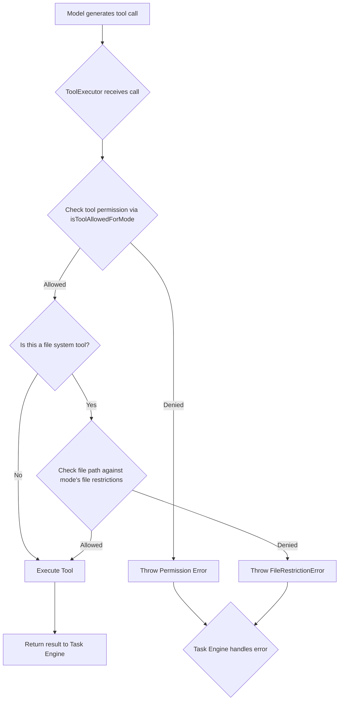

# Orchestrator Security & Governance
## Table of Contents

- [Orchestrator Security & Governance](#orchestrator-security-governance)
  - [Table of Contents](#table-of-contents)
    - [Related Documents](#related-documents)
    - [Security Philosophy](#security-philosophy)
    - [Modes as a Security Boundary](#modes-as-a-security-boundary)
    - [Tool Permissioning](#tool-permissioning)
    - [File Access Control](#file-access-control)
    - [Governance Workflow Diagram](#governance-workflow-diagram)
  - [🔍 Research Context & Next Steps](#-research-context-next-steps)
    - [When You're Here, You Can:](#when-youre-here-you-can)
    - [No Dead Ends Policy](#no-dead-ends-policy)
    - [Navigation Footer](#navigation-footer)

> **Architecture Fun Fact**: Like a well-designed building, good documentation has a solid
> foundation, clear structure, and intuitive navigation! 🏗️

- *Purpose:*\* This document details the security model of the Kilo Code Orchestrator, focusing on
  mode-based permissions, file access restrictions, and other governance mechanisms that ensure safe
  and predictable operation.

> **Cartography Fun Fact**: This documentation is like a map - it shows you where you are, where you
> can go, and how to get there without getting lost! 🗺️

Table of Contents

- [1. Related Documents](#related-documents)
- [2. Security Philosophy](#security-philosophy)
- [3. Modes as a Security Boundary](#modes-as-a-security-boundary)
- [4. Tool Permissioning](#tool-permissioning)
- [5. File Access Control](#file-access-control)
- [6. Governance Workflow Diagram](#governance-workflow-diagram)
- \[7. Navigation Footer

- \*\*

### Related Documents

]\(7-navigation-footer-details-----related-documents-a-idrelated-documentsa-)

- **[Orchestrator Master Index](../orchestrator/ORCHESTRATOR_INDEX.md)**: The master index for all
  orchestrator
  documentation.
- **[ORCHESTRATOR\_TOOLS\_REFERENCE.md](ORCHESTRATOR_TOOLS_REFERENCE.md)**: Lists all tools and
  their
  intended functions.
- **[Error Handling Guide](ORCHESTRATOR_ERROR_HANDLING.md)**: Explains how permission
  errors are handled.

[Back to Top](#orchestrator-security--governance)
- \*\*

### Security Philosophy

The orchestrator's security model is based on the principle of **least privilege**. By default, a
task has limited capabilities. Its permissions are elevated based on the specific `Mode` it is
operating in. This ensures that the powerful tools, especially those that interact with the file
system, are only used when explicitly required for the task at hand.

This mode-centric approach provides a clear and auditable trail of why certain actions were
permitted.

[Back to Top](#orchestrator-security--governance)
- \*\*

### Modes as a Security Boundary

Modes are the primary security mechanism in the orchestrator. Each mode defines a specific context
and a corresponding set of allowed actions. The definitions for these modes and their capabilities
are located in [`src/shared/modes.ts`](../../src/shared/modes.ts#L69).

Examples of modes and their intended privilege levels:

- **`architect`**: High-level planning and structuring. Typically has no file system write access.
- **`code`**: Implementation and file modification. Has broad access to file system tools.
- **`debug`**: Investigation and analysis. May have read access to most files but limited write
  access.
- **`test`**: Running and creating tests. Has access to test runners and can write to test files.

A task can request to change its mode by using the
[`switchModeTool`](../../src/core/tools/switchModeTool.ts#L8), but this is an explicit, logged
action.

[Back to Top](#orchestrator-security--governance)
- \*\*

### Tool Permissioning

Before any tool is executed, the `ToolExecutor` performs a permission check. This is handled by the
[`isToolAllowedForMode`](../../src/shared/modes.ts#L167) function.

This function checks a mapping that associates each mode with a list of allowed tool names or
patterns.
- If the tool is in the allowed list for the current mode, execution proceeds.
- If the tool is not in the list, the function returns `false`, and the `ToolExecutor` throws a
  permission error.

Some tools, like `askFollowupQuestionTool`, are considered **Always-Available Tools** and are
permitted in all modes.

[Back to Top](#orchestrator-security--governance)
- \*\*

### File Access Control

In addition to tool-level permissions, modes can also define file access policies. This is a more
granular level of control that restricts which files can be read or written, even by permitted tools
like `write_to_file`.

This is enforced through file path pattern matching. For example, the `test` mode might only be
allowed to write to files matching `*.test.ts` or `__mocks__/*.ts`.

When a tool attempts to access a file that violates the current mode's file access policy, a
[`FileRestrictionError`](../../src/shared/modes.ts#L157) is thrown. This error is specific and
clearly
communicates the nature of the violation to the model, allowing it to take corrective action (e.g.,
switching to an appropriate mode).

[Back to Top](#orchestrator-security--governance)
- \*\*

### Governance Workflow Diagram

This diagram shows the decision-making process for executing a tool call.

[Back to Top](#orchestrator-security--governance)
- \*\*

## When You're Here

This document is part of the KiloCode project documentation. If you're not familiar with this
document's role or purpose, this section helps orient you.

- **Purpose**: [Brief description of what this document covers]
- **Audience**: [Who should read this document]
- **Prerequisites**: [What you should know before reading]
- **Related Documents**: [Links to related documentation]

## 🔍 Research Context & Next Steps

### When You're Here, You Can:

- *Understanding This System:*\*

- **Next**: Check related documentation in the same directory

- **Related**: [Technical Glossary](../GLOSSARY.md) for terminology,
  [Architecture Documentation](../architecture/README.md) for context

- *Implementing Features:*\*

- **Next**: [Repository Development Guide](../architecture/GETTING_STARTED.md) →
  [Testing Infrastructure](../testing/TESTING_STRATEGY.md)

- **Related**: [Orchestrator Documentation](../orchestrator/README.md) for integration patterns

- *Troubleshooting Issues:*\*

- **Next**: [Race Condition Analysis](../architecture/README.md) →
  [Root Cause Analysis](../architecture/DUPLICATE_API_REQUESTS_ROOT_CAUSE_ANALYSIS.md)

- **Related**: [Orchestrator Error Handling](../orchestrator/ORCHESTRATOR_ERROR_HANDLING.md) for
  common issues

### No Dead Ends Policy

Every page provides clear next steps based on your research goals. If you're unsure where to go
next, return to the appropriate README for guidance.

### Navigation Footer

You have reached the end of the security and governance document. Return to the
[Master Index](../orchestrator/ORCHESTRATOR_INDEX.md) or proceed to the
[Best Practices Document](ORCHESTRATOR_BEST_PRACTICES.md).

[Back to Top](#orchestrator-security--governance)
- \*\*

End of document.
- \*\*

## No Dead Ends Policy

Every section in this document connects you to your next step:

- **If you're new here**: Start with the [When You're Here](#when-youre-here) section
- **If you need context**: Check the [Research Context](#research-context) section
- **If you're ready to implement**: Jump to the implementation sections
- **If you're stuck**: Visit our [Troubleshooting Guide](../tools/TROUBLESHOOTING_GUIDE.md)
- **If you need help**: Check the [Technical Glossary](../GLOSSARY.md)

- *Navigation*\*: [docs](../) · [orchestrator](../orchestrator/) ·
  [↑ Table of Contents](#orchestrator-security--governance)

## Navigation

- 📚 [Technical Glossary](../GLOSSARY.md)

