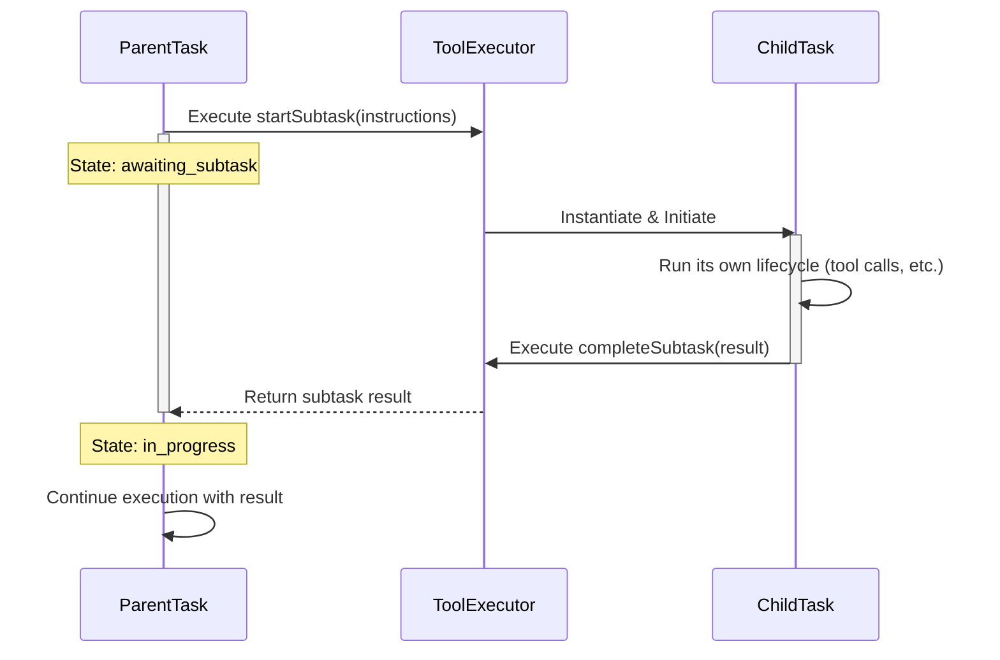

# Orchestrator Task Delegation

## Table of Contents

* [Orchestrator Task Delegation](#orchestrator-task-delegation)
* [Table of Contents](#table-of-contents)
* [Related Documents](#related-documents)
* [The Philosophy of Delegation](#the-philosophy-of-delegation)
* [The Subtask Mechanism](#the-subtask-mechanism)
* [Subtask Workflow Diagram](#subtask-workflow-diagram)
* [Key Symbols and Their Roles](#key-symbols-and-their-roles)
* [When to Use Subtasks](#when-to-use-subtasks)
* [When You're Here](#when-youre-here)
* [🔍 Research Context & Next Steps](#research-context--next-steps)
* [When You're Here, You Can:](#when-youre-here-you-can)
* [No Dead Ends Policy](#no-dead-ends-policy)
* [Navigation Footer](#navigation-footer)
* [No Dead Ends Policy](#no-dead-ends-policy)
* [Navigation](#navigation)
* [Orchestrator Task Delegation](#orchestrator-task-delegation)
* [Table of Contents](#table-of-contents)
* [Related Documents](#related-documents)
* [The Philosophy of Delegation](#the-philosophy-of-delegation)
* [The Subtask Mechanism](#the-subtask-mechanism)
* [Subtask Workflow Diagram](#subtask-workflow-diagram)
* [Key Symbols and Their Roles](#key-symbols-and-their-roles)
* [When to Use Subtasks](#when-to-use-subtasks)
* [🔍 Research Context & Next Steps](#research-context--next-steps)
* [When You're Here, You Can:](#when-youre-here-you-can)
* [No Dead Ends Policy](#no-dead-ends-policy)
* [Navigation Footer](#navigation-footer)

> **Architecture Fun Fact**: Like a well-designed building, good documentation has a solid
> foundation, clear structure, and intuitive navigation! 🏗️

* *Purpose:*\* This document explains the mechanism and strategy behind task delegation in the Kilo
  Code Orchestrator. It covers how complex problems are decomposed into smaller, manageable subtasks
  and the lifecycle of those subtasks.

> **Cartography Fun Fact**: This documentation is like a map - it shows you where you are, where you
> can go, and how to get there without getting lost! 🗺️

Table of Contents

- [1. Related Documents](#related-documents)
- [2. The Philosophy of Delegation](#the-philosophy-of-delegation)
- [3. The Subtask Mechanism](#the-subtask-mechanism)
- [4. Subtask Workflow Diagram](#subtask-workflow-diagram)
- [5. Key Symbols and Their Roles](#key-symbols-and-their-roles)
- [6. When to Use Subtasks](#when-to-use-subtasks)
- \[7. Navigation Footer

- \*\*

### Related Documents

\]\(7-navigation-footer-details-----related-documents-a-idrelated-documentsa-)

* **[Orchestrator Master Index](../orchestrator/ORCHESTRATOR_INDEX.md)**: The master index for all
  orchestrator
  documentation.
* **[ORCHESTRATOR\_LIFECYCLE.md](ORCHESTRATOR_LIFECYCLE.md)**: Describes the overall task lifecycle
  where delegation occurs.
* **[ORCHESTRATOR\_TOOLS\_REFERENCE.md](ORCHESTRATOR_TOOLS_REFERENCE.md)**: Provides details on the
  `startSubtask` and `completeSubtask` tools.

[Back to Top](#orchestrator-task-delegation)

* \*\*

### The Philosophy of Delegation

The orchestrator's task delegation capability is a form of recursive problem decomposition. Instead
of attempting to solve a large, multi-faceted problem in a single, long-running task, the system can
break it down into a series of smaller, more focused subtasks.

This approach has several advantages:

* **Isolation**: Subtasks have their own context and history, preventing prompt contamination and
  allowing the model to focus on a specific goal.
* **Specialization**: A subtask can be initiated in a different `Mode` than its parent, granting it
  access to a specialized set of tools. For example, a `code` mode task could delegate to a `test`
  mode subtask.
* **Resilience**: An error in a subtask does not automatically fail the parent task. The parent can
  decide how to proceed based on the subtask's result.
* **Clarity**: It creates a clear, hierarchical structure for complex work, which is easier to debug
  and manage.

[Back to Top](#orchestrator-task-delegation)

* \*\*

### The Subtask Mechanism

Task delegation is facilitated by a pair of specialized tools:

1. **`startSubtask`**: This tool is called by the model when it identifies a piece of work that
   should be handled in isolation. It pauses the current (parent) task and initiates a new (child)
   task.
2. **`completeSubtask`**: This tool is called by the child task when its objective is complete. It
   terminates the child task and returns its result to the waiting parent task, which then resumes
   its own execution loop.

The parent task is effectively in an `awaiting_subtask` state while the child task is active.

[Back to Top](#orchestrator-task-delegation)

* \*\*

### Subtask Workflow Diagram

[Back to Top](#orchestrator-task-delegation)

* \*\*

### Key Symbols and Their Roles

* [`startSubtask`](`[FILE_MOVED_OR_RENAMED]`#L1628): The entry point for delegation. This function
  is responsible for pausing the parent task and creating the new child `Task` instance. It takes
  the instructions for the new subtask as an argument.
* [`completeSubtask`](`[FILE_MOVED_OR_RENAMED]`#L1669): The exit point for a subtask. This function
  packages the subtask's final output and signals the parent task to resume its operation.
* **`newTaskTool`**: While not strictly for subtasks, the
  [`newTaskTool`](`[FILE_MOVED_OR_RENAMED]`#L14) can be used to fire off independent, asynchronous
  tasks that do not block the parent. This is useful for "fire and forget" operations where the
  result is not immediately needed.

[Back to Top](#orchestrator-task-delegation)

* \*\*

### When to Use Subtasks

The decision to delegate is made by the language model based on the complexity of the task at hand.
Common scenarios for delegation include:

* **Mode Switching for a Specific Action**: A task in `architect` mode needs to write code. It
  delegates to a subtask in `code` mode to perform the file modifications.
* **Complex Queries**: A task needs to gather information from multiple sources. It can delegate a
  subtask for each source to run in parallel (if the architecture supports it) or sequentially.
* **Refactoring**: A large-scale refactoring task can be broken down into subtasks for each file or
  module that needs to be changed.
* **Verification Steps**: A task can delegate to a `test` mode subtask to run verification checks on
  the code it has just written.

[Back to Top](#orchestrator-task-delegation)

* \*\*

## When You're Here

This document is part of the KiloCode project documentation. If you're not familiar with this
document's role or purpose, this section helps orient you.

* **Purpose**: \[Brief description of what this document covers]
* **Audience**: \[Who should read this document]
* **Prerequisites**: \[What you should know before reading]
* **Related Documents**: \[Links to related documentation]

## 🔍 Research Context & Next Steps

### When You're Here, You Can:

* *Understanding This System:*\*

* **Next**: Check related documentation in the same directory

* **Related**: [Technical Glossary](../../../GLOSSARY.md) for terminology,
  [Architecture Documentation](../architecture/README.md) for context

* *Implementing Features:*\*

* **Next**: [Repository Development Guide](../../../../GETTING_STARTED.md) →
  [Testing Infrastructure](../../../testing/TESTING_STRATEGY.md)

* **Related**: [Orchestrator Documentation](./README.md) for integration patterns

* *Troubleshooting Issues:*\*

* **Next**: [Race Condition Analysis](../architecture/README.md) →
  [Root Cause Analysis](../../../../../../../../../architecture/DUPLICATE_API_REQUESTS_ROOT_CAUSE_ANALYSIS.md)

* **Related**: [Orchestrator Error Handling](./ORCHESTRATOR_ERROR_HANDLING.md) for
  common issues

### No Dead Ends Policy

Every page provides clear next steps based on your research goals. If you're unsure where to go
next, return to the appropriate README for guidance.

### Navigation Footer

You have reached the end of the task delegation document. Return to the
[Master Index](../orchestrator/ORCHESTRATOR_INDEX.md) or proceed to the
[Tools Reference](ORCHESTRATOR_TOOLS_REFERENCE.md).

[Back to Top](#orchestrator-task-delegation)

* \*\*

End of document.

* \*\*

## No Dead Ends Policy

Every section in this document connects you to your next step:

* **If you're new here**: Start with the [When You're Here](#when-youre-here) section

* **If you need context**: Check the [Research Context](#research-context) section

* **If you're ready to implement**: Jump to the implementation sections

* **If you're stuck**: Visit our [Troubleshooting Guide](../../../tools/TROUBLESHOOTING_GUIDE.md)

* **If you need help**: Check the [Technical Glossary](../../../GLOSSARY.md)

* *Navigation*\*: [docs](../) · [orchestrator](../orchestrator/) ·
  [↑ Table of Contents](#orchestrator-task-delegation)

## Navigation

* 📚 [Technical Glossary](../../../GLOSSARY.md)
