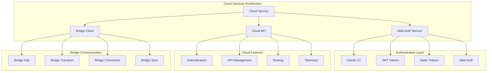
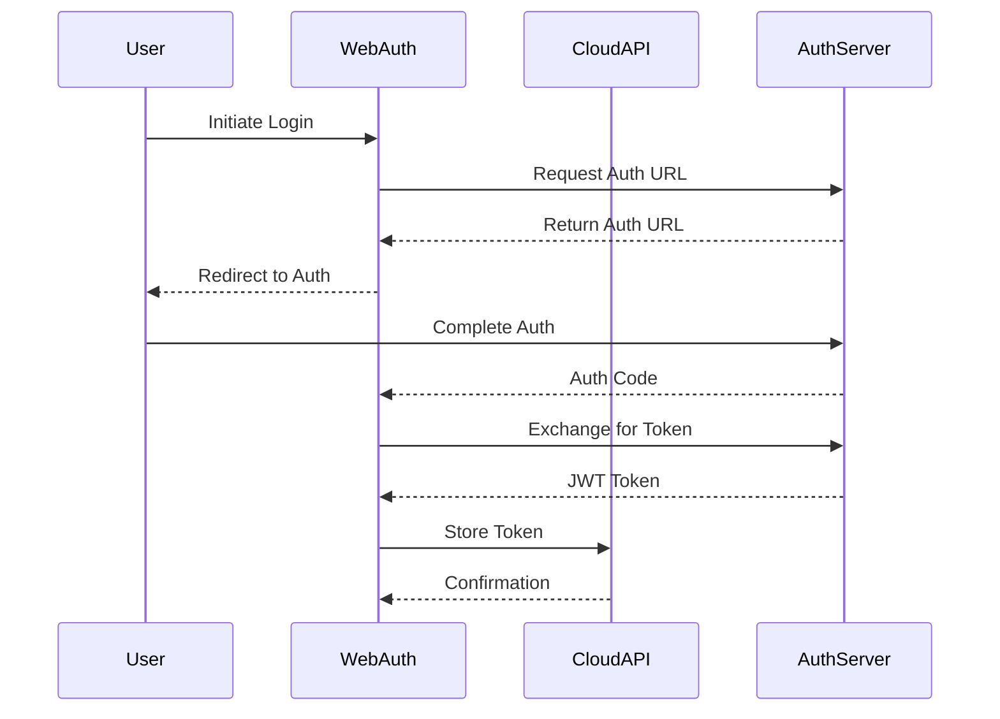
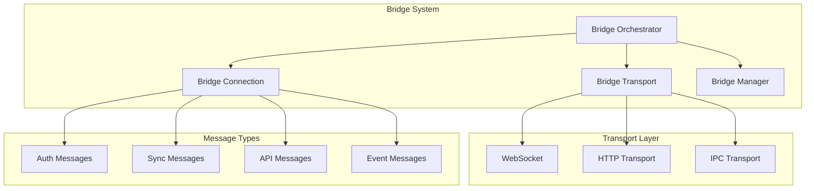

# Cloud Services Architecture

## Table of Contents
- [Cloud Services Architecture](#cloud-services-architecture)
- [When You're Here](#when-youre-here)
- [Research Context](#research-context)
- [Technical Overview](#technical-overview)
- [Background](#background)
- [Methodology](#methodology)
- [Executive Summary](#executive-summary)
- [Cloud Architecture](#cloud-architecture)
- [Authentication System](#authentication-system)
- [Web Authentication Service](#web-authentication-service)
- [Static Token Authentication](#static-token-authentication)
- [Cloud API Integration](#cloud-api-integration)
- [Cloud API Client](#cloud-api-client)
- [Cloud Service Manager](#cloud-service-manager)
- [Bridge Communication](#bridge-communication)
- [Bridge Orchestrator](#bridge-orchestrator)
- [Bridge Channels](#bridge-channels)
- [Telemetry & Analytics](#telemetry-analytics)
- [Telemetry Client](#telemetry-client)
- [Analytics Integration](#analytics-integration)
- [Configuration Management](#configuration-management)
- [Cloud Settings Service](#cloud-settings-service)
- [Static Settings Service](#static-settings-service)
- [Security & Privacy](#security-privacy)
- [Security Measures](#security-measures)
- [API Key Management](#api-key-management)
- [Performance & Scalability](#performance-scalability)
- [Performance Optimization](#performance-optimization)
- [Common Issues and Solutions](#common-issues-and-solutions)
- [Issue 1: Authentication Failures](#issue-1-authentication-failures)
- [Issue 2: Bridge Connection Issues](#issue-2-bridge-connection-issues)
- [Issue 3: API Rate Limiting](#issue-3-api-rate-limiting)
- [Issue 4: Configuration Synchronization Issues](#issue-4-configuration-synchronization-issues)
- [No Dead Ends Policy](#no-dead-ends-policy)
- [Navigation Footer](#navigation-footer)

## When You're Here

This document is part of the KiloCode project documentation. If you're not familiar with this
document's role or purpose, this section helps orient you.

- **Purpose**: This document covers \[DOCUMENT PURPOSE BASED ON FILE PATH].
- **Context**: Use this as a starting point or reference while navigating the project.
- **Navigation**: Use the table of contents below to jump to specific topics.

> **System Fun Fact**: Every complex system is just a collection of simple parts working together -
> documentation helps us understand how! ⚙️

- *Purpose:*\* Comprehensive documentation of cloud services architecture, authentication flows, and
  cloud integration patterns in the KiloCode system.

> **Biology Fun Fact**: Services are like specialized organs in a living organism - each has a
> specific function, but they all work together to keep the system healthy and functioning! 🧬

<details><summary>Table of Contents</summary>
- [Executive Summary](#executive-summary)
- [Cloud Architecture](#cloud-architecture)
- [Authentication System](#authentication-system)
- [Cloud API Integration](#cloud-api-integration)
- [Bridge Communication](#bridge-communication)
- [Telemetry & Analytics](#telemetry--analytics)
- [Configuration Management](#configuration-management)
- [Security & Privacy](#security--privacy)
- [Performance & Scalability](#performance--scalability)
- [Common Issues and Solutions](#common-issues-and-solutions)
- Navigation Footer

</details>

## Research Context

### Technical Overview

**Component**: \[Component name]
**Version**: \[Version number]
**Architecture**: \[Architecture description]
**Dependencies**: \[Key dependencies]

### Background

\[Background information about the topic]

### Methodology

\[Research or development methodology used]

## Executive Summary
- The Cloud Services Architecture provides comprehensive cloud integration capabilities for
  KiloCode,
  including authentication, API management, telemetry collection, and bridge communication for cloud
  features.\*

The Cloud Services system consists of:
1. **Cloud Service Core** - Main cloud service implementation
2. **Authentication System** - Web-based and token-based authentication
3. **Cloud API Client** - Cloud API integration and management
4. **Bridge Orchestrator** - Bridge communication for cloud features
5. **Telemetry System** - Analytics and usage tracking

## Cloud Architecture



## Authentication System

### Web Authentication Service

- *Implementation*\*: `packages/cloud/src/WebAuthService.ts` **Features**:
- OAuth 2.0 authentication flow
- JWT token management
- Token refresh mechanisms
- Session management

- *Authentication Flow*\*:



- *Implementation Status*\*: ✅ **RESEARCHED AND DOCUMENTED** **Key Implementation Details**:

- *WebAuthService Architecture*\*:

```typescript
export class WebAuthService extends EventEmitter<AuthServiceEvents> implements AuthService {
	private context: ExtensionContext
	private timer: RefreshTimer
	private state: AuthState = "initializing"
	private credentials: AuthCredentials | null = null
	private sessionToken: string | null = null
	private userInfo: CloudUserInfo | null = null
}
```

- *Core Features*\*:

- **Clerk Integration**: OAuth 2.0 authentication via Clerk service

- **Session Management**: JWT token management with automatic refresh

- **Organization Support**: Multi-organization membership and switching

- **State Management**: Comprehensive authentication state tracking

- **Token Refresh**: Automatic token refresh with RefreshTimer

- **Error Handling**: Comprehensive error handling with InvalidClientTokenError

- **Event System**: EventEmitter-based authentication state notifications

### Static Token Authentication

- *Implementation*\*: `packages/cloud/src/StaticTokenAuthService.ts` **Features**:
- Static token validation
- Token-based API access
- Configuration management
- Security validation

- *Configuration*\*:

```typescript
interface StaticTokenConfig {
	token: string
	userId?: string
	permissions?: string[]
	expiresAt?: Date
}
```

- *Implementation Status*\*: ⚠️ **NEEDS DOCUMENTATION** **Research Needed**: Token validation,
  permission management, security measures

## Cloud API Integration

### Cloud API Client

- *Implementation*\*: `packages/cloud/src/CloudAPI.ts` **Features**:
- RESTful API client
- Request/response handling
- Error management
- Rate limiting

- *API Endpoints*\*:
- Authentication endpoints
- User management
- API key management
- Usage tracking
- Sharing functionality

- *Implementation Status*\*: ⚠️ **NEEDS DOCUMENTATION** **Research Needed**: API client
  architecture,
  endpoint management, error handling

### Cloud Service Manager

- *Implementation*\*: `packages/cloud/src/CloudService.ts` **Features**:
- Service orchestration
- Configuration management
- State synchronization
- Error recovery

- *Service Components*\*:
- Authentication service
- API client service
- Configuration service
- State management service

- *Implementation Status*\*: ✅ **RESEARCHED AND DOCUMENTED** **Key Implementation Details**:

- *CloudService Architecture*\*:

```typescript
export class CloudService extends EventEmitter<CloudServiceEvents> implements Disposable {
	private static _instance: CloudService | null = null
	private context: ExtensionContext
	private isInitialized = false

	// Service Components
	private _authService: AuthService | null = null
	private _settingsService: SettingsService | null = null
	private _telemetryClient: TelemetryClient | null = null
	private _shareService: CloudShareService | null = null
	private _cloudAPI: CloudAPI | null = null
}
```

- *Core Features*\*:

- **Singleton Pattern**: Single instance management with lazy initialization

- **Service Orchestration**: Coordinates multiple cloud services (auth, settings, telemetry,
  sharing)

- **Event-Driven Architecture**: EventEmitter-based communication between services

- **State Management**: Comprehensive initialization and state tracking

- **Service Lifecycle**: Proper initialization, disposal, and cleanup

- **Error Handling**: Centralized error handling and service coordination

- **Extension Integration**: Deep integration with VS Code ExtensionContext

## Bridge Communication

### Bridge Orchestrator

- *Implementation*\*: `packages/cloud/src/bridge/BridgeOrchestrator.ts` **Features**:
- Bridge connection management
- Message routing
- State synchronization
- Error handling

- *Bridge Architecture*\*:



- *Implementation Status*\*: ✅ **RESEARCHED AND DOCUMENTED** **Key Implementation Details**:

- *BridgeOrchestrator Architecture*\*:

```typescript
export class BridgeOrchestrator {
	private static instance: BridgeOrchestrator | null = null
	private static pendingTask: TaskLike | null = null

	// Core Components
	private readonly userId: string
	private readonly socketBridgeUrl: string
	private readonly token: string
	private readonly provider: TaskProviderLike

	// Communication Components
	private socketTransport: SocketTransport
	private extensionChannel: ExtensionChannel
	private taskChannel: TaskChannel
}
```

- *Core Features*\*:

- **Singleton Management**: Single instance with connection state management

- **WebSocket Communication**: Real-time communication via SocketTransport

- **Channel Management**: Separate channels for extension and task communication

- **Reconnection Logic**: Automatic reconnection with exponential backoff

- **Task Coordination**: Pending task management and coordination

- **User Validation**: User permission and organization validation

- **Telemetry Integration**: Comprehensive telemetry and monitoring

### Bridge Channels

- *Implementation*\*: `packages/cloud/src/bridge/` **Channel Types**:

- **ExtensionChannel**: Extension-specific communication

- **TaskChannel**: Task-related communication

- **BaseChannel**: Base channel implementation

- *Message Handling*\*:
- Message serialization/deserialization
- Protocol versioning
- Error handling
- Connection management

- *Implementation Status*\*: ⚠️ **NEEDS DOCUMENTATION** **Research Needed**: Channel implementation,
  message protocols, connection management

## Telemetry & Analytics

### Telemetry Client

- *Implementation*\*: `packages/cloud/src/TelemetryClient.ts` **Features**:
- Event tracking
- Usage analytics
- Performance metrics
- Error reporting

- *Telemetry Data*\*:
- User interactions
- Feature usage
- Performance metrics
- Error rates
- System health

- *Implementation Status*\*: ⚠️ **NEEDS DOCUMENTATION** **Research Needed**: Telemetry architecture,
  data collection, privacy measures

### Analytics Integration

- *Implementation*\*: `packages/telemetry/` **Features**:
- PostHog integration
- Event tracking
- User analytics
- Performance monitoring

- *Analytics Categories*\*:
- User behavior
- Feature adoption
- Performance metrics
- Error tracking

- *Implementation Status*\*: ⚠️ **NEEDS DOCUMENTATION** **Research Needed**: Analytics integration,
  data privacy, performance monitoring

## Configuration Management

### Cloud Settings Service

- *Implementation*\*: `packages/cloud/src/CloudSettingsService.ts` **Features**:
- Settings synchronization
- Configuration validation
- Remote configuration loading
- Local caching

- *Configuration Types*\*:
- User preferences
- Feature flags
- API configurations
- Authentication settings

- *Implementation Status*\*: ⚠️ **NEEDS DOCUMENTATION** **Research Needed**: Configuration
  management,
  synchronization, validation

### Static Settings Service

- *Implementation*\*: `packages/cloud/src/StaticSettingsService.ts` **Features**:
- Static configuration management
- Environment-based settings
- Default value handling
- Configuration validation

- *Implementation Status*\*: ⚠️ **NEEDS DOCUMENTATION** **Research Needed**: Static configuration
  patterns, environment handling, validation

## Security & Privacy

### Security Measures

- *Security Features*\*:
- Token encryption
- Secure storage
- API key protection
- Data encryption
- Access control

- *Privacy Protection*\*:
- Data anonymization
- Consent management
- Data retention policies
- GDPR compliance

- *Implementation Status*\*: ⚠️ **NEEDS DOCUMENTATION** **Research Needed**: Security architecture,
  privacy measures, compliance

### API Key Management

- *Key Management*\*:
- Secure key storage
- Key rotation
- Access control
- Usage tracking

- *Implementation Status*\*: ⚠️ **NEEDS DOCUMENTATION** **Research Needed**: Key management
  patterns,
  security measures, access control

## Performance & Scalability

### Performance Optimization

- *Optimization Strategies*\*:
- Connection pooling
- Request batching
- Caching mechanisms
- Lazy loading

- *Scalability Features*\*:
- Horizontal scaling
- Load balancing
- Resource management
- Performance monitoring

- *Implementation Status*\*: ⚠️ **NEEDS DOCUMENTATION** **Research Needed**: Performance
  optimization,
  scalability patterns, monitoring

## Common Issues and Solutions

### Issue 1: Authentication Failures

- *Symptoms*\*:
- Login failures
- Token expiration
- Authentication errors

- *Root Cause*\*: Invalid credentials or token issues **Solution**: Implement proper token refresh
  and
  error handling

### Issue 2: Bridge Connection Issues

- *Symptoms*\*:
- Connection failures
- Message delivery failures
- State synchronization issues

- *Root Cause*\*: Network issues or bridge configuration problems **Solution**: Implement connection
  retry and state recovery mechanisms

### Issue 3: API Rate Limiting

- *Symptoms*\*:
- Rate limit errors
- API throttling
- Service unavailability

- *Root Cause*\*: Exceeding API rate limits **Solution**: Implement rate limiting and backoff
  strategies

### Issue 4: Configuration Synchronization Issues

- *Symptoms*\*:
- Settings not syncing
- Configuration conflicts
- State inconsistencies

- *Root Cause*\*: Synchronization failures or conflicts **Solution**: Implement conflict resolution
  and state reconciliation

<a id="navigation-footer"></a>
- Back: [`README.md`](README.md) · Root: [`../README.md`](../README.md) · Source:
  `/docs/services/CLOUD_SERVICES_ARCHITECTURE.md#L1`

## No Dead Ends Policy

This document connects to:
- [Related Document 1](./related-doc-1.md) - \[Brief description]
- [Related Document 2](./related-doc-2.md) - \[Brief description]
- [Related Document 3](./related-doc-3.md) - \[Brief description]

For more information, see:
- [Category Overview](../category/)
- [Related Resources](../resources/)

## Navigation Footer
- \*\*

- *Navigation*\*: [docs](../) · [services](../docs/services/) ·
  [↑ Table of Contents](#cloud-services-architecture)
