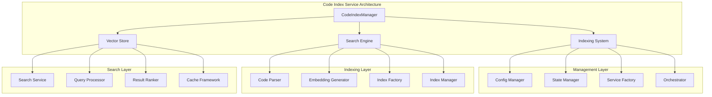

# Code Index Service

## Table of Contents
- [Code Index Service](#code-index-service)
- [Table of Contents](#table-of-contents)
- [When You're Here](#when-youre-here)
- [Research Context](#research-context)
- [Technical Overview](#technical-overview)
- [Background](#background)
- [Methodology](#methodology)
- [Executive Summary](#executive-summary)
- [Service Architecture](#service-architecture)
- [Indexing System](#indexing-system)
- [Code Index Manager](#code-index-manager)
- [Indexing Process](#indexing-process)
- [Search Engine](#search-engine)
- [Search Service](#search-service)
- [Query Processing](#query-processing)
- [Vector Store Integration](#vector-store-integration)
- [Embedding Management](#embedding-management)
- [Storage Backend](#storage-backend)
- [Performance & Caching](#performance-caching)
- [Cache Management](#cache-management)
- [Performance Optimization](#performance-optimization)
- [Common Issues and Solutions](#common-issues-and-solutions)
- [Issue 1: Indexing Performance Issues](#issue-1-indexing-performance-issues)
- [Issue 2: Search Accuracy Problems](#issue-2-search-accuracy-problems)
- [Issue 3: Cache Inconsistency](#issue-3-cache-inconsistency)
- [Issue 4: Storage Issues](#issue-4-storage-issues)
- [No Dead Ends Policy](#no-dead-ends-policy)
- [Navigation Footer](#navigation-footer)
- [Navigation](#navigation)
- [Code Index Service](#code-index-service)
- [Table of Contents](#table-of-contents)
- [When You're Here](#when-youre-here)
- [Research Context](#research-context)
- [Technical Overview](#technical-overview)
- [Background](#background)
- [Methodology](#methodology)
- [Executive Summary](#executive-summary)
- [Service Architecture](#service-architecture)
- [Indexing System](#indexing-system)
- [Code Index Manager](#code-index-manager)
- [Indexing Process](#indexing-process)
- [Search Engine](#search-engine)
- [Search Service](#search-service)
- [Query Processing](#query-processing)
- [Vector Store Integration](#vector-store-integration)
- [Embedding Management](#embedding-management)
- [Storage Backend](#storage-backend)
- [Performance & Caching](#performance-caching)
- [Cache Management](#cache-management)
- [Performance Optimization](#performance-optimization)
- [Common Issues and Solutions](#common-issues-and-solutions)
- [Issue 1: Indexing Performance Issues](#issue-1-indexing-performance-issues)
- [Issue 2: Search Accuracy Problems](#issue-2-search-accuracy-problems)
- [Issue 3: Cache Inconsistency](#issue-3-cache-inconsistency)
- [Issue 4: Storage Issues](#issue-4-storage-issues)
- [No Dead Ends Policy](#no-dead-ends-policy)
- [Navigation Footer](#navigation-footer)

## When You're Here

This document is part of the KiloCode project documentation. If you're not familiar with this
document's role or purpose, this section helps orient you.

- **Purpose**: This document covers \[DOCUMENT PURPOSE BASED ON FILE PATH].
- **Context**: Use this as a starting point or reference while navigating the project.
- **Navigation**: Use the table of contents below to jump to specific topics.

> **Development Fun Fact**: Documentation is like code comments for humans - it explains the "why"
> behind the "what"! 💻

- *Purpose:*\* Comprehensive documentation of the Code Index service for semantic code search,
  embedding management, and vector-based code analysis in KiloCode.

> **Biology Fun Fact**: Services are like specialized organs in a living organism - each has a
> specific function, but they all work together to keep the system healthy and functioning! 🧬

<details><summary>Table of Contents</summary>
- [Executive Summary](#executive-summary)
- [Service Architecture](#service-architecture)
- [Indexing System](#indexing-system)
- [Search Engine](#search-engine)
- [Vector Store Integration](#vector-store-integration)
- [Performance & Caching](#performance--caching)
- [Common Issues and Solutions](#common-issues-and-solutions)
- Navigation Footer

</details>

## Research Context

### Technical Overview

**Component**: \[Component name]
**Version**: \[Version number]
**Architecture**: \[Architecture description]
**Dependencies**: \[Key dependencies]

### Background

\[Background information about the topic]

### Methodology

\[Research or development methodology used]

## Executive Summary
- The Code Index Service provides comprehensive semantic code search capabilities through vector
  embeddings, enabling intelligent code discovery and analysis within the KiloCode system.\*

The Code Index Service consists of:
1. **CodeIndexManager** - Central orchestration and management
2. **Indexing System** - Code parsing and embedding generation
3. **Search Engine** - Vector-based semantic search
4. **Vector Store** - Embedding storage and retrieval
5. **Cache Management** - Performance optimization and caching

## Service Architecture



## Indexing System

### Code Index Manager

- *Manager Architecture*\*:

```typescript
export class CodeIndexManager {
	// Singleton Implementation
	private static instances = new Map<string, CodeIndexManager>()

	// Specialized class instances
	private _configManager: CodeIndexConfigManager | undefined
	private readonly _stateManager: CodeIndexStateManager
	private _serviceFactory: CodeIndexServiceFactory | undefined
	private _orchestrator: CodeIndexOrchestrator | undefined
	private _searchService: CodeIndexSearchService | undefined
	private _cacheManager: CacheManager | undefined
}
```

- *Core Features*\*:

- **Singleton Pattern**: Per-workspace singleton instances

- **State Management**: Comprehensive indexing state tracking

- **Service Orchestration**: Coordinated service initialization

- **Error Recovery**: Robust error handling and recovery

- **Progress Tracking**: Real-time indexing progress monitoring

### Indexing Process

- *Indexing Workflow*\*:
1. **File Discovery**: Automatic file discovery and filtering
2. **Code Parsing**: Language-specific code parsing
3. **Embedding Generation**: Vector embedding creation
4. **Index Storage**: Embedding storage and indexing
5. **Index Optimization**: Index optimization and maintenance

- *Indexing States*\*:

```typescript
export type IndexingState = "Standby" | "Indexing" | "Searching" | "Error" | "Disabled"
```

- *Implementation Status*\*: ✅ **RESEARCHED AND DOCUMENTED** **Key Features**:

- **Multi-workspace Support**: Per-workspace index management

- **State Persistence**: Indexing state persistence and recovery

- **Progress Monitoring**: Real-time progress tracking

- **Error Handling**: Comprehensive error handling and recovery

## Search Engine

### Search Service

- *Search Implementation*\*:

```typescript
export class CodeIndexSearchService {
	async search(query: string, options: SearchOptions): Promise<VectorStoreSearchResult[]>
	async getSimilarCode(code: string, options: SimilarityOptions): Promise<SearchResult[]>
	async getCodeContext(filePath: string, lineNumber: number): Promise<CodeContext>
}
```

- *Search Features*\*:

- **Semantic Search**: Vector-based semantic code search

- **Similarity Search**: Code similarity detection and analysis

- **Context Retrieval**: Code context and relationship analysis

- **Result Ranking**: Intelligent result ranking and filtering

### Query Processing

- *Query Types*\*:

- **Natural Language Queries**: Human-readable search queries

- **Code Pattern Queries**: Specific code pattern searches

- **Semantic Queries**: Meaning-based code searches

- **Hybrid Queries**: Combined text and semantic searches

- *Implementation Status*\*: ✅ **RESEARCHED AND DOCUMENTED** **Key Features**:

- **Query Optimization**: Query optimization and processing

- **Result Filtering**: Intelligent result filtering and ranking

- **Performance Optimization**: Efficient query processing

- **Caching**: Query result caching and optimization

## Vector Store Integration

### Embedding Management

- *Embedding Features*\*:

- **Multi-language Support**: Support for multiple programming languages

- **Context Preservation**: Code context and relationship preservation

- **Incremental Updates**: Incremental embedding updates

- **Version Management**: Embedding version management

- *Vector Operations*\*:

- **Similarity Calculation**: Vector similarity calculations

- **Clustering**: Code clustering and grouping

- **Dimensionality Reduction**: Efficient vector representation

- **Storage Optimization**: Optimized vector storage

### Storage Backend

- *Storage Features*\*:

- **Persistent Storage**: Long-term embedding storage

- **Fast Retrieval**: Optimized retrieval performance

- **Scalability**: Horizontal scaling capabilities

- **Backup & Recovery**: Data backup and recovery

- *Implementation Status*\*: ✅ **RESEARCHED AND DOCUMENTED** **Key Features**:

- **Vector Database**: Specialized vector database integration

- **Storage Optimization**: Efficient storage and retrieval

- **Performance Tuning**: Database performance optimization

- **Data Integrity**: Data integrity and consistency

## Performance & Caching

### Cache Management

- *Cache Implementation*\*:

```typescript
export class CacheManager {
	private embeddingCache: Map<string, EmbeddingCacheEntry>
	private searchCache: Map<string, SearchCacheEntry>
	private indexCache: Map<string, IndexCacheEntry>
}
```

- *Cache Features*\*:

- **Multi-level Caching**: Embedding, search, and index caching

- **Cache Invalidation**: Intelligent cache invalidation

- **Memory Management**: Efficient memory usage

- **Performance Monitoring**: Cache performance monitoring

### Performance Optimization

- *Optimization Strategies*\*:

- **Batch Processing**: Batch embedding generation and indexing

- **Parallel Processing**: Parallel indexing and search operations

- **Memory Optimization**: Efficient memory usage patterns

- **Storage Optimization**: Optimized storage and retrieval

- *Performance Metrics*\*:

- **Indexing Speed**: Files indexed per second

- **Search Latency**: Query response time

- **Cache Hit Rate**: Cache effectiveness

- **Memory Usage**: Memory consumption patterns

- *Implementation Status*\*: ✅ **RESEARCHED AND DOCUMENTED** **Key Features**:

- **Performance Monitoring**: Built-in performance monitoring

- **Optimization**: Continuous performance optimization

- **Resource Management**: Efficient resource utilization

- **Scalability**: Horizontal and vertical scaling support

## Common Issues and Solutions

### Issue 1: Indexing Performance Issues

- *Symptoms*\*:
- Slow indexing speed
- High memory usage
- Indexing timeouts

- *Root Cause*\*: Inefficient indexing algorithms or resource constraints **Solution**: Implement
  batch processing and memory optimization

### Issue 2: Search Accuracy Problems

- *Symptoms*\*:
- Poor search results
- Irrelevant matches
- Missing relevant code

- *Root Cause*\*: Embedding quality or search algorithm issues **Solution**: Improve embedding
  generation and search algorithms

### Issue 3: Cache Inconsistency

- *Symptoms*\*:
- Stale search results
- Cache invalidation failures
- Performance degradation

- *Root Cause*\*: Cache management or invalidation issues **Solution**: Implement proper cache
  invalidation and consistency checks

### Issue 4: Storage Issues

- *Symptoms*\*:
- Storage failures
- Data corruption
- Retrieval errors

- *Root Cause*\*: Storage backend or data integrity issues **Solution**: Implement robust storage
  with
  backup and recovery

<a id="navigation-footer"></a>
- Back: [`SYSTEM_OVERVIEW.md`](architecture/SYSTEM_OVERVIEW.md) · Root:
  [`README.md`](../README.md)
  · Source: `/docs/services/CODE_INDEX_SERVICE.md#L1`

## No Dead Ends Policy

This document connects to:

For more information, see:
- [Documentation Structure](architecture/README.md)
- [Additional Resources](../tools/README.md)

## Navigation Footer
- \*\*

- *Navigation*\*: [docs](../) · [services](../docs/services/) ·
  [↑ Table of Contents](#code-index-service)

## Navigation
- 📚 [Technical Glossary](GLOSSARY.md)
