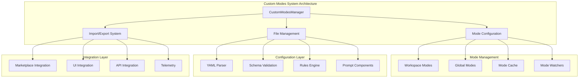

# Custom Modes System

**Purpose:** Comprehensive documentation of the Custom Modes system for managing AI behavior configurations and custom prompt strategies in KiloCode.

> **Biology Fun Fact**: Services are like specialized organs in a living organism - each has a specific function, but they all work together to keep the system healthy and functioning! 🧬

<details><summary>Table of Contents</summary>

- [Executive Summary](#executive-summary)
- [System Architecture](#system-architecture)
- [Mode Configuration](#mode-configuration)
- [Import/Export System](#importexport-system)
- [File Management](#file-management)
- [Validation & Error Handling](#validation--error-handling)
- [Performance & Caching](#performance--caching)
- [Common Issues and Solutions](#common-issues-and-solutions)
- [Navigation Footer](#navigation-footer)

</details>

## Executive Summary

_The Custom Modes System provides comprehensive management of AI behavior configurations, custom prompt strategies, and mode-based customization for different development contexts in KiloCode._

The Custom Modes System consists of:

1. **CustomModesManager** - Core mode management and configuration
2. **Mode Configuration** - YAML-based mode definitions and rules
3. **Import/Export System** - Mode sharing and distribution
4. **File Management** - Workspace and global mode file handling
5. **Validation System** - Schema validation and error handling

## System Architecture



## Mode Configuration

### Mode Schema

**Mode Configuration Structure**:

```typescript
interface ModeConfig {
	slug: string
	name: string
	description: string
	promptComponents: PromptComponent[]
	rules: string[]
	metadata?: Record<string, any>
}
```

**Implementation Details**:

```typescript
export class CustomModesManager {
	private static readonly cacheTTL = 10_000
	private disposables: vscode.Disposable[] = []
	private isWriting = false
	private writeQueue: Array<() => Promise<void>> = []
	private cachedModes: ModeConfig[] | null = null
	private cachedAt: number = 0
}
```

**Core Features**:

- **YAML Configuration**: Human-readable YAML configuration format
- **Schema Validation**: Comprehensive schema validation with Zod
- **Prompt Components**: Modular prompt component system
- **Rules Engine**: Flexible rules and constraints system
- **Metadata Support**: Extensible metadata for mode customization

### Mode Types

**Mode Categories**:

- **Workspace Modes**: Project-specific mode configurations
- **Global Modes**: User-wide mode configurations
- **Template Modes**: Reusable mode templates
- **Custom Modes**: User-defined custom modes

**Implementation Status**: ✅ **RESEARCHED AND DOCUMENTED**
**Key Features**:

- **File-based Configuration**: `.kilocodemodes` file support
- **Hierarchical Override**: Workspace modes override global modes
- **Template System**: Reusable mode templates
- **Validation**: Comprehensive configuration validation

## Import/Export System

### Export Functionality

**Export Implementation**:

```typescript
interface ExportResult {
	success: boolean
	yaml?: string
	error?: string
}

interface ExportedModeConfig extends ModeConfig {
	rulesFiles?: RuleFile[]
}
```

**Export Features**:

- **YAML Export**: Complete mode configuration export
- **Rules File Inclusion**: Associated rules file export
- **Metadata Preservation**: Full metadata preservation
- **Error Handling**: Comprehensive error reporting

### Import Functionality

**Import Implementation**:

```typescript
interface ImportResult {
	success: boolean
	error?: string
}

interface ImportData {
	customModes: ExportedModeConfig[]
}
```

**Import Features**:

- **YAML Import**: Mode configuration import
- **Validation**: Import-time validation and error checking
- **Conflict Resolution**: Automatic conflict resolution
- **Rollback Support**: Import rollback on failure

**Implementation Status**: ✅ **RESEARCHED AND DOCUMENTED**
**Key Features**:

- **Marketplace Integration**: Integration with marketplace system
- **Validation**: Comprehensive import validation
- **Error Recovery**: Robust error handling and recovery
- **User Feedback**: Clear user feedback and error messages

## File Management

### File System Integration

**File Management Features**:

- **Workspace Detection**: Automatic workspace mode file detection
- **Global Configuration**: User-wide mode configuration
- **File Watching**: Automatic file change detection
- **Backup System**: Automatic backup creation

**File Operations**:

```typescript
private async getWorkspaceRoomodes(): Promise<string | undefined>
private async getGlobalRoomodes(): Promise<string>
private async ensureSettingsDirectoryExists(): Promise<void>
```

**Implementation Status**: ✅ **RESEARCHED AND DOCUMENTED**
**Key Features**:

- **Atomic Operations**: Atomic file write operations
- **Queue Management**: Write queue for concurrent operations
- **Error Handling**: Comprehensive file operation error handling
- **Performance Optimization**: Efficient file operations and caching

### Caching System

**Cache Implementation**:

```typescript
private cachedModes: ModeConfig[] | null = null
private cachedAt: number = 0
private static readonly cacheTTL = 10_000
```

**Cache Features**:

- **TTL-based Caching**: Time-to-live based cache invalidation
- **Write Queue**: Concurrent write operation management
- **Cache Invalidation**: Automatic cache invalidation on file changes
- **Performance Optimization**: Reduced file I/O operations

## Validation & Error Handling

### Schema Validation

**Validation Implementation**:

```typescript
const customModesSettingsSchema = z.object({
	customModes: z.array(modeConfigSchema),
})

const modeConfigSchema = z.object({
	slug: z.string().min(1),
	name: z.string().min(1),
	description: z.string(),
	promptComponents: z.array(promptComponentSchema),
	rules: z.array(z.string()),
})
```

**Validation Features**:

- **Zod Schema Validation**: Type-safe schema validation
- **Error Reporting**: Detailed validation error messages
- **Partial Validation**: Support for partial mode validation
- **Custom Validators**: Extensible validation system

### Error Handling

**Error Management**:

- **Graceful Degradation**: Graceful handling of validation errors
- **User Feedback**: Clear error messages and recovery suggestions
- **Logging**: Comprehensive error logging and debugging
- **Recovery**: Automatic error recovery where possible

**Implementation Status**: ✅ **RESEARCHED AND DOCUMENTED**
**Key Features**:

- **Comprehensive Validation**: Multi-layer validation system
- **Error Recovery**: Automatic error recovery mechanisms
- **User Experience**: Clear error messages and guidance
- **Debugging Support**: Detailed error logging and debugging information

## Performance & Caching

### Performance Optimization

**Optimization Strategies**:

- **Lazy Loading**: Lazy loading of mode configurations
- **Write Queuing**: Efficient write operation queuing
- **Cache Management**: Intelligent cache management
- **File Watching**: Efficient file change detection

**Performance Metrics**:

- **Cache Hit Rate**: Mode configuration cache effectiveness
- **Load Time**: Mode loading performance
- **Write Performance**: File write operation performance
- **Memory Usage**: Memory consumption optimization

**Implementation Status**: ✅ **RESEARCHED AND DOCUMENTED**
**Key Features**:

- **Efficient Caching**: TTL-based caching with automatic invalidation
- **Write Optimization**: Queued write operations for performance
- **Memory Management**: Efficient memory usage patterns
- **Performance Monitoring**: Built-in performance monitoring

## Common Issues and Solutions

### Issue 1: Mode Configuration Validation Failures

**Symptoms**:

- Mode configuration errors
- Import/export failures
- Validation errors

**Root Cause**: Schema validation or configuration format issues
**Solution**: Implement comprehensive validation with clear error messages

### Issue 2: File System Issues

**Symptoms**:

- File read/write failures
- Permission errors
- File corruption

**Root Cause**: File system or permission issues
**Solution**: Implement robust file handling with error recovery

### Issue 3: Cache Inconsistency

**Symptoms**:

- Stale mode configurations
- Cache invalidation failures
- Performance issues

**Root Cause**: Cache management or invalidation issues
**Solution**: Implement proper cache invalidation and consistency checks

### Issue 4: Import/Export Failures

**Symptoms**:

- Import/export errors
- Data corruption
- Validation failures

**Root Cause**: Import/export process or validation issues
**Solution**: Implement robust import/export with validation and rollback

<a id="navigation-footer"></a>

- Back: [`SYSTEM_OVERVIEW.md`](../architecture/SYSTEM_OVERVIEW.md) · Root: [`INDEX.md`](../INDEX.md) · Source: `/docs/services/CUSTOM_MODES_SYSTEM.md#L1`
