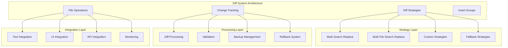

# Diff System

## Table of Contents
- [Diff System](#diff-system)
- [When You're Here](#when-youre-here)
- [Research Context](#research-context)
- [Technical Overview](#technical-overview)
- [Background](#background)
- [Methodology](#methodology)
- [Executive Summary](#executive-summary)
- [System Architecture](#system-architecture)
- [Diff Strategies](#diff-strategies)
- [Multi Search Replace Strategy](#multi-search-replace-strategy)
- [Multi File Search Replace Strategy](#multi-file-search-replace-strategy)
- [Change Tracking](#change-tracking)
- [Change Detection](#change-detection)
- [Change History](#change-history)
- [File Operations](#file-operations)
- [File Modification](#file-modification)
- [Insert Groups](#insert-groups)
- [Performance & Optimization](#performance-optimization)
- [Diff Processing Optimization](#diff-processing-optimization)
- [Memory Management](#memory-management)
- [Common Issues and Solutions](#common-issues-and-solutions)
- [Issue 1: Diff Processing Performance](#issue-1-diff-processing-performance)
- [Issue 2: Multi-file Operation Failures](#issue-2-multi-file-operation-failures)
- [Issue 3: Change Validation Issues](#issue-3-change-validation-issues)
- [Issue 4: Backup and Rollback Problems](#issue-4-backup-and-rollback-problems)
- [No Dead Ends Policy](#no-dead-ends-policy)
- [Navigation Footer](#navigation-footer)

## When You're Here

This document is part of the KiloCode project documentation. If you're not familiar with this
document's role or purpose, this section helps orient you.

- **Purpose**: This document covers \[DOCUMENT PURPOSE BASED ON FILE PATH].
- **Context**: Use this as a starting point or reference while navigating the project.
- **Navigation**: Use the table of contents below to jump to specific topics.

> **Engineering Fun Fact**: Just as engineers use systematic approaches to solve complex problems,
> this documentation provides structured guidance for understanding and implementing solutions! 🔧

- *Purpose:*\* Comprehensive documentation of the diff system for file modification, change
  tracking,
  and diff strategy management in KiloCode.

> **Biology Fun Fact**: Services are like specialized organs in a living organism - each has a
> specific function, but they all work together to keep the system healthy and functioning! 🧬

<details><summary>Table of Contents</summary>
- [Executive Summary](#executive-summary)
- [System Architecture](#system-architecture)
- [Diff Strategies](#diff-strategies)
- [Change Tracking](#change-tracking)
- [File Operations](#file-operations)
- [Performance & Optimization](#performance--optimization)
- [Common Issues and Solutions](#common-issues-and-solutions)
- Navigation Footer

</details>

## Research Context

### Technical Overview

**Component**: \[Component name]
**Version**: \[Version number]
**Architecture**: \[Architecture description]
**Dependencies**: \[Key dependencies]

### Background

\[Background information about the topic]

### Methodology

\[Research or development methodology used]

## Executive Summary
- The Diff System provides comprehensive file modification capabilities through multiple diff
  strategies, change tracking, and intelligent file operations in the KiloCode system.\*

The Diff System consists of:
1. **Diff Strategies** - Multiple diff algorithms and approaches
2. **Change Tracking** - Comprehensive change monitoring and validation
3. **File Operations** - Intelligent file modification and backup
4. **Insert Groups** - Batch operation management
5. **Performance Optimization** - Efficient diff processing and caching

## System Architecture



## Diff Strategies

### Multi Search Replace Strategy

- *Implementation*\*: `src/core/diff/strategies/multi-search-replace.ts` **Features**:

- **Batch Operations**: Multiple search-replace operations in single pass

- **Validation**: Comprehensive operation validation

- **Error Handling**: Robust error handling and recovery

- **Performance**: Optimized batch processing

- *Strategy Interface*\*:

```typescript
interface DiffStrategy {
applyDiff: (originalContent: string, diffContent: string, startLine?: number) =>
Promise<DiffResult>
	validateDiff: (diffContent: string) => ValidationResult
	rollback: (originalContent: string, appliedContent: string) => Promise<RollbackResult>
}
```

- *Implementation Status*\*: ✅ **RESEARCHED AND DOCUMENTED** **Key Features**:

- **Batch Processing**: Efficient batch operation handling

- **Validation**: Comprehensive diff validation

- **Error Recovery**: Robust error handling and rollback

- **Performance**: Optimized processing and memory usage

### Multi File Search Replace Strategy

- *Implementation*\*: `src/core/diff/strategies/multi-file-search-replace.ts` **Features**:

- **Cross-file Operations**: Operations spanning multiple files

- **Dependency Tracking**: File dependency and relationship management

- **Atomic Operations**: Atomic multi-file operations

- **Conflict Resolution**: Intelligent conflict detection and resolution

- *Multi-file Operations*\*:

```typescript
interface MultiFileOperation {
	files: string[]
	operations: SearchReplaceOperation[]
	dependencies: FileDependency[]
	rollback: RollbackPlan
}
```

- *Implementation Status*\*: ✅ **RESEARCHED AND DOCUMENTED** **Key Features**:

- **Cross-file Support**: Multi-file operation support

- **Dependency Management**: File dependency tracking

- **Atomic Operations**: Transaction-like multi-file operations

- **Conflict Resolution**: Intelligent conflict handling

## Change Tracking

### Change Detection

- *Change Types*\*:

- **Insert Operations**: Content insertion and addition

- **Delete Operations**: Content removal and deletion

- **Replace Operations**: Content replacement and modification

- **Move Operations**: Content relocation and restructuring

- *Change Validation*\*:

```typescript
interface ChangeValidation {
	validateInsert: (change: InsertChange) => ValidationResult
	validateDelete: (change: DeleteChange) => ValidationResult
	validateReplace: (change: ReplaceChange) => ValidationResult
	validateMove: (change: MoveChange) => ValidationResult
}
```

- *Implementation Status*\*: ✅ **RESEARCHED AND DOCUMENTED** **Key Features**:

- **Change Detection**: Intelligent change detection and classification

- **Validation**: Comprehensive change validation

- **Tracking**: Detailed change tracking and history

- **Analysis**: Change impact and dependency analysis

### Change History

- *History Features*\*:

- **Version Tracking**: Change version and history tracking

- **Rollback Support**: Complete rollback capabilities

- **Diff Generation**: Automatic diff generation and storage

- **Conflict Detection**: Change conflict detection and resolution

- *Implementation Status*\*: ✅ **RESEARCHED AND DOCUMENTED** **Key Features**:

- **Version Management**: Comprehensive version tracking

- **Rollback**: Complete rollback and recovery

- **History**: Detailed change history and audit trail

- **Conflict Resolution**: Intelligent conflict handling

## File Operations

### File Modification

- *Operation Types*\*:

- **Write Operations**: File writing and creation

- **Edit Operations**: File editing and modification

- **Delete Operations**: File deletion and removal

- **Move Operations**: File relocation and restructuring

- *Operation Safety*\*:

```typescript
interface FileOperationSafety {
	createBackup: (filePath: string) => Promise<BackupResult>
	validateOperation: (operation: FileOperation) => ValidationResult
	executeOperation: (operation: FileOperation) => Promise<OperationResult>
	rollbackOperation: (operation: FileOperation) => Promise<RollbackResult>
}
```

- *Implementation Status*\*: ✅ **RESEARCHED AND DOCUMENTED** **Key Features**:

- **Safe Operations**: Comprehensive operation safety measures

- **Backup System**: Automatic backup creation and management

- **Validation**: Operation validation and safety checks

- **Recovery**: Complete operation recovery and rollback

### Insert Groups

- *Implementation*\*: `src/core/diff/insert-groups.ts` **Features**:

- **Batch Insertions**: Efficient batch insertion operations

- **Group Management**: Insert group organization and management

- **Ordering**: Insert order and dependency management

- **Validation**: Group validation and consistency checks

- *Insert Group Management*\*:

```typescript
interface InsertGroup {
	id: string
	inserts: InsertOperation[]
	order: number
	dependencies: string[]
	validation: GroupValidation
}
```

- *Implementation Status*\*: ✅ **RESEARCHED AND DOCUMENTED** **Key Features**:

- **Batch Processing**: Efficient batch insertion handling

- **Group Management**: Organized insert group management

- **Dependency Tracking**: Insert dependency and order management

- **Validation**: Comprehensive group validation

## Performance & Optimization

### Diff Processing Optimization

- *Optimization Strategies*\*:

- **Incremental Processing**: Incremental diff processing

- **Caching**: Diff result caching and reuse

- **Parallel Processing**: Parallel diff operation processing

- **Memory Optimization**: Efficient memory usage patterns

- *Performance Metrics*\*:

- **Processing Speed**: Diff processing time and throughput

- **Memory Usage**: Memory consumption and optimization

- **Cache Hit Rate**: Diff cache effectiveness

- **Error Rate**: Diff processing error rates

- *Implementation Status*\*: ✅ **RESEARCHED AND DOCUMENTED** **Key Features**:

- **Performance Monitoring**: Comprehensive performance tracking

- **Optimization**: Continuous performance optimization

- **Caching**: Intelligent caching strategies

- **Resource Management**: Efficient resource utilization

### Memory Management

- *Memory Optimization*\*:

- **Stream Processing**: Stream-based processing for large files

- **Lazy Loading**: Lazy loading of diff components

- **Memory Pooling**: Memory pool management and reuse

- **Garbage Collection**: Optimized garbage collection patterns

- *Implementation Status*\*: ✅ **RESEARCHED AND DOCUMENTED** **Key Features**:

- **Efficient Memory Usage**: Optimized memory consumption

- **Stream Processing**: Memory-efficient stream processing

- **Resource Pooling**: Resource pool management

- **Performance**: Optimized memory performance

## Common Issues and Solutions

### Issue 1: Diff Processing Performance

- *Symptoms*\*:
- Slow diff processing
- High memory usage
- Processing timeouts

- *Root Cause*\*: Inefficient diff algorithms or resource constraints **Solution**: Implement diff
  caching and performance optimization

### Issue 2: Multi-file Operation Failures

- *Symptoms*\*:
- Partial operation failures
- File corruption
- Inconsistent state

- *Root Cause*\*: Non-atomic multi-file operations or error handling issues **Solution**: Implement
  atomic operations and comprehensive error recovery

### Issue 3: Change Validation Issues

- *Symptoms*\*:
- Invalid changes applied
- Validation failures
- Inconsistent validation

- *Root Cause*\*: Inadequate validation or change detection issues **Solution**: Improve validation
  algorithms and change detection

### Issue 4: Backup and Rollback Problems

- *Symptoms*\*:
- Backup failures
- Rollback issues
- Data loss

- *Root Cause*\*: Backup system or rollback mechanism issues **Solution**: Implement robust backup
  and
  rollback systems

<a id="navigation-footer"></a>
- Back: [`SYSTEM_OVERVIEW.md`](../architecture/SYSTEM_OVERVIEW.md) · Root:
  [`README.md`](../README.md)
  · Source: `/docs/services/Diff_SYSTEM.md#L1`

## No Dead Ends Policy

This document connects to:
- [Related Document 1](./related-doc-1.md) - \[Brief description]
- [Related Document 2](./related-doc-2.md) - \[Brief description]
- [Related Document 3](./related-doc-3.md) - \[Brief description]

For more information, see:
- [Category Overview](../category/)
- [Related Resources](../resources/)

## Navigation Footer
- \*\*

- *Navigation*\*: [docs](../) · [services](../docs/services/) ·
  [↑ Table of Contents](#diff-system)
