# Ghost Service

## Table of Contents

* [Ghost Service](#ghost-service)
* [Table of Contents](#table-of-contents)
* [When You're Here](#when-youre-here)
* [Research Context](#research-context)
* [Technical Overview](#technical-overview)
* [Background](#background)
* [Methodology](#methodology)
* [Executive Summary](#executive-summary)
* [Service Architecture](#service-architecture)
* [Completion System](#completion-system)
* [Ghost Provider](#ghost-provider)
* [Completion Engine](#completion-engine)
* [Strategy Management](#strategy-management)
* [Completion Strategies](#completion-strategies)
* [Strategy Orchestration](#strategy-orchestration)
* [UI Integration](#ui-integration)
* [Visual Feedback](#visual-feedback)
* [User Experience](#user-experience)
* [Performance & Optimization](#performance-optimization)
* [Performance Monitoring](#performance-monitoring)
* [Optimization Strategies](#optimization-strategies)
* [Common Issues and Solutions](#common-issues-and-solutions)
* [Issue 1: Completion Accuracy Problems](#issue-1-completion-accuracy-problems)
* [Issue 2: Performance Issues](#issue-2-performance-issues)
* [Issue 3: UI Integration Issues](#issue-3-ui-integration-issues)
* [Issue 4: Strategy Selection Problems](#issue-4-strategy-selection-problems)
* [No Dead Ends Policy](#no-dead-ends-policy)
* [Navigation Footer](#navigation-footer)
* [Navigation](#navigation)
* [Ghost Service](#ghost-service)
* [Table of Contents](#table-of-contents)
* [When You're Here](#when-youre-here)
* [Research Context](#research-context)
* [Technical Overview](#technical-overview)
* [Background](#background)
* [Methodology](#methodology)
* [Executive Summary](#executive-summary)
* [Service Architecture](#service-architecture)
* [Completion System](#completion-system)
* [Ghost Provider](#ghost-provider)
* [Completion Engine](#completion-engine)
* [Strategy Management](#strategy-management)
* [Completion Strategies](#completion-strategies)
* [Strategy Orchestration](#strategy-orchestration)
* [UI Integration](#ui-integration)
* [Visual Feedback](#visual-feedback)
* [User Experience](#user-experience)
* [Performance & Optimization](#performance-optimization)
* [Performance Monitoring](#performance-monitoring)
* [Optimization Strategies](#optimization-strategies)
* [Common Issues and Solutions](#common-issues-and-solutions)
* [Issue 1: Completion Accuracy Problems](#issue-1-completion-accuracy-problems)
* [Issue 2: Performance Issues](#issue-2-performance-issues)
* [Issue 3: UI Integration Issues](#issue-3-ui-integration-issues)
* [Issue 4: Strategy Selection Problems](#issue-4-strategy-selection-problems)
* [No Dead Ends Policy](#no-dead-ends-policy)
* [Navigation Footer](#navigation-footer)

## When You're Here

This document is part of the KiloCode project documentation. If you're not familiar with this
document's role or purpose, this section helps orient you.

* **Purpose**: This document covers \[DOCUMENT PURPOSE BASED ON FILE PATH].
* **Context**: Use this as a starting point or reference while navigating the project.
* **Navigation**: Use the table of contents below to jump to specific topics.

> **System Fun Fact**: Every complex system is just a collection of simple parts working together -
> documentation helps us understand how! ⚙️

* *Purpose:*\* Comprehensive documentation of the Ghost Service for AI-powered code completion,
  inline
  suggestions, and intelligent code assistance in KiloCode.

> **Biology Fun Fact**: Services are like specialized organs in a living organism - each has a
> specific function, but they all work together to keep the system healthy and functioning! 🧬

<details><summary>Table of Contents</summary>
- [Executive Summary](#executive-summary)
- [Service Architecture](#service-architecture)
- [Completion System](#completion-system)
- [Strategy Management](#strategy-management)
- [UI Integration](#ui-integration)
- [Performance & Optimization](#performance--optimization)
- [Common Issues and Solutions](#common-issues-and-solutions)
- Navigation Footer

</details>

## Research Context

### Technical Overview

**Component**: \[Component name]
**Version**: \[Version number]
**Architecture**: \[Architecture description]
**Dependencies**: \[Key dependencies]

### Background

\[Background information about the topic]

### Methodology

\[Research or development methodology used]

## Executive Summary

* The Ghost Service provides comprehensive AI-powered code completion, inline suggestions, and
  intelligent code assistance through multiple completion strategies and real-time UI integration in
  KiloCode.\*

The Ghost Service consists of:

1. **GhostProvider** - Core service orchestration and management
2. **Completion System** - AI-powered code completion engine
3. **Strategy Management** - Multiple completion strategies and contexts
4. **UI Integration** - Real-time UI updates and visual feedback
5. **Performance System** - Optimization and caching mechanisms

## Service Architecture

```mermaid
graph TB
    subgraph "Ghost Service Architecture"
        GP[GhostProvider]
        CS[Completion System]
        SM[Strategy Management]
        UI[UI Integration]
    end

    subgraph "Core Components"
        DS[Document Store]
        GM[Ghost Model]
        GS[Ghost Strategy]
        WE[Workspace Edit]
    end

    subgraph "Strategy Layer"
        AST[AST Aware Strategy]
        AT[Auto Trigger Strategy]
        CD[Comment Driven Strategy]
        EF[Error Fix Strategy]
        IC[Inline Completion Strategy]
        NL[New Line Completion Strategy]
        SR[Selection Refactor Strategy]
        UR[User Request Strategy]
    end

    subgraph "UI Layer"
        GD[Ghost Decorations]
        SB[Status Bar]
        CA[Code Actions]
        CL[Code Lens]
        AN[Animations]
    end

    GP --> CS
    GP --> SM
    GP --> UI

    CS --> DS
    CS --> GM
    CS --> GS
    CS --> WE

    SM --> AST
    SM --> AT
    SM --> CD
    SM --> EF
    SM --> IC
    SM --> NL
    SM --> SR
    SM --> UR

    UI --> GD
    UI --> SB
    UI --> CA
    UI --> CL
    UI --> AN
```



## Completion System

### Ghost Provider

* *Provider Architecture*\*:

```typescript
export class GhostProvider {
	private static instance: GhostProvider | null = null
	private decorations: GhostDecorations
	private documentStore: GhostDocumentStore
	private model: GhostModel
	private strategy: GhostStrategy
	private workspaceEdit: GhostWorkspaceEdit
	private suggestions: GhostSuggestionsState
	private ghostContext: GhostContext
	private cursor: GhostCursor
	private cursorAnimation: GhostGutterAnimation
}
```

* *Core Features*\*:

* **Singleton Pattern**: Single instance management across workspace

* **Document Management**: Comprehensive document state management

* **Strategy Selection**: Intelligent completion strategy selection

* **UI Coordination**: Real-time UI updates and visual feedback

* **Performance Monitoring**: Cost tracking and performance metrics

### Completion Engine

* *Completion Workflow*\*:

1. **Context Analysis**: Code context and cursor position analysis
2. **Strategy Selection**: Appropriate completion strategy selection
3. **AI Processing**: AI-powered completion generation
4. **Result Processing**: Completion result processing and validation
5. **UI Update**: Real-time UI updates and visual feedback

* *Completion Types*\*:

* **Inline Completions**: Inline code suggestions

* **Multi-line Completions**: Multi-line code generation

* **Error Fixes**: Automatic error detection and fixing

* **Refactoring**: Code refactoring suggestions

* *Implementation Status*\*: ✅ **RESEARCHED AND DOCUMENTED** **Key Features**:

* **Real-time Processing**: Real-time completion generation

* **Context Awareness**: Intelligent context analysis

* **Multi-strategy Support**: Multiple completion strategies

* **Performance Optimization**: Efficient processing and caching

## Strategy Management

### Completion Strategies

* *Strategy Types*\*:

```typescript
// Base strategy interface
interface BasePromptStrategy {
    canHandle(context: CompletionContext): boolean
    generatePrompt(context: CompletionContext): string
    processResponse(response: string, context: CompletionContext): CompletionResult
}

// Specific strategies
class ASTAwareStrategy extends BasePromptStrategy
class AutoTriggerStrategy extends BasePromptStrategy
class CommentDrivenStrategy extends BasePromptStrategy
class ErrorFixStrategy extends BasePromptStrategy
class InlineCompletionStrategy extends BasePromptStrategy
class NewLineCompletionStrategy extends BasePromptStrategy
class SelectionRefactorStrategy extends BasePromptStrategy
class UserRequestStrategy extends BasePromptStrategy
```

* *Strategy Features*\*:

* **Context-aware Selection**: Intelligent strategy selection based on context

* **Specialized Processing**: Strategy-specific completion processing

* **Fallback Mechanisms**: Graceful fallback to alternative strategies

* **Performance Optimization**: Strategy-specific performance tuning

### Strategy Orchestration

* *Orchestration Features*\*:

* **Strategy Ranking**: Intelligent strategy ranking and selection

* **Context Analysis**: Deep context analysis for strategy selection

* **Performance Monitoring**: Strategy performance monitoring

* **Adaptive Learning**: Strategy selection improvement over time

* *Implementation Status*\*: ✅ **RESEARCHED AND DOCUMENTED** **Key Features**:

* **Multi-strategy Architecture**: Flexible strategy system

* **Context Intelligence**: Smart context-based strategy selection

* **Performance Optimization**: Strategy-specific optimizations

* **Extensibility**: Easy addition of new completion strategies

## UI Integration

### Visual Feedback

* *UI Components*\*:

```typescript
// Visual components
class GhostDecorations extends vscode.Disposable
class GhostStatusBar extends vscode.Disposable
class GhostCodeActionProvider implements vscode.CodeActionProvider
class GhostCodeLensProvider implements vscode.CodeLensProvider
class GhostGutterAnimation extends vscode.Disposable
```

* *Visual Features*\*:

* **Inline Decorations**: Real-time completion preview decorations

* **Status Bar Integration**: Completion status and progress display

* **Code Actions**: Context-aware code action suggestions

* **Code Lens**: Intelligent code lens information

* **Animations**: Smooth visual transitions and feedback

### User Experience

* *UX Features*\*:

* **Non-intrusive**: Subtle and non-intrusive completion suggestions

* **Responsive**: Fast and responsive completion generation

* **Customizable**: User-customizable completion behavior

* **Accessible**: Accessible completion interface

* *Implementation Status*\*: ✅ **RESEARCHED AND DOCUMENTED** **Key Features**:

* **Real-time Updates**: Live completion updates and feedback

* **Visual Polish**: Smooth animations and visual transitions

* **User Control**: User control over completion behavior

* **Performance**: Optimized UI performance and responsiveness

## Performance & Optimization

### Performance Monitoring

* *Performance Metrics*\*:

```typescript
private sessionCost: number = 0
private lastCompletionCost: number = 0
private isProcessing: boolean = false
private isRequestCancelled: boolean = false
```

* *Monitoring Features*\*:

* **Cost Tracking**: AI API cost monitoring and tracking

* **Performance Metrics**: Completion speed and accuracy metrics

* **Resource Usage**: Memory and CPU usage monitoring

* **User Analytics**: Usage patterns and behavior analytics

### Optimization Strategies

* *Optimization Techniques*\*:

* **Request Cancellation**: Intelligent request cancellation

* **Caching**: Completion result caching and reuse

* **Debouncing**: Input debouncing for performance

* **Batch Processing**: Batch completion processing

* *Implementation Status*\*: ✅ **RESEARCHED AND DOCUMENTED** **Key Features**:

* **Performance Monitoring**: Comprehensive performance tracking

* **Cost Management**: AI API cost optimization

* **Resource Optimization**: Efficient resource utilization

* **User Experience**: Optimized user experience and responsiveness

## Common Issues and Solutions

### Issue 1: Completion Accuracy Problems

* *Symptoms*\*:

* Poor completion suggestions

* Irrelevant completions

* Missing context awareness

* *Root Cause*\*: Strategy selection or context analysis issues **Solution**: Improve context
  analysis
  and strategy selection algorithms

### Issue 2: Performance Issues

* *Symptoms*\*:

* Slow completion generation

* High resource usage

* UI lag and freezing

* *Root Cause*\*: Inefficient processing or resource management **Solution**: Implement performance
  optimization and resource management

### Issue 3: UI Integration Issues

* *Symptoms*\*:

* Visual glitches

* Decoration rendering issues

* Animation problems

* *Root Cause*\*: UI component or rendering issues **Solution**: Fix UI components and improve
  rendering performance

### Issue 4: Strategy Selection Problems

* *Symptoms*\*:

* Wrong strategy selection

* Poor completion quality

* Context misinterpretation

* *Root Cause*\*: Strategy selection or context analysis issues **Solution**: Improve strategy
  selection algorithms and context analysis

<a id="navigation-footer"></a>

* Back: [`SYSTEM_OVERVIEW.md`](SYSTEM_OVERVIEW.md) · Root:
  [`README.md`](../README.md)
  · Source: `/docs/services/GHOST_SERVICE.md#L1`

## No Dead Ends Policy

This document connects to:

For more information, see:

* [Documentation Structure](../README.md)
* [Additional Resources](../tools/README.md)

## Navigation Footer

* \*\*

* *Navigation*\*: [docs](../) · [services](../docs/services/) ·
  [↑ Table of Contents](#ghost-service)

## Navigation

* 📚 [Technical Glossary](../../GLOSSARY.md)
