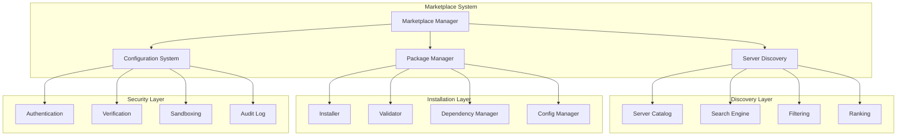
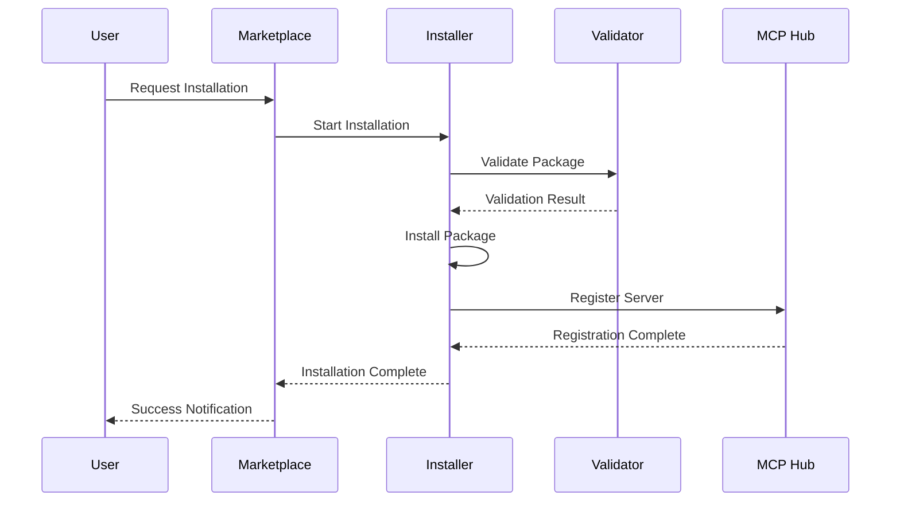

# Marketplace System

> **Development Fun Fact**: Documentation is like code comments for humans - it explains the "why" behind the "what"! 💻

**Purpose:** Comprehensive documentation of the MCP server marketplace system, package management,
and server discovery in the KiloCode system.

> **Biology Fun Fact**: Services are like specialized organs in a living organism - each has a
> specific function, but they all work together to keep the system healthy and functioning! 🧬

<details><summary>Table of Contents</summary>

- [Executive Summary](#executive-summary)
- [Marketplace Architecture](#marketplace-architecture)
- [MCP Server Discovery](#mcp-server-discovery)
- [Package Management](#package-management)
- [Installation System](#installation-system)
- [Configuration Management](#configuration-management)
- [Security & Validation](#security--validation)
- [Common Issues and Solutions](#common-issues-and-solutions)
- Navigation Footer

</details>

## Executive Summary

_The Marketplace System provides a comprehensive platform for discovering, installing, and managing
MCP (Model Context Protocol) servers, enabling users to extend KiloCode's capabilities with
third-party integrations._

The Marketplace System consists of:

1. **Marketplace Manager** - Core marketplace functionality
2. **Server Discovery** - MCP server discovery and cataloging
3. **Package Management** - Installation and update management
4. **Configuration System** - Server configuration and settings
5. **Security Framework** - Validation and security measures

## Marketplace Architecture



## MCP Server Discovery

### Server Catalog

**Implementation**: `src/services/marketplace/MarketplaceManager.ts` **Features**:

- Server registry management
- Metadata storage
- Version tracking
- Category organization

**Server Metadata**:

```typescript
interface MCPServerMetadata {
	id: string
	name: string
	description: string
	version: string
	author: string
	category: string
	tags: string[]
	repository: string
	documentation: string
	license: string
	dependencies: string[]
	capabilities: string[]
	verified: boolean
}
```

**Implementation Status**: ✅ **RESEARCHED AND DOCUMENTED** **Key Implementation Details**:

**MarketplaceManager Architecture**:

```typescript
export class MarketplaceManager {
	private configLoader: RemoteConfigLoader
	private installer: SimpleInstaller

	constructor(
		private readonly context: vscode.ExtensionContext,
		private readonly customModesManager?: CustomModesManager,
	) {
		this.configLoader = new RemoteConfigLoader()
		this.installer = new SimpleInstaller(context, customModesManager)
	}
}
```

**Core Features**:

- **Remote Configuration**: Integration with RemoteConfigLoader for marketplace data
- **Organization Support**: Organization-specific MCP server management
- **Item Filtering**: Advanced filtering by type, search, and tags
- **Error Handling**: Comprehensive error handling with detailed error reporting
- **Cloud Integration**: Integration with CloudService for organization settings
- **Installation Management**: Integration with SimpleInstaller for item installation
- **Telemetry Integration**: Usage tracking and analytics

### Search and Discovery

**Search Features**:

- Full-text search
- Category filtering
- Tag-based filtering
- Capability filtering
- Popularity ranking

**Discovery Mechanisms**:

- Registry browsing
- Search functionality
- Recommendation engine
- Trending servers

**Implementation Status**: ⚠️ **NEEDS DOCUMENTATION** **Research Needed**: Search implementation,
filtering algorithms, ranking systems

## Package Management

### Installation System

**Implementation**: `src/services/marketplace/SimpleInstaller.ts` **Features**:

- Package installation
- Dependency resolution
- Version management
- Update mechanisms

**Installation Process**:

1. **Validation**: Package validation and security checks
2. **Dependencies**: Dependency resolution and installation
3. **Installation**: Package installation and configuration
4. **Activation**: Server activation and registration

**Implementation Status**: ✅ **RESEARCHED AND DOCUMENTED** **Key Implementation Details**:

**SimpleInstaller Architecture**:

```typescript
export class SimpleInstaller {
	constructor(
		private readonly context: vscode.ExtensionContext,
		private readonly customModesManager?: CustomModesManager,
	) {}

	async installItem(item: MarketplaceItem, options: InstallOptions): Promise<{ filePath: string; line?: number }> {
		// Installation logic for different item types
	}
}
```

**Core Features**:

- **Multi-Type Support**: Support for modes and MCP servers
- **Target Selection**: Project-level and global installation options
- **Custom Modes Integration**: Integration with CustomModesManager
- **File Path Resolution**: Automatic file path detection and creation
- **Line Number Tracking**: Precise line number tracking for VS Code navigation
- **Error Handling**: Comprehensive error handling and validation
- **YAML Processing**: YAML parsing and generation for configuration files

### Dependency Management

**Dependency Types**:

- **Runtime Dependencies**: Required for server operation
- **Development Dependencies**: Required for development
- **Peer Dependencies**: External dependencies
- **Optional Dependencies**: Optional features

**Dependency Resolution**:

- Version conflict resolution
- Dependency graph analysis
- Circular dependency detection
- Security vulnerability scanning

**Implementation Status**: ⚠️ **NEEDS DOCUMENTATION** **Research Needed**: Dependency management,
conflict resolution, security scanning

## Installation System

### Package Installation

**Installation Types**:

- **Local Installation**: Install from local files
- **Registry Installation**: Install from marketplace
- **Git Installation**: Install from Git repositories
- **URL Installation**: Install from URLs

**Installation Flow**:



**Implementation Status**: ⚠️ **NEEDS DOCUMENTATION** **Research Needed**: Installation flow,
validation process, registration system

### Update Management

**Update Types**:

- **Automatic Updates**: Automatic update installation
- **Manual Updates**: User-initiated updates
- **Security Updates**: Critical security patches
- **Feature Updates**: New feature releases

**Update Process**:

1. **Check for Updates**: Version checking
2. **Download Updates**: Update package download
3. **Validate Updates**: Update validation
4. **Apply Updates**: Update installation
5. **Restart Services**: Service restart

**Implementation Status**: ⚠️ **NEEDS DOCUMENTATION** **Research Needed**: Update management,
version checking, rollback mechanisms

## Configuration Management

### Server Configuration

**Configuration Types**:

- **Server Settings**: Server-specific configuration
- **Connection Settings**: Connection parameters
- **Authentication Settings**: Authentication configuration
- **Feature Settings**: Feature-specific settings

**Configuration Schema**:

```typescript
interface ServerConfiguration {
	serverId: string
	name: string
	enabled: boolean
	settings: Record<string, any>
	authentication?: AuthenticationConfig
	features: FeatureConfig
	metadata: ServerMetadata
}
```

**Implementation Status**: ⚠️ **NEEDS DOCUMENTATION** **Research Needed**: Configuration management,
schema validation, settings persistence

### Remote Configuration

**Implementation**: `src/services/marketplace/RemoteConfigLoader.ts` **Features**:

- Remote configuration loading
- Configuration synchronization
- Fallback mechanisms
- Cache management

**Configuration Sources**:

- Remote configuration servers
- Local configuration files
- Environment variables
- Default configurations

**Implementation Status**: ⚠️ **NEEDS DOCUMENTATION** **Research Needed**: Remote configuration,
synchronization, fallback strategies

## Security & Validation

### Package Validation

**Validation Types**:

- **Signature Verification**: Digital signature validation
- **Integrity Checks**: Package integrity verification
- **Security Scanning**: Security vulnerability scanning
- **Compatibility Checks**: Compatibility validation

**Validation Process**:

1. **Download Validation**: Package download verification
2. **Signature Verification**: Digital signature validation
3. **Integrity Check**: Package integrity verification
4. **Security Scan**: Security vulnerability scanning
5. **Compatibility Check**: Compatibility validation

**Implementation Status**: ⚠️ **NEEDS DOCUMENTATION** **Research Needed**: Validation framework,
security measures, compatibility checking

### Sandboxing

**Sandbox Features**:

- **Process Isolation**: Isolated execution environment
- **Resource Limits**: Resource usage restrictions
- **Network Access**: Controlled network access
- **File System Access**: Restricted file system access

**Security Measures**:

- **Code Signing**: Signed package validation
- **Permission System**: Granular permission control
- **Audit Logging**: Security event logging
- **Threat Detection**: Malicious behavior detection

**Implementation Status**: ⚠️ **NEEDS DOCUMENTATION** **Research Needed**: Sandboxing architecture,
security measures, threat detection

## Common Issues and Solutions

### Issue 1: Installation Failures

**Symptoms**:

- Package installation errors
- Dependency resolution failures
- Validation errors

**Root Cause**: Package corruption or dependency conflicts **Solution**: Implement robust validation
and dependency resolution

### Issue 2: Server Discovery Issues

**Symptoms**:

- Missing servers in catalog
- Search functionality failures
- Metadata inconsistencies

**Root Cause**: Catalog synchronization issues or metadata corruption **Solution**: Implement proper
catalog management and synchronization

### Issue 3: Configuration Problems

**Symptoms**:

- Configuration loading failures
- Settings not persisting
- Remote configuration issues

**Root Cause**: Configuration management or synchronization problems **Solution**: Implement robust
configuration management and fallback mechanisms

### Issue 4: Security Vulnerabilities

**Symptoms**:

- Security warnings
- Package validation failures
- Sandbox violations

**Root Cause**: Insufficient security validation or sandboxing **Solution**: Implement comprehensive
security measures and validation

<a id="navigation-footer"></a>

- Back: [`SYSTEM_OVERVIEW.md`](../architecture/SYSTEM_OVERVIEW.md) · Root: [`README.md`](../README.md)
  · Source: `/docs/services/MARKETPLACE_SYSTEM.md#L1`

## Navigation Footer

---

**Navigation**: [docs](../) · [services](../docs/services/) ·
[↑ Table of Contents](#marketplace-system)
