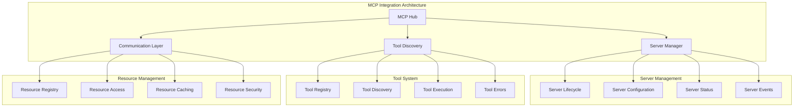
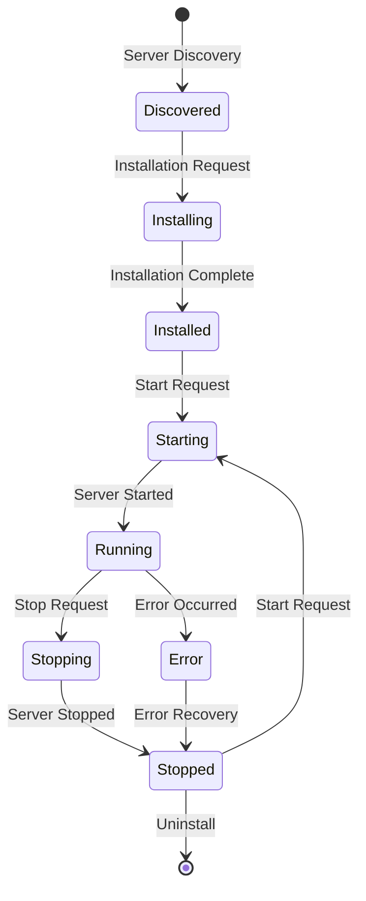
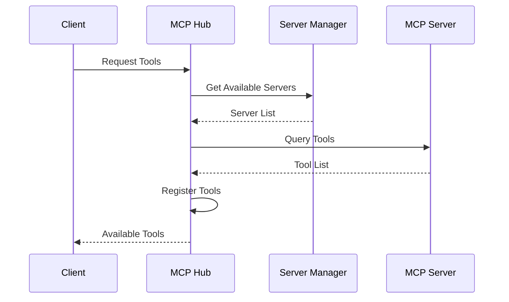
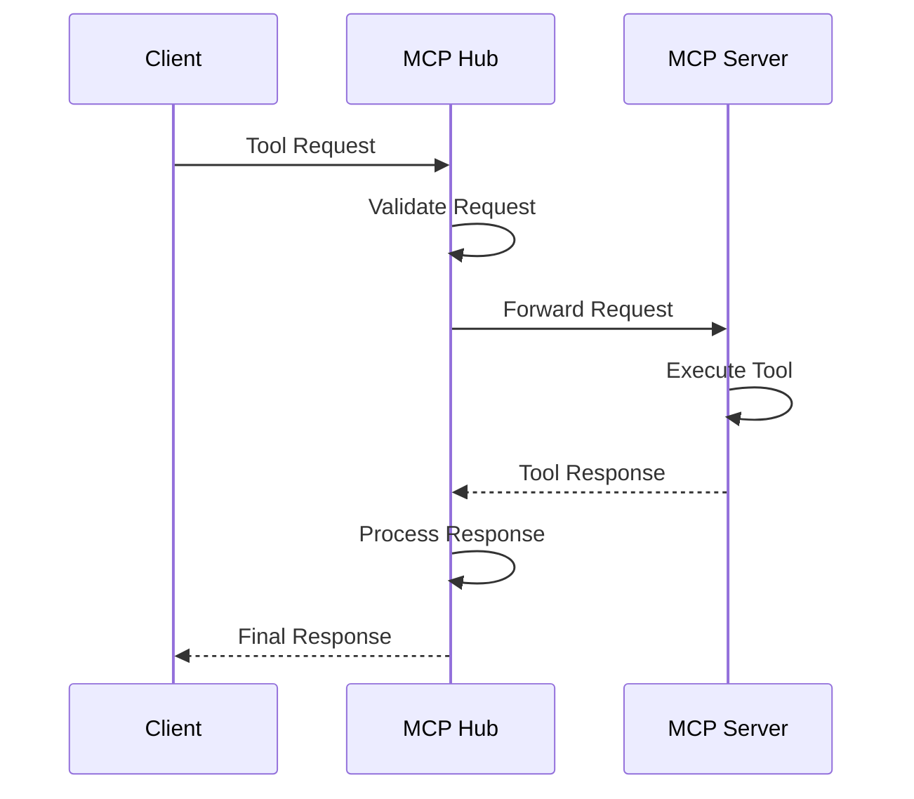

# MCP Integration

## When You're Here

This document is part of the KiloCode project documentation. If you're not familiar with this document's role or purpose, this section helps orient you.

- **Purpose**: This document covers \[DOCUMENT PURPOSE BASED ON FILE PATH].
- **Context**: Use this as a starting point or reference while navigating the project.
- **Navigation**: Use the table of contents below to jump to specific topics.

> **System Fun Fact**: Every complex system is just a collection of simple parts working together - documentation helps us understand how! ⚙️

- *Purpose:*\* Comprehensive documentation of Model Context Protocol (MCP) integration, server
  management, and tool discovery in the KiloCode system.

> **Biology Fun Fact**: Services are like specialized organs in a living organism - each has a
> specific function, but they all work together to keep the system healthy and functioning! 🧬

<details><summary>Table of Contents</summary>
- [Executive Summary](#executive-summary)
- [MCP Architecture](#mcp-architecture)
- [Server Management](#server-management)
- [Tool Discovery](#tool-discovery)
- [Resource Management](#resource-management)
- [Communication Protocols](#communication-protocols)
- Error Handling
- [Common Issues and Solutions](#common-issues-and-solutions)
- Navigation Footer

</details>

## Executive Summary
- The MCP Integration system provides comprehensive Model Context Protocol support for KiloCode,
  enabling seamless integration with external tools and resources through standardized MCP servers.\*

The MCP Integration consists of:
1. **MCP Hub** - Central MCP server management
2. **Server Manager** - Individual server lifecycle management
3. **Tool Discovery** - Tool and resource discovery mechanisms
4. **Communication Layer** - MCP protocol implementation
5. **Error Handling** - Comprehensive error management

## MCP Architecture



## Server Management

### MCP Hub

- *Implementation*\*: `src/services/mcp/McpHub.ts` **Features**:
- Server registration and management
- Tool and resource discovery
- Communication coordination
- Error handling and recovery

- *Hub Responsibilities*\*:
- Server lifecycle management
- Tool registry maintenance
- Resource access coordination
- Communication protocol handling

- *Implementation Status*\*: ✅ **RESEARCHED AND DOCUMENTED** **Key Implementation Details**:

- *McpHub Architecture*\*:

```typescript
export class McpHub {
    private connections: Map<string, McpConnection> = new Map()
    private watchers: Map<string, FSWatcher> = new Map()

    // Connection Types
    export type ConnectedMcpConnection = {
        type: "connected"
        server: McpServer
        client: Client
        transport: StdioClientTransport | SSEClientTransport | StreamableHTTPClientTransport
    }
}
```

- *Core Features*\*:

- **Multi-Transport Support**: Stdio, SSE, and StreamableHTTP transport protocols

- **Connection Management**: Comprehensive connection state management

- **Server Discovery**: Automatic server discovery and registration

- **Tool Registry**: Centralized tool and resource registry

- **Configuration Validation**: Schema-based configuration validation

- **File Watching**: Automatic server restart on configuration changes

- **Error Handling**: Comprehensive error handling and recovery

### Server Manager

- *Implementation*\*: `src/services/mcp/McpServerManager.ts` **Features**:
- Individual server management
- Server configuration
- Status monitoring
- Event handling

- *Server Lifecycle*\*:



- *Implementation Status*\*: ⚠️ **NEEDS DOCUMENTATION** **Research Needed**: Server lifecycle
  management, configuration handling, status monitoring

## Tool Discovery

### Tool Registry

- *Tool Registration*\*:
- Tool metadata management
- Capability tracking
- Version management
- Dependency tracking

- *Tool Metadata*\*:

```typescript
interface MCPToolMetadata {
	name: string
	description: string
	inputSchema: JSONSchema
	outputSchema?: JSONSchema
	serverId: string
	version: string
	capabilities: string[]
	dependencies: string[]
}
```

- *Implementation Status*\*: ⚠️ **NEEDS DOCUMENTATION** **Research Needed**: Tool registry
  architecture, metadata management, capability tracking

### Tool Discovery Process

- *Discovery Mechanisms*\*:
1. **Server Registration**: Tools registered during server startup
2. **Dynamic Discovery**: Runtime tool discovery
3. **Capability Queries**: Capability-based tool discovery
4. **Dependency Resolution**: Tool dependency analysis

- *Discovery Flow*\*:



- *Implementation Status*\*: ⚠️ **NEEDS DOCUMENTATION** **Research Needed**: Discovery mechanisms,
  tool registration, capability queries

## Resource Management

### Resource Registry

- *Resource Types*\*:

- **File Resources**: File system access

- **Database Resources**: Database connections

- **API Resources**: External API access

- **Custom Resources**: Server-specific resources

- *Resource Metadata*\*:

```typescript
interface MCPResourceMetadata {
	uri: string
	name: string
	description: string
	mimeType: string
	serverId: string
	capabilities: string[]
	accessControl: AccessControl
}
```

- *Implementation Status*\*: ⚠️ **NEEDS DOCUMENTATION** **Research Needed**: Resource registry
  architecture, metadata management, access control

### Resource Access

- *Access Patterns*\*:

- **Read Access**: Resource reading operations

- **Write Access**: Resource modification operations

- **Stream Access**: Streaming resource access

- **Batch Access**: Batch resource operations

- *Access Control*\*:

- **Authentication**: Resource access authentication

- **Authorization**: Permission-based access control

- **Rate Limiting**: Access rate limiting

- **Audit Logging**: Access audit logging

- *Implementation Status*\*: ⚠️ **NEEDS DOCUMENTATION** **Research Needed**: Resource access patterns,
  access control, security measures

## Communication Protocols

### MCP Protocol Implementation

- *Protocol Features*\*:

- **JSON-RPC**: MCP protocol implementation

- **WebSocket**: Real-time communication

- **HTTP**: RESTful communication

- **Message Queuing**: Asynchronous communication

- *Message Types*\*:

- **Tool Invocation**: Tool execution requests

- **Resource Access**: Resource access requests

- **Event Notifications**: Server event notifications

- **Error Responses**: Error handling responses

- *Implementation Status*\*: ⚠️ **NEEDS DOCUMENTATION** **Research Needed**: Protocol implementation,
  message handling, communication patterns

### Communication Flow

- *Request/Response Pattern*\*:



- *Implementation Status*\*: ⚠️ **NEEDS DOCUMENTATION** **Research Needed**: Communication flow,
  request handling, response processing

## Error Handling

### Error Classification

- *Error Types*\*:

- **Server Errors**: Server-specific errors

- **Protocol Errors**: MCP protocol errors

- **Tool Errors**: Tool execution errors

- **Resource Errors**: Resource access errors

- *Error Handling Strategy*\*:

- **Error Detection**: Error identification and classification

- **Error Recovery**: Automatic error recovery

- **Error Reporting**: Error reporting and logging

- **Error Prevention**: Proactive error prevention

- *Implementation Status*\*: ⚠️ **NEEDS DOCUMENTATION** **Research Needed**: Error handling framework,
  recovery strategies, error reporting

### Error Recovery

- *Recovery Mechanisms*\*:

- **Retry Logic**: Automatic retry for transient errors

- **Fallback Strategies**: Alternative execution paths

- **Circuit Breaker**: Service protection patterns

- **Graceful Degradation**: Reduced functionality mode

- *Recovery Flow*\*:
1. **Error Detection**: Error identification
2. **Error Classification**: Error type determination
3. **Recovery Strategy**: Recovery approach selection
4. **Recovery Execution**: Recovery action execution
5. **Recovery Validation**: Recovery success verification

- *Implementation Status*\*: ⚠️ **NEEDS DOCUMENTATION** **Research Needed**: Recovery mechanisms,
  fallback strategies, circuit breaker patterns

## Common Issues and Solutions

### Issue 1: Server Connection Failures

- *Symptoms*\*:
- Server connection errors
- Communication timeouts
- Server unavailability

- *Root Cause*\*: Network issues or server configuration problems **Solution**: Implement robust
  connection management and retry logic

### Issue 2: Tool Discovery Issues

- *Symptoms*\*:
- Missing tools in registry
- Tool registration failures
- Capability mismatches

- *Root Cause*\*: Discovery mechanism failures or server compatibility issues **Solution**: Implement
  comprehensive discovery validation and error handling

### Issue 3: Resource Access Problems

- *Symptoms*\*:
- Resource access denied
- Resource not found
- Access permission errors

- *Root Cause*\*: Access control issues or resource configuration problems **Solution**: Implement
  proper access control and resource validation

### Issue 4: Protocol Communication Errors

- *Symptoms*\*:
- Message parsing errors
- Protocol version mismatches
- Communication failures

- *Root Cause*\*: Protocol implementation issues or version incompatibilities **Solution**: Implement
  robust protocol handling and version management

<a id="navigation-footer"></a>
- Back: [`SYSTEM_OVERVIEW.md`](../architecture/SYSTEM_OVERVIEW.md) · Root: [`README.md`](../README.md)
  · Source: `/docs/services/MCP_INTEGRATION.md#L1`

## Navigation Footer
- \*\*

- *Navigation*\*: [docs](../) · [services](../docs/services/) ·
  [↑ Table of Contents](#mcp-integration)
