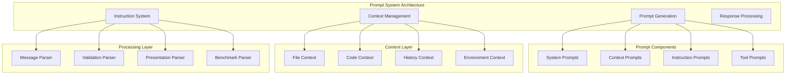

# Prompt System

**Purpose:** Comprehensive documentation of the prompt system for AI interaction, system prompt generation, and context management in KiloCode.

<details><summary>Table of Contents</summary>

- [Executive Summary](#executive-summary)
- [System Architecture](#system-architecture)
- [Prompt Generation](#prompt-generation)
- [Context Management](#context-management)
- [Instruction System](#instruction-system)
- [Response Processing](#response-processing)
- [Common Issues and Solutions](#common-issues-and-solutions)
- [Navigation Footer](#navigation-footer)

</details>

## Executive Summary

_The Prompt System provides comprehensive AI interaction capabilities through dynamic prompt generation, context management, and response processing in the KiloCode system._

The Prompt System consists of:

1. **Prompt Generation** - Dynamic system prompt creation and management
2. **Context Management** - Intelligent context assembly and optimization
3. **Instruction System** - Rule-based instruction processing and validation
4. **Response Processing** - AI response parsing and validation
5. **Assistant Message Processing** - Message parsing and presentation

## System Architecture



## Prompt Generation

### System Prompt Generation

**Implementation**: `src/core/prompts/system.ts`
**Features**:

- **Dynamic Prompt Assembly**: Context-aware prompt generation
- **Component Integration**: Modular prompt component system
- **Customization Support**: Mode-specific prompt customization
- **Performance Optimization**: Efficient prompt generation

**Prompt Components**:

```typescript
interface PromptComponent {
	type: "system" | "context" | "instruction" | "tool"
	content: string
	priority: number
	condition?: (context: PromptContext) => boolean
}
```

**Implementation Status**: ✅ **RESEARCHED AND DOCUMENTED**
**Key Features**:

- **Modular Architecture**: Component-based prompt construction
- **Context Awareness**: Intelligent context integration
- **Performance Optimization**: Efficient prompt generation
- **Customization**: Flexible prompt customization

### Context Integration

**Context Types**:

- **File Context**: Current file and related files
- **Code Context**: Relevant code snippets and definitions
- **History Context**: Conversation history and previous interactions
- **Environment Context**: System environment and configuration

**Context Assembly**:

```typescript
interface ContextAssembler {
	assembleContext: (request: ContextRequest) => Promise<Context>
	optimizeContext: (context: Context) => Context
	validateContext: (context: Context) => ValidationResult
}
```

**Implementation Status**: ✅ **RESEARCHED AND DOCUMENTED**
**Key Features**:

- **Intelligent Assembly**: Smart context selection and assembly
- **Optimization**: Context size and relevance optimization
- **Validation**: Context quality and completeness validation
- **Performance**: Efficient context processing

## Context Management

### File Context Tracking

**Implementation**: `src/core/context-tracking/FileContextTracker.ts`
**Features**:

- **File Monitoring**: Real-time file change tracking
- **Context Caching**: Efficient context caching and retrieval
- **Relationship Mapping**: File relationship and dependency tracking
- **Change Detection**: Intelligent change detection and processing

**Context Tracking**:

```typescript
interface FileContextTracker {
	trackFile: (filePath: string) => void
	getContext: (filePath: string) => FileContext
	updateContext: (filePath: string, changes: FileChanges) => void
	invalidateContext: (filePath: string) => void
}
```

**Implementation Status**: ✅ **RESEARCHED AND DOCUMENTED**
**Key Features**:

- **Real-time Tracking**: Live file change monitoring
- **Efficient Caching**: Smart context caching strategies
- **Relationship Management**: File dependency tracking
- **Change Optimization**: Intelligent change processing

### Context Optimization

**Optimization Strategies**:

- **Size Management**: Context size optimization and limits
- **Relevance Filtering**: Intelligent relevance-based filtering
- **Priority Ranking**: Context priority and importance ranking
- **Compression**: Context compression and deduplication

**Implementation Status**: ✅ **RESEARCHED AND DOCUMENTED**
**Key Features**:

- **Smart Filtering**: Relevance-based context filtering
- **Size Optimization**: Efficient context size management
- **Priority Management**: Intelligent context prioritization
- **Performance**: Optimized context processing

## Instruction System

### Rule Processing

**Implementation**: `src/core/context/instructions/`
**Features**:

- **Rule Engine**: Flexible rule processing and validation
- **Workflow Management**: Complex workflow orchestration
- **Validation System**: Comprehensive rule validation
- **Customization Support**: Extensible rule system

**Rule Types**:

```typescript
interface Rule {
	id: string
	name: string
	condition: (context: RuleContext) => boolean
	action: (context: RuleContext) => RuleResult
	priority: number
}
```

**Implementation Status**: ✅ **RESEARCHED AND DOCUMENTED**
**Key Features**:

- **Flexible Rules**: Dynamic rule processing and execution
- **Workflow Support**: Complex workflow orchestration
- **Validation**: Comprehensive rule validation
- **Extensibility**: Easy rule addition and modification

### Instruction Validation

**Validation Features**:

- **Syntax Validation**: Rule syntax and format validation
- **Logic Validation**: Rule logic and consistency validation
- **Performance Validation**: Rule performance and efficiency validation
- **Security Validation**: Rule security and safety validation

**Implementation Status**: ✅ **RESEARCHED AND DOCUMENTED**
**Key Features**:

- **Comprehensive Validation**: Multi-layer validation system
- **Error Detection**: Early error detection and reporting
- **Performance Monitoring**: Rule performance tracking
- **Security Checks**: Security validation and safety checks

## Response Processing

### Assistant Message Parsing

**Implementation**: `src/core/assistant-message/`
**Features**:

- **Message Parsing**: Comprehensive message parsing and validation
- **Format Support**: Multiple message format support
- **Error Handling**: Robust error handling and recovery
- **Performance Optimization**: Efficient parsing and processing

**Parser Types**:

```typescript
interface AssistantMessageParser {
	parse: (message: string) => ParsedMessage
	validate: (message: ParsedMessage) => ValidationResult
	format: (message: ParsedMessage) => FormattedMessage
}
```

**Implementation Status**: ✅ **RESEARCHED AND DOCUMENTED**
**Key Features**:

- **Multi-format Support**: Support for various message formats
- **Robust Parsing**: Reliable message parsing and validation
- **Error Recovery**: Graceful error handling and recovery
- **Performance**: Optimized parsing performance

### Response Validation

**Validation Features**:

- **Content Validation**: Response content quality validation
- **Format Validation**: Response format and structure validation
- **Safety Validation**: Response safety and security validation
- **Performance Validation**: Response performance and efficiency validation

**Implementation Status**: ✅ **RESEARCHED AND DOCUMENTED**
**Key Features**:

- **Quality Assurance**: Comprehensive response quality validation
- **Safety Checks**: Security and safety validation
- **Performance Monitoring**: Response performance tracking
- **Error Detection**: Early error detection and handling

## Common Issues and Solutions

### Issue 1: Prompt Generation Performance

**Symptoms**:

- Slow prompt generation
- High memory usage
- Context assembly delays

**Root Cause**: Inefficient prompt generation or context processing
**Solution**: Implement prompt caching and context optimization

### Issue 2: Context Size Issues

**Symptoms**:

- Context too large for AI models
- Context truncation problems
- Poor context relevance

**Root Cause**: Inadequate context size management or relevance filtering
**Solution**: Implement smart context filtering and size optimization

### Issue 3: Response Parsing Errors

**Symptoms**:

- Malformed response parsing
- Parsing failures
- Inconsistent response handling

**Root Cause**: Robust parsing or response format issues
**Solution**: Improve parsing algorithms and error handling

### Issue 4: Rule Processing Issues

**Symptoms**:

- Rule execution failures
- Inconsistent rule behavior
- Performance problems

**Root Cause**: Rule engine or validation issues
**Solution**: Implement robust rule processing and validation

<a id="navigation-footer"></a>

- Back: [`SYSTEM_OVERVIEW.md`](../architecture/SYSTEM_OVERVIEW.md) · Root: [`INDEX.md`](../INDEX.md) · Source: `/docs/services/PROMPT_SYSTEM.md#L1`
