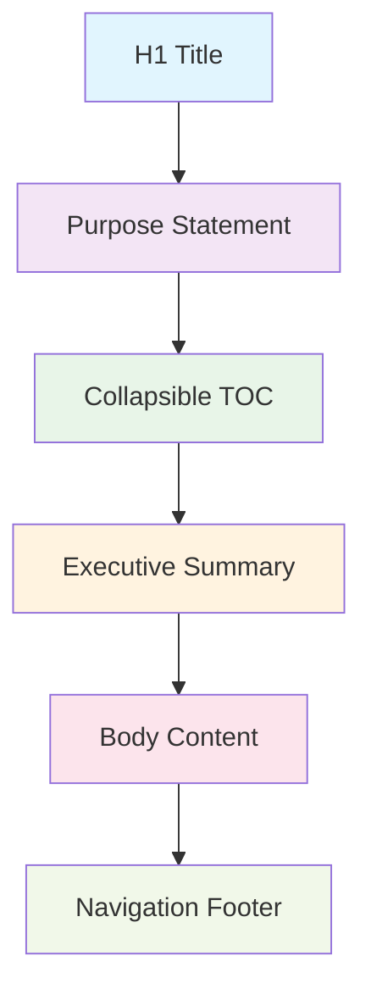

# Document Anatomy 🧬

## Table of Contents
- [Document Anatomy 🧬](#document-anatomy-)
- [Table of Contents](#table-of-contents)
- [When You're Here](#when-youre-here)
- [Executive Summary](#executive-summary)
- [Research Context](#research-context)
- [Required Elements](#required-elements)
- [1. H1 Title](#1-h1-title)
- [2. Purpose Statement](#2-purpose-statement)
- [3. Collapsible TOC](#3-collapsible-toc)
- [4. Executive Summary](#4-executive-summary)
- [5. Body Content](#5-body-content)
- [6. Navigation Footer](#6-navigation-footer)
- [Element Details](#element-details)
- [H1 Title](#h1-title)
- [Purpose Statement](#purpose-statement)
- [Collapsible TOC](#collapsible-toc)
- [Executive Summary](#executive-summary)
- [Body Content](#body-content)
- [🔍 Research Context & Next Steps](#-research-context--next-steps)
- [When You're Here, You Can:](#when-youre-here-you-can)
- [No Dead Ends Policy](#no-dead-ends-policy)
- [Navigation Footer](#navigation-footer)
- [Structure Flow](#structure-flow)
- [Element Validation](#element-validation)
- [Common Mistakes](#common-mistakes)
- [Implementation Examples](#implementation-examples)
- [Complete Document Example](#complete-document-example)
- [Minimal Document Example](#minimal-document-example)
- [No Dead Ends Policy](#no-dead-ends-policy)
- [Navigation](#navigation)
- [Document Anatomy 🧬](#document-anatomy-)
- [Table of Contents](#table-of-contents)
- [Executive Summary](#executive-summary)
- [Research Context](#research-context)
- [Required Elements](#required-elements)
- [1. H1 Title](#1-h1-title)
- [2. Purpose Statement](#2-purpose-statement)
- [3. Collapsible TOC](#3-collapsible-toc)
- [4. Executive Summary](#4-executive-summary)
- [5. Body Content](#5-body-content)
- [6. Navigation Footer](#6-navigation-footer)
- [Element Details](#element-details)
- [H1 Title](#h1-title)
- [Purpose Statement](#purpose-statement)
- [Collapsible TOC](#collapsible-toc)
- [Executive Summary](#executive-summary)
- [Body Content](#body-content)
- [🔍 Research Context & Next Steps](#-research-context--next-steps)
- [When You're Here, You Can:](#when-youre-here-you-can)
- [No Dead Ends Policy](#no-dead-ends-policy)
- [Navigation Footer](#navigation-footer)
- [Structure Flow](#structure-flow)
- [Element Validation](#element-validation)
- [Common Mistakes](#common-mistakes)
- [Implementation Examples](#implementation-examples)
- [Complete Document Example](#complete-document-example)
- [Minimal Document Example](#minimal-document-example)

> **Architecture Fun Fact**: Like a well-designed building, good documentation has a solid
> foundation, clear structure, and intuitive navigation! 🏗️

- *Purpose:*\* Detailed breakdown of the standardized document structure that every KiloCode
  document
  must follow, ensuring consistency and usability across all documentation.

> **Biology Fun Fact**: Just like how DNA has a specific structure with base pairs, sugar-phosphate
> backbones, and double helix formation, our documents have a specific structure with purpose
> statements, content sections, and navigation elements that work together to create functional
> information! 🧬

<details><summary>Table of Contents</summary>
- [Executive Summary](#executive-summary)
- [Required Elements](#required-elements)
- [Element Details](#element-details)
- [Structure Flow](#structure-flow)
- [Element Validation](#element-validation)
- [Common Mistakes](#common-mistakes)
- Implementation Examples

</details>
- ↑ [Table of Contents](#table-of-contents)

## When You're Here

This document is part of the KiloCode project documentation. If you're not familiar with this
document's role or purpose, this section helps orient you.

- **Purpose**: \[Brief description of what this document covers]
- **Audience**: \[Who should read this document]
- **Prerequisites**: \[What you should know before reading]
- **Related Documents**: \[Links to related documentation]

## Executive Summary

## Research Context

- *Purpose:*\* \[Describe the purpose and scope of this document]

- *Background:*\* \[Provide relevant background information]

- *Research Questions:*\* \[List key questions this document addresses]

- *Methodology:*\* \[Describe the approach or methodology used]

- *Findings:*\* \[Summarize key findings or conclusions]
- \*\*
- Every KiloCode document follows a standardized anatomy with six required elements that work
  together to create consistent, discoverable, and usable documentation. This structure ensures that
  both authors and readers know what to expect from any document.\*

- *Required Elements:*\*
1. **H1 Title** - Single, descriptive title
2. **Purpose Statement** - Clear purpose and audience
3. **Collapsible TOC** - Navigation overview
4. **Executive Summary** - Key highlights
5. **Body Content** - Detailed information
6. **Navigation Footer** - Cross-references and links

## Required Elements

- *Every document MUST contain these six elements in this exact order:*\*

### 1. H1 Title

- **Format**: Single H1 heading at the top
- **Case**: Title Case
- **Content**: Descriptive, specific title
- **Purpose**: Identifies the document's main topic

### 2. Purpose Statement

- **Format**: `**Purpose:**` followed by brief description
- **Content**: Document's purpose and intended audience
- **Purpose**: Helps readers understand what they'll learn

### 3. Collapsible TOC

- **Format**: `<details><summary>Table of Contents</summary>` with H2/H3 entries
- **Content**: Links to all H2 and H3 sections
- **Purpose**: Provides navigation overview

### 4. Executive Summary

- **Format**: H2 heading with italic text
- **Content**: Key highlights and overview
- **Purpose**: Gives readers a quick understanding

### 5. Body Content

- **Format**: H2/H3 sections with detailed information
- **Content**: Main document content
- **Purpose**: Provides the detailed information

### 6. Navigation Footer

- **Format**: `<a id="navigation-footer"></a>` with back/root/source links
- **Content**: Cross-references and navigation
- **Purpose**: Helps users navigate the system

## Element Details

### H1 Title

- *Requirements*\*:

- **Single H1**: Only one H1 per document

- **Title Case**: Capitalize major words

- **Descriptive**: Clearly indicates content

- **Specific**: Avoid generic titles

- *Examples*\*:

```markdown
# Good: Specific and descriptive

> **Development Fun Fact**: Documentation is like code comments for humans - it explains the "why"
behind the "what"! 💻

API Duplication Analysis State Machine Design Patterns Build Process Guide

# Bad: Generic or unclear

> **System Fun Fact**: Every complex system is just a collection of simple parts working together -
documentation helps us understand how! ⚙️

Documentation Guide Stuff Things
```

### Purpose Statement

- *Format*\*: `**Purpose:**` followed by brief description

- *Content Requirements*\*:

- **Clear Purpose**: What the document does

- **Target Audience**: Who should read it

- **Success Criteria**: What readers will learn

- **Context**: How it fits into the larger system

- *Examples*\*:

```markdown
# Good: Clear purpose and audience

> **System Fun Fact**: Every complex system is just a collection of simple parts working together -
documentation helps us understand how! ⚙️

- *Purpose:** Comprehensive analysis of the API duplication race condition, including root cause
identification, impact assessment, and solution recommendations for developers and system
architects.

# Bad: Vague or missing context

> **Architecture Fun Fact**: Like a well-designed building, good documentation has a solid
foundation, clear structure, and intuitive navigation! 🏗️

- *Purpose:** This document explains things. **Purpose:** Guide for users.
```

### Collapsible TOC

- *Format*\*: `<details><summary>Table of Contents</summary>` with H2/H3 entries

- *Content Requirements*\*:

- **H2 Entries**: All major sections

- **H3 Entries**: All subsections

- **No H4**: Don't include H4 entries

- **Proper Links**: Use correct anchor links

- *Examples*\*:

```markdown
<details><summary>Table of Contents</summary>
- [Executive Summary](#executive-summary)
- Problem Description
- Root Cause Analysis
- Solution Recommendations
- [Implementation Guide](#implementation-guide)

</details>
```

### Executive Summary

- *Format*\*: H2 heading with italic text

- *Content Requirements*\*:

- **Key Highlights**: Most important information

- **Overview**: What the document covers

- **Context**: How it relates to other content

- **Actionable**: What readers can do next

- *Examples*\*:

```markdown
## Executive Summary

_The API duplication issue is caused by a race condition where multiple API calls are made
simultaneously, resulting in jumbled responses and confused user experience. This document provides
a comprehensive analysis of the problem, identifies the root cause, and recommends solutions for
implementation._

## Executive Summary

_This guide provides step-by-step instructions for building the KiloCode project from source,
including prerequisites, build steps, and troubleshooting common issues._
```

### Body Content

- *Format*\*: H2/H3 sections with detailed information

- *Content Requirements*\*:

- **Logical Flow**: Information flows logically

- **Clear Hierarchy**: Proper H2/H3 structure

- **Detailed Information**: Comprehensive coverage

- **Examples**: Code examples and use cases

- *Examples*\*:

```markdown
## Problem Description

The issue manifests as multiple API requests with spinners appearing simultaneously in the chat
interface.

### Symptoms
- Multiple API requests with spinners
- Jumbled responses in chat interface
- Confused user experience

### Impact
- Degraded user experience
- Potential data corruption
- System instability

## Root Cause Analysis

The race condition occurs when both the main task loop and subtask completion call
`recursivelyMakeClineRequests` simultaneously.

### Technical Details

The issue is introduced in commit `749f3d22a` where subtask completion triggers a recursive call to
the parent task.
```

## 🔍 Research Context & Next Steps

### When You're Here, You Can:

- *Understanding Documentation Standards:*\*

- **Next**: Check related standards documentation in the same directory

- **Related**: [Technical Glossary](../GLOSSARY.md) for terminology,
  [Documentation Standards Guide](../DOCUMENTATION_GUIDE.md) for context

- *Implementing Documentation Standards:*\*

- **Next**: [Repository Development Guide](../architecture/GETTING_STARTED.md) →
  [Testing Infrastructure](../testing/TESTING_STRATEGY.md)

- **Related**: [Orchestrator Documentation](../orchestrator/README.md) for integration patterns

- *Applying Standards to Documentation:*\*

- **Next**: [Documentation Guide](../DOCUMENTATION_GUIDE.md) →
  [Architecture Documentation](../../architecture/README.md) →
  [Orchestrator Documentation](../orchestrator/README.md)

- **Related**: [Race Condition Analysis](../../architecture/README.md) for current
  issues

### No Dead Ends Policy

Every page provides clear next steps based on your research goals. If you're unsure where to go
next, return to [Standards Documentation](README.md) for guidance.

### Navigation Footer

- *Format*\*: `<a id="navigation-footer"></a>` with back/root/source links

- *Content Requirements*\*:

- **Back Link**: Link to parent index

- **Root Link**: Link to main README.md

- **Source Link**: Link to source file with #L1

- **Proper Paths**: Use correct relative/absolute paths

- *Examples*\*:

```markdown
<a id="navigation-footer"></a>
- Back: [`README.md`](../architecture/README.md) · Root: [`README.md`](../README.md) · Source:
  `/docs/architecture/API_DUPLICATION_ANALYSIS.md#L1`

<a id="navigation-footer"></a>
- Back: [`README.md`](README.md) · Root: [`README.md`](README.md) · Source:
  `/docs/BUILD_PROCESS_GUIDE.md#L1`
```

## Structure Flow

- *Logical Flow*\*: The document structure follows a logical flow from general to specific:
1. **Title** → Identifies the topic
2. **Purpose** → Explains the goal
3. **TOC** → Shows the structure
4. **Summary** → Provides overview
5. **Content** → Delivers details
6. **Footer** → Enables navigation

- *Flow Diagram*\*:



## Element Validation

- *Pre-Submission Checks*\*: Validate each element before submitting.

- *H1 Title Validation*\*:
- \[ ] Single H1 at the top
- \[ ] Title Case formatting
- \[ ] Descriptive and specific
- \[ ] Matches document content

- *Purpose Statement Validation*\*:
- \[ ] Uses `**Purpose:**` format
- \[ ] Clear purpose description
- \[ ] Identifies target audience
- \[ ] Includes success criteria

- *TOC Validation*\*:
- \[ ] Collapsible format used
- \[ ] Includes all H2 sections
- \[ ] Includes all H3 sections
- \[ ] No H4 entries included
- \[ ] Links work correctly

- *Executive Summary Validation*\*:
- \[ ] H2 heading used
- \[ ] Italic text format
- \[ ] Key highlights included
- \[ ] Overview provided

- *Body Content Validation*\*:
- \[ ] Logical flow maintained
- \[ ] Proper H2/H3 hierarchy
- \[ ] Detailed information provided
- \[ ] Examples included where appropriate

- *Navigation Footer Validation*\*:
- \[ ] Anchor tag present
- \[ ] Back link correct
- \[ ] Root link correct
- \[ ] Source link correct
- \[ ] All links functional

## Common Mistakes

- *Structure Mistakes*\*:
- ❌ Multiple H1 headings
- ❌ Missing purpose statement
- ❌ TOC includes H4 entries
- ❌ Missing navigation footer
- ❌ Incorrect element order

- *Content Mistakes*\*:
- ❌ Purpose statement doesn't match content
- ❌ TOC doesn't match actual headings
- ❌ Executive summary too vague
- ❌ Body content lacks detail
- ❌ Navigation footer links broken

- *Format Mistakes*\*:
- ❌ Wrong heading case
- ❌ Missing italic formatting in summary
- ❌ Incorrect TOC format
- ❌ Wrong link paths
- ❌ Missing required elements

- *Examples*\*:

```markdown
# Bad: Multiple H1 headings

> **Development Fun Fact**: Documentation is like code comments for humans - it explains the "why"
behind the "what"! 💻

# Document Title

> **Engineering Fun Fact**: Just as engineers use systematic approaches to solve complex problems,
this documentation provides structured guidance for understanding and implementing solutions! 🔧

Content here.

# Another Title

> **Engineering Fun Fact**: Just as engineers use systematic approaches to solve complex problems,
this documentation provides structured guidance for understanding and implementing solutions! 🔧

More content here.

# Good: Single H1 heading

> **Architecture Fun Fact**: Like a well-designed building, good documentation has a solid
foundation, clear structure, and intuitive navigation! 🏗️

# Document Title

> **System Fun Fact**: Every complex system is just a collection of simple parts working together -
documentation helps us understand how! ⚙️

Content here.

## Section heading

More content here.
```

## Implementation Examples

### Complete Document Example

```markdown
# API Duplication Analysis

> **System Fun Fact**: Every complex system is just a collection of simple parts working together -
documentation helps us understand how! ⚙️

- *Purpose:** Comprehensive analysis of the API duplication race condition, including root cause
identification, impact assessment, and solution recommendations for developers and system
architects.

<details><summary>Table of Contents</summary>
- [Executive Summary](#executive-summary)
- Problem Description
- Root Cause Analysis
- Solution Recommendations
- [Implementation Guide](#implementation-guide)

</details>

## Executive Summary

_The API duplication issue is caused by a race condition where multiple API calls are made
simultaneously, resulting in jumbled responses and confused user experience. This document provides
a comprehensive analysis of the problem, identifies the root cause, and recommends solutions for
implementation._

## Problem Description

The issue manifests as multiple API requests with spinners appearing simultaneously in the chat
interface.

### Symptoms
- Multiple API requests with spinners
- Jumbled responses in chat interface
- Confused user experience

### Impact
- Degraded user experience
- Potential data corruption
- System instability

## Root Cause Analysis

The race condition occurs when both the main task loop and subtask completion call
`recursivelyMakeClineRequests` simultaneously.

### Technical Details

The issue is introduced in commit `749f3d22a` where subtask completion triggers a recursive call to
the parent task.

## Solution Recommendations

Implement a synchronization mechanism to ensure only one recursive call executes at a time.

### Implementation Strategies
1. **Simple Lock-Based**: Use a mutex to prevent concurrent calls
2. **Enhanced with Call Tracking**: Track call state and queue additional calls
3. **Subtask Completion Coordination**: Coordinate subtask completion with main loop

## Implementation Guide

Follow these steps to implement the solution:
1. **Add Synchronization**: Implement lock-based synchronization
2. **Add Logging**: Add comprehensive debug logging
3. **Test Thoroughly**: Create automated tests for race conditions
4. **Monitor Performance**: Ensure solution doesn't impact performance

<a id="navigation-footer"></a>
- Back: [`README.md`](../architecture/README.md) · Root: [`README.md`](../README.md) · Source:
  `/docs/architecture/API_DUPLICATION_ANALYSIS.md#L1`
```

### Minimal Document Example

```markdown
# Build Process Guide

> **Engineering Fun Fact**: Just as engineers use systematic approaches to solve complex problems,
this documentation provides structured guidance for understanding and implementing solutions! 🔧

- *Purpose:** Step-by-step instructions for building the KiloCode project from source, including
prerequisites, build steps, and troubleshooting common issues.

<details><summary>Table of Contents</summary>
- [Prerequisites](#prerequisites)
- [Build Steps](#build-steps)
- [Troubleshooting](#troubleshooting)

</details>

## Executive Summary

_This guide provides step-by-step instructions for building the KiloCode project from source,
including prerequisites, build steps, and troubleshooting common issues._

## Prerequisites

Ensure you have the following installed:
- Node.js 18+
- pnpm
- Git

## Build Steps
1. Clone the repository
2. Install dependencies
3. Run the build command
4. Verify the build

## Troubleshooting

Common issues and solutions:
- Dependency conflicts
- Build errors
- Environment issues

<a id="navigation-footer"></a>
- Back: [`README.md`](README.md) · Root: [`README.md`](README.md) · Source:
  `/docs/BUILD_PROCESS_GUIDE.md#L1`
```
- \*\*

## No Dead Ends Policy

Every section in this document connects you to your next step:

- **If you're new here**: Start with the [When You're Here](#when-youre-here) section

- **If you need context**: Check the [Research Context](#research-context) section

- **If you're ready to implement**: Jump to the implementation sections

- **If you're stuck**: Visit our [Troubleshooting Guide](../tools/TROUBLESHOOTING_GUIDE.md)

- **If you need help**: Check the [Technical Glossary](../GLOSSARY.md)

- *Navigation*\*: [Back to Structure](README.md) · [Next: Headings &
  Hierarchy](HEADINGS_HIERARCHY.md)
  · [Source: `/docs/standards/structure/DOCUMENT_ANATOMY.md#L1`](DOCUMENT_ANATOMY.md#L1)

## Navigation
- 📚 [Technical Glossary](../GLOSSARY.md)

\_"The best way to understand a complex system is to map it like a geologist maps rock formations -
layer by layer, with an eye for the unexpected fault lines."\* 🗺️
