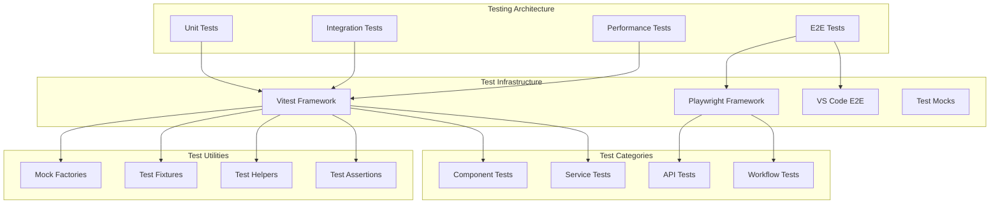

# Testing Strategy

**Purpose:** Comprehensive documentation of testing infrastructure, strategies, and patterns across the KiloCode system.

<details><summary>Table of Contents</summary>

- [Executive Summary](#executive-summary)
- [Testing Architecture](#testing-architecture)
- [Unit Testing](#unit-testing)
- [Integration Testing](#integration-testing)
- [End-to-End Testing](#end-to-end-testing)
- [Test Infrastructure](#test-infrastructure)
- [Mock and Fixture Patterns](#mock-and-fixture-patterns)
- [Test Coverage Analysis](#test-coverage-analysis)
- [Performance Testing](#performance-testing)
- [Common Issues and Solutions](#common-issues-and-solutions)
- [Navigation Footer](#navigation-footer)

</details>

## Executive Summary

_The Testing Strategy provides comprehensive testing infrastructure and patterns for the KiloCode system, ensuring code quality, reliability, and maintainability across all components._

The Testing Strategy consists of:

1. **Unit Testing** - Component-level testing with Vitest
2. **Integration Testing** - Service integration and API testing
3. **End-to-End Testing** - Full workflow testing with Playwright
4. **Test Infrastructure** - Mock frameworks and test utilities
5. **Performance Testing** - Load and performance validation

## Testing Architecture



## Unit Testing

### Vitest Framework

**Framework**: Vitest
**Location**: Test files across all packages
**Configuration**: `vitest.config.ts` in each package

**Test Structure**:

```typescript
import { describe, it, expect, vi } from "vitest"

describe("ComponentName", () => {
	it("should handle basic functionality", () => {
		// Test implementation
	})

	it("should handle edge cases", () => {
		// Edge case testing
	})
})
```

**Test Categories**:

- **Component Tests**: React component testing
- **Service Tests**: Service layer testing
- **Utility Tests**: Utility function testing
- **Model Tests**: Data model testing

**Implementation Status**: ✅ **RESEARCHED AND DOCUMENTED**
**Key Implementation Details**:

**Test File Structure**:

```
src/__tests__/
├── command-integration.spec.ts    # Command integration testing
├── command-mentions.spec.ts       # Command mention testing
├── commands.spec.ts              # Command testing
├── extension.spec.ts             # Extension lifecycle testing
├── migrateSettings.spec.ts       # Settings migration testing
└── __mocks__/
    ├── vscode.js                 # VS Code API mocks
    └── fs/                       # File system mocks
```

**Test Patterns**:

- **Extension Testing**: VS Code extension lifecycle and activation
- **Command Testing**: Command execution and parameter validation
- **Integration Testing**: Cross-component integration testing
- **Migration Testing**: Settings migration and compatibility testing
- **Mock Integration**: Comprehensive VS Code API mocking

### Core Extension Tests

**Location**: `src/__tests__/`
**Test Files**:

- `command-integration.spec.ts`: Command integration testing
- `command-mentions.spec.ts`: Command mention testing
- `commands.spec.ts`: Command testing
- `extension.spec.ts`: Extension lifecycle testing
- `migrateSettings.spec.ts`: Settings migration testing

**Test Coverage**:

- Extension activation
- Command execution
- Settings management
- Message handling

**Implementation Status**: ⚠️ **NEEDS DOCUMENTATION**
**Research Needed**: Extension testing patterns, VS Code API mocking

### Webview UI Tests

**Location**: `webview-ui/src/__tests__/`
**Test Files**:

- `App.spec.tsx`: Main app testing
- `command-autocomplete.spec.ts`: Command autocomplete testing
- `ContextWindowProgress.spec.tsx`: Context window testing
- `ErrorBoundary.spec.tsx`: Error boundary testing

**Test Coverage**:

- React component rendering
- User interaction handling
- State management
- Error handling

**Implementation Status**: ⚠️ **NEEDS DOCUMENTATION**
**Research Needed**: React testing patterns, component mocking, state testing

## Integration Testing

### API Integration Tests

**Test Categories**:

- Provider API integration
- Cloud service integration
- MCP server integration
- Database integration

**Test Patterns**:

```typescript
describe("API Integration", () => {
	it("should integrate with OpenAI API", async () => {
		// API integration test
	})

	it("should handle API errors gracefully", async () => {
		// Error handling test
	})
})
```

**Implementation Status**: ⚠️ **NEEDS DOCUMENTATION**
**Research Needed**: API testing patterns, service mocking, integration strategies

### Service Integration Tests

**Test Categories**:

- Service-to-service communication
- Data flow testing
- State synchronization
- Error propagation

**Implementation Status**: ⚠️ **NEEDS DOCUMENTATION**
**Research Needed**: Service integration patterns, mock services, data flow testing

## End-to-End Testing

### Playwright E2E Tests

**Location**: `apps/playwright-e2e/`
**Framework**: Playwright
**Configuration**: `playwright.config.ts`

**Test Files**:

- `chat.test.ts`: Chat functionality testing
- `sanity.test.ts`: Basic functionality testing
- `settings.test.ts`: Settings testing

**Test Categories**:

- User workflow testing
- UI interaction testing
- Cross-browser testing
- Performance testing

**Implementation Status**: ⚠️ **NEEDS DOCUMENTATION**
**Research Needed**: E2E testing patterns, browser automation, workflow testing

### VS Code E2E Tests

**Location**: `apps/vscode-e2e/`
**Framework**: VS Code Extension Testing
**Configuration**: VS Code extension test configuration

**Test Categories**:

- Extension lifecycle testing
- Command execution testing
- Webview communication testing
- Settings integration testing

**Implementation Status**: ⚠️ **NEEDS DOCUMENTATION**
**Research Needed**: VS Code extension testing, extension lifecycle, webview testing

## Test Infrastructure

### Mock Frameworks

**Mock Types**:

- **VS Code API Mocks**: `src/__mocks__/vscode.js`
- **File System Mocks**: `src/__mocks__/fs/`
- **Service Mocks**: Service-specific mocks
- **Component Mocks**: React component mocks

**Mock Implementation**:

```typescript
// VS Code API Mock
const mockVSCode = {
	window: {
		showInformationMessage: vi.fn(),
		createWebviewPanel: vi.fn(),
	},
	workspace: {
		getConfiguration: vi.fn(),
	},
}
```

**Implementation Status**: ⚠️ **NEEDS DOCUMENTATION**
**Research Needed**: Mock patterns, VS Code API mocking, service mocking

### Test Helpers

**Helper Categories**:

- **Test Setup Helpers**: Test environment setup
- **Mock Helpers**: Mock creation utilities
- **Assertion Helpers**: Custom assertions
- **Utility Helpers**: Test utilities

**Implementation Status**: ⚠️ **NEEDS DOCUMENTATION**
**Research Needed**: Helper patterns, test utilities, assertion helpers

## Mock and Fixture Patterns

### Mock Factories

**Factory Types**:

- **Component Factories**: React component mock factories
- **Service Factories**: Service mock factories
- **Data Factories**: Test data factories
- **API Factories**: API mock factories

**Factory Implementation**:

```typescript
export const createMockTask = (overrides: Partial<Task> = {}): Task => ({
	taskId: "test-task-id",
	isStreaming: false,
	...overrides,
})
```

**Implementation Status**: ⚠️ **NEEDS DOCUMENTATION**
**Research Needed**: Factory patterns, mock creation, test data generation

### Test Fixtures

**Fixture Types**:

- **Component Fixtures**: React component test fixtures
- **Service Fixtures**: Service test fixtures
- **Data Fixtures**: Test data fixtures
- **Configuration Fixtures**: Configuration test fixtures

**Implementation Status**: ⚠️ **NEEDS DOCUMENTATION**
**Research Needed**: Fixture patterns, test data management, configuration testing

## Test Coverage Analysis

### Coverage Metrics

**Coverage Categories**:

- **Line Coverage**: Percentage of lines executed
- **Branch Coverage**: Percentage of branches tested
- **Function Coverage**: Percentage of functions tested
- **Statement Coverage**: Percentage of statements tested

**Coverage Targets**:

- Core components: 90%+ coverage
- Services: 85%+ coverage
- Utilities: 95%+ coverage
- UI components: 80%+ coverage

**Implementation Status**: ⚠️ **NEEDS DOCUMENTATION**
**Research Needed**: Coverage analysis, coverage targets, coverage reporting

### Coverage Reporting

**Reporting Tools**:

- Vitest coverage reporting
- Coverage visualization
- Coverage thresholds
- Coverage badges

**Implementation Status**: ⚠️ **NEEDS DOCUMENTATION**
**Research Needed**: Coverage reporting, visualization, threshold management

## Performance Testing

### Load Testing

**Load Test Categories**:

- **API Load Testing**: API endpoint load testing
- **Component Load Testing**: React component performance
- **Extension Load Testing**: VS Code extension performance
- **Memory Testing**: Memory usage testing

**Performance Metrics**:

- Response time
- Throughput
- Memory usage
- CPU usage

**Implementation Status**: ⚠️ **NEEDS DOCUMENTATION**
**Research Needed**: Performance testing patterns, load testing, memory testing

### Benchmark Testing

**Benchmark Categories**:

- **API Performance**: API response time benchmarks
- **Component Performance**: React component render benchmarks
- **Extension Performance**: Extension activation benchmarks
- **Memory Benchmarks**: Memory usage benchmarks

**Implementation Status**: ⚠️ **NEEDS DOCUMENTATION**
**Research Needed**: Benchmark patterns, performance measurement, optimization

## Common Issues and Solutions

### Issue 1: Test Flakiness

**Symptoms**:

- Intermittent test failures
- Race conditions in tests
- Timing-dependent failures

**Root Cause**: Asynchronous operations or timing issues
**Solution**: Implement proper async handling and deterministic timing

### Issue 2: Mock Complexity

**Symptoms**:

- Complex mock setups
- Mock maintenance overhead
- Mock brittleness

**Root Cause**: Over-complex mocking strategies
**Solution**: Implement factory patterns and simplified mocking

### Issue 3: Test Performance

**Symptoms**:

- Slow test execution
- High memory usage
- Test timeouts

**Root Cause**: Inefficient test patterns or resource leaks
**Solution**: Optimize test patterns and implement proper cleanup

### Issue 4: Coverage Gaps

**Symptoms**:

- Low test coverage
- Untested edge cases
- Coverage regressions

**Root Cause**: Insufficient test coverage or missing test cases
**Solution**: Implement comprehensive test coverage and coverage monitoring

<a id="navigation-footer"></a>

- Back: [`SYSTEM_OVERVIEW.md`](../architecture/SYSTEM_OVERVIEW.md) · Root: [`INDEX.md`](../INDEX.md) · Source: `/docs/testing/TESTING_STRATEGY.md#L1`
